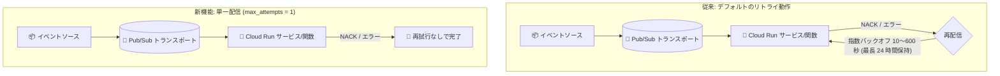

# Eventarc: Cloud Run 宛先トリガーで再試行なしの単一配信 (Single Delivery Attempt) 設定が可能に

**リリース日**: 2026-08-10

**サービス**: Eventarc

**機能**: Cloud Run 宛先トリガーの単一配信 (再試行なし) 設定

**ステータス**: Change (機能変更)

📊 [このアップデートのインフォグラフィックを見る](https://takech9203.github.io/google-cloud-news-summary/20260810-eventarc-cloud-run-single-delivery-attempt.html)

## 概要

Eventarc で Cloud Run 宛先 (Cloud Run functions を含む) のトリガーを構成する際に、再試行を行わない単一配信 (single delivery attempt) を指定できるようになりました。トリガーのリトライポリシーとして最大試行回数 1 回を設定することで、イベント配信が失敗しても Pub/Sub による自動再配信が行われなくなります。

Eventarc Standard は Pub/Sub をトランスポート層として使用する at-least-once (少なくとも 1 回) 配信モデルを採用しており、宛先がイベントを ACK できなかった場合、デフォルトでは指数バックオフ (最小 10 秒〜最大 600 秒) で自動的に再配信が行われます。しかし、通知やベストエフォートの処理など、再試行が不要または望ましくないワークロードでは、この自動再試行が重複実行や不要な負荷の原因になることがありました。

本アップデートにより、トリガー単位で「1 回だけ配信する」動作を宣言的に指定できるようになり、イベントドリブンアーキテクチャの配信セマンティクスをワークロードの特性に合わせて制御しやすくなります。

**アップデート前の課題**

- Eventarc トリガーの配信失敗時は、Pub/Sub サブスクリプションのリトライポリシーに従って自動的に再配信され、トリガー作成時に再試行を無効化する手段がなかった
- 再試行を抑制するには、Eventarc が自動作成した Pub/Sub サブスクリプションを特定し、サブスクリプション側の設定を直接変更するといった間接的な運用が必要だった
- at-least-once 配信により重複イベントが発生し得るため、再試行が不要なワークロードでもイベントハンドラの冪等性 (べきとうせい) 対応や重複排除の実装が求められた

**アップデート後の改善**

- トリガー構成時にリトライポリシー (最大試行回数 1) を指定するだけで、再試行なしの単一配信を宣言的に設定できるようになった
- gcloud CLI の `--max-retry-attempts=1` フラグや Terraform の `retry_policy { max_attempts = 1 }` ブロックにより、IaC を含む標準的なワークフローで設定を管理できるようになった
- 通知系・ベストエフォート系のワークロードで、失敗イベントの重複再実行や不要な再試行負荷を回避できるようになった

## アーキテクチャ図



従来は配信失敗時に指数バックオフで自動再配信されていましたが、新たにトリガーのリトライポリシーで最大試行回数を 1 に設定すると、失敗しても再試行せずに配信を終了します。

## サービスアップデートの詳細

### 主要機能

1. **トリガー単位の単一配信設定**
   - Eventarc トリガーのリトライポリシーとして最大配信試行回数を 1 回に指定可能
   - 設定できる値は 1 のみで、「再試行を行わない」ことを明示するための設定
   - Cloud Run 宛先 (Cloud Run functions を含む) のトリガーでのみ設定可能

2. **gcloud CLI での設定・解除**
   - `gcloud eventarc triggers create` / `update` で `--max-retry-attempts=1` を指定
   - `--clear-max-retry-attempts` で設定を解除し、デフォルトのリトライ動作に戻すことが可能

3. **Terraform (IaC) 対応**
   - `google_eventarc_trigger` リソースの `retry_policy` ブロックで `max_attempts = 1` を指定
   - インフラ構成コードとして配信セマンティクスを管理可能

## 技術仕様

### Eventarc Standard のリトライ動作

| 項目 | デフォルト動作 | 単一配信設定時 |
|------|------|------|
| 配信モデル | at-least-once (少なくとも 1 回) | 最大 1 回の配信試行 |
| 再試行 | 指数バックオフで自動再配信 (最小 10 秒〜最大 600 秒) | 再試行なし |
| メッセージ保持期間 | 24 時間 (期間内に配信できなければ破棄) | 失敗時は即座に完了 |
| 対象宛先 | すべての宛先 | Cloud Run サービス / Cloud Run functions のみ |
| 設定値 | - | `max-retry-attempts` の有効値は 1 のみ |

### Terraform 設定例

```hcl
resource "google_eventarc_trigger" "default" {
  name     = "trigger-storage-cloudrun-tf"
  location = google_cloud_run_v2_service.default.location

  matching_criteria {
    attribute = "type"
    value     = "google.cloud.storage.object.v1.finalized"
  }

  destination {
    cloud_run_service {
      service = google_cloud_run_v2_service.default.name
      region  = google_cloud_run_v2_service.default.location
    }
  }

  # 再試行なしの単一配信を指定
  retry_policy {
    max_attempts = 1
  }

  service_account = google_service_account.default.email
}
```

## 設定方法

### 前提条件

1. Eventarc API および Cloud Run API が有効化されていること
2. トリガーに関連付けるサービスアカウントに `roles/eventarc.eventReceiver` および `roles/run.invoker` が付与されていること
3. 宛先が Cloud Run サービスまたは Cloud Run functions であること

### 手順

#### ステップ 1: トリガー作成時に単一配信を指定する

```bash
gcloud eventarc triggers create TRIGGER_NAME \
  --location=us-central1 \
  --destination-run-service=SERVICE_NAME \
  --destination-run-region=us-central1 \
  --event-filters="type=google.cloud.storage.object.v1.finalized" \
  --event-filters="bucket=BUCKET_NAME" \
  --service-account=SERVICE_ACCOUNT_EMAIL \
  --max-retry-attempts=1
```

`--max-retry-attempts=1` により、再試行なしの単一配信が設定されます (有効値は 1 のみ)。

#### ステップ 2: 既存トリガーの設定変更・解除

```bash
# 既存トリガーに単一配信を設定
gcloud eventarc triggers update TRIGGER_NAME \
  --location=us-central1 \
  --max-retry-attempts=1

# 設定を解除してデフォルトのリトライ動作に戻す
gcloud eventarc triggers update TRIGGER_NAME \
  --location=us-central1 \
  --clear-max-retry-attempts
```

`--clear-max-retry-attempts` を指定すると、Pub/Sub の指数バックオフによるデフォルトの再配信動作に戻ります。

## メリット

### ビジネス面

- **不要な処理コストの削減**: 再試行が不要なベストエフォート処理で、失敗イベントの重複再実行による Cloud Run の実行コストを抑制できる
- **運用のシンプル化**: Pub/Sub サブスクリプションを個別に操作することなく、トリガー構成だけで配信セマンティクスを管理できる

### 技術面

- **宣言的な配信制御**: gcloud / Terraform でトリガーのプロパティとして再試行動作を管理でき、IaC との親和性が高い
- **重複実行の回避**: 再試行に起因する重複イベントが発生しなくなるため、冪等性要件が緩和されるワークロードでは実装を簡素化できる
- **障害時の負荷抑制**: 宛先サービスの障害時に再試行トラフィックが積み上がることを防ぎ、復旧後のスパイクを回避できる

## デメリット・制約事項

### 制限事項

- 単一配信設定は Cloud Run 宛先 (Cloud Run functions を含む) のトリガーでのみ利用可能で、GKE や Workflows などの宛先では設定できない
- `--max-retry-attempts` に設定できる値は 1 のみで、任意の再試行回数 (例: 3 回まで) を指定することはできない

### 考慮すべき点

- 単一配信では一時的な障害 (コールドスタート時のタイムアウトや瞬間的な過負荷など) でもイベントが失われるため、イベントロストが許容できないワークロードには適用しない
- 失敗イベントの追跡が必要な場合は、デッドレタートピックの構成やログベースの監視を検討する
- 単一配信であっても Pub/Sub の特性上、まれに重複配信が発生する可能性は残るため、厳密な exactly-once が必要な場合はハンドラ側の冪等性設計を引き続き推奨

## ユースケース

### ユースケース 1: ベストエフォートの通知処理

**シナリオ**: Cloud Storage へのファイルアップロードをきっかけに Slack へ通知を送る Cloud Run 関数を運用している。通知は 1 回届けば十分で、失敗時の再送によって同じ通知が繰り返し届くことはむしろ避けたい。

**実装例**:
```bash
gcloud eventarc triggers create notify-trigger \
  --location=us-central1 \
  --destination-run-service=slack-notifier \
  --destination-run-region=us-central1 \
  --event-filters="type=google.cloud.storage.object.v1.finalized" \
  --event-filters="bucket=upload-bucket" \
  --service-account=eventarc-sa@PROJECT_ID.iam.gserviceaccount.com \
  --max-retry-attempts=1
```

**効果**: 通知の重複送信を防ぎつつ、失敗時も再試行による不要な実行コストが発生しない。

### ユースケース 2: 冪等でないレガシー処理の保護

**シナリオ**: 外部システムへの書き込みを行う既存の処理を Cloud Run に移行したが、処理が冪等に設計されておらず、再試行によって二重書き込みが発生するリスクがある。

**効果**: トリガー側で再試行を無効化することで、ハンドラの大規模な改修なしに二重実行のリスクを排除できる。失敗イベントはログ監視やデッドレタートピックで別途把握する。

## 料金

本機能自体に追加料金はありません。Eventarc および Cloud Run、トランスポート層の Pub/Sub の通常料金が適用されます。再試行が行われなくなることで、失敗時の Cloud Run 再実行分のコストは削減される方向に働きます。

詳細は [Eventarc の料金ページ](https://cloud.google.com/eventarc/pricing) を参照してください。

## 利用可能リージョン

Eventarc Standard トリガーが利用可能なリージョンで使用できます。詳細は [Eventarc のロケーション](https://docs.cloud.google.com/eventarc/docs/locations) を参照してください。

## 関連サービス・機能

- **Cloud Run / Cloud Run functions**: 本機能の対象となるイベント配信先。トリガー単位で配信セマンティクスを制御できる
- **Pub/Sub**: Eventarc Standard のトランスポート層。デフォルトのリトライ動作 (指数バックオフ、24 時間保持) は Pub/Sub のサブスクリプションリトライポリシーに基づく
- **Pub/Sub デッドレタートピック**: 配信できなかったイベントを保存・分析するための仕組み。イベントロストの監視と組み合わせて利用を検討
- **Cloud Logging / Cloud Monitoring**: 配信失敗の検知やアラート設定に活用

## 参考リンク

- 📊 [インフォグラフィック](https://takech9203.github.io/google-cloud-news-summary/20260810-eventarc-cloud-run-single-delivery-attempt.html)
- [公式リリースノート](https://docs.cloud.google.com/release-notes#August_10_2026)
- [ドキュメント: Retry events (Cloud Run 宛先のリトライ)](https://docs.cloud.google.com/eventarc/docs/retry-events#run-targets)
- [gcloud eventarc triggers update リファレンス](https://docs.cloud.google.com/sdk/gcloud/reference/eventarc/triggers/update)
- [Cloud Run functions のリトライセマンティクス](https://docs.cloud.google.com/run/docs/tips/function-retries)
- [料金ページ](https://cloud.google.com/eventarc/pricing)

## まとめ

Eventarc の Cloud Run 宛先トリガーで再試行なしの単一配信を宣言的に指定できるようになり、通知系やベストエフォート系のイベントドリブンワークロードにおける重複実行・不要な再試行の問題をトリガー構成だけで解決できるようになりました。再試行が不要なワークロードを運用している場合は、`--max-retry-attempts=1` または Terraform の `retry_policy` ブロックの適用を検討してください。ただしイベントロストのリスクを伴うため、対象ワークロードの許容度を確認したうえで導入することを推奨します。

---

**タグ**: Eventarc, Cloud Run, Cloud Run functions, Pub/Sub, イベントドリブン, リトライポリシー, サーバーレス
