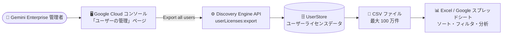

# Gemini Enterprise: ユーザーデータの CSV エクスポート機能 (GA)

**リリース日**: 2026-08-10

**サービス**: Gemini Enterprise

**機能**: ユーザーデータの CSV ファイルエクスポート

**ステータス**: GA (一般提供)

📊 [このアップデートのインフォグラフィックを見る](https://takech9203.github.io/google-cloud-news-summary/20260810-gemini-enterprise-user-data-csv-export.html)

## 概要

Gemini Enterprise の管理者が、ユーザーデータを CSV (カンマ区切り値) ファイルとしてエクスポートできる機能が一般提供 (GA) になりました。エクスポートした CSV ファイルを Excel や Google スプレッドシートなどで開くことで、ユーザーレコードのソート、フィルタリング、分析をオフラインで行えます。

Google Cloud コンソールの「ユーザーの管理」ページにあるユーザーテーブルは、ソートやフィルタリングをサポートしていません。この機能により、最大 1,000,000 件のユーザーレコードを一括で CSV ファイルにエクスポートし、ライセンスの割り当て状況や最終ログイン日時などを任意のツールで分析できるようになります。ライセンス管理や利用状況の棚卸しを行う Gemini Enterprise 管理者にとって、実用的な運用改善となるアップデートです。

**アップデート前の課題**

- Google Cloud コンソールのユーザーテーブルはソート・フィルタリングに対応しておらず、ユーザーデータの分析が困難だった
- ライセンスの割り当て状況や最終ログイン日時を確認するには、コンソール上でユーザーを 1 件ずつ確認するか、API (`userLicenses.list`) を呼び出す独自スクリプトを作成する必要があった
- 大規模組織でのライセンス棚卸し (未使用ライセンスの特定など) に手間がかかっていた

**アップデート後の改善**

- コンソールの「Export all users」ボタンをクリックするだけで、最大 1,000,000 件のユーザーレコードを CSV ファイルとしてダウンロードできるようになった
- エクスポートした CSV を Excel や Google スプレッドシートで開き、オフラインでソート・フィルタリング・分析が可能になった
- ライセンス割り当て状態 (`ASSIGNED` / `NO_LICENSE` / `BLOCKED`) や最終ログイン日時が一覧で取得でき、ライセンスの棚卸しや利用状況の監査が容易になった

## アーキテクチャ図



管理者がコンソールからエクスポートを実行すると、UserStore 配下のすべてのユーザーライセンスレコードが CSV としてブラウザにダウンロードされ、オフラインツールで分析できます。

## サービスアップデートの詳細

### 主要機能

1. **ユーザーデータの一括 CSV エクスポート**
   - Google Cloud コンソールの「Gemini Enterprise > ユーザーの管理」ページから、選択したマルチリージョン内の全ユーザーをエクスポート
   - 最大 1,000,000 件のユーザーレコードに対応
   - ユーザーテーブルのサイズによっては、エクスポート完了まで最大 2.5 分かかる (処理中はコンソールにローディング状態が表示される)

2. **ライセンス管理に必要な情報を網羅した CSV スキーマ**
   - ユーザーのメールアドレス、割り当てられたサブスクリプション (エディション)、ライセンス割り当て日時、最終ログイン日時、ライセンス割り当て状態を含む
   - ヘッダー行に続いてユーザーライセンスごとに 1 行が出力される

3. **API によるエクスポート (バックエンド)**
   - コンソールの「Download as CSV」操作のバックエンドとして、Discovery Engine API の `userLicenses:export` メソッド (v1alpha) が提供されている
   - レスポンスの `csvData` フィールドに CSV ドキュメント全体が Base64 エンコードされて返される

## 技術仕様

### エクスポートされる CSV の列

| 列名 | 説明 |
|------|------|
| `user_principal` | ユーザーのメールアドレス |
| `license_config` | ユーザーに割り当てられたサブスクリプションの完全なリソース名 (例: `projects/PROJECT_NUMBER/locations/LOCATION/licenseConfigs/LICENSE_CONFIG_ID`)。ライセンス構成 ID は Gemini Enterprise のエディション (Standard、Plus など) に対応 |
| `assignment_time` | 管理者がライセンスを割り当てたタイムスタンプ (UTC) |
| `last_login_time` | ユーザーが最後にサインインしたタイムスタンプ (UTC) |
| `license_assignment_state` | ライセンス割り当て状態。`ASSIGNED` (割り当て済み)、`NO_LICENSE` (未割り当てまたは削除済み)、`BLOCKED` (ポリシーまたは管理者によりブロック) |

### API 仕様 (userLicenses:export)

| 項目 | 詳細 |
|------|------|
| HTTP リクエスト | `POST https://discoveryengine.googleapis.com/v1alpha/{parent=projects/*/locations/*/userStores/*}/userLicenses:export` |
| リクエストボディ | 空 |
| レスポンス | `csvData` (bytes 形式、Base64 エンコード文字列)。ヘッダー行 + UserLicense ごとに 1 行 |
| 必要な IAM 権限 | 親リソースに対する `discoveryengine.userStores.listUserLicenses` |
| OAuth スコープ | `cloud-platform`、`discoveryengine.readwrite`、`discoveryengine.serving.readwrite` のいずれか |

## 設定方法

### 前提条件

1. Gemini Enterprise のサブスクリプションが有効で、選択したマルチリージョンにライセンスが割り当てられたユーザーが存在すること
2. 操作するアカウントに Gemini Enterprise 管理者 (Gemini Enterprise Admin) ロールが付与されていること (`discoveryengine.userStores.listUserLicenses` 権限を含む)

### 手順

#### ステップ 1: コンソールからエクスポートを実行

1. Google Cloud コンソールで「Gemini Enterprise > ユーザーの管理 (Manage users)」ページに移動
2. 既存ライセンスのマルチリージョンを選択
3. 「Users」セクションで「Export all users」をクリック

ユーザーテーブルのサイズによって、エクスポートには最大 2.5 分かかります。完了するとブラウザのデフォルトのダウンロード場所に CSV ファイルが保存されます。

#### ステップ 2: (参考) API でエクスポートする場合

```bash
curl -X POST \
  -H "Authorization: Bearer $(gcloud auth print-access-token)" \
  -H "Content-Type: application/json" \
  "https://discoveryengine.googleapis.com/v1alpha/projects/PROJECT_ID/locations/LOCATION/userStores/default_user_store/userLicenses:export"
```

レスポンスの `csvData` フィールドを Base64 デコードすると CSV ファイルが得られます。

### トラブルシューティング

| 事象 | 対処 |
|------|------|
| 「Export all users」ボタンが表示されない | 選択したマルチリージョンにライセンスが割り当てられたユーザーが存在するか確認する。割り当て済みユーザーがいない場合、ボタンは表示されない |
| 上限超過エラーでエクスポートが失敗する | ユーザーリストがエクスポート上限の 1,000,000 件を超えると、コンソールはリクエストを拒否しエラーを表示する |
| 権限拒否エラーでエクスポートが失敗する | アカウントに Gemini Enterprise Admin ロール (`discoveryengine.userStores.listUserLicenses` 権限を含む) が付与されているか確認する |

## メリット

### ビジネス面

- **ライセンスコストの最適化**: 最終ログイン日時をもとに未使用・低頻度利用のライセンスを特定し、割り当ての見直しによるコスト削減につなげられる
- **監査・コンプライアンス対応の効率化**: ライセンス割り当て状況の全量データをワンクリックで取得でき、定期的な棚卸しや監査レポートの作成が容易になる

### 技術面

- **スクリプト開発が不要**: 従来 API を使った独自ツールで行っていたユーザーデータの一括取得が、コンソール操作のみで完結する
- **既存ツールとの親和性**: CSV 形式のため Excel、Google スプレッドシート、BI ツールなど任意の分析ツールにそのまま取り込める
- **大規模組織に対応**: 最大 1,000,000 件のユーザーレコードをエクスポート可能

## デメリット・制約事項

### 制限事項

- エクスポート上限は 1,000,000 ユーザーレコード。これを超えるとリクエストは拒否される
- コンソールのユーザーテーブル自体は引き続きソート・フィルタリングに対応しておらず、分析はオフライン (エクスポート後) で行う必要がある
- エクスポートはマルチリージョン単位で実行するため、複数のマルチリージョンを利用している場合はそれぞれエクスポートが必要

### 考慮すべき点

- CSV にはユーザーのメールアドレスなどの個人情報が含まれるため、ダウンロードしたファイルの取り扱い・保管には注意が必要
- 大きなユーザーテーブルではエクスポートに最大 2.5 分かかる
- API (`userLicenses:export`) は v1alpha であり、レスポンスは CSV をインラインで返す方式 (将来的に大規模エクスポート向けの方式が追加される可能性がある)

## ユースケース

### ユースケース 1: 未使用ライセンスの棚卸し

**シナリオ**: 数千人規模で Gemini Enterprise を導入している企業で、契約更新前にライセンスの利用実態を把握したい。

**実装例**:
```
1. コンソールで「Export all users」を実行し CSV をダウンロード
2. スプレッドシートで last_login_time 列をフィルタし、90 日以上ログインのないユーザーを抽出
3. license_assignment_state が ASSIGNED のユーザーのうち低利用者のライセンスを見直し
```

**効果**: 未使用ライセンスを特定して割り当てを最適化し、サブスクリプションコストを削減できる。

### ユースケース 2: エディション別の割り当て状況レポート作成

**シナリオ**: Standard と Plus の複数エディションを併用しており、部門ごとの割り当て状況を経営層向けにレポートしたい。

**効果**: `license_config` 列からエディションを判別し、ピボットテーブルでエディション別・割り当て状態別の集計レポートを短時間で作成できる。

## 料金

エクスポート機能自体に関する追加料金の記載はありません。Gemini Enterprise はエディション (Standard、Plus など) ごとのサブスクリプション (ライセンス) 課金です。詳細は料金ページを参照してください。

- [Gemini Enterprise の料金](https://cloud.google.com/gemini/enterprise/pricing)

## 利用可能リージョン

ライセンス管理はマルチリージョン (`global`、`us`、`eu`) 単位で行われ、エクスポートは選択したマルチリージョンのユーザーが対象となります。

## 関連サービス・機能

- **Gemini Enterprise ライセンス管理**: 本機能はライセンス管理 (ユーザーへのライセンス割り当て・削除・移行) の一部として提供され、`userLicenses.list` と同じ読み取りパスを利用する
- **Discovery Engine API**: エクスポートのバックエンドは Discovery Engine API (`userStores.userLicenses:export`) として提供されている
- **IAM**: エクスポートには Gemini Enterprise Admin ロールに含まれる `discoveryengine.userStores.listUserLicenses` 権限が必要

## 参考リンク

- 📊 [インフォグラフィック](https://takech9203.github.io/google-cloud-news-summary/20260810-gemini-enterprise-user-data-csv-export.html)
- [公式リリースノート](https://docs.cloud.google.com/release-notes#August_10_2026)
- [ドキュメント: Export user data](https://docs.cloud.google.com/gemini/enterprise/docs/licenses#export-user-data)
- [API リファレンス: userLicenses.export](https://docs.cloud.google.com/gemini/enterprise/docs/reference/rest/v1alpha/projects.locations.userStores.userLicenses/export)
- [料金ページ](https://cloud.google.com/gemini/enterprise/pricing)

## まとめ

Gemini Enterprise のユーザーデータ CSV エクスポートが GA となり、これまでコンソールでは難しかったユーザーレコードのソート・フィルタリング・分析がワンクリックのエクスポートで可能になりました。Gemini Enterprise を管理している組織は、まず「ユーザーの管理」ページからエクスポートを試し、最終ログイン日時をもとにしたライセンス棚卸しの定期運用に組み込むことを推奨します。

---

**タグ**: #GeminiEnterprise #ライセンス管理 #CSV #GA #管理者機能 #DiscoveryEngine
