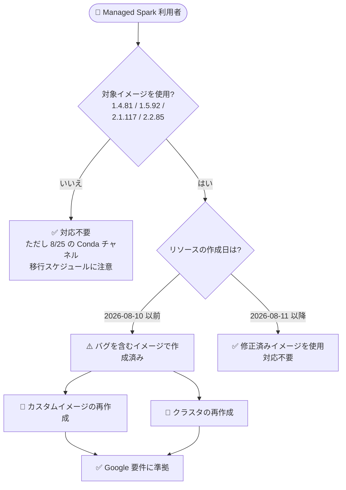

# Managed Service for Apache Spark: Conda チャネル関連の重大バグ修正 (要対応: リソースの再作成が必要)

**リリース日**: 2026-08-10

**サービス**: Managed Service for Apache Spark (旧 Dataproc on Compute Engine)

**機能**: イメージバージョン 1.4.81 / 1.5.92 / 2.1.117 / 2.2.85 における Conda チャネル関連バグの修正

**ステータス**: Fixed (修正済み・**顧客側での対応が必要**)

📊 [このアップデートのインフォグラフィックを見る](https://takech9203.github.io/google-cloud-news-summary/20260810-managed-spark-conda-channels-fix.html)

> [!WARNING]
> **必須の顧客対応 (Required Customer Actions)**
>
> 以下のイメージバージョンを使用して **2026 年 8 月 10 日以前に作成した** リソースは、Google の要件に準拠するため **再作成が必要** です。
>
> - **対象イメージバージョン**: `1.4.81`、`1.5.92`、`2.1.117`、`2.2.85`
> - **再作成が必要なリソース**:
>   1. **カスタムイメージ** (これらのバージョンをベースに生成したもの)
>   2. **クラスタ** (これらのバージョンで作成したもの)

## 概要

Managed Service for Apache Spark (旧 Dataproc on Compute Engine) のイメージバージョン `1.4.81`、`1.5.92`、`2.1.117`、`2.2.85` において、Conda チャネルに関連する重大なバグ (critical bug) が **in-place (同一バージョン番号のまま) で修正** されました。これらのイメージバージョンは、事前構成された Conda チャネルを持たない形でリリースされたものです。

今回の修正は新しいサブマイナーバージョンの発行ではなく、既存バージョンへの上書き修正 (in-place fix) として行われました。そのため、**修正前のイメージで作成済みのリソースには修正が反映されません**。2026 年 8 月 10 日以前にこれらのバージョンを使用して作成したカスタムイメージおよびクラスタは、修正済みイメージを取り込むために再作成する必要があります。

この一連の変更は、2026 年 6 月以降に段階的に進められている「事前構成済み Conda チャネルの廃止」の流れの中で発生したものです。2026 年 8 月 25 日以降は、事前構成済み Conda チャネルを持つ旧サブマイナーバージョンの使用が禁止されるため、対象クラスタを運用しているすべてのユーザーが影響を受けます。

**アップデート前の課題**

- イメージバージョン `1.4.81`、`1.5.92`、`2.1.117`、`2.2.85` には Conda チャネルに関連する重大なバグが含まれていた
- これらのバージョンは事前構成済み Conda チャネルなしでリリースされており、クラスタ初期化時にチャネルを手動構成しない限り Conda でのパッケージインストールができない仕様変更の対象だった
- バグを含むイメージから作成されたカスタムイメージ・クラスタは、問題を内包したまま稼働していた

**アップデート後の改善**

- 対象 4 バージョンのイメージが in-place で修正され、**2026 年 8 月 11 日以降に新規作成するリソースは修正済みイメージを使用** できるようになった
- バージョン番号を変えない修正のため、既存の自動化 (バージョン指定のスクリプトや IaC) を変更せずに修正版を利用できる
- ただし、**2026 年 8 月 10 日以前に作成済みのカスタムイメージとクラスタは再作成が必須** となる

## アーキテクチャ図



対象 4 バージョンのイメージを 2026 年 8 月 10 日以前に使用して作成したカスタムイメージとクラスタは再作成が必要です。修正はバージョン番号を変えない in-place 修正のため、8 月 11 日以降に新規作成するリソースは自動的に修正版を使用します。

## サービスアップデートの詳細

### 主要ポイント

1. **Conda チャネル関連の重大バグを in-place 修正**
   - 対象イメージバージョン: `1.4.81`、`1.5.92`、`2.1.117`、`2.2.85`
   - バージョン番号はそのままに、イメージの内容のみが修正された
   - これらのバージョンは事前構成済み Conda チャネルなしでリリースされたイメージ群

2. **必須の顧客対応: リソースの再作成**
   - 2026 年 8 月 10 日以前に対象バージョンで作成した **カスタムイメージ** を再作成する
   - 2026 年 8 月 10 日以前に対象バージョンで作成した **クラスタ** を再作成する
   - Google の要件への準拠 (comply with Google requirements) のために必要とされている

3. **背景: 事前構成済み Conda チャネルの段階的廃止**
   - 2026 年 6 月 22 日: `1.3.96`、`1.4.81`、`1.5.92`、`2.0.161`、`2.3.32` が事前構成済み Conda チャネルなしでリリース
   - 2026 年 6 月 30 日: `2.1.117`、`2.2.85` が同様に事前構成済み Conda チャネルなしでリリース
   - 2026 年 8 月 25 日以降: デフォルトエイリアス (`2.1-debian11`、`2.2-debian12` など) が Conda チャネルなしの最新サブマイナーバージョンを指すようになり、事前構成済み Conda チャネルを持つ旧バージョンの使用は禁止される

## 技術仕様

### 対象イメージバージョン

| イメージバージョン | 系列 | リリース時期 | 特徴 |
|------|------|------|------|
| `1.4.81` | 1.4 (Debian 10 / Ubuntu 18) | 2026-06-22 | 事前構成済み Conda チャネルなし |
| `1.5.92` | 1.5 (Debian 10 / Rocky 8 / Ubuntu 18) | 2026-06-22 | 事前構成済み Conda チャネルなし |
| `2.1.117` | 2.1 (Debian 11 / Rocky 8 / Ubuntu 20 / ARM) | 2026-06-30 | 事前構成済み Conda チャネルなし |
| `2.2.85` | 2.2 (Debian 12 / Rocky 9 / Ubuntu 22 / ARM) | 2026-06-30 | 事前構成済み Conda チャネルなし |

### 対応要否の判定基準

| 条件 | 対応 |
|------|------|
| 対象バージョンで 2026-08-10 以前に作成したカスタムイメージ | **再作成が必要** |
| 対象バージョンで 2026-08-10 以前に作成したクラスタ | **再作成が必要** |
| 対象バージョンで 2026-08-11 以降に作成したリソース | 対応不要 (修正済みイメージを使用) |
| 対象外バージョンで作成したリソース | 今回の修正の対応は不要 (ただし 8/25 の移行スケジュールに注意) |

## 設定方法

### 前提条件

1. 使用中のクラスタ・カスタムイメージのイメージバージョンを確認できること
2. クラスタの再作成に伴うジョブの一時停止・切り替え計画があること

### 手順

#### ステップ 1: 対象リソースの特定

```bash
# クラスタのイメージバージョンを確認
gcloud dataproc clusters describe CLUSTER_NAME \
    --region=REGION \
    --format="value(config.softwareConfig.imageVersion)"

# プロジェクト内のクラスタを一覧表示
gcloud dataproc clusters list --region=REGION
```

イメージバージョンが `1.4.81`、`1.5.92`、`2.1.117`、`2.2.85` のいずれかで、2026 年 8 月 10 日以前に作成されたクラスタ・カスタムイメージを特定します。

#### ステップ 2: カスタムイメージの再作成

```bash
# generate_custom_image.py を使用してカスタムイメージを再生成
python3 generate_custom_image.py \
    --image-name=NEW_CUSTOM_IMAGE_NAME \
    --dataproc-version=2.2.85-debian12 \
    --customization-script=CUSTOM_SCRIPT_PATH \
    --zone=ZONE \
    --gcs-bucket=GS_BUCKET
```

対象バージョンをベースに作成していたカスタムイメージは、修正済みイメージから再生成します。

#### ステップ 3: クラスタの再作成

```bash
# 既存クラスタを削除
gcloud dataproc clusters delete CLUSTER_NAME --region=REGION

# 同一構成でクラスタを再作成 (修正済みイメージが使用される)
gcloud dataproc clusters create CLUSTER_NAME \
    --region=REGION \
    --image-version=2.2.85-debian12 \
    ... その他の既存設定
```

クラスタ構成のエクスポート/インポート機能 (`gcloud dataproc clusters export` / `import`) を使用すると、同一構成での再作成を効率化できます。

## メリット

### ビジネス面

- **コンプライアンス維持**: Google の要件に準拠した状態を維持し、2026 年 8 月 25 日以降の移行スケジュールに備えられる
- **リスク低減**: 重大バグを内包したイメージでの運用を解消できる

### 技術面

- **in-place 修正による移行負荷の軽減**: バージョン番号が変わらないため、IaC やスクリプトのバージョン指定を変更せずに修正版を利用できる
- **Conda チャネル移行との整合**: 事前構成済み Conda チャネル廃止後のイメージ体系に沿った修正であり、8 月 25 日以降の移行と同じ方向性で対応できる

## デメリット・制約事項

### 制限事項

- 修正は in-place で行われたため、**2026 年 8 月 10 日以前に作成済みのリソースには自動反映されない** (再作成が唯一の反映手段)
- 対象イメージバージョンは事前構成済み Conda チャネルを持たないため、Conda でパッケージをインストールするにはクラスタ初期化時にチャネルを手動構成する必要がある

### 考慮すべき点

- クラスタ再作成には**ダウンタイム**が伴うため、実行中のジョブやスケジュールされたワークフローへの影響を計画する必要がある
- 2026 年 8 月 25 日以降は、事前構成済み Conda チャネルを持つ旧サブマイナーバージョンの使用が禁止されるため、旧バージョンへのピン留めで回避している場合も期日までの移行計画が必要
- カスタムイメージを再作成した場合、そのイメージを参照するクラスタ作成テンプレートやワークフローテンプレートの更新も必要

## ユースケース

### ユースケース 1: 対象バージョンで稼働中の本番クラスタの再作成

**シナリオ**: 2026 年 7 月に `2.2.85-debian12` で作成した本番 Spark クラスタを運用している。今回の要件に従い、修正済みイメージでクラスタを再作成する。

**実装例**:
```bash
# 既存クラスタの構成をエクスポート
gcloud dataproc clusters export my-prod-cluster \
    --region=us-central1 \
    --destination=cluster-config.yaml

# 既存クラスタを削除
gcloud dataproc clusters delete my-prod-cluster --region=us-central1

# 同一構成で再作成 (修正済み 2.2.85 イメージが使用される)
gcloud dataproc clusters import my-prod-cluster \
    --region=us-central1 \
    --source=cluster-config.yaml
```

**効果**: 重大バグを含むイメージからの脱却と Google 要件への準拠を、既存構成を維持したまま実現できる。

### ユースケース 2: カスタムイメージパイプラインの更新

**シナリオ**: `2.1.117` をベースにライブラリをプリインストールしたカスタムイメージを CI/CD で生成し、複数チームのクラスタに配布している。

**効果**: カスタムイメージを修正済みベースイメージから再生成し、参照するクラスタを順次再作成することで、組織全体で修正を確実に反映できる。ベースイメージのバージョン指定は変更不要のため、パイプラインの改修は最小限で済む。

## 料金

今回の修正自体に料金変更はありません。クラスタ再作成時も、同一構成であれば従来と同じ料金体系 (Compute Engine リソース料金 + Dataproc 料金) が適用されます。

詳細は [Dataproc 料金ページ](https://cloud.google.com/dataproc/pricing) を参照してください。

## 利用可能リージョン

対象イメージバージョンが利用可能なすべてのリージョンに適用されます。最新イメージのロールアウトには全リージョンへの反映まで最大 1 週間かかる場合があります。

## 関連サービス・機能

- **Compute Engine**: クラスタのベースとなる VM インスタンス。カスタムイメージは Compute Engine イメージとして管理される
- **Serverless for Apache Spark**: クラスタ管理が不要なサーバーレス実行環境。クラスタ運用の負荷を避けたい場合の代替選択肢
- **Managed Service for Apache Spark on GKE**: GKE 上で Spark を実行する形態。こちらも `3.5-dataproc-28` 以降で Conda チャネルなしイメージへの移行が進行中
- **Cloud Composer / Workflow Templates**: クラスタを参照するオーケストレーション。クラスタ再作成後の参照先更新に注意

## 参考リンク

- 📊 [インフォグラフィック](https://takech9203.github.io/google-cloud-news-summary/20260810-managed-spark-conda-channels-fix.html)
- [公式リリースノート (2026 年 8 月 10 日)](https://docs.cloud.google.com/release-notes#August_10_2026)
- [Managed Service for Apache Spark リリースノート](https://docs.cloud.google.com/managed-spark/docs/release-notes)
- [クラスタの再作成ガイド](https://docs.cloud.google.com/managed-spark/docs/guides/recreate-cluster#recreate_and_update_a_cluster_2)
- [カスタムイメージの生成ガイド](https://docs.cloud.google.com/managed-spark/docs/guides/images)
- [サポート対象イメージバージョン一覧](https://docs.cloud.google.com/managed-spark/docs/concepts/versioning/image-version-lists#supported-dataproc-image-versions)
- [料金ページ](https://cloud.google.com/dataproc/pricing)

## まとめ

イメージバージョン `1.4.81`、`1.5.92`、`2.1.117`、`2.2.85` の Conda チャネル関連バグが in-place で修正されましたが、**2026 年 8 月 10 日以前にこれらのバージョンで作成したカスタムイメージとクラスタは再作成が必須** です。まず対象リソースの棚卸しを行い、ダウンタイムを考慮した再作成計画を立ててください。あわせて、2026 年 8 月 25 日に予定されている事前構成済み Conda チャネル廃止 (旧サブマイナーバージョンの使用禁止) への移行準備も進めることを推奨します。

---

**タグ**: #ManagedServiceForApacheSpark #Dataproc #ApacheSpark #Conda #BugFix #RequiredAction #イメージバージョン
