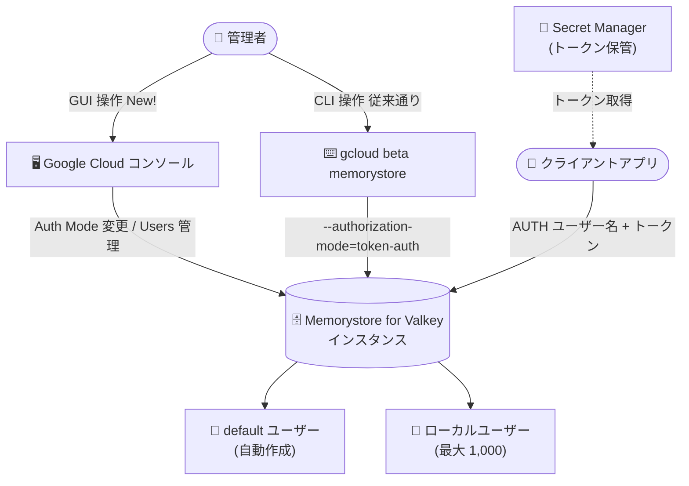

# Memorystore for Valkey: Google Cloud コンソールによる基本トークンベース認証の管理

**リリース日**: 2026-08-10

**サービス**: Memorystore for Valkey

**機能**: Google Cloud コンソールでの基本トークンベース認証 (Basic Token-Based Authentication) 管理

**ステータス**: Preview

📊 [このアップデートのインフォグラフィックを見る](https://takech9203.github.io/google-cloud-news-summary/20260810-memorystore-valkey-console-basic-auth.html)

## 概要

Memorystore for Valkey の基本トークンベース認証 (Basic Token-Based Authentication) が、Google Cloud コンソールから設定・管理できるようになりました (Preview)。基本トークンベース認証は、既存の IAM 認証に加えて利用できる軽量な認証方式で、クライアントがトークンを使用してインスタンスへのアクセスを認証します。

基本トークンベース認証自体は 2026 年 4 月に Preview として提供が開始されており、これまでは gcloud CLI (`gcloud beta memorystore` コマンド) による設定が必要でした。今回のアップデートにより、コンソールの GUI からインスタンスの認証モードの有効化やユーザーの追加・削除といった操作が可能になり、CLI に不慣れなユーザーでも直感的にアクセス保護を構成できるようになります。

Memorystore for Redis やオンプレミス環境で AUTH ベースの認証を使用しているワークロードを Memorystore for Valkey へ移行するユーザー、および運用チームの日常的なユーザー管理を GUI で行いたいユーザーが主な対象です。

**アップデート前の課題**

- 基本トークンベース認証の有効化やユーザー管理は gcloud CLI (beta コマンド) でのみ操作可能で、コンソールからは設定できなかった
- 認証モードやユーザーの状態を確認するには CLI コマンドの実行が必要で、GUI 上でインスタンスのセキュリティ設定を一元的に把握できなかった
- CLI 環境の準備 (gcloud CLI バージョン 489.0.0 以上) が管理作業の前提となっていた

**アップデート後の改善**

- コンソールの「Instance at a glance」ページの Security カードから、既存インスタンスの認証モード (Auth Mode) を「Token Auth」に変更して有効化できるようになった
- インスタンス作成時にコンソールから基本トークンベース認証を有効にできるようになった
- コンソールのナビゲーションドロワーに「Users」メニューが追加され、ユーザーの追加・一覧表示・削除が GUI で完結するようになった

## アーキテクチャ図



管理者は従来の gcloud CLI に加えて、Google Cloud コンソールの GUI から基本トークンベース認証の有効化とユーザー管理を実行できるようになりました。クライアントアプリケーションは `AUTH` コマンドとトークンでインスタンスに認証します。

## サービスアップデートの詳細

### 主要機能

1. **コンソールからの認証モードの有効化**
   - インスタンス詳細画面 (Instance at a glance) の Security カードで「Auth Mode」フィールドの編集アイコンをクリックし、「Token Auth」を選択して「Update instance」で有効化
   - インスタンス作成フローでも基本トークンベース認証を有効にした状態で作成可能
   - 有効化すると `default` ユーザーと認証トークンが自動作成される

2. **コンソールからのユーザー管理 (Users メニュー)**
   - ナビゲーションドロワーに「Users」メニューが追加され、基本トークンベース認証ユーザーの一覧を表示
   - 「Add user」からユーザー ID を入力してマルチユーザー認証用のユーザーを追加
   - 「Remove user」でユーザーを削除 (関連する認証トークンもすべて削除される)

3. **2 つの認証モード (機能自体は既存)**
   - シンプル認証: `AUTH TOKEN` で `default` ユーザーとして認証
   - マルチユーザー認証: `AUTH USERNAME TOKEN` で個別ユーザーとして認証

## 技術仕様

### 基本トークンベース認証の仕様

| 項目 | 詳細 |
|------|------|
| ステータス | Preview |
| 認証コマンド | `AUTH TOKEN` (default ユーザー) / `AUTH USERNAME TOKEN` (その他のユーザー) |
| 最大ローカルユーザー数 | 1,000 |
| ユーザーあたりのトークン数 | 最大 2 (ゼロダウンタイムローテーション用) |
| default ユーザー | 有効化時に自動作成、削除不可 |
| 認証モードの無効化 | 有効化後は無効化・変更不可 |
| 既存接続への影響 | 有効化時に既存接続は影響を受けない (新規接続から認証必須) |
| 必要な IAM ロール | `roles/memorystore.admin`、`roles/owner`、`roles/editor` のいずれか |

### コンソールと gcloud CLI の対応状況

| 操作 | コンソール | gcloud CLI |
|------|-----------|------------|
| 認証有効化済みインスタンスの作成 | 対応 (New) | 対応 |
| 既存インスタンスでの認証有効化 | 対応 (New) | 対応 |
| ユーザーの作成 | 対応 (New) | 対応 |
| ユーザーの一覧表示 | 対応 (New) | 対応 |
| ユーザーの詳細表示 | 未対応 | 対応 |
| ユーザーの削除 | 対応 (New) | 対応 |
| 認証トークンの作成・一覧・詳細・削除 | 未対応 | 対応 |

## 設定方法

### 前提条件

1. Google Cloud プロジェクトで課金が有効になっていること
2. Memorystore for Valkey API、Network Connectivity API、Service Consumer Management API が有効になっていること
3. `roles/memorystore.admin`、`roles/owner`、`roles/editor` のいずれかの IAM ロールを保有していること
4. クライアントアプリケーションが `AUTH` コマンドをサポートしていること

### 手順

#### ステップ 1: コンソールで既存インスタンスの認証を有効化

1. Google Cloud コンソールで「Memorystore for Valkey」ページに移動
2. 対象インスタンスをクリック
3. 「Instance at a glance」ページの「Security」カードまでスクロール
4. 「Auth Mode」フィールドの横の編集 (Edit) アイコンをクリック
5. 「Auth Mode」ダイアログで「Token Auth」を選択し、「Update instance」をクリック

有効化後は `default` ユーザーと認証トークンが自動作成されます。既存接続には影響しませんが、新規接続には認証が必須になります。

#### ステップ 2: コンソールでユーザーを追加 (マルチユーザー認証)

1. インスタンス詳細画面のナビゲーションドロワーで「Users」メニューをクリック
2. 「Users」ページで「Add user」をクリック
3. 「Add user」ダイアログでユーザー ID を入力し、「Add」をクリック

ユーザー作成時に認証トークンが自動生成されます。

#### ステップ 3: クライアントから認証して接続

```bash
# default ユーザーの場合
AUTH TOKEN

# その他のユーザーの場合
AUTH USERNAME TOKEN
```

トークンのローテーションなど、コンソール未対応の操作は gcloud CLI を使用します。

```bash
# トークンのローテーション (ユーザーあたり最大 2 トークン)
gcloud beta memorystore instances token-auth-users create-auth-token USERNAME \
  --instance=INSTANCE_ID \
  --location=REGION
```

## メリット

### ビジネス面

- **運用ハードルの低減**: CLI 環境の準備やコマンド習熟が不要になり、運用チーム全体でユーザー管理を分担しやすくなる
- **移行の促進**: Memorystore for Redis やオンプレミスから移行する際、使い慣れた AUTH ベースの認証を GUI で素早くセットアップできる

### 技術面

- **設定状態の可視化**: Security カードで認証モード (IAM Auth / Token Auth) を一目で確認でき、設定漏れに気付きやすい
- **操作ミスの防止**: ユーザー削除時に ID の再入力を求めるダイアログなど、GUI ならではの確認ステップで誤操作を抑制できる
- **CLI との併用**: 有効化・ユーザー管理はコンソール、トークンローテーションの自動化は gcloud CLI と、用途に応じた使い分けが可能

## デメリット・制約事項

### 制限事項

- Preview 機能であり、Pre-GA Offerings Terms が適用される (サポートが限定される場合がある)
- 一度有効化した基本トークンベース認証は無効化・変更できない
- 認証トークンの作成・一覧・詳細表示・削除、およびユーザーの詳細表示はコンソール未対応で、gcloud CLI が必要
- 管理できるローカルユーザーは最大 1,000
- `default` ユーザーは削除できない

### 考慮すべき点

- 既存インスタンスで有効化する場合、新規接続には認証が必須になるため、アプリケーション側の接続処理を事前に更新しておく必要がある
- ユーザー削除後も既存接続は切断されないため、即時遮断が必要な場合は各ノードで `CLIENT KILL USER USERNAME` を実行する
- トークンを平文で送信しないよう、In-transit encryption (TLS) との併用が推奨される
- トークンはアプリケーションコードにハードコードせず、Secret Manager で管理することが推奨される

## ユースケース

### ユースケース 1: Memorystore for Redis からの移行時のセキュリティ設定

**シナリオ**: Memorystore for Redis で AUTH 認証を使用しているワークロードを Memorystore for Valkey に移行する。移行担当チームは CLI スクリプトよりも GUI での設定を好む。

**実装例**:
1. コンソールのインスタンス作成フローで基本トークンベース認証を有効にしてインスタンスを作成
2. 「Users」ページからアプリケーションごとのユーザーを追加
3. 自動生成されたトークンを Secret Manager に格納し、アプリケーションから参照

**効果**: 既存の AUTH ベースの認証方式を維持したまま、CLI 環境を用意せずに移行先インスタンスのアクセス保護を構成できる。

### ユースケース 2: 運用チームによる日常的なユーザー管理

**シナリオ**: 開発者の入れ替わりに応じて、Valkey インスタンスへのアクセスユーザーを追加・削除する運用を GUI で行いたい。

**効果**: 「Users」ページからユーザーの追加・削除が完結し、削除時にはユーザーに紐づくトークンもまとめて失効するため、アクセス権の棚卸しを安全かつ簡単に実施できる。

## 料金

基本トークンベース認証の利用自体に追加料金は発表されていません。Memorystore for Valkey インスタンスの料金は、ノードタイプとノード数、リージョンに基づいて課金されます。詳細は料金ページを参照してください。

- [Memorystore for Valkey 料金](https://cloud.google.com/memorystore/docs/valkey/pricing)

## 関連サービス・機能

- **IAM 認証**: Memorystore for Valkey の既定の認証方式。基本トークンベース認証はこれに追加して選択できる代替の認証手段
- **Secret Manager**: 認証トークンの保管先として推奨。IAM によるアクセス制御と監査ログにより、認証情報の漏えいを防止
- **In-transit encryption (TLS)**: トークンやユーザー名を平文で送信しないために併用が推奨される暗号化機能
- **Memorystore for Redis**: AUTH ベースの認証を使用する移行元として、本機能により互換性のある移行パスが提供される

## 参考リンク

- 📊 [インフォグラフィック](https://takech9203.github.io/google-cloud-news-summary/20260810-memorystore-valkey-console-basic-auth.html)
- [公式リリースノート](https://docs.cloud.google.com/release-notes#August_10_2026)
- [ドキュメント: Secure access to your instances by using basic token-based authentication](https://docs.cloud.google.com/memorystore/docs/valkey/manage-basic-auth)
- [ドキュメント: IAM authentication](https://docs.cloud.google.com/memorystore/docs/valkey/about-iam-auth)
- [料金ページ](https://cloud.google.com/memorystore/docs/valkey/pricing)
- [関連レポート: 基本トークンベース認証の Preview 提供開始 (2026-04-17)](./2026-04-17-memorystore-valkey-token-authentication.md)

## まとめ

2026 年 4 月に Preview 提供が開始された Memorystore for Valkey の基本トークンベース認証が、Google Cloud コンソールから管理できるようになり、認証モードの有効化とユーザー管理を GUI で完結できるようになりました。Memorystore for Redis からの移行や新規インスタンスのセキュリティ強化を検討しているチームは、まずコンソールで認証を有効化し、Secret Manager と TLS の併用、トークンローテーションポリシーの整備を進めることを推奨します。

---

**タグ**: Memorystore for Valkey, セキュリティ, 認証, トークン認証, Google Cloud コンソール, Preview
