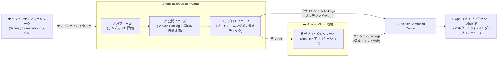

# Security Command Center: Application Design Center 統合によるアプリケーションライフサイクルセキュリティ評価が GA

**リリース日**: 2026-08-10

**サービス**: Security Command Center

**機能**: Application Design Center 統合 (アプリケーションライフサイクルセキュリティ評価)

**ステータス**: 一般提供 (GA)

📊 [このアップデートのインフォグラフィックを見る](https://takech9203.github.io/google-cloud-news-summary/20260810-scc-application-design-center-integration-ga.html)

## 概要

Security Command Center (SCC) と Application Design Center (App Design Center) の統合による「アプリケーションライフサイクルセキュリティ評価」が一般提供 (GA) になりました。この統合により、アプリケーション開発ライフサイクルにプロアクティブなセキュリティ評価を直接組み込むことができます。デプロイ時にはデザインタイム (設計時) の検出結果 (findings) がオンデマンドで Security Command Center に送信されます。

本統合は 2026 年 4 月 17 日にプレビューとして発表されており、今回 GA に昇格しました。設計時に IaC (Infrastructure as Code) テンプレートやアプリケーションをスキャンして得られる「デザインタイム findings」と、デプロイ済みリソースから得られる「ランタイム findings」の両方を SCC 上で統合的に確認でき、アプリケーションのセキュリティ態勢を一元的に把握できます。

また、GA に伴い、app-enabled フォルダおよびプロジェクトのレベルで、App Hub アプリケーション単位に findings をフィルタリングできるようになりました。リソース単位ではなくアプリケーション単位でリスクを把握したい組織にとって、アプリケーション中心 (application-centric) のセキュリティ運用を実現する重要なアップデートです。

**アップデート前の課題**

- 本機能はプレビュー段階 (2026 年 4 月発表) であり、Pre-GA 提供条件が適用され、本番環境での利用にはサポート面の制約があった
- 設計時のセキュリティ検証とデプロイ後のセキュリティ監視が分断されており、デプロイ前に組織のセキュリティポリシー違反を体系的に検出する仕組みを SCC と連携して構築することが難しかった
- SCC の findings はリソース単位での確認が中心で、App Hub アプリケーション単位でのフィルタリングはプロジェクト / フォルダレベルでは制限があった

**アップデート後の改善**

- 統合が GA となり、本番ワークロードのアプリケーションライフサイクル全体 (設計・公開・デプロイ・運用) にセキュリティ評価を組み込める
- デプロイ時にデザインタイム findings がオンデマンドで SCC に送信され、設計時の問題とランタイムの問題を SCC 上で統合的に管理できる
- app-enabled フォルダおよびプロジェクトレベルで、App Hub アプリケーション単位に findings をフィルタリングできるようになった

## アーキテクチャ図



App Design Center の設計・公開・デプロイ各フェーズでセキュリティ評価が実行され、デプロイ時にデザインタイム findings が SCC に送信されます。デプロイ後は SCC がランタイムリソースを監視し、両方の findings をアプリケーション単位で確認できます。

## サービスアップデートの詳細

### 主要機能

1. **デザインタイム findings とランタイム findings の統合ビュー**
   - デザインタイム findings: リソースのデプロイ前に、App Design Center 内の IaC テンプレートやアプリケーションのスキャンから生成される
   - ランタイム findings: クラウド環境にデプロイ済みのリソースから生成される
   - SCC は両方の findings を表示し、アプリケーションのセキュリティ態勢を統一的に可視化する

2. **アプリケーションライフサイクル全体での評価ポイント**
   - 設計フェーズ: テンプレートやアプリケーションの編集時にオンデマンドで評価を実行
   - 公開フェーズ: テンプレートを Service Catalog に公開する際に自動評価
   - デプロイフェーズ: リソースをプロビジョニングする前の最終評価チェック

3. **セキュリティフレームワークのテンプレートへのアタッチ**
   - 管理者が SCC でフレームワークをデプロイし、App Design Center のアプリケーションテンプレートにアタッチできる
   - 開発者は設計キャンバス上で評価を実行し、フレームワークごとのコンプライアンス findings を確認できる
   - 評価スコアカードを確認し、デプロイ前に設計を修正して構成ミスを解消できる
   - アプリケーションはテンプレートにアタッチされたフレームワークを継承し、デプロイ後も SCC が構成ドリフトを監視する

4. **App Hub アプリケーション単位の findings フィルタリング**
   - app-enabled フォルダおよびプロジェクトのレベルで、App Hub アプリケーション単位に findings をフィルタリングできる
   - Risk Overview のダッシュボード、Findings ページ、Issues ページ、Compliance Monitor などの調査ビューでアプリケーションによる絞り込みが可能

5. **テンプレートリビジョンへのトレーサビリティ**
   - App Design Center がアプリケーションライフサイクルを管理するため、SCC が検出したランタイムの問題を、その問題を持ち込んだ特定のテンプレートリビジョンまで遡って追跡できる

## 技術仕様

### 対象アプリケーションの分類

| 分類 | 説明 | サポートされる評価 |
|------|------|-------------------|
| マネージドアプリケーション | App Design Center で設計されたアプリケーション | デザインタイム評価 + ランタイム監視 |
| アンマネージドアプリケーション | App Hub に登録されているが App Design Center 管理外のアプリケーション | ランタイム監視とリスク優先順位付けのみ (デザインタイム評価は非対応) |

### サービスティアごとの機能

| ティア | 利用できる機能 |
|--------|---------------|
| Standard | Google Cloud の Security Essentials フレームワークによるテンプレート / インスタンスの検証 |
| Premium / Enterprise | Security Essentials に加え、SCC でカスタム / 規制対応フレームワークを作成しテンプレートにアタッチ可能 |

### 必要な IAM ロール (管理プロジェクトに付与)

| 操作 | ロール |
|------|--------|
| フレームワークの管理 | Application Design Center Admin (`roles/designcenter.admin`) |
| テンプレートへのフレームワークのアタッチ、評価の実行 | Application Design Center User (`roles/designcenter.user`) |

## 設定方法

### 前提条件

1. 組織で Security Command Center が有効化されていること (機能はサービスティアに依存)
2. アプリケーション管理境界 (app-enabled フォルダなど) がセットアップされていること
3. 管理プロジェクトに必要な IAM ロールが付与されていること

### 手順

#### ステップ 1: 利用可能なフレームワークを確認

```bash
gcloud alpha design-center locations fetch-frameworks LOCATION \
    --project=PROJECT
```

アタッチ可能な SCC フレームワークの一覧を取得します。

#### ステップ 2: フレームワークをアプリケーションテンプレートにアタッチ

```bash
gcloud alpha design-center spaces application-templates policies create POLICY \
    --application-template=APPLICATION_TEMPLATE \
    --project=PROJECT \
    --location=LOCATION \
    --space=SPACE \
    --policy-type=compliance-framework \
    --policy-uri=POLICY_URI
```

`POLICY_URI` には `organizations/12345/locations/global/frameworks/my-framework` のような SCC フレームワークの URI を指定します。

#### ステップ 3: テンプレートの評価を実行

```bash
gcloud alpha design-center spaces application-templates generate-assessment-report APPLICATION_TEMPLATE \
    --project=PROJECT \
    --location=LOCATION \
    --space=SPACE
```

アタッチされたフレームワークに基づく評価レポートが出力されます。テンプレートを開発者に共有する前に、セキュリティ上の問題を特定・修正できます。

## メリット

### ビジネス面

- **シフトレフトによるリスク低減**: デプロイ前の設計段階でポリシー違反を検出・修正できるため、本番環境での構成ミスに起因するインシデントや手戻りのコストを削減できる
- **ガバナンスの標準化**: プラットフォームチームがフレームワークをテンプレートにアタッチすることで、そのテンプレートからデプロイされるすべてのアプリケーションに一貫したセキュリティポリシーを適用できる
- **GA による本番利用**: Pre-GA 提供条件の制約がなくなり、本番ワークロードで安心して利用できる

### 技術面

- **設計時と実行時の findings の一元化**: デザインタイムとランタイムの findings を SCC で統合的に確認でき、セキュリティ態勢を分断なく把握できる
- **アプリケーション中心のフィルタリング**: App Hub アプリケーション単位で findings を絞り込めるため、リソース単位ではなくビジネス機能単位でのリスク管理が可能
- **トレーサビリティ**: ランタイムで検出された問題を、その原因となったテンプレートリビジョンまで追跡できる
- **Gemini 支援による修正**: 設計キャンバス上の評価で検出された findings を、手動または Gemini の支援を受けて解決できる

## デメリット・制約事項

### 制限事項

- デザインタイム評価は App Design Center で設計された「マネージドアプリケーション」のみ対応。App Hub 登録のみの「アンマネージドアプリケーション」はランタイム監視とリスク優先順位付けのみ
- カスタムフレームワークのアタッチには SCC の Premium または Enterprise ティアが必要 (Standard ティアは Security Essentials フレームワークのみ)
- App Design Center のフレームワーク操作用 gcloud コマンドは現時点で alpha トラックで提供されている

### 考慮すべき点

- App Design Center の利用にはアプリケーション管理境界 (app-enabled フォルダ等) のセットアップと管理プロジェクトが必要
- App Design Center でテンプレート作成・アプリケーションデプロイを行うには、管理プロジェクトへの請求先アカウントのリンクが必要
- 管理プロジェクトを削除するとアプリケーションモデルのデータ (テンプレート、カタログ等) は完全に失われる

## ユースケース

### ユースケース 1: プラットフォームチームによるゴールデンテンプレートの提供

**シナリオ**: プラットフォームエンジニアリングチームが、組織のセキュリティ基準を満たすアプリケーションテンプレートを整備し、開発チームにセルフサービスで提供したい。

**実装例**:
1. 管理者が SCC でコンプライアンスフレームワークをデプロイ
2. プラットフォームエンジニアがフレームワークをアプリケーションテンプレートにアタッチし、`generate-assessment-report` で事前評価
3. 問題を修正したテンプレートを Service Catalog に公開 (公開時に自動評価)
4. 開発者はテンプレートからアプリケーションをカスタマイズし、デプロイ前の最終評価を経てプロビジョニング

**効果**: セキュリティ基準を満たしたテンプレートのみが流通し、デプロイされるアプリケーションに一貫したガードレールを適用できる。

### ユースケース 2: アプリケーション単位でのリスク調査

**シナリオ**: セキュリティ運用チームが、特定のビジネスアプリケーションに関連する findings だけを抽出してリスクを評価したい。

**効果**: SCC の Findings / Issues / Risk Overview の各ビューで App Hub アプリケーションによるフィルタリングを行い、app-enabled フォルダやプロジェクトのレベルでアプリケーション単位のセキュリティ状態を迅速に把握できる。設計起因の問題はテンプレートリビジョンまで遡って原因を特定できる。

## 料金

本機能は Security Command Center のサービスティア (Standard / Premium / Enterprise) に依存します。カスタムフレームワークの利用には Premium または Enterprise ティアが必要です。詳細は料金ページを参照してください。

- [Security Command Center の料金](https://cloud.google.com/security-command-center/pricing)

## 関連サービス・機能

- **Application Design Center**: アプリケーションテンプレートの設計・公開・デプロイを行うサービス。本統合のデザインタイム評価の実行基盤
- **App Hub**: アプリケーションをサービスとワークロードの論理グループとして管理。findings のアプリケーション単位フィルタリングの基盤
- **Compliance Manager (SCC)**: フレームワークの作成・デプロイを行い、テンプレートにアタッチするポリシーの源泉となる
- **Cloud Asset Inventory**: SCC のアプリケーション選択メニューに表示される情報の取得元
- **Gemini Cloud Assist**: 設計キャンバス上での findings 修正支援や、自然言語によるアプリケーション設計に利用可能

## 参考リンク

- 📊 [インフォグラフィック](https://takech9203.github.io/google-cloud-news-summary/20260810-scc-application-design-center-integration-ga.html)
- [公式リリースノート](https://docs.cloud.google.com/release-notes#August_10_2026)
- [Application lifecycle security assessments (SCC ドキュメント)](https://docs.cloud.google.com/security-command-center/docs/concepts-security-sources#application-security-assessments)
- [Application Design Center の概要](https://docs.cloud.google.com/application-design-center/docs/overview)
- [Enforce security policies (App Design Center)](https://docs.cloud.google.com/application-design-center/docs/enforce-security-policies)
- [app-enabled フォルダのセットアップ](https://docs.cloud.google.com/app-hub/docs/set-up-app-hub-folder)
- [料金ページ](https://cloud.google.com/security-command-center/pricing)

## まとめ

Security Command Center と Application Design Center の統合が GA となり、設計・公開・デプロイの各フェーズでのセキュリティ評価と、デザインタイム / ランタイム findings の統合管理を本番環境で利用できるようになりました。App Hub アプリケーション単位のフィルタリングにより、アプリケーション中心のセキュリティ運用が現実的になります。App Design Center でアプリケーションを管理している組織は、SCC フレームワークのテンプレートへのアタッチから導入を検討することを推奨します。

---

**タグ**: Security Command Center, Application Design Center, App Hub, GA, セキュリティ, アプリケーションライフサイクル, コンプライアンス
