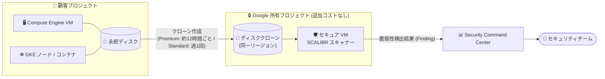

# Security Command Center: Vulnerability Assessment for Google Cloud の一般提供 (GA) 開始

**リリース日**: 2026-08-10

**サービス**: Security Command Center

**機能**: Vulnerability Assessment for Google Cloud

**ステータス**: 一般提供 (GA)

📊 [このアップデートのインフォグラフィックを見る](https://takech9203.github.io/google-cloud-news-summary/20260810-scc-vulnerability-assessment-google-cloud-ga.html)

## 概要

Security Command Center (SCC) の **Vulnerability Assessment for Google Cloud** が一般提供 (GA) になりました。本サービスは、Google Cloud 上のワークロードに対して **エージェントレス** でソフトウェア脆弱性を検出する機能です。スキャン対象の VM にエージェントをインストールする必要がなく、VM インスタンスのディスクをクローンし、Google 所有プロジェクト内のセキュアな VM にマウントして、オープンソースの [SCALIBR](https://github.com/google/osv-scalibr) スキャナーで解析します。

スキャン対象は、稼働中の Compute Engine VM インスタンス、GKE Standard クラスタのノード、GKE Standard / Autopilot クラスタ上で稼働するコンテナです。検出された脆弱性は、SCC に「Software vulnerability」「OS vulnerability」「Container Image Vulnerability」カテゴリの Vulnerability クラスの検出結果 (Finding) として登録されます。

SCC の Standard、Premium、Enterprise (非推奨) の各サービスティアで利用でき、Premium / Enterprise ティアでは自動的に有効化されます。エージェント運用の負荷なしに、組織全体の脆弱性可視化を実現したいセキュリティチームやインフラ管理者に有用なアップデートです。

**アップデート前の課題**

- Vulnerability Assessment for Google Cloud は Preview (Pre-GA) 段階であり、「Pre-GA Offerings Terms」の適用対象で、サポートが限定される可能性があるため本番環境での全面採用が難しかった
- エージェントベースの脆弱性スキャンでは、各 VM へのエージェント導入・管理の運用負荷や、ワークロードへの性能影響が懸念事項だった

**アップデート後の改善**

- GA となり、本番環境で正式サポートのもと利用できるようになった
- エージェント不要 (エージェントレスディスクスキャン) で、Compute Engine VM・GKE ノード・GKE コンテナの脆弱性を自動検出できる
- ディスクのクローンは Google 所有プロジェクト内に作成されるため、スキャンによる追加コストが発生せず、本番ワークロードにも影響を与えない

## アーキテクチャ図



顧客の VM ディスクを同一リージョンの Google 所有プロジェクトにクローンし、セキュアな VM 上で SCALIBR によりスキャンするエージェントレス方式です。検出結果は SCC に Finding として集約されます。

## サービスアップデートの詳細

### 主要機能

1. **エージェントレスディスクスキャン**
   - スキャン対象の VM にエージェントをインストール不要
   - VM ディスクをクローンし、Google 所有プロジェクト内のセキュアな VM にマウントして SCALIBR スキャナーで解析
   - クローンはソース VM と同一リージョンに作成され、顧客側にコストは発生しない

2. **幅広いスキャン対象リソース**
   - 稼働中の Compute Engine VM インスタンス
   - GKE Standard クラスタのノード
   - GKE Standard / Autopilot クラスタ上で稼働するコンテナ
   - コンテナイメージ脆弱性は GKE Pod、App Engine サービス、Cloud Run サービス / ジョブが対象

3. **リッチな検出結果 (Finding)**
   - 脆弱性のあるソフトウェアパッケージとその場所、CVE レコード情報、SCC による重大度評価を含む
   - 利用可能な場合は修正手順 (パッチやバージョンアップグレード) を提示
   - Mandiant CVE アセスメントによる影響度・悪用可能性の情報でエンリッチ
   - Premium / Enterprise ティアでは Attack Exposure Score (攻撃露出スコア) と、攻撃者が高価値リソースに到達しうる経路の可視化も提供

## 技術仕様

### サービスティアによる機能差

| 項目 | Standard ティア | Premium / Enterprise ティア |
|------|----------------|---------------------------|
| スキャン頻度 | 週 1 回 | 約 12 時間ごと |
| 検出される重大度 | Critical のみ | Critical および High |
| Finding の ACTIVE 状態保持期間 | 195 時間 | 25 時間 |
| Mandiant CVE アセスメント | Critical の CVE のみ | Critical / High の CVE |
| Attack Exposure Score・攻撃パス可視化 | なし | あり |
| 有効化 | 手動 (組織 / フォルダ / プロジェクト単位) | 自動有効化 |

### 検出結果のプロパティ

| プロパティ | 値 |
|-----------|-----|
| Class | Vulnerability |
| Cloud service provider | Google Cloud |
| Source | Vulnerability Assessment |
| Category | Container Image Vulnerability / OS vulnerability / Software vulnerability |

## 設定方法

### 前提条件

1. Security Command Center (Standard / Premium ティア) が有効化されていること
2. 組織レベルの Standard ティア有効化では、Security Center Admin (`roles/securitycenter.admin`) に加え、Security Admin (`roles/iam.securityAdmin`) または Organization Admin (`roles/resourcemanager.organizationAdmin`) のいずれかのロールが必要
3. プロジェクトレベルの有効化では、Security Center Admin と Security Admin のロールが必要
4. VPC Service Controls の境界を設定している場合は、必要な Egress / Ingress ルールを作成すること
5. SCC のサービスエージェント (組織レベル: `service-org-ORGANIZATION_ID@security-center-api.iam.gserviceaccount.com`、プロジェクトレベル: `service-project-PROJECT_NUMBER@security-center-api.iam.gserviceaccount.com`) が VM の一覧取得とディスクのクローンを実行できること

### 手順

#### ステップ 1: 組織ポリシーの確認

サービスエージェントによるディスククローン作成が組織ポリシーで妨げられないよう、必要に応じて google.com 組織 (組織 ID `433637338589`) を許可リストに追加します。

```yaml
name: organizations/Org-A/policies/compute.storageResourceUseRestrictions
spec:
  rules:
    - values:
        allowedValues:
          - under:organizations/433637338589
```

#### ステップ 2: Vulnerability Assessment の有効化

1. Google Cloud コンソールで「リスクの概要 (Risk Overview)」ページに移動
2. 対象の組織を選択し、「設定 (Settings)」をクリック
3. 「Vulnerability Assessment」セクションで「設定を管理 (Manage settings)」をクリック
4. 「Google Cloud」タブの「Agentless Vulnerability Assessment」列で、組織 / フォルダ / プロジェクトレベルで有効化 (下位レベルは上位レベルの設定を継承可能)

Premium / Enterprise ティアでは、可能なすべての VM インスタンスに対して自動的に有効化されます。Standard ティアでは手動での有効化が必要です。

## メリット

### ビジネス面

- **運用コスト削減**: エージェントの導入・更新・監視といったライフサイクル管理が不要になり、脆弱性管理の運用負荷を大幅に軽減
- **追加コストなしのスキャン基盤**: ディスククローンは Google 所有プロジェクトに作成されるため、スキャン用インフラの費用が顧客に発生しない
- **GA による本番採用**: 正式サポート対象となり、エンタープライズの本番環境で安心して利用可能

### 技術面

- **ワークロードへの無影響**: 稼働中の VM ではなくディスクのクローンをスキャンするため、本番ワークロードの性能に影響しない
- **VM とコンテナの統合カバレッジ**: Compute Engine、GKE ノード、GKE コンテナ、さらにコンテナイメージ脆弱性は App Engine / Cloud Run まで単一サービスでカバー
- **優先順位付けの支援**: Mandiant CVE アセスメントや Attack Exposure Score (Premium 以上) により、対応すべき脆弱性の優先順位付けが容易

## デメリット・制約事項

### 制限事項

- CMEK (顧客管理の暗号鍵) で暗号化された永続ディスクをスキャンする場合、鍵はディスクと同一リージョン (マルチリージョン鍵の場合は global または同一地理的ロケーション) に保存されている必要がある
- CMEK で暗号化され、かつ VPC Service Controls 境界内にあるディスクのスキャンは非対応
- CSEK (顧客指定の暗号鍵) で暗号化された永続ディスクを持つ VM は非対応
- スキャン対象のディスクパーティションは VFAT、EXT2、EXT4、XFS、NTFS のみ
- Confidential VM および Confidential GKE Node はスキャン対象外
- GKE クラスタのスキャンでは、Finding にクラスタラベルが含まれない

### 考慮すべき点

- サービスティアによってスキャン頻度・検出重大度・Finding の保持期間が異なるため、要件に応じたティア選択が必要 (Standard は Critical のみ週 1 回)
- ティアを変更した場合、旧ティアで生成された Finding は旧ティアの ACTIVE 状態保持期間に従って残る
- 組織ポリシー (例: `compute.storageResourceUseRestrictions`) がサービスエージェントのディスククローン操作を妨げないよう事前確認が必要
- SCC Enterprise ティアは 2027 年 5 月 21 日にシャットダウン予定で、以降は Premium ティアに自動移行される

## ユースケース

### ユースケース 1: エージェント導入が困難な既存 VM 群の脆弱性可視化

**シナリオ**: 多数の Compute Engine VM を運用しているが、エージェント導入の変更管理コストや性能影響の懸念から脆弱性スキャンを全台に展開できていない。

**効果**: SCC の設定でエージェントレススキャンを有効化するだけで、稼働中の VM 全体の OS / ソフトウェア脆弱性を定期的に検出できる。ワークロードへの影響やエージェント管理は不要。

### ユースケース 2: GKE クラスタとコンテナの脆弱性管理の一元化

**シナリオ**: GKE Standard / Autopilot 上でコンテナワークロードを運用しており、ノード OS とコンテナイメージの脆弱性を別々のツールで管理している。

**効果**: ノードとコンテナの脆弱性検出結果が SCC に Finding として一元的に集約され、Premium ティアでは Attack Exposure Score により修復の優先順位付けまで実施できる。

## 料金

Vulnerability Assessment for Google Cloud は Security Command Center のサービスティア (Standard / Premium) に含まれる機能です。ディスクのクローンは Google 所有プロジェクトに作成されるため、スキャンによる追加コストは発生しません。SCC 自体の料金体系については料金ページを参照してください。

- [Security Command Center の料金](https://cloud.google.com/security-command-center/pricing)

## 関連サービス・機能

- **Compute Engine**: 稼働中の VM インスタンスがスキャン対象。永続ディスクがクローンされてスキャンされる
- **Google Kubernetes Engine (GKE)**: Standard クラスタのノードと、Standard / Autopilot クラスタ上のコンテナがスキャン対象
- **App Engine / Cloud Run**: コンテナイメージ脆弱性の検出対象 (サービス / ジョブ)
- **Vulnerability Assessment for AWS**: SCC Enterprise ティアで提供される AWS EC2 向けの同等のエージェントレススキャン機能
- **Mandiant CVE アセスメント**: 検出された CVE の影響度・悪用可能性情報によるエンリッチメント
- **VPC Service Controls**: 境界を設定している場合、スキャンには Egress / Ingress ルールの構成が必要

## 参考リンク

- 📊 [インフォグラフィック](https://takech9203.github.io/google-cloud-news-summary/20260810-scc-vulnerability-assessment-google-cloud-ga.html)
- [公式リリースノート](https://docs.cloud.google.com/release-notes#August_10_2026)
- [Vulnerability Assessment for Google Cloud ドキュメント](https://docs.cloud.google.com/security-command-center/docs/vulnerability-assessment-google-cloud)
- [Security Command Center のサービスティア](https://docs.cloud.google.com/security-command-center/docs/service-tiers)
- [Security Command Center の料金](https://cloud.google.com/security-command-center/pricing)
- [SCALIBR (オープンソーススキャナー)](https://github.com/google/osv-scalibr)

## まとめ

Vulnerability Assessment for Google Cloud の GA により、エージェントレスかつワークロードに影響を与えない脆弱性スキャンを本番環境で正式に利用できるようになりました。SCC の Standard ティアでも利用可能なため、まずは SCC の設定から有効化状況を確認し、CMEK / Confidential VM などの制限事項に該当するリソースがないかを整理したうえで、組織全体への展開を検討することを推奨します。

---

**タグ**: #SecurityCommandCenter #VulnerabilityAssessment #GA #セキュリティ #脆弱性管理 #ComputeEngine #GKE #エージェントレス
