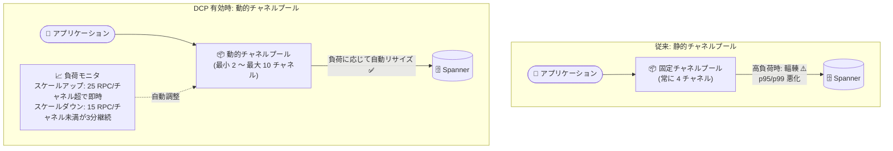

# Spanner: Go / Java クライアントライブラリの Dynamic Channel Pooling (DCP) が GA

**リリース日**: 2026-08-10

**サービス**: Spanner

**機能**: gRPC チャネルの Dynamic Channel Pooling (DCP) - Go / Java クライアントライブラリ

**ステータス**: GA (一般提供)

📊 [このアップデートのインフォグラフィックを見る](https://takech9203.github.io/google-cloud-news-summary/20260810-spanner-dynamic-channel-pooling-ga.html)

## 概要

Spanner の Go および Java クライアントライブラリにおいて、gRPC チャネルの Dynamic Channel Pooling (DCP) が一般提供 (GA) となりました。DCP は、アプリケーションの負荷変動に応じて gRPC チャネルプールのサイズを自動的に拡大・縮小する機能です。これにより、チャネルのプロビジョニング不足 (under-provisioning) や過剰プロビジョニング (over-provisioning) に起因するパフォーマンス問題を防ぎ、チャネル数のチューニングにかかる設定・運用の手間を削減します。

Spanner クライアントは通信に gRPC チャネルを使用します。1 つの gRPC チャネルは概ね 1 本の TCP 接続に相当し、最大 100 の同時リクエストを処理できます。従来はワークロードの同時実行数を見積もってチャネル数 (NumChannels) を静的に設定する必要があり、高負荷時にはチャネル輻輳によるテールレイテンシ (p95/p99) の悪化が発生しがちでした。DCP を有効にすると、クライアントライブラリが負荷に追従してチャネルプールを自動リサイズするため、こうした輻輳起因のテールレイテンシを低減できます。

DCP は **デフォルトでは無効** であり、利用にはオプトインの設定が必要です。同時リクエスト数が大きく変動するアプリケーションや、チャネル数のチューニングに悩んでいた高スループットワークロードを運用する開発者・SRE が主な対象です。

**アップデート前の課題**

- gRPC チャネル数は静的な固定値 (デフォルト 4、Java で gRPC-GCP 拡張有効時は 8) であり、ワークロードの同時実行数を見積もって手動でチューニングする必要があった
- チャネルが不足 (プロビジョニング不足) すると、1 チャネルあたり 100 同時リクエストの上限に起因する輻輳が発生し、p95/p99 のテールレイテンシが悪化した
- チャネルが過剰 (過剰プロビジョニング) だと、TCP 接続やメモリなどのリソースを不必要に消費した
- 負荷が時間帯によって変動するワークロードでは、単一の固定値ではピークとオフピークの両方に最適化できなかった

**アップデート後の改善**

- 負荷の変化に応じてクライアントライブラリが gRPC チャネルプールを自動的にリサイズするようになり、チャネル数の手動チューニングが不要になった
- スケールアップはイベント駆動 (チャネルあたりの同時 RPC 数がしきい値を超えると即座に拡大) で、負荷の急上昇に追従できるようになった
- チャネル輻輳に起因するテールレイテンシ (p95/p99) の低減と、アイドル時のリソース消費削減を両立できるようになった
- Go / Java の両クライアントライブラリで GA 品質として本番利用が可能になった

## アーキテクチャ図



従来は固定数の gRPC チャネルで全リクエストを処理していたため高負荷時に輻輳が発生していましたが、DCP 有効時はチャネルあたりの同時 RPC 数を監視し、プールサイズを自動的に拡大・縮小します。

## サービスアップデートの詳細

### 主要機能

1. **負荷に応じたチャネルプールの自動リサイズ**
   - チャネルあたりの同時 RPC 数がスケールアップしきい値 (デフォルト 25) を超えると、イベント駆動で即座にチャネルを追加
   - 同時 RPC 数がスケールダウンしきい値 (デフォルト 15) を下回った状態が定期チェック間隔 (デフォルト 3 分) 継続すると、チャネルを削減
   - プロビジョニング不足・過剰プロビジョニングの両方を回避

2. **Go クライアントライブラリでの DCP サポート (GA)**
   - `ClientConfig` の `DynamicChannelPoolConfig` で `DCPEnabled: true` を設定して有効化
   - `DCPInitialChannels`、`DCPMinChannels`、`DCPMaxChannels`、`DCPMaxRPCPerChannel`、`DCPMinRPCPerChannel` の各フィールドでカスタマイズ可能
   - 無効時は従来通りデフォルト 4 チャネル (`option.WithGRPCConnectionPool` で固定数の変更も可能)

3. **Java クライアントライブラリでの DCP サポート (GA)**
   - `SpannerOptions` の `enableDynamicChannelPool()` で有効化
   - `setGcpChannelPoolOptions` (`GcpChannelPoolOptions`) で初期サイズ、最小/最大サイズ、動的スケーリングのしきい値をカスタマイズ可能
   - `setNumChannels` で静的なチャネル数を設定した場合、DCP は無効化される

## 技術仕様

### DCP のデフォルト設定 (Go / Java 共通)

| 項目 | デフォルト値 |
|------|-------------|
| 有効/無効 | 無効 (オプトイン) |
| 初期プールサイズ | 4 チャネル |
| 最小プールサイズ | 2 チャネル |
| 最大プールサイズ | 10 チャネル (Java のハードキャップ: 256 チャネル) |
| スケールアップしきい値 | チャネルあたり 25 同時 RPC |
| スケールダウンしきい値 | チャネルあたり 15 同時 RPC |
| スケールダウンチェック間隔 | 3 分 |

### gRPC チャネルの基礎仕様

| 項目 | 詳細 |
|------|------|
| gRPC チャネル | 概ね 1 本の TCP 接続に相当 |
| チャネルあたりの同時リクエスト上限 | 100 |
| DCP 無効時のチャネル数 | Go: 4 / Java: 4 (gRPC-GCP 拡張有効時は 8) |
| スケールアップ動作 | イベント駆動 (負荷上昇に即時追従) |
| スケールダウン動作 | 定期チェック (しきい値未満が継続した場合のみ削減) |

## 設定方法

### 前提条件

1. Go または Java の Spanner クライアントライブラリを使用していること (DCP をサポートするバージョン)
2. Java でマルチプレックスセッションを利用する場合はバージョン 6.98.0 以降 (デフォルトで有効)
3. Java で `setNumChannels` による静的チャネル数設定を行っていないこと (設定すると DCP が無効化される)

### 手順

#### ステップ 1: Go クライアントで DCP を有効化

```go
client, err := spanner.NewClientWithConfig(ctx,
    "projects/PROJECT_ID/instances/INSTANCE_ID/databases/DATABASE_ID",
    spanner.ClientConfig{
        DynamicChannelPoolConfig: spanner.DynamicChannelPoolConfig{
            DCPEnabled: true,
        },
    })
```

`DCPEnabled: true` のみを設定した場合、デフォルト値 (初期 4 / 最小 2 / 最大 10 チャネルなど) が適用されます。カスタマイズする場合は `DCPInitialChannels`、`DCPMinChannels`、`DCPMaxChannels`、`DCPMaxRPCPerChannel`、`DCPMinRPCPerChannel` を設定します。

#### ステップ 2: Java クライアントで DCP を有効化

```java
SpannerOptions options =
    SpannerOptions.newBuilder()
        .setProjectId("PROJECT_ID")
        .enableDynamicChannelPool()
        .build();
```

#### ステップ 3: Java クライアントで DCP をカスタマイズ (任意)

```java
SpannerOptions options =
    SpannerOptions.newBuilder()
        .setProjectId("PROJECT_ID")
        .enableDynamicChannelPool()
        .setGcpChannelPoolOptions(
            GcpChannelPoolOptions.newBuilder()
                .setMaxSize(15)
                .setMinSize(3)
                .setInitSize(5)
                // スケールアップ: チャネル負荷が 30 同時 RPC を超えたら即時拡大
                // スケールダウン: 5 分ごとのチェックで 10 同時 RPC 未満が続いたら削減
                .setDynamicScaling(10, 30, Duration.ofMinutes(5))
                .build())
        .build();
```

## メリット

### ビジネス面

- **運用コストの削減**: チャネル数の見積もり・チューニング・再デプロイのサイクルが不要になり、パフォーマンスチューニングにかかる工数を削減できる
- **ユーザー体験の安定化**: 高負荷時のテールレイテンシ (p95/p99) 悪化を抑制し、トラフィック変動下でも安定した応答性能を維持できる

### 技術面

- **輻輳の自動回避**: チャネルあたり 100 同時リクエストの上限に近づく前に、イベント駆動でチャネルを即時追加し輻輳を回避できる
- **リソース効率の向上**: アイドル時にはチャネルを最小サイズまで自動削減し、TCP 接続やメモリの無駄な消費を抑えられる
- **マルチプレックスセッションとの組み合わせ**: Go / Java ではマルチプレックスセッションがデフォルトで有効であり、セッションプールの設定も不要なため、DCP と合わせて接続管理をほぼフルマネージドにできる

## デメリット・制約事項

### 制限事項

- DCP はデフォルトで無効であり、明示的なオプトイン設定が必要
- GA の対象は Go / Java クライアントライブラリ (Node.js はマルチ gRPC チャネル自体を非サポート、PHP はチャネル数の設定不可など、言語ごとの差異がある)
- Java で `setNumChannels` を設定すると DCP は無効化され、静的なチャネル数が使用される

### 考慮すべき点

- **スケーリングのオーバーヘッド**: プールの拡大・縮小には gRPC チャネル / TCP 接続の作成・破棄のオーバーヘッドが伴う。急峻なバーストを伴うレイテンシ重視のワークロードでは、スケーリング遅延を避けるために大きめの静的プールの方が適する場合がある
- **リソース使用量の変動**: 静的プールはメモリ・接続数が固定だが、動的プールは負荷に応じて変動するため、キャパシティ計画では最大プールサイズ時のリソース消費を考慮する
- デフォルトのしきい値 (25 / 15 同時 RPC) は一般的なワークロード向けに最適化されており、特殊なトラフィックパターンでは `setDynamicScaling` (Java) や `DCPMaxRPCPerChannel` / `DCPMinRPCPerChannel` (Go) での調整を検討する

## ユースケース

### ユースケース 1: 時間帯によって負荷が変動する EC サイトのバックエンド

**シナリオ**: 日中のピーク時間帯には数千の同時リクエストが発生し、深夜はほぼアイドルになる EC サイトで、Java 製バックエンドから Spanner にアクセスしている。固定 4 チャネルではピーク時に輻輳が発生し、ピークに合わせて静的に増やすと深夜のリソースが無駄になる。

**実装例**:
```java
SpannerOptions options =
    SpannerOptions.newBuilder()
        .setProjectId("my-ecommerce-project")
        .enableDynamicChannelPool()
        .build();
```

**効果**: ピーク時はチャネルが自動追加されて輻輳による p95/p99 悪化を防ぎ、深夜は最小 2 チャネルまで縮小してリソース消費を抑えられる。チャネル数の手動チューニングが不要になる。

### ユースケース 2: Go 製マイクロサービスのチューニングレス運用

**シナリオ**: 多数の Go 製マイクロサービスがそれぞれ Spanner クライアントを持ち、サービスごとにトラフィック特性が異なる。サービスごとに `WithGRPCConnectionPool` の最適値を検証・設定する運用が負担になっている。

**効果**: 全サービスで `DCPEnabled: true` を共通設定にするだけで、各サービスの負荷特性に応じてチャネルプールが自動調整され、サービス個別のチューニング作業を廃止できる。

## 料金

DCP はクライアントライブラリの機能であり、この機能自体に追加料金はありません。Spanner の利用料金 (コンピュート容量、ストレージ、ネットワーク) は通常どおり適用されます。

- [Spanner の料金](https://cloud.google.com/spanner/pricing)

## 利用可能リージョン

DCP はクライアントライブラリ (Go / Java) 側の機能であるため、特定のリージョンに依存せず、Spanner が利用可能なすべての環境で使用できます。

## 関連サービス・機能

- **マルチプレックスセッション**: 単一セッションで多数の同時リクエストを処理する機能。Go / Java クライアントライブラリではデフォルトで有効であり、DCP と組み合わせることでセッション・チャネル管理の両方が自動化される
- **gRPC-GCP 拡張 (Java)**: Java クライアントで従来から利用可能なチャネル管理拡張。有効時のデフォルトは 8 チャネル。DCP のカスタマイズには `GcpChannelPoolOptions` を使用する
- **OpenTelemetry メトリクス**: セッションプールとマルチプレックスセッション間のトラフィック分布を可視化でき (`is_multiplexed` フィルタ)、接続まわりの監視に活用できる
- **Cloud Monitoring**: Spanner のレイテンシメトリクス (p95/p99) を監視し、DCP 導入前後の効果測定に利用できる

## 参考リンク

- 📊 [インフォグラフィック](https://takech9203.github.io/google-cloud-news-summary/20260810-spanner-dynamic-channel-pooling-ga.html)
- [公式リリースノート](https://docs.cloud.google.com/release-notes#August_10_2026)
- [ドキュメント: セッションと gRPC チャネルのプール設定](https://docs.cloud.google.com/spanner/docs/sessions#configure_the_number_of_sessions_and_grpc_channels_in_the_pools)
- [料金ページ](https://cloud.google.com/spanner/pricing)

## まとめ

Spanner の Go / Java クライアントライブラリで Dynamic Channel Pooling が GA となり、gRPC チャネル数の手動チューニングなしに、負荷変動へ自動追従する接続管理が本番品質で利用可能になりました。高負荷時のテールレイテンシ悪化やチャネル数の見積もりに課題を抱えているワークロードでは、まずステージング環境で `DCPEnabled` / `enableDynamicChannelPool()` を有効化し、p95/p99 レイテンシとリソース消費の変化を計測した上での本番導入を推奨します。

---

**タグ**: #Spanner #gRPC #DynamicChannelPooling #Go #Java #ClientLibrary #GA #パフォーマンス
