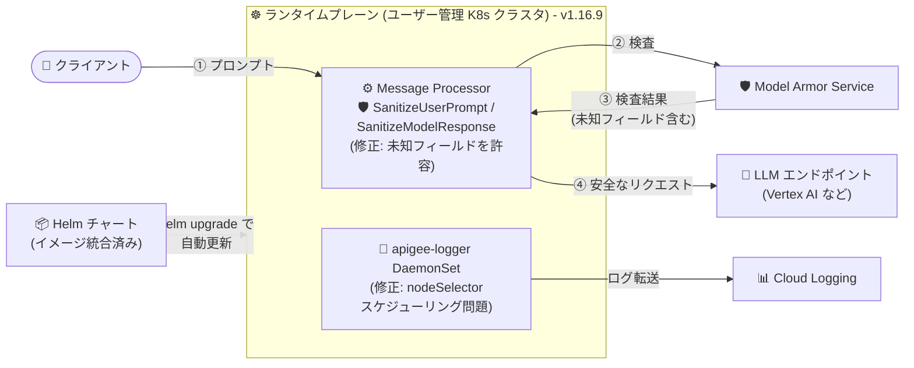

# Apigee hybrid: v1.16.9 パッチリリース (Model Armor ポリシー修正・apigee-logger スケジューリング修正・セキュリティ修正)

**リリース日**: 2026-08-11

**サービス**: Apigee hybrid

**機能**: v1.16.9 パッチリリース

**ステータス**: Announcement / Fixed / Security (パッチリリース)

📊 [このアップデートのインフォグラフィックを見る](https://takech9203.github.io/google-cloud-news-summary/20260811-apigee-hybrid-v1-16-9.html)

## 概要

2026 年 8 月 11 日、Apigee hybrid ソフトウェアの更新版 v1.16.9 がリリースされました。Apigee hybrid は、管理プレーンを Google Cloud 上に置きつつ、ランタイムプレーンをユーザー管理の Kubernetes クラスタ (GKE、他クラウド、オンプレミス) で稼働させるハイブリッド型の API 管理プラットフォームです。

本リリースはパッチリリースであり、2 件の不具合修正と各種セキュリティ / CVE 修正が含まれています。パッチリリースで使用されるコンテナイメージは Apigee hybrid の Helm チャートに統合されているため、Helm チャート経由でパッチにアップグレードするとイメージも自動的に更新され、通常は手動でのイメージ変更は不要です。

修正内容は、(1) 生成 AI ワークロード保護に使用する SanitizeUserPrompt / SanitizeModelResponse ポリシーの Model Armor レスポンス解析の問題、(2) Helm チャートのデフォルト `logger.nodeSelector` に起因する apigee-logger DaemonSet のスケジューリング問題の 2 点です。Apigee で AI API のガードレール (Model Armor 連携) を利用している環境や、カスタムノードラベルを付与していないノードでロガーを稼働させる環境では、本バージョンへの更新が推奨されます。

**アップデート前の課題**

- SanitizeUserPrompt / SanitizeModelResponse ポリシーが、Model Armor Service からのレスポンスに未知のフィールドが含まれていると解析に失敗する問題があった (Bug 514973778)
- Helm チャートのデフォルト `logger.nodeSelector` により、カスタムノードラベル (デフォルト: `apigee.com/apigee-logger-enabled: true`) が付与されていないクラスタノードでは apigee-logger DaemonSet がスケジュールできない問題があった (Bug 543171828)
- 既知のセキュリティ脆弱性 (CVE) への対応が旧パッチには含まれていなかった

**アップデート後の改善**

- SanitizeUserPrompt / SanitizeModelResponse ポリシーが Model Armor Service レスポンス内の未知のフィールドを許容できるようになり、Model Armor 側のレスポンス形式の拡張に対する耐性が向上した
- カスタムノードラベルのないノードでも apigee-logger DaemonSet が正常にスケジュールされるようになった
- 各種セキュリティ / CVE 修正が適用され、セキュリティ体制が強化された

## アーキテクチャ図



v1.16.9 で修正された 2 つのコンポーネント (Model Armor 連携ポリシーと apigee-logger DaemonSet) の位置付けを示しています。パッチのコンテナイメージは Helm チャートに統合されており、`helm upgrade` で自動的に更新されます。

## サービスアップデートの詳細

### 主要機能

1. **Model Armor 連携ポリシーの解析エラー修正 (Bug 514973778)**
   - SanitizeUserPrompt / SanitizeModelResponse ポリシーが Model Armor Service からのレスポンスを解析する際に、未知のフィールドを許容できずに失敗する問題を修正
   - SanitizeUserPrompt はリクエストフローでユーザープロンプトを、SanitizeModelResponse はレスポンスフローで LLM の応答を Model Armor に送信して検査する、AI ワークロード保護のための Extensible ポリシー
   - この修正により、Model Armor API のレスポンススキーマに新しいフィールドが追加されても、ポリシーの解析エラー (`SanitizationResponseParsingFailed` に相当する事象) を回避できる

2. **apigee-logger DaemonSet のスケジューリング修正 (Bug 543171828)**
   - Helm チャートのデフォルト `logger.nodeSelector` により、カスタムノードラベルのないノードで apigee-logger DaemonSet がスケジュールできない問題を修正
   - `logger.nodeSelector.key` / `logger.nodeSelector.value` は、ロガーサービスを稼働させるノードを指定するプロパティ (デフォルト値: `apigee.com/apigee-logger-enabled` / `true`)
   - apigee-logger は非 GKE 環境でクラスタノードのログを Cloud Logging に転送する DaemonSet であり、全対象ノードでの稼働が前提となるため、スケジューリング不能はログ欠損に直結する

3. **セキュリティ / CVE 修正**
   - 各種セキュリティおよび CVE 修正が本リリースに含まれる
   - 個別の CVE 番号はリリースノートに明記されていない

## 技術仕様

### リリース情報

| 項目 | 詳細 |
|------|------|
| バージョン | v1.16.9 |
| リリース日 | 2026 年 8 月 11 日 |
| リリース種別 | パッチリリース |
| コンテナイメージ | Helm チャートに統合済み (Helm チャート経由のアップグレードで自動更新) |
| 修正 Bug ID | 514973778 (Model Armor ポリシー)、543171828 (apigee-logger nodeSelector) |
| セキュリティ | 各種セキュリティ / CVE 修正を含む |

### 関連する設定プロパティ (logger.nodeSelector)

```yaml
# overrides.yaml での logger nodeSelector 設定例
logger:
  enabled: true  # 非 GKE 環境では true
  nodeSelector:
    key: apigee.com/apigee-logger-enabled  # デフォルト値
    value: "true"                           # デフォルト値
```

## 設定方法

### 前提条件

1. Apigee hybrid v1.16 系がユーザー管理の Kubernetes クラスタで稼働していること
2. Helm チャートによるインストール / 管理を行っていること (v1.16.9 のコンテナイメージは Helm チャートに統合済み)

### 手順

#### ステップ 1: アップグレードガイドの確認

v1.16.9 へのアップグレード手順は公式ドキュメント「Upgrading Apigee hybrid to version 1.16」を参照します。新規インストールの場合は「The big picture」を参照します。

#### ステップ 2: Helm チャートによるアップグレード

```bash
# 例: apigee-operator チャートのアップグレード (dry run で事前検証)
helm upgrade operator apigee-operator/ \
  --install \
  --namespace apigee \
  -f OVERRIDES_FILE \
  --dry-run=server

# 問題なければ実際にアップグレード
helm upgrade operator apigee-operator/ \
  --install \
  --namespace apigee \
  -f OVERRIDES_FILE
```

パッチリリースのコンテナイメージは Helm チャートに統合されているため、チャート経由でアップグレードするとイメージも自動的に更新されます。手動でのイメージ変更は通常不要です。各コンポーネント (apigee-datastore、apigee-telemetry、apigee-org、apigee-env など) のチャートを公式アップグレード手順に従って順にアップグレードします。

## メリット

### ビジネス面

- **AI API ガードレールの安定稼働**: Model Armor と連携した AI API 保護 (プロンプト / レスポンスのサニタイズ) が解析エラーで中断するリスクが解消され、生成 AI ワークロードの可用性が向上する
- **セキュリティコンプライアンス**: CVE 修正の適用により、パッチ適用ポリシーや監査要件への対応が容易になる

### 技術面

- **前方互換性の向上**: Model Armor Service のレスポンスに未知のフィールドが追加されてもポリシーが動作し続けるため、Model Armor 側の機能拡張に対して堅牢になる
- **ログ収集の確実性**: カスタムノードラベルの有無に関わらず apigee-logger DaemonSet がスケジュールされ、ノードログの欠損を防止できる
- **運用負荷の低いアップグレード**: コンテナイメージが Helm チャートに統合されているため、チャートのアップグレードのみで完結する

## デメリット・制約事項

### 考慮すべき点

- パッチ適用には各 Helm チャートのアップグレード作業が必要であり、本番環境では dry run による事前検証と計画的なロールアウトが推奨される
- セキュリティ修正の対象 CVE はリリースノートに個別に明記されていないため、詳細が必要な場合は Google Cloud サポートへの確認が必要
- Apigee hybrid はバージョンごとにサポート期間が定められているため、旧バージョン (v1.14 / v1.15 系) を利用中の場合はマイナーバージョンアップグレードの計画も併せて検討が必要

## ユースケース

### ユースケース 1: Model Armor による AI API ガードレールの安定運用

**シナリオ**: Apigee hybrid を LLM API (Vertex AI Gemini など) のゲートウェイとして利用し、SanitizeUserPrompt / SanitizeModelResponse ポリシーでプロンプトインジェクションや有害コンテンツを検査している。Model Armor のレスポンス解析エラーにより API 呼び出しが失敗するリスクを排除したい。

**実装例**:
```xml
<SanitizeUserPrompt async="false" continueOnError="false" enabled="true" name="sanitize-prompt">
  <IgnoreUnresolvedVariables>true</IgnoreUnresolvedVariables>
  <ModelArmor>
    <TemplateName>projects/$PROJECT/locations/$LOCATION/templates/$TEMPLATE_NAME</TemplateName>
  </ModelArmor>
  <UserPromptSource>{jsonPath('$.contents[-1].parts[-1].text',request.content,true)}</UserPromptSource>
</SanitizeUserPrompt>
```

**効果**: v1.16.9 では Model Armor レスポンス内の未知フィールドを許容するため、Model Armor 側の機能追加後もポリシーが解析エラーを起こさず、AI API のガードレールが安定して機能する。

### ユースケース 2: 非 GKE 環境でのノードログ収集の正常化

**シナリオ**: 他クラウドやオンプレミスの Kubernetes 上で Apigee hybrid を稼働させ、`logger.enabled: true` で apigee-logger によるログ収集を行っている。一部ノードにカスタムノードラベルを付与しておらず、apigee-logger DaemonSet がスケジュールされない事象が発生していた。

**効果**: v1.16.9 へのアップグレードにより、カスタムノードラベルのないノードでも apigee-logger DaemonSet が正常にスケジュールされ、全ノードのログが Cloud Logging に転送されるようになる。

## 料金

Apigee hybrid 自体のパッチ適用に追加料金は発生しません。Apigee の料金体系 (サブスクリプションまたは従量課金) の詳細は公式料金ページを参照してください。

- [Apigee 料金ページ](https://cloud.google.com/apigee/pricing)

なお、SanitizeUserPrompt / SanitizeModelResponse は Extensible ポリシーであり、Apigee のライセンスによってはコストや利用量への影響がある点、また Model Armor Service 自体の利用料金が別途発生する点に留意してください。

## 利用可能リージョン

Apigee hybrid のランタイムプレーンはユーザー管理の Kubernetes クラスタ (GKE、他クラウド、オンプレミス) 上で稼働するため、リージョンの制約は管理プレーン (Apigee 組織) の構成に依存します。詳細は公式ドキュメントを参照してください。

## 関連サービス・機能

- **Model Armor**: LLM のリスク (プロンプトインジェクション、有害コンテンツ、機密データ漏えいなど) を軽減する Google Cloud の AI セキュリティサービス。SanitizeUserPrompt / SanitizeModelResponse ポリシーの検査バックエンドとして利用される
- **Cloud Logging**: apigee-logger DaemonSet がクラスタノードのログを転送する先のログ管理サービス
- **Google Kubernetes Engine (GKE)**: Apigee hybrid ランタイムプレーンの代表的な稼働環境。GKE ではプラットフォーム側のログ収集があるため logger はデフォルト無効 (`logger.enabled: false`)
- **Vertex AI**: Model Armor ポリシーと組み合わせて保護する代表的な LLM エンドポイント (Gemini モデルなど)

## 参考リンク

- 📊 [インフォグラフィック](https://takech9203.github.io/google-cloud-news-summary/20260811-apigee-hybrid-v1-16-9.html)
- [公式リリースノート](https://docs.cloud.google.com/release-notes#August_11_2026)
- [Apigee hybrid リリースノート](https://docs.cloud.google.com/apigee/docs/hybrid/release-notes)
- [Apigee hybrid v1.16 へのアップグレード](https://docs.cloud.google.com/apigee/docs/hybrid/v1.16/upgrade)
- [Apigee hybrid の全体像 (The big picture)](https://docs.cloud.google.com/apigee/docs/hybrid/v1.16/big-picture)
- [Apigee リリースプロセス (コンテナイメージのサポート)](https://docs.cloud.google.com/apigee/docs/release/apigee-release-process#apigee-hybrid-container-images)
- [SanitizeUserPrompt ポリシー](https://docs.cloud.google.com/apigee/docs/api-platform/reference/policies/sanitize-user-prompt-policy)
- [SanitizeModelResponse ポリシー](https://docs.cloud.google.com/apigee/docs/api-platform/reference/policies/sanitize-llm-response-policy)
- [Apigee Model Armor ポリシーの利用](https://docs.cloud.google.com/apigee/docs/api-platform/tutorials/using-model-armor-policies)
- [構成プロパティリファレンス](https://docs.cloud.google.com/apigee/docs/hybrid/v1.16/config-prop-ref)
- [料金ページ](https://cloud.google.com/apigee/pricing)

## まとめ

Apigee hybrid v1.16.9 は、Model Armor 連携ポリシーの解析エラーと apigee-logger DaemonSet のスケジューリング問題を修正し、各種セキュリティ / CVE 修正を含むパッチリリースです。特に Apigee を生成 AI ワークロードのゲートウェイとして利用している環境や、非 GKE 環境でロガーを稼働させている環境では影響が大きいため、Helm チャート経由での早期アップグレードを推奨します。

---

**タグ**: Apigee hybrid, パッチリリース, Model Armor, SanitizeUserPrompt, SanitizeModelResponse, apigee-logger, Helm, セキュリティ, CVE, API 管理
