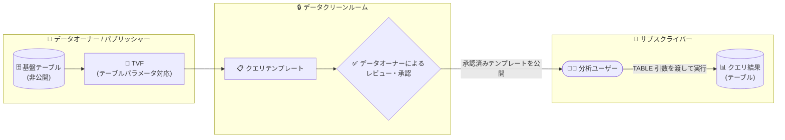

# BigQuery: データクリーンルーム向けクエリテンプレートと TVF テーブルパラメータが GA

**リリース日**: 2026-08-11

**サービス**: BigQuery

**機能**: データクリーンルーム向けクエリテンプレート / テーブル値関数 (TVF) のテーブルパラメータ

**ステータス**: GA (一般提供)

📊 [このアップデートのインフォグラフィックを見る](https://takech9203.github.io/google-cloud-news-summary/20260811-bigquery-query-templates-tvf-table-parameters.html)

## 概要

BigQuery において、関連する 2 つの機能が一般提供 (GA) となりました。1 つ目は **データクリーンルーム向けクエリテンプレート** です。クエリテンプレートを使用すると、データクリーンルームのオーナーやパブリッシャーは、基盤となるテーブルやビューを公開することなく、事前定義されたクエリをサブスクライバーに共有できます。事前定義クエリは BigQuery のテーブル値関数 (TVF) として実装され、テーブル全体や特定のフィールドを入力パラメータとして受け取り、テーブルを出力として返します。

2 つ目は **TVF におけるテーブルパラメータ** の GA です。TVF のパラメータとしてテーブルを渡せるようになり、さらに `ANY TABLE` 型を使用することで、任意の構造のテーブルを受け取る汎用的な関数を作成できます。この 2 つの機能は密接に関連しており、クエリテンプレートはテーブルパラメータを持つ TVF を基盤として動作します。

対象ユーザーは、広告・マーケティング・金融・ヘルスケアなどでパートナー企業と機密データを安全に共有・分析するデータプロバイダーおよびデータアナリスト、そして再利用可能な SQL ロジックを構築するデータエンジニアです。

**アップデート前の課題**

- データクリーンルームでサブスクライバーに自由なクエリ実行を許可すると、意図的または偶発的な機密データ漏洩のリスクが高まる懸念があった
- 分析ルール (集計しきい値など) はプライバシー制御を提供するものの、生データ抽出を狙ったすべての不正なクエリをブロックすることは保証されていなかった
- クエリテンプレートおよび TVF のテーブルパラメータは Preview 段階であり、Pre-GA 提供条件のもとでの利用となるため、本番環境での採用が難しかった
- TVF のパラメータはスカラー型が中心で、テーブル構造ごとに個別の関数を定義する必要があった

**アップデート後の改善**

- クエリテンプレートが GA となり、事前定義・承認済みのクエリのみをサブスクライバーに実行させる運用を本番環境で採用できるようになった
- 基盤となるテーブルやビューを公開せずにクエリを共有できるため、データ漏洩リスクを事前にブロックできるようになった
- TVF のテーブルパラメータが GA となり、`TABLE<schema>` 型に加えて `ANY TABLE` 型により任意の構造のテーブルを受け取る汎用関数を作成できるようになった
- SQL の専門知識が少ないサブスクライバーでも、承認済みテンプレートを呼び出すだけで一貫した分析結果を得られるようになった

## アーキテクチャ図



データオーナーは基盤テーブルを公開せずに TVF ベースのクエリテンプレートを定義し、承認ワークフローを経てデータクリーンルームに公開します。サブスクライバーは承認済みテンプレートに自身のテーブルを引数として渡して実行し、結果テーブルのみを取得します。

## サービスアップデートの詳細

### 主要機能

1. **クエリテンプレート (GA)**
   - データクリーンルームのオーナーとパブリッシャーが、事前定義・承認済みのクエリをサブスクライバーに共有できる
   - 基盤となるテーブルやビューのリソース自体は共有せず、クエリ (TVF) のみを公開するため、生データへのアクセスを防止できる
   - テンプレートは承認ワークフローを持ち、クエリで参照されるデータの所有者のみが承認可能。自身のデータのみを参照する TVF であれば自己承認できる
   - 実行可能なクエリを事前に制限することで、機密データ漏洩の防止、非技術系ユーザーのオンボーディング簡素化、分析結果の一貫性保証を実現する

2. **TVF のテーブルパラメータ (GA)**
   - TVF のパラメータとしてテーブルを指定可能。`TABLE<列名 型, ...>` の形式で必要なスキーマを明示的に指定する
   - 渡すテーブル引数は、パラメータスキーマで指定した列のスーパーセットでよく、列の順序も任意
   - 呼び出し時はテーブル引数名の前に `TABLE` キーワードを付与する

3. **ANY TABLE 型による汎用関数**
   - `ANY TABLE` 型をテーブルパラメータとして使用することで、任意の構造のテーブルを受け取る汎用的な関数を作成できる
   - スキーマごとに個別の TVF を定義する必要がなくなり、再利用性の高い SQL ロジックを構築できる

## 技術仕様

### クエリテンプレートの仕様

| 項目 | 詳細 |
|------|------|
| 実装基盤 | テーブル値関数 (TVF) |
| データ参照数 | 最大 2 つ (TVF のクエリ定義に使用するデータ + TVF が受け取るデータパラメータ入力) |
| クエリ定義内の参照 | 複数のテーブル・ビューを参照可能だが、すべて同一のデータオーナーに属する必要がある |
| 固定型のサポート | TABLE および VIEW 固定型のみサポート |
| 承認 | クエリで参照されるデータへのアクセス権を持つデータコントリビューターのみが承認可能 |
| 前提 API | Analytics Hub API (`analyticshub.googleapis.com`) |
| 利用リージョン | BigQuery sharing 対応リージョン (データクリーンルームの制約に準拠) |

### 必要な IAM ロール (主なもの)

| タスク | 必要なロール |
|--------|-------------|
| クエリテンプレートの作成 | Analytics Hub Publisher (`roles/analyticshub.publisher`) + Analytics Hub Subscriber (`roles/analyticshub.subscriber`) |
| クエリテンプレートの承認 | Analytics Hub Publisher + BigQuery Data Owner (`roles/bigquery.dataOwner`) |
| クリーンルームへのサブスクライブ | Analytics Hub Subscriber + Analytics Hub Subscription Owner (`roles/analyticshub.subscriptionOwner`) |
| テンプレートのクエリ実行 | BigQuery Data Viewer (`roles/bigquery.dataViewer`) + BigQuery User (`roles/bigquery.user`) |

### TVF テーブルパラメータの構文

```sql
CREATE TABLE FUNCTION mydataset.compute_sales (
  orders TABLE<sales INT64, item STRING>,
  item_name STRING)
AS (
  SELECT SUM(sales) AS total_sales, item
  FROM orders
  WHERE item = item_name
  GROUP BY item
);
```

## 設定方法

### 前提条件

1. Google Cloud プロジェクトで Analytics Hub API が有効化されていること (クエリテンプレートの場合)
2. 上記の必要な IAM ロールが付与されていること
3. TVF は参照するテーブルと同じロケーションに保存すること

### 手順

#### ステップ 1: テーブルパラメータを持つ TVF を作成する

```sql
CREATE TABLE FUNCTION mydataset.compute_sales (
  orders TABLE<sales INT64, item STRING>,
  item_name STRING)
AS (
  SELECT SUM(sales) AS total_sales, item
  FROM orders
  WHERE item = item_name
  GROUP BY item
);
```

テーブルパラメータのスキーマは struct のフィールドと同じ形式で明示的に指定します。

#### ステップ 2: TVF を呼び出す

```sql
WITH my_orders AS (
  SELECT 1 AS sales, "apple" AS item, 0.99 AS price
  UNION ALL SELECT 2, "banana", 0.49
  UNION ALL SELECT 5, "apple", 0.99)
SELECT * FROM mydataset.compute_sales(TABLE my_orders, "apple");
-- 結果: total_sales = 6, item = "apple"
```

テーブル引数には `TABLE` キーワードを付けます。引数のテーブルはパラメータスキーマに含まれない追加列 (例: `price`) を持っていても問題ありません。

#### ステップ 3: クエリテンプレートを作成・承認する (データクリーンルーム)

1. Google Cloud コンソールで「共有 (Analytics Hub)」ページに移動する
2. 対象のデータクリーンルームを開き、「テンプレート」タブでクエリテンプレートを作成・提出する
3. データオーナーが「Approval Status」>「Requires review」から内容をレビューし、「Approve」で承認する
4. 承認されたテンプレートがクリーンルーム内のリスティングとしてサブスクライバーに公開される

## メリット

### ビジネス面

- **データ漏洩リスクの低減**: サブスクライバーが実行できるクエリを承認済みテンプレートに限定することで、機密データの偶発的・意図的な流出を事前にブロックできる
- **パートナー協業の加速**: 非技術系ユーザーでも承認済みクエリを実行するだけで分析でき、クリーンルームのオンボーディングと採用が簡素化される
- **コンプライアンスの担保**: 実行されるクエリが事前レビューされるため、プライバシー規制への準拠確認と一貫した分析結果の保証が容易になる

### 技術面

- **生データ非公開のクエリ共有**: 基盤テーブル・ビューを共有せず、TVF として定義したクエリロジックのみを公開できる
- **汎用的な SQL 資産の構築**: `ANY TABLE` 型により任意のスキーマのテーブルを受け取る汎用 TVF を定義でき、スキーマごとの関数乱立を回避できる
- **柔軟な引数渡し**: テーブル引数はパラメータスキーマのスーパーセットでよく、列順序も自由なため、呼び出し側のテーブル構造変更に強い

## デメリット・制約事項

### 制限事項

- クエリテンプレートがサポートするデータ参照は最大 2 つ (TVF のクエリ定義に使用するデータと、TVF が受け取るデータパラメータ入力)
- TVF のクエリ定義内で複数のテーブル・ビューを参照できるが、すべて同一のデータオーナーに属している必要がある
- クエリテンプレートの TVF は TABLE および VIEW の固定型のみをサポートする
- TVF のクエリ本体は SELECT 文である必要があり、DDL/DML は使用できない
- TVF は参照するテーブルと同じロケーションに保存する必要がある
- データクリーンルームは BigQuery sharing 対応リージョンでのみ利用可能

### 考慮すべき点

- 他のコントリビューターのデータを参照する TVF は、そのデータの所有者のみが承認できるため、承認ワークフローの運用設計が必要
- TVF のパラメータ名が参照テーブルの列名と一致すると列参照として解釈されるため、列名と重複しないパラメータ名を使用することが推奨される
- クエリテンプレートは TVF の制限事項 (クォータ含む) にも準拠する

## ユースケース

### ユースケース 1: 広告主とメディアのオーディエンス重複分析

**シナリオ**: メディア企業 (データオーナー) が広告主 (サブスクライバー) に対し、顧客リストの重複分析を提供したい。ただし自社の視聴者データの生データは一切公開したくない。

**実装例**:
```sql
-- メディア企業が定義するクエリテンプレート用 TVF
CREATE TABLE FUNCTION mydataset.audience_overlap (
  advertiser_customers TABLE<user_id STRING>)
AS (
  SELECT COUNT(DISTINCT m.user_id) AS overlap_count
  FROM mydataset.media_audience AS m
  JOIN advertiser_customers AS a
  ON m.user_id = a.user_id
);
```

**効果**: 広告主は自社の顧客テーブルを `TABLE` 引数として渡すだけで重複数を取得できる。メディア側の視聴者データは非公開のまま、承認済みクエリ以外は実行できないため、データ漏洩リスクを最小化できる。

### ユースケース 2: ANY TABLE を使った汎用データ品質チェック関数

**シナリオ**: データエンジニアリングチームが、スキーマの異なる多数のテーブルに対して共通のデータ品質チェック (行数集計など) を適用したい。

**効果**: `ANY TABLE` 型のテーブルパラメータを持つ汎用 TVF を 1 つ定義するだけで、任意の構造のテーブルに適用できる。テーブルごとに個別の関数やビューを作成・保守する必要がなくなり、SQL 資産の再利用性が向上する。

## 料金

クエリテンプレートおよび TVF 自体に追加料金はなく、テンプレート経由で実行されるクエリには通常の BigQuery の分析料金 (オンデマンドまたはエディションの容量ベース料金) が適用されます。詳細は料金ページを参照してください。

- [BigQuery の料金](https://cloud.google.com/bigquery/pricing)

## 利用可能リージョン

データクリーンルーム (クエリテンプレート) は BigQuery sharing がサポートされるリージョンで利用できます。詳細は [BigQuery sharing のサポートリージョン](https://docs.cloud.google.com/bigquery/docs/analytics-hub-introduction#supported-regions) を参照してください。

## 関連サービス・機能

- **BigQuery sharing (Analytics Hub)**: データクリーンルームの基盤となるデータ共有プラットフォーム。クエリテンプレートは Analytics Hub API を通じて作成・承認・公開される
- **BigQuery データクリーンルーム**: 生データへのアクセスを防ぎながら機密データを共有・分析する環境。クエリテンプレートにより分析ルールを補完する事前承認型の制御が可能になる
- **分析ルール (Analysis rules)**: 集計しきい値などのプライバシー制御。クエリテンプレートと組み合わせることでより強固なデータ保護を実現する
- **承認済みルーチン (Authorized routines)**: 基盤テーブルへのアクセスを付与せずにクエリ結果を共有する仕組みで、TVF にも適用可能
- **IAM (Identity and Access Management)**: クエリテンプレートの作成・承認・実行に必要なロール管理

## 参考リンク

- 📊 [インフォグラフィック](https://takech9203.github.io/google-cloud-news-summary/20260811-bigquery-query-templates-tvf-table-parameters.html)
- [公式リリースノート](https://docs.cloud.google.com/release-notes#August_11_2026)
- [ドキュメント: クエリテンプレートの使用](https://docs.cloud.google.com/bigquery/docs/query-templates)
- [ドキュメント: テーブル関数 (テーブルパラメータ)](https://docs.cloud.google.com/bigquery/docs/table-functions#table_parameters)
- [ドキュメント: BigQuery データクリーンルーム](https://docs.cloud.google.com/bigquery/docs/data-clean-rooms)
- [料金ページ](https://cloud.google.com/bigquery/pricing)

## まとめ

データクリーンルームのクエリテンプレートと TVF のテーブルパラメータが GA となり、生データを公開せずに事前承認済みクエリのみを共有する安全なデータコラボレーションを本番環境で構築できるようになりました。パートナー企業との機密データ分析を検討している組織は、分析ルールに加えてクエリテンプレートを導入することでデータ漏洩リスクを大幅に低減できます。また、`ANY TABLE` 型を活用した汎用 TVF により、再利用性の高い SQL 資産の整備を進めることを推奨します。

---

**タグ**: BigQuery, データクリーンルーム, クエリテンプレート, TVF, テーブル値関数, ANY TABLE, Analytics Hub, データ共有, GA
