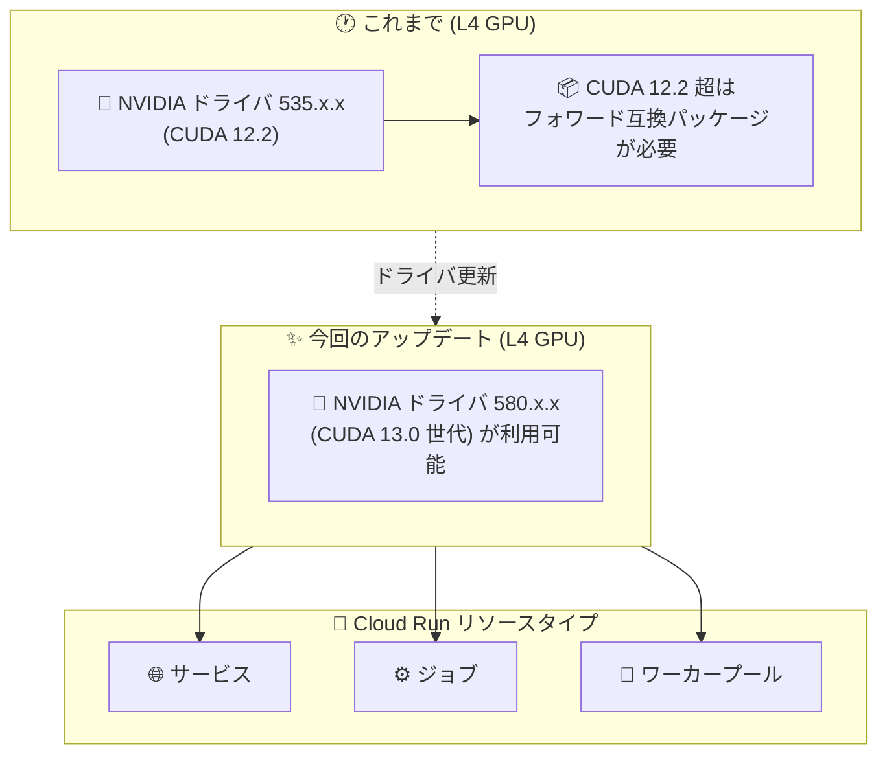

# Cloud Run: NVIDIA L4 GPU ドライバ バージョン 580.x.x が利用可能に

**リリース日**: 2026-08-11

**サービス**: Cloud Run

**機能**: NVIDIA L4 GPU ドライバ バージョン 580.x.x のサポート

**ステータス**: Feature

📊 [このアップデートのインフォグラフィックを見る](https://takech9203.github.io/google-cloud-news-summary/20260811-cloud-run-nvidia-l4-gpu-driver-580.html)

## 概要

Cloud Run の NVIDIA L4 GPU 向けに、NVIDIA ドライバ バージョン 580.x.x が利用可能になった。このドライバ バージョンは、サービス (services)、ジョブ (jobs)、ワーカープール (worker pools) の 3 つのリソースタイプすべてで利用できる。

Cloud Run の GPU はフルマネージドで提供され、ドライバやライブラリの追加インストールは不要である。ドライバ 580.x.x は CUDA 13.0 に対応するバージョンであり (Cloud Run で先行して 580.x.x を採用している NVIDIA RTX PRO 6000 Blackwell GPU のドキュメント表記より)、L4 GPU でもより新しい CUDA 環境を前提としたワークロードを実行しやすくなる。LLM 推論、動画トランスコード、3D レンダリングなど、L4 GPU を活用する AI/計算集約型ワークロードの利用者が対象となる。

**アップデート前の課題**

- Cloud Run の L4 GPU に提供されるドライバはバージョン 535.x.x (CUDA 12.2) であり、より新しいドライバを利用する選択肢がなかった
- CUDA 12.2 より新しい CUDA バージョンを利用するには、フォワード互換パッケージを含む新しい NVIDIA ベースイメージに依存するか、フォワード互換パッケージを手動でインストールして `LD_LIBRARY_PATH` に追加する必要があった
- 新しい CUDA ツールキットを前提とするフレームワークやライブラリの利用にひと手間かかっていた

**アップデート後の改善**

- L4 GPU で NVIDIA ドライバ 580.x.x が利用可能になり、より新しいドライバ環境でワークロードを実行できるようになった
- サービス、ジョブ、ワーカープールの 3 つのリソースタイプすべてで一貫して利用できる
- Cloud Run で提供されるもう 1 つの GPU (NVIDIA RTX PRO 6000 Blackwell、ドライバ 580.x.x) とドライバ世代を揃えられ、GPU タイプをまたぐコンテナイメージの共通化がしやすくなる

## アーキテクチャ図



L4 GPU のドライバが 535.x.x に加えて 580.x.x でも利用可能になり、Cloud Run のサービス、ジョブ、ワーカープールのすべてで新しいドライバ世代を使えるようになったことを示している。

## サービスアップデートの詳細

### 主要機能

1. **NVIDIA L4 GPU 向けドライバ 580.x.x の提供**
   - L4 GPU インスタンスで NVIDIA ドライバ バージョン 580.x.x が利用可能になった
   - ドライバ 580.x.x は CUDA 13.0 に対応する世代 (RTX PRO 6000 Blackwell GPU の「580.x.x (13.0)」という表記より)
   - 従来の L4 GPU のドライバは 535.x.x (CUDA 12.2)

2. **3 つのリソースタイプすべてで利用可能**
   - サービス: HTTP リクエスト駆動の推論エンドポイントなど
   - ジョブ: バッチ推論やモデルのファインチューニングなどのバッチ処理
   - ワーカープール: Pub/Sub などからのプル型処理を行う常駐ワーカー

3. **フルマネージドなドライバ提供 (従来どおり)**
   - ドライバはプリインストールされ、利用者によるインストール作業は不要
   - ドライバ ライブラリは `/usr/local/nvidia/lib64` にマウントされ、`LD_LIBRARY_PATH` に自動的に追加される
   - ドライバがプリインストールされた GPU インスタンスは約 5 秒で起動する

## 技術仕様

### Cloud Run の L4 GPU の仕様

| 項目 | 詳細 |
|------|------|
| GPU タイプ | NVIDIA L4 (`nvidia-l4`) |
| GPU メモリ (VRAM) | 24 GB (インスタンスメモリとは別) |
| ドライバ バージョン | 580.x.x が利用可能に (従来は 535.x.x / CUDA 12.2) |
| 最小構成 | 4 CPU / 16 GiB メモリ (推奨: 8 CPU / 32 GiB メモリ) |
| GPU 数 | 1 インスタンスあたり 1 GPU |
| サイドカー利用時 | GPU をアタッチできるコンテナは 1 つのみ |
| 起動時間 | ドライバ プリインストール済みで約 5 秒 |
| ドライバ ライブラリ | `/usr/local/nvidia/lib64` にマウント、`LD_LIBRARY_PATH` に自動追加 |

### ゾーン冗長性オプション

| オプション | 動作 | 料金 |
|-----------|------|------|
| ゾーン冗長性オン (デフォルト) | 複数ゾーンに GPU 容量を予約し、ゾーン障害時のフェイルオーバー性を確保 | GPU 秒あたりの単価が高い |
| ゾーン冗長性オフ | フェイルオーバーはベストエフォート (その時点で空き容量がある場合のみ) | GPU 秒あたりの単価が低い |

## 設定方法

### 前提条件

1. Cloud Run API が有効化されていること
2. Cloud Run デベロッパー (`roles/run.developer`) とサービスアカウント ユーザー (`roles/iam.serviceAccountUser`) のロール
3. L4 GPU クォータ (プロジェクト・リージョンごと。初回デプロイ時にゾーン冗長性オフの 3 GPU 分が自動付与される。自動付与は容量状況に依存)
4. L4 GPU の最小リソース構成 (4 CPU / 16 GiB メモリ以上) を満たすこと

### 手順

#### ステップ 1: L4 GPU 付きサービスのデプロイ

```bash
gcloud run deploy SERVICE \
  --image IMAGE_URL \
  --cpu 8 \
  --memory 32Gi \
  --gpu 1 \
  --gpu-type nvidia-l4 \
  --region us-central1
```

ドライバは Cloud Run 側で管理されるため、コンテナイメージにドライバを含める必要はない。

#### ステップ 2: ジョブ / ワーカープールでの利用

```bash
# ジョブの場合
gcloud run jobs update JOB_NAME --gpu 1 --gpu-type nvidia-l4

# ワーカープールの場合
gcloud run worker-pools update WORKER_POOL \
  --gpu 1 \
  --gpu-type nvidia-l4
```

ジョブとワーカープールでも同じ GPU タイプ指定 (`nvidia-l4`) で L4 GPU を利用できる。

#### ステップ 3: ドライバ バージョンの確認

```bash
# コンテナ内で実行 (例: 起動スクリプトやジョブ内)
nvidia-smi
```

コンテナ内から `nvidia-smi` を実行すると、割り当てられたドライバ バージョンを確認できる。

## メリット

### ビジネス面

- **最新エコシステムへの追従**: 新しい CUDA 世代を前提とする ML フレームワークやライブラリを L4 GPU 上で利用しやすくなり、技術選択の幅が広がる
- **運用負荷の低減**: ドライバはフルマネージドで提供されるため、ドライバ更新に伴う運用作業なしで新バージョンの恩恵を受けられる

### 技術面

- **フォワード互換パッケージへの依存の軽減**: 従来 CUDA 12.2 (ドライバ 535.x.x) を超える CUDA を使うにはフォワード互換パッケージが必要だったが、580.x.x の利用により新しい CUDA 環境を直接利用しやすくなる
- **GPU タイプ間のドライバ世代の統一**: RTX PRO 6000 Blackwell GPU (580.x.x) と同じドライバ世代を L4 でも利用でき、GPU タイプをまたぐイメージやコードの共通化がしやすくなる
- **全リソースタイプでの一貫性**: サービス、ジョブ、ワーカープールで同じドライバ環境を利用できる

## デメリット・制約事項

### 制限事項

- L4 GPU は 1 インスタンスあたり 1 基のみ構成可能
- L4 GPU の最小構成は 4 CPU / 16 GiB メモリ
- GPU インスタンス数はサービスの最大インスタンス数設定と、プロジェクト・リージョンごとの GPU クォータの両方で制限される
- L4 GPU の利用可能リージョンは限定されている (下記「利用可能リージョン」参照)

### 考慮すべき点

- 公式ドキュメント (2026-08-12 時点) では L4 の「現行ドライバ バージョン」は 535.x.x (12.2) と記載されており、580.x.x はリリースノートで「利用可能」とアナウンスされた段階である。アプリケーションが特定のドライバ/CUDA バージョンに依存する場合は、`nvidia-smi` で実際に割り当てられたバージョンを確認すること
- コンテナ内のコード (CUDA ツールキットやフレームワーク) は、提供されるドライバ バージョンと互換である必要がある。NVIDIA の互換性マトリクスで確認すること
- ワーカープールの GPU は自動スケーリングされず、プロセスが動作していなくてもインスタンス稼働中は GPU 課金が発生する

## ユースケース

### ユースケース 1: 新しい CUDA 世代を必要とする LLM 推論サービス

**シナリオ**: 最新の推論フレームワーク (新しい CUDA ツールキットを前提とするバージョン) を使って、L4 GPU 上でオープンモデルの推論 API を提供したい。

**実装例**:
```bash
gcloud run deploy llm-inference \
  --image us-docker.pkg.dev/PROJECT/repo/llm-server:latest \
  --cpu 8 --memory 32Gi \
  --gpu 1 --gpu-type nvidia-l4 \
  --region us-central1
```

**効果**: ドライバ 580.x.x の利用により、フォワード互換パッケージを手動で組み込むことなく、新しい CUDA 世代を前提としたイメージを L4 GPU で動かしやすくなる。アイドル時はゼロまでスケールインでき、コストを抑えられる。

### ユースケース 2: ジョブによるバッチ推論・動画処理

**シナリオ**: 夜間バッチで大量の動画のトランスコードや LLM によるオフライン推論を Cloud Run ジョブで実行する。

**効果**: ジョブでも 580.x.x ドライバの L4 GPU を利用でき、サービスと同じコンテナイメージ・同じドライバ環境でバッチ処理を実行できる。

## 料金

ドライバ バージョンの違いによる追加料金はなく、L4 GPU の利用料金は従来どおり GPU 秒単位で課金される。GPU はインスタンスのライフサイクル全体にわたって課金される。CPU・メモリの料金が別途発生する。

### 料金例 (us-central1、L4 GPU 1 基、GPU 分のみの概算)

| 使用量 | 月額料金 (概算) |
|--------|-----------------|
| ゾーン冗長性なし ($0.0001867/秒) × 1 日 1 時間 × 30 日 | 約 $20.2 |
| ゾーン冗長性なし ($0.0001867/秒) × 730 時間 (常時稼働) | 約 $490.6 |
| ゾーン冗長性あり ($0.0002909/秒) × 730 時間 (常時稼働) | 約 $764.5 |

最新の料金は [Cloud Run 料金ページ](https://cloud.google.com/run/pricing) を参照。

## 利用可能リージョン

L4 GPU は以下のリージョンで利用可能 (2026-08-12 時点のドキュメントより):

- asia-southeast1 (シンガポール)
- asia-south1 (ムンバイ) ※招待制
- europe-west1 (ベルギー)
- europe-west4 (オランダ)
- us-central1 (アイオワ)
- us-east4 (北バージニア)

## 関連サービス・機能

- **Cloud Run worker pools**: Pub/Sub などからのプル型ワークロードを GPU 付き常駐インスタンスで処理。今回のドライバ更新の対象
- **Cloud Run jobs**: バッチ推論・ファインチューニングなどの GPU バッチ処理。今回のドライバ更新の対象
- **NVIDIA RTX PRO 6000 Blackwell GPU (Cloud Run)**: Cloud Run が提供するもう 1 つの GPU タイプ。ドライバ 580.x.x (CUDA 13.0) を採用しており、今回のアップデートで L4 とドライバ世代を揃えられる
- **GKE / Compute Engine の GPU**: より多くの GPU 数やドライバ バージョンの細かい制御が必要な場合の代替選択肢

## 参考リンク

- 📊 [インフォグラフィック](https://takech9203.github.io/google-cloud-news-summary/20260811-cloud-run-nvidia-l4-gpu-driver-580.html)
- [公式リリースノート](https://docs.cloud.google.com/release-notes#August_11_2026)
- [GPU 構成 (サービス)](https://docs.cloud.google.com/run/docs/configuring/services/gpu)
- [GPU 構成 (ジョブ)](https://docs.cloud.google.com/run/docs/configuring/jobs/gpu)
- [GPU 構成 (ワーカープール)](https://docs.cloud.google.com/run/docs/configuring/workerpools/gpu)
- [料金ページ](https://cloud.google.com/run/pricing)

## まとめ

Cloud Run の L4 GPU で NVIDIA ドライバ 580.x.x が利用可能になり、新しい CUDA 世代を前提とした AI/計算集約型ワークロードをサービス・ジョブ・ワーカープールで動かしやすくなった。ドライバはフルマネージドで提供されるため利用者側の更新作業は不要だが、CUDA やフレームワークのバージョン互換性に依存するワークロードでは、`nvidia-smi` による実際のドライバ バージョン確認と NVIDIA 互換性マトリクスの確認を推奨する。

---

**タグ**: Cloud Run, GPU, NVIDIA L4, ドライバ, CUDA, サーバーレス, AI 推論
