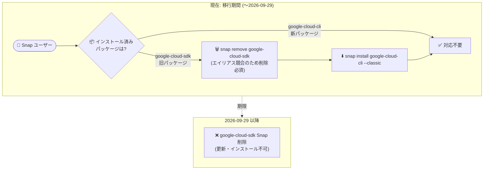

# Cloud SDK: gcloud CLI 580.0.0 リリース (Snap パッケージ非推奨化の Breaking Change)

**リリース日**: 2026-08-11

**サービス**: Cloud SDK (gcloud CLI)

**機能**: gcloud CLI 580.0.0 - google-cloud-sdk Snap パッケージの非推奨化、GCE 常駐検出の修正、新コマンド群の追加

**ステータス**: リリース済み (Breaking Change を含む)

📊 [このアップデートのインフォグラフィックを見る](https://takech9203.github.io/google-cloud-news-summary/20260811-cloud-sdk-580-snap-deprecation.html)

## 概要

2026 年 8 月 11 日、Google Cloud CLI (gcloud) のバージョン 580.0.0 がリリースされました。本リリースの最重要事項は Breaking Change として告知された **`google-cloud-sdk` Snap パッケージの非推奨化**です。同パッケージは **2026 年 9 月 29 日に削除**される予定であり、Ubuntu などで Snap 経由で gcloud CLI をインストールしているユーザーは、後継の **`google-cloud-cli`** Snap パッケージへの移行が必要です。両パッケージは同じエイリアス (コマンド名) を使用するため共存できず、旧パッケージを削除 (`snap remove google-cloud-sdk`) してから新パッケージをインストール (`snap install google-cloud-cli --classic`) する手順になります。

もう 1 つの重要な修正として、**Google Compute Engine の常駐 (residency) 検出の修正**が含まれています。従来は一時的な問題による認証失敗や、Google Cloud 以外の環境 (オンプレミス、他クラウド、ローカル開発環境など) でのコマンド実行レイテンシの悪化 (リグレッション) が発生する可能性がありましたが、本修正により解消されました。

そのほか、`gcloud apihub locations configure-and-deploy-server` の GA 昇格 (API Hub 経由で Apigee X 上に MCP サーバーを構成・デプロイ)、Cloud Dataflow の `jobs pause` / `jobs resume` コマンド追加、IAM Workload Identity Pools での X.509 証明書ベース認証情報とロケーショナル mTLS エンドポイントのサポート、Backup and DR の選択的ディスクバックアップ・個別ディスクリストア、Cloud Composer の Airflow CLI サブコマンド拡充など、Solutions Architect や運用担当者が把握しておくべき変更が幅広く含まれています。

**アップデート前の課題**

- Snap 環境では旧称の `google-cloud-sdk` パッケージが提供され続けており、他のインストール方法 (apt / yum / アーカイブ) で使用される `google-cloud-cli` という名称と不一致だった
- GCE 常駐検出の一時的な問題により認証失敗が発生することがあり、Google Cloud 以外の環境ではコマンドレイテンシのリグレッションが発生していた
- Dataflow ジョブを CLI から一時停止・再開するコマンドがなく、ジョブの一時的な停止にはドレインやキャンセルなどの手段しかなかった
- Workload Identity Federation の認証情報構成 (`create-cred-config`) は X.509 証明書ベースの認証情報に対応していなかった
- Backup and DR のバックアッププランではインスタンス全体が対象で、ブートディスクのみ、あるいはラベルによるディスク除外といった選択的バックアップを CLI から構成できなかった
- `gcloud storage rsync` は宛先ディレクトリ外を指すパス (パストラバーサル) を含むファイルも同期対象になり得た

**アップデート後の改善**

- Snap パッケージが `google-cloud-cli` に統一され、他のインストール方法とパッケージ名が一貫するようになった (旧パッケージは 2026 年 9 月 29 日に削除)
- GCE 常駐検出が修正され、一時的な問題による認証失敗と、非 Google Cloud 環境でのコマンドレイテンシのリグレッションが解消された
- `gcloud dataflow jobs pause` / `resume` により、ジョブの一時停止と再開が CLI で完結するようになった
- `gcloud iam workload-identity-pools create-cred-config` が X.509 証明書ベースの認証情報とロケーショナル mTLS エンドポイントに対応し、証明書ベースのキーレス認証構成が可能になった
- Backup and DR で `boot-disk-only` / `disk-exclusion-labels` による選択的ディスクバックアップと、`backups restore disk` による個別ディスクリストアが可能になった
- `gcloud storage rsync` が宛先ディレクトリ外に出るファイルの同期をスキップするようになり、安全性が向上した

## アーキテクチャ図



`google-cloud-sdk` Snap パッケージから `google-cloud-cli` パッケージへの移行フローを示しています。両パッケージは同じコマンドエイリアスを使用するため、旧パッケージを削除してから新パッケージをインストールする必要があります。

## サービスアップデートの詳細

### Breaking Change

1. **`google-cloud-sdk` Snap パッケージの非推奨化・削除 (2026 年 9 月 29 日)**
   - Ubuntu などの Snap 対応システムで提供されてきた `google-cloud-sdk` Snap パッケージが非推奨となり、2026 年 9 月 29 日に削除される
   - 後継は `google-cloud-cli` Snap パッケージで、`snap install google-cloud-cli --classic` でインストールする
   - 両パッケージは同じエイリアスを必要とするため共存できず、先に `snap remove google-cloud-sdk` で旧パッケージを削除する必要がある
   - Snap パッケージには gcloud / gcloud alpha / gcloud beta / gsutil / docker-credential-gcloud / bq が含まれる (kubectl や App Engine 拡張は含まれないため、必要な場合は Debian パッケージ等を利用)
   - 詳細: https://docs.cloud.google.com/sdk/docs/downloads-snap

### 重要な修正

1. **GCE 常駐検出 (residency detection) の修正**
   - Compute Engine 上で実行されているかどうかの検出処理が修正された
   - 一時的な問題 (transient issues) に起因する認証失敗を防止
   - Google Cloud 以外の環境 (オンプレミス、他クラウド、ローカル環境) でのコマンドレイテンシのリグレッションを解消
   - CI/CD 環境やローカル開発で gcloud の認証が不安定・遅いと感じていた場合、580.0.0 への更新で改善が期待できる

### GA 昇格

1. **API Hub: `gcloud apihub locations configure-and-deploy-server`**
   - API Hub 経由で Apigee X 上に MCP (Model Context Protocol) サーバーを構成・デプロイするコマンドが GA に昇格
   - AI エージェントから API を利用するための MCP サーバー基盤を CLI で構築できる

2. **Compute Engine: グレースフルシャットダウンフラグ**
   - `--graceful-shutdown`、`--graceful-shutdown-max-duration`、`--no-graceful-shutdown` が `gcloud compute instances` / `instance-templates` コマンドで GA に昇格

3. **Network Security: `mcp` / `policyProfile` フィールド**
   - `gcloud network-security authz-policies import` / `export` で `mcp` と `policyProfile` フィールドが GA に昇格
   - あわせて `loadBalancingScheme` がオプションになった

4. **Cloud Spanner: `INSTANCE_PARTITIONS` 列**
   - `gcloud spanner backups list` が GA トラックで `INSTANCE_PARTITIONS` 列を表示するようになった

### 新機能・新コマンド

1. **Cloud Dataflow: ジョブの一時停止・再開とターンキーアラート**
   - `gcloud dataflow jobs pause` / `gcloud dataflow jobs resume` コマンドを追加
   - `gcloud dataflow jobs run` と `gcloud dataflow flex-template run` に `--enable-turnkey-alerts` フラグを追加

2. **Cloud IAM: X.509 証明書ベース認証情報**
   - `gcloud iam workload-identity-pools create-cred-config` が X.509 証明書ベースの認証情報とロケーショナル mTLS エンドポイントをサポート
   - サービスアカウントキーを使わない証明書ベースの Workload Identity Federation 構成が CLI で生成可能になった

3. **Backup and DR: 選択的ディスクバックアップと個別ディスクリストア**
   - `gcloud backup-dr backup-plans create` / `update` の `--compute-instance-properties` に `boot-disk-only` と `disk-exclusion-labels` プロパティを追加
   - `gcloud backup-dr backups restore disk` に `--source-instance-boot-disk` と `--source-instance-disk-device-name` フラグを追加し、インスタンスバックアップから個別ディスクをリストアできるようになった

4. **Cloud Composer: Airflow CLI サブコマンドの拡充**
   - Airflow 3 環境で `backfill` サブコマンドが利用可能になった
   - Airflow 2.11.0 以降の環境で `config lint` サブコマンドが利用可能になった

5. **Certificate Authority Service / Certificate Manager**
   - `gcloud privateca subordinates activate` に first-party アクティベーション対応の `--issuer-pool`、`--issuer-location`、`--issuer-ca` フラグを追加
   - `gcloud certificate-manager` の各 create コマンド (certificates / dns-authorizations / issuance-configs / maps / trust-configs) に `--tags` フラグを追加

6. **Compute Engine: KMS・バックエンドサービス関連フラグ**
   - `--kms-key-service-account` を disks / images / machine-images / snapshots の create コマンドに追加 (beta)
   - `--boot-disk-kms-key-service-account` / `--instance-kms-key-service-account` を instances create / instance-templates create に追加 (beta)
   - `gcloud compute backend-services create` / `update` に `--consistent-hash-minimum-ring-size` と `--circuit-breakers-max-requests` フラグを追加
   - resource-policies / backend-services / images / ssl-policies / firewall-policies などに `test-iam-permissions` コマンドを追加

7. **Cloud Storage: rsync の安全性向上**
   - `gcloud storage rsync` が宛先ディレクトリの外に出るパスを持つファイルの同期をスキップするようになった (パストラバーサル対策)

8. **Network Connectivity: PSC エクスポートフラグ (beta)**
   - `gcloud beta network-connectivity hubs create` / `update` に `--export-psc-published-services-and-regional-google-apis` と `--export-psc-global-google-apis` フラグを追加

## 技術仕様

### Snap パッケージ移行の要点

| 項目 | 詳細 |
|------|------|
| 非推奨パッケージ | `google-cloud-sdk` (Snap) |
| 削除予定日 | 2026 年 9 月 29 日 |
| 移行先パッケージ | `google-cloud-cli` (Snap、`--classic` confinement) |
| 共存可否 | 不可 (同じエイリアスを使用するため、旧パッケージの削除が必須) |
| 含まれるツール | gcloud、gcloud alpha、gcloud beta、gsutil、docker-credential-gcloud、bq |
| 含まれないツール | kubectl、App Engine 拡張 (必要な場合は Debian パッケージ等を利用) |
| 影響対象 | Snap でインストールした Ubuntu 等の環境、Snap を使う CI/CD イメージ・プロビジョニングスクリプト |

### 580.0.0 の主な変更一覧

| サービス | 変更内容 |
|----------|----------|
| Google Cloud CLI | Snap 非推奨化 (Breaking)、GCE 常駐検出の修正 |
| API Hub | `configure-and-deploy-server` GA (Apigee X 上の MCP サーバー) |
| Cloud Dataflow | `jobs pause` / `resume`、`--enable-turnkey-alerts` |
| Cloud IAM | X.509 証明書ベース認証情報、ロケーショナル mTLS エンドポイント |
| Backup and DR | 選択的ディスクバックアップ、個別ディスクリストア |
| Cloud Composer | `backfill` (Airflow 3)、`config lint` (Airflow 2.11.0+) |
| Compute Engine | KMS サービスアカウントフラグ (beta)、バックエンドサービスフラグ、graceful shutdown GA |
| Cloud Storage | rsync のパストラバーサルスキップ |
| Network Connectivity | PSC エクスポートフラグ (beta) |
| Network Security | `mcp` / `policyProfile` フィールド GA |

## 設定方法

### 前提条件

1. Snap 対応の Ubuntu などで `google-cloud-sdk` Snap パッケージを利用しているかを確認すること
2. gcloud の設定 (`~/.config/gcloud`) は Snap パッケージの入れ替えで基本的に引き継がれるが、念のため `gcloud config list` の内容を控えておくこと

### 手順

#### ステップ 1: 現在のインストール方法の確認

```bash
# Snap で旧パッケージがインストールされているか確認
snap list | grep google-cloud

# 現在のバージョンを確認
gcloud version
```

`google-cloud-sdk` が表示された場合は移行が必要です。`google-cloud-cli` の場合は対応不要です。

#### ステップ 2: 旧 Snap パッケージの削除と新パッケージのインストール

```bash
# 旧パッケージを削除 (エイリアス競合のため必須)
sudo snap remove google-cloud-sdk

# 新パッケージをインストール
sudo snap install google-cloud-cli --classic
```

両パッケージは同じコマンドエイリアスを必要とするため、旧パッケージを削除してからインストールします。

#### ステップ 3: コマンド補完の再設定と動作確認

```bash
# Bash の場合 (補完スクリプトのパスが変わるため再設定)
echo "source /snap/google-cloud-cli/current/completion.bash.inc" >> ~/.bashrc

# 動作確認
gcloud version
gcloud config list
gcloud auth list
```

補完スクリプトのパスが `/snap/google-cloud-sdk/...` から `/snap/google-cloud-cli/...` に変わるため、シェルプロファイルを更新します。認証情報と構成が引き継がれていることを確認してください。

## メリット

### ビジネス面

- **移行期限の明確化**: 削除日 (2026 年 9 月 29 日) が明示されており、計画的な移行スケジュールを立てられる
- **認証の安定化によるパイプライン信頼性向上**: GCE 常駐検出の修正により、CI/CD やハイブリッド環境での認証失敗による突発的なジョブ失敗が減少する
- **バックアップコストの最適化**: Backup and DR の選択的ディスクバックアップ (ブートディスクのみ、ラベル除外) により、不要なディスクのバックアップコストを削減できる

### 技術面

- **パッケージ名の統一**: apt / yum / アーカイブと同じ `google-cloud-cli` 名称に統一され、ドキュメントや自動化スクリプトの一貫性が向上する
- **非 GCP 環境のレイテンシ改善**: オンプレミスや他クラウド、ローカル開発環境での gcloud コマンドのレイテンシリグレッションが解消される
- **運用操作の拡充**: Dataflow ジョブの pause/resume、個別ディスクリストア、X.509 ベースの Workload Identity 構成など、CLI で完結する運用操作が増えた

## デメリット・制約事項

### 制限事項

- `google-cloud-sdk` と `google-cloud-cli` の Snap パッケージは共存できないため、切り替え時に一時的に gcloud コマンドが利用できない時間が発生する
- Snap パッケージには kubectl や App Engine 拡張が含まれない (必要な場合は Debian パッケージなど別のインストール方法を検討)
- 2026 年 9 月 29 日以降、旧パッケージは削除され更新を受け取れなくなる (セキュリティ修正も適用されない)

### 考慮すべき点

- CI/CD イメージや VM プロビジョニングスクリプト (cloud-init、Ansible、Dockerfile など) に `snap install google-cloud-sdk` が含まれていないか確認が必要
- Snap は自動更新されるため、移行しない場合でも削除日以降は環境の再現性に影響が出る可能性がある
- シェルプロファイルの補完スクリプトパス (`/snap/google-cloud-sdk/...`) の書き換えを忘れると補完が機能しなくなる

## ユースケース

### ユースケース 1: Ubuntu 開発環境・CI イメージの Snap パッケージ移行

**シナリオ**: 開発チームの Ubuntu ワークステーションと CI 用のカスタムイメージで `google-cloud-sdk` Snap パッケージを使用している。2026 年 9 月 29 日の削除前に移行を完了したい。

**実装例**:
```bash
# プロビジョニングスクリプトの変更
# 変更前
sudo snap install google-cloud-sdk --classic

# 変更後
sudo snap install google-cloud-cli --classic

# 既存環境の移行
sudo snap remove google-cloud-sdk
sudo snap install google-cloud-cli --classic
```

**効果**: 削除日以降もセキュリティ更新と新機能を受け取り続けられ、パッケージ名が他のインストール方法と統一される。

### ユースケース 2: 非 Google Cloud 環境での認証安定化

**シナリオ**: オンプレミスのビルドサーバーや他クラウドの CI 環境で gcloud を利用しており、まれに認証失敗が発生する、またはコマンドの起動が遅いと感じている。

**実装例**:
```bash
# 580.0.0 へ更新 (インタラクティブインストーラーの場合)
gcloud components update
```

**効果**: GCE 常駐検出の修正により、一時的な問題による認証失敗が防止され、非 Google Cloud 環境でのコマンドレイテンシが改善される。

### ユースケース 3: Dataflow ジョブの一時停止による計画メンテナンス

**シナリオ**: 下流システムのメンテナンス中、ストリーミングパイプラインを削除せずに一時的に停止したい。

**実装例**:
```bash
# ジョブの一時停止
gcloud dataflow jobs pause JOB_ID --region=us-central1

# メンテナンス完了後に再開
gcloud dataflow jobs resume JOB_ID --region=us-central1
```

**効果**: ジョブの再作成やドレイン・再デプロイの手間なく、メンテナンスウィンドウに合わせた一時停止・再開が CLI で完結する。

## 料金

gcloud CLI 自体は無料で利用できます。CLI から操作する各サービス (Dataflow、Backup and DR、Compute Engine など) には各サービスの料金が適用されます。

- [Google Cloud の料金](https://cloud.google.com/pricing)

## 利用可能リージョン

gcloud CLI はリージョンに依存せず利用できます。Snap パッケージの非推奨化はインストール方法の変更であり、リージョンに関係なくすべての Snap 利用環境が対象です。

## 関連サービス・機能

- **Snap (Canonical)**: Ubuntu 標準のパッケージ管理システム。今回の Breaking Change の対象となるインストールチャネル
- **API Hub / Apigee X**: GA 昇格した `configure-and-deploy-server` コマンドが MCP サーバーをデプロイする基盤
- **Workload Identity Federation**: X.509 証明書ベース認証情報の追加により、キーレス認証の選択肢が拡大
- **Backup and DR Service**: 選択的ディスクバックアップと個別ディスクリストアの対象サービス
- **Cloud Composer / Apache Airflow**: `backfill` (Airflow 3) と `config lint` (Airflow 2.11.0+) サブコマンドの対象環境

## 参考リンク

- 📊 [インフォグラフィック](https://takech9203.github.io/google-cloud-news-summary/20260811-cloud-sdk-580-snap-deprecation.html)
- [公式リリースノート](https://docs.cloud.google.com/release-notes#August_11_2026)
- [gcloud CLI リリースノート](https://docs.cloud.google.com/sdk/docs/release-notes)
- [Snap パッケージによるインストール (移行手順)](https://docs.cloud.google.com/sdk/docs/downloads-snap)
- [gcloud CLI のインストール](https://docs.cloud.google.com/sdk/docs/install-sdk)
- [Workload Identity Federation の構成](https://docs.cloud.google.com/iam/docs/workload-identity-federation)
- [リリースノート購読 (google-cloud-sdk-announce)](https://groups.google.com/forum/#!forum/google-cloud-sdk-announce)

## まとめ

gcloud CLI 580.0.0 の最重要事項は、`google-cloud-sdk` Snap パッケージが 2026 年 9 月 29 日に削除されるという Breaking Change です。Snap で gcloud をインストールしている Ubuntu 環境や CI/CD イメージは、`snap remove google-cloud-sdk` の後に `snap install google-cloud-cli --classic` を実行する移行が必須です。あわせて GCE 常駐検出の修正による認証安定化・レイテンシ改善、Dataflow の pause/resume、IAM の X.509 証明書ベース認証情報など運用性を高める変更も多く含まれるため、まずは Snap 利用有無の棚卸しを行い、早めの移行と 580.0.0 への更新を推奨します。

---

**タグ**: #CloudSDK #gcloud #BreakingChanges #Snap #Ubuntu #Dataflow #IAM #WorkloadIdentityFederation #BackupDR #CloudComposer #ComputeEngine #APIHub #MCP
