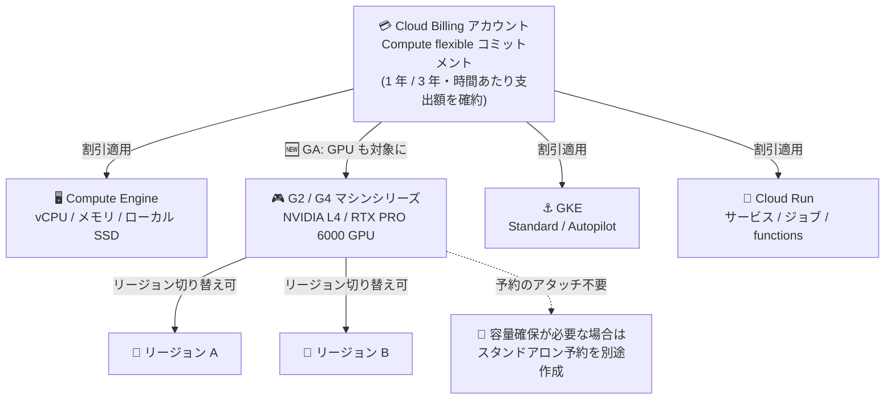

# Compute Engine: Compute flexible CUD が G2 / G4 GPU マシンシリーズで一般提供 (GA)

**リリース日**: 2026-08-11

**サービス**: Compute Engine

**機能**: Compute flexible committed use discounts (CUDs) の G2 / G4 GPU アクセラレータ最適化マシンシリーズ対応

**ステータス**: 一般提供 (GA)

📊 [このアップデートのインフォグラフィックを見る](https://takech9203.github.io/google-cloud-news-summary/20260811-compute-engine-flexible-cuds-g2-g4.html)

## 概要

Compute flexible committed use discounts (CUDs) が、G2 および G4 GPU アクセラレータ最適化マシンシリーズで一般提供 (GA) になりました。対象リソースは vCPU、メモリ、ローカル SSD ディスク、そして GPU です。Compute flexible CUD は支出ベース (spend-based) の CUD で、Compute Engine、GKE、Cloud Run にまたがる対象支出に適用されます。

G2 マシンシリーズは NVIDIA L4 GPU を搭載し、コスト効率の高い推論やグラフィックスワークロードに最適化されています。G4 マシンシリーズは NVIDIA RTX PRO 6000 Blackwell Server Edition GPU と第 5 世代 AMD EPYC Turin CPU を搭載し、Omniverse シミュレーション、グラフィックス処理、動画トランスコード、単一ホストでの推論・モデルチューニングなどに適しています。今回の GA により、これらの GPU ワークロードの継続的な支出に対して、リージョンやマシンシリーズに縛られない柔軟な割引を適用できるようになりました。

GPU 容量の確保が難しい状況でも、対象マシンシリーズ (G2 ⇔ G4) やリージョンをワークロードの必要に応じて切り替えながら、同一のコミットメントで割引を受け続けられる点が大きな特徴です。また、これらのマシンシリーズの GPU では、コミットメントに予約 (リザベーション) をアタッチする必要がありません。

**アップデート前の課題**

- Compute flexible CUD は GPU に対応しておらず、対象リソースは vCPU、メモリ、ローカル SSD に限られていた
- GPU の CUD 割引はリソースベース CUD で購入する必要があり、リソースベース CUD は特定のリージョン・マシン構成に紐づくため、GPU 容量の空き状況に応じてリージョンやマシンシリーズを移動すると割引を活用しきれないリスクがあった
- Compute Engine、GKE、Cloud Run にまたがる GPU を含む支出を、単一の支出ベースコミットメントでカバーすることができなかった

**アップデート後の改善**

- G2 / G4 マシンシリーズの GPU (NVIDIA L4 / NVIDIA RTX PRO 6000) が Compute flexible CUD の対象リソースになり、vCPU・メモリ・ローカル SSD と合わせて支出ベースの割引を受けられるようになった
- 希望するゾーン・リージョンで GPU 容量が確保できない場合でも、別のロケーションにデプロイして同じコミットメントの割引を適用できるようになった
- 同一のコミットメントを G2 と G4 のどちらのインスタンスにも適用でき、一方の GPU マシンタイプの容量がない場合はもう一方に切り替えられるようになった
- GPU 容量がまったく利用できない場合でも、コミットメントは他の対象リソース (vCPU、メモリなど) や対象サービス (GKE、Cloud Run) の支出に充当できるため、コミットメントの未消化リスクを抑えられるようになった
- G2 / G4 の GPU では予約のアタッチが不要になった (リソースベース CUD と異なり、予約アタッチなしで割引が適用される)

## アーキテクチャ図

Cloud Billing アカウント単位で購入する単一の Compute flexible コミットメントが、Compute Engine (今回 GA となった G2 / G4 の GPU を含む)、GKE、Cloud Run の対象支出を横断的にカバーします。G2 / G4 間やリージョン間を移動しても割引が追従します。

## サービスアップデートの詳細

### 主要機能

1. **G2 / G4 マシンシリーズの GPU が Compute flexible CUD の対象に (GA)**
   - 対象リソースは vCPU、メモリ、ローカル SSD ディスク、GPU
   - G2 (NVIDIA L4 GPU) と G4 (NVIDIA RTX PRO 6000 Blackwell Server Edition GPU) が対象
   - GPU が対象になるのは G2 / G4 マシンシリーズのみ。他のマシンシリーズでは従来どおり vCPU・メモリ・ローカル SSD のみが対象

2. **ロケーションとマシンタイプの柔軟な切り替え**
   - 希望するゾーンやリージョンで容量が確保できない場合、別のロケーションにインスタンスをデプロイしても同じコミットメントで割引を受けられる
   - 同一コミットメントを G2 / G4 のどちらにも適用可能。一方の GPU マシンタイプの容量がない場合、もう一方でコミットメントを消化できる
   - GPU 容量が利用できない場合は、vCPU・メモリなどの他の対象リソースや、GKE・Cloud Run の対象支出にコミットメントを充当できる

3. **予約 (リザベーション) のアタッチが不要**
   - リソースベースのコミットメントと異なり、Compute flexible コミットメントは予約のアタッチをサポートせず、必要ともしない
   - ただし、予約アタッチに伴う容量保証は提供されない。G2 / G4 GPU の容量を確保したい場合は、スタンドアロン予約を別途作成する
   - 同一 Cloud Billing アカウントの共有予約から容量を消費する場合も、その使用量に Compute flexible コミットメントの割引が適用される

## 技術仕様

### Compute flexible CUD の割引率 (抜粋)

| 対象 | 1 年コミットメント | 3 年コミットメント |
|------|-------------------|-------------------|
| **G2 マシンシリーズの vCPU、メモリ、NVIDIA L4 GPU** | **21%** | **43%** |
| **G4 マシンシリーズの vCPU、メモリ、NVIDIA RTX PRO 6000 GPU** | **16%** | **42%** |
| C2, C2D, C3, C3D, C4, C4A, C4D, E2, N1, N2, N2D, N4, N4D, N4A の vCPU・メモリ | 28% | 46% |
| C4N マシンシリーズ | 28% | 54% |
| H3, H4D の vCPU・メモリ | 17% | 38% |
| M1, M2, M3, M4 の vCPU・メモリ | 割引なし | 63% |
| 対象マシンシリーズにアタッチされたローカル SSD | 28% | 46% |
| GKE (Standard / Autopilot) | 28% | 46% |
| Cloud Run (インスタンスベース課金のサービス、ジョブ、ワーカープール) | 28% | 46% |
| Cloud Run (リクエストベース課金のサービス、functions) | 17% | 17% |

割引率は、他のオンデマンド VM 割引が有効な Cloud Billing アカウントでは異なる場合があります。

### G2 / G4 マシンシリーズの概要

| 項目 | G2 | G4 |
|------|-----|-----|
| GPU | NVIDIA L4 (GDDR6 24 GB/GPU) | NVIDIA RTX PRO 6000 Blackwell Server Edition (GDDR7 96 GB/GPU) |
| CPU プラットフォーム | Intel Cascade Lake | 第 5 世代 AMD EPYC Turin |
| vCPU / メモリ (最大) | 96 vCPU / 432 GB | 384 vCPU / 1,440 GB |
| ローカル SSD (最大) | 3,000 GiB | 12,000 GiB (Titanium SSD) |
| ネットワーク帯域 (最大) | 100 Gbps | 400 Gbps |
| 主な用途 | コスト最適化された推論、グラフィックス、HPC | Omniverse シミュレーション、グラフィックス、動画トランスコード、単一ホスト推論・モデルチューニング |

## 設定方法

### 前提条件

1. Compute flexible コミットメントは Cloud Billing アカウント レベルでのみ購入できる (プロジェクト単位・リージョン単位の指定は不要)
2. コミットメント期間は 1 年または 3 年で、購入後のキャンセルは不可
3. 購入前に Service Specific Terms を確認する

### 手順

Compute flexible コミットメントの購入は、[支出ベースのコミットメントの購入手順](https://docs.cloud.google.com/billing/docs/how-to/purchase-commitments) に従い、Cloud Billing 経由で行います。コミットした時間あたりの支出額 (コミットメントフィー) を指定して購入すると、購入後まもなくコミットメントが有効化され、対象リソース・サービスの支出に割引価格が直接適用されます。

G2 / G4 GPU の容量保証が必要な場合は、コミットメントとは別にスタンドアロン予約を作成します。予約から消費した使用量にもコミットメントの割引は適用されます。

## メリット

### ビジネス面

- **GPU コストの最適化**: 継続的な GPU ワークロードの支出に対し、G2 で最大 43%、G4 で最大 42% (3 年コミットメント) の割引を確保できる
- **コミットメント未消化リスクの低減**: GPU 容量が確保できない時間帯でも、他の対象マシンシリーズや GKE・Cloud Run の支出にコミットメントを充当できるため、支払ったコミットメントフィーを無駄にしにくい
- **調達の簡素化**: プロジェクト・リージョン・マシン構成ごとに個別のコミットメントを管理する必要がなく、Cloud Billing アカウント単位の単一コミットメントで横断的にカバーできる

### 技術面

- **容量状況に応じた柔軟なデプロイ**: GPU 容量の空き状況に応じてリージョンや G2 / G4 マシンタイプを切り替えても、割引が追従する
- **予約アタッチ不要**: リソースベース CUD のような予約アタッチの運用が不要。容量保証が必要な場合のみスタンドアロン予約を併用すればよい
- **サービス横断の適用**: Compute Engine の VM だけでなく、GKE (Standard / Autopilot) や Cloud Run の対象支出にも同一コミットメントが適用される

## デメリット・制約事項

### 制限事項

- GPU が Compute flexible CUD の対象になるのは G2 / G4 マシンシリーズのみ。A シリーズなど他の GPU マシンシリーズの GPU は対象外
- Compute flexible コミットメントは Cloud Billing アカウント レベルでのみ購入可能
- Spot VM / プリエンプティブル VM には適用されない
- 予約アタッチによる容量保証はない。容量を確実に確保するにはスタンドアロン予約を別途作成する必要がある
- 購入後のキャンセルは不可。実際の使用量にかかわらずコミットメント期間中は毎時のコミットメントフィーを支払う

### 考慮すべき点

- 割引は排他的に適用される。同一リソースにリソースベース CUD と Compute flexible CUD を重複して適用することはできず、リソースベース CUD → Compute flexible CUD → オンデマンド (SUD 適用可) の順で消化される
- G2 / G4 の割引率 (1 年: 21% / 16%、3 年: 43% / 42%) は、汎用マシンシリーズの割引率 (28% / 46%) とは異なるため、コミットメント額の設計時に考慮が必要
- 毎時のコミットメントフィーを超えた使用分 (オーバーエージ) はオンデマンド料金で課金され、未消化分の繰り越しはない
- 安定して特定リージョン・特定構成で稼働するワークロードには、割引率の高いリソースベース CUD (最大 55〜70%) の方が有利な場合がある

## ユースケース

### ユースケース 1: GPU 容量の変動に強い推論基盤のコスト最適化

**シナリオ**: NVIDIA L4 (G2) で推論サービスを運用しているが、リージョンによっては GPU 容量が逼迫することがあり、リージョン固定のリソースベース CUD では割引を活用しきれないリスクがある。

**効果**: Compute flexible コミットメントを購入することで、容量状況に応じて別リージョンや G4 インスタンスに切り替えても割引が継続する。GPU が確保できない時間帯も、同じコミットメントを vCPU・メモリや GKE・Cloud Run の支出に充当でき、コミットメントの消化率を最大化できる。

### ユースケース 2: Compute Engine / GKE / Cloud Run 混在環境の一括コミットメント

**シナリオ**: G4 インスタンスでのモデルチューニング、GKE 上のバッチ処理、Cloud Run のアプリケーションが混在しており、サービスごとに支出が変動する。

**効果**: Cloud Billing アカウント単位の単一の Compute flexible コミットメントで、G4 の GPU を含む Compute Engine の支出と GKE・Cloud Run の対象支出を横断的にカバーできる。サービス間で支出の比率が変わっても割引が適用され続ける。

## 料金

Compute flexible CUD は、1 年または 3 年の期間にわたり時間あたりの最低支出額を確約する支出ベースの割引です。コミットメントフィーは実際の使用量にかかわらず期間中毎時支払い、対象リソース・サービスには割引後の価格が直接適用されます。毎時の対象支出がコミットメントフィーに達するまで割引価格で消化され、超過分はオンデマンド料金で課金されます。

今回 GA となった G2 / G4 の割引率は以下のとおりです。

| 対象 | 1 年 | 3 年 |
|------|------|------|
| G2 (vCPU、メモリ、NVIDIA L4 GPU) | 21% | 43% |
| G4 (vCPU、メモリ、NVIDIA RTX PRO 6000 GPU) | 16% | 42% |

各マシンファミリーのオンデマンド価格と CUD 適用価格の詳細は、[Compute Engine の VM インスタンス料金ページ](https://docs.cloud.google.com/compute/vm-instance-pricing) を参照してください。

## 利用可能リージョン

Compute flexible CUD は Cloud Billing アカウント単位で購入し、リージョンを問わず対象支出に適用されます。G2 / G4 インスタンス自体の提供リージョンは [GPU のリージョンとゾーンの可用性](https://docs.cloud.google.com/compute/docs/gpus/gpu-regions-zones) を参照してください。

## 関連サービス・機能

- **GKE**: GKE Standard / Autopilot の対象支出にも同一の Compute flexible コミットメントが適用される
- **Cloud Run**: サービス、ジョブ、ワーカープール、functions の対象支出に適用される
- **リソースベース CUD**: 特定のリージョン・マシン構成に紐づく従来型の CUD。GPU を含むハードウェアで最大 55% (メモリ最適化は最大 70%) の割引。安定稼働するワークロードには併用を検討
- **Compute Engine 予約 (Reservations)**: Compute flexible コミットメントは容量保証を提供しないため、G2 / G4 GPU の容量確保にはスタンドアロン予約を併用する
- **Cloud Billing (CUD 分析レポート)**: コミットメントの消化状況や費用対効果の分析に利用する

## 参考リンク

- 📊 [インフォグラフィック](https://takech9203.github.io/google-cloud-news-summary/20260811-compute-engine-flexible-cuds-g2-g4.html)
- [公式リリースノート](https://docs.cloud.google.com/release-notes#August_11_2026)
- [Compute flexible CUDs ドキュメント (CUD 概要)](https://docs.cloud.google.com/compute/docs/instances/committed-use-discounts-overview)
- [アクセラレータ最適化マシンファミリー (G2 / G4)](https://docs.cloud.google.com/compute/docs/accelerator-optimized-machines)
- [支出ベースのコミットメントの購入](https://docs.cloud.google.com/billing/docs/how-to/purchase-commitments)
- [料金ページ (VM インスタンス料金)](https://docs.cloud.google.com/compute/vm-instance-pricing)

## まとめ

Compute flexible CUD の G2 / G4 対応 GA により、GPU ワークロードのコストコミットメントを特定のリージョンやマシン構成に縛られずに設計できるようになりました。GPU 容量の変動が悩みだったチームは、リソースベース CUD との割引率・柔軟性のトレードオフを整理し、G2 / G4 の継続支出分を Compute flexible コミットメントでカバーする構成を検討することをおすすめします。容量保証が必要な場合はスタンドアロン予約の併用を忘れずに計画してください。

---

**タグ**: Compute Engine, CUD, コスト最適化, GPU, G2, G4, NVIDIA L4, NVIDIA RTX PRO 6000, FinOps, GA
