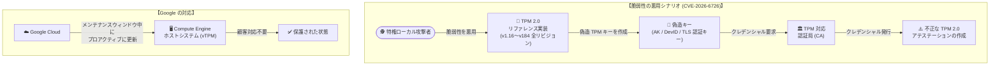

# Compute Engine: セキュリティ脆弱性 GCP-2026-054 - TPM 2.0 リファレンス実装の脆弱性 (CVE-2026-6726)

**リリース日**: 2026-08-11

**サービス**: Compute Engine

**機能**: セキュリティ脆弱性 GCP-2026-054 (CVE-2026-6726 / TCGVRT0010)

**ステータス**: セキュリティ速報 (Security Bulletin) - 深刻度: High

:bar_chart: [このアップデートのインフォグラフィックを見る](https://takech9203.github.io/google-cloud-news-summary/20260811-compute-engine-tpm-cve-2026-6726.html)

## 概要

Google Cloud は 2026年8月11日、Trusted Computing Group (TCG) の TPM 2.0 リファレンス実装コードに発見された脆弱性 (CVE-2026-6726、別名 TCGVRT0010) に関するセキュリティ速報 GCP-2026-054 を公開しました。この脆弱性は TPM 2.0 リファレンス実装コードの公開済み全リビジョン (v1.16、v1.38、v1.59、v1.83、v184) に影響し、深刻度は「High（高）」に分類されています。

この脆弱性は、特権を持つローカル攻撃者が、偽造した TPM キー (Attestation Key (AK)、DevID キー、TLS 認証キーなど) に対して、TPM 対応の認証局 (CA) からクレデンシャルを取得できる可能性があるというものです。これにより、偽造キーを使用した不正な TPM 2.0 アテステーション (構成証明) が作成される恐れがあります。

Google は標準および計画されたメンテナンスウィンドウ中にシステムをプロアクティブに更新することを表明しており、顧客側での対応は不要です。Compute Engine の Shielded VM が提供する仮想 TPM (vTPM) は TCG の TPM 2.0 ライブラリ仕様に完全準拠しており、TPM ベースのアテステーションや鍵保護を利用するワークロードに関連するアップデートです。

**アップデート前の課題**

- TCG の TPM 2.0 リファレンス実装コードの公開済み全リビジョンに脆弱性 (CVE-2026-6726) が存在していた
- 特権を持つローカル攻撃者が、偽造した TPM キー (AK、DevID キー、TLS 認証キーなど) に対して TPM 対応 CA からクレデンシャルを取得できる可能性があった
- 取得したクレデンシャルを悪用し、偽造キーによる不正な TPM 2.0 アテステーションを作成できる恐れがあった

**アップデート後の改善**

- Google が標準および計画されたメンテナンスウィンドウ中にシステムをプロアクティブに更新
- 顧客側での追加対応は不要
- セキュリティ速報 (GCP-2026-054) と CVE 番号による透明性のある脆弱性開示が行われた

## アーキテクチャ図



この図は、CVE-2026-6726 の悪用シナリオ (特権ローカル攻撃者が偽造 TPM キーで TPM 対応 CA からクレデンシャルを取得し、不正なアテステーションを作成する流れ) と、Google によるプロアクティブな修正対応を示しています。

## サービスアップデートの詳細

### 主要機能

1. **脆弱性の内容 (CVE-2026-6726 / TCGVRT0010)**
   - Trusted Computing Group の TPM 2.0 リファレンス実装コードに発見された脆弱性
   - 公開済みの全リビジョン (v1.16、v1.38、v1.59、v1.83、v184) が影響を受ける
   - 特権を持つローカル攻撃者が、偽造した TPM キー (Attestation Key (AK)、DevID キー、TLS 認証キーなど) に対して TPM 対応の認証局 (CA) からクレデンシャルを取得できる可能性がある
   - 偽造キーを使用した不正な TPM 2.0 アテステーションの作成につながる恐れがある

2. **影響を受けるコンポーネント**
   - TCG TPM 2.0 リファレンス実装コードをベースとする TPM 実装
   - Compute Engine の Shielded VM で提供される仮想 TPM (vTPM) は、TCG TPM 2.0 ライブラリ仕様に準拠した実装であり、本速報は Compute Engine のセキュリティ速報として公開されている

3. **Google による対応**
   - 標準および計画されたメンテナンスウィンドウ中にシステムをプロアクティブに更新
   - 顧客側での対応は不要

## 技術仕様

### 脆弱性の詳細

| 項目 | 詳細 |
|------|------|
| セキュリティ速報 ID | GCP-2026-054 |
| CVE 番号 | CVE-2026-6726 |
| TCG アドバイザリ ID | TCGVRT0010 |
| 公開日 | 2026-08-11 |
| 深刻度 | High（高） |
| 影響を受けるコード | TCG TPM 2.0 リファレンス実装 (公開済み全リビジョン: v1.16、v1.38、v1.59、v1.83、v184) |
| 攻撃の前提条件 | 特権を持つローカルアクセス |
| 影響範囲 | 偽造 TPM キー (AK / DevID / TLS 認証キー) への CA クレデンシャル発行、不正な TPM 2.0 アテステーションの作成 |
| 顧客側の対応 | 不要（Google がメンテナンスウィンドウ中にプロアクティブに更新） |

### Compute Engine における vTPM の位置づけ

| 項目 | 詳細 |
|------|------|
| vTPM | Shielded VM ごとに提供される仮想化されたセキュリティプロセッサ |
| 仕様準拠 | TCG TPM 2.0 ライブラリ仕様に完全準拠 (BoringSSL ライブラリを使用) |
| Measured Boot | ファームウェア、ブートローダー、カーネル等のハッシュを計測し、整合性ポリシーベースラインを作成 |
| 鍵の保護 | 暗号鍵の生成・保管 (例: BitLocker の鍵は vTPM に保管) |
| 整合性モニタリング | 計測値をベースラインと比較し、Cloud Logging / Cloud Monitoring で検知・通知 |

## 設定方法

### 顧客側の対応

**顧客側でのアクションは不要です。** Google が標準および計画されたメンテナンスウィンドウ中に、影響を受けるシステムをプロアクティブに更新します。

### 推奨されるセキュリティ強化策（ベストプラクティス）

以下は今回の脆弱性への直接的な対応ではありませんが、TPM / Shielded VM 関連のセキュリティを強化するための推奨事項です。

#### ステップ 1: 組織ポリシーで Shielded VM を必須化

```bash
# 組織内の VM 作成時に Shielded VM を必須とする組織ポリシーを設定
gcloud resource-manager org-policies enable-enforce \
  compute.requireShieldedVm \
  --organization=ORGANIZATION_ID
```

`constraints/compute.requireShieldedVm` を有効にすることで、組織内で作成される VM を Shielded VM に限定できます。

#### ステップ 2: 整合性モニタリングの確認

```bash
# Shielded VM の整合性モニタリングイベントを確認
gcloud logging read \
  'logName="projects/PROJECT_ID/logs/compute.googleapis.com%2Fshielded_vm_integrity"' \
  --project=PROJECT_ID \
  --freshness=7d
```

`earlyBootReportEvent` / `lateBootReportEvent` を確認し、ブートシーケンスの整合性検証が成功しているかを監査します。

#### ステップ 3: vTPM 関連の IAM 権限の監査

```bash
# vTPM のエンドースメントキー情報の取得権限を持つロールを確認
gcloud projects get-iam-policy PROJECT_ID \
  --flatten="bindings[].members" \
  --filter="bindings.role:roles/compute.securityAdmin OR bindings.role:roles/compute.instanceAdmin.v1" \
  --format="table(bindings.role, bindings.members)"
```

`compute.instances.getShieldedInstanceIdentity` などの Shielded VM 関連権限を持つユーザーの範囲が適切かを確認します。

## メリット

### ビジネス面

- **顧客対応不要**: Google がメンテナンスウィンドウ中に更新を実施するため、顧客側での緊急対応やパッチ適用作業は発生しない
- **アテステーション基盤の信頼性維持**: TPM ベースのデバイス認証・構成証明を利用するシステムの信頼性が保たれる

### 技術面

- **プロアクティブな修正**: 標準および計画されたメンテナンスウィンドウ内で更新が行われるため、予期しないダウンタイムを回避できる
- **透明性のある情報公開**: CVE 番号 (CVE-2026-6726) と TCG アドバイザリ ID (TCGVRT0010)、セキュリティ速報 (GCP-2026-054) による適切な脆弱性開示プロセス

## デメリット・制約事項

### 制限事項

- 修正の適用はメンテナンスウィンドウのスケジュールに依存するため、全システムへの適用完了時期は明示されていない
- 脆弱性が存在した期間中に悪用が行われたかどうかの情報は公開されていない

### 考慮すべき点

- 攻撃には特権を持つローカルアクセスが前提となるため、VM 内の特権アクセス管理 (最小権限の原則) が引き続き重要
- TPM 2.0 リファレンス実装の脆弱性は過去にも報告されており (2025年6月の GCP-2025-031 / CVE-2025-2884、2023年4月の GCP-2023-004 / CVE-2023-1017・CVE-2023-1018)、TPM ベースの信頼基盤には継続的な注意が必要
- TPM ベースのアテステーションや TPM 対応 CA を自社システムで運用している場合は、TCG のアドバイザリ (TCGVRT0010) に基づき自社実装への影響も確認することが望ましい

## ユースケース

### ユースケース 1: TPM アテステーションを利用するゼロトラスト環境での影響評価

**シナリオ**: Shielded VM の vTPM を利用してワークロードのアテステーション (構成証明) を行い、デバイス/ワークロードの信頼性を検証している企業が、自社環境での影響を評価する場合。

**実装例**:
```bash
# Shielded VM の有効化状況を組織全体で確認
gcloud asset search-all-resources \
  --asset-types="compute.googleapis.com/Instance" \
  --scope="organizations/ORG_ID" \
  --query="shieldedInstanceConfig.enableVtpm=true"
```

**効果**: vTPM を利用しているインスタンスを可視化し、Google による更新が顧客対応不要であることを踏まえた影響評価レポートを作成できる。

### ユースケース 2: セキュリティコンプライアンス報告

**シナリオ**: 企業のセキュリティチームが経営層やコンプライアンス部門に対して、この脆弱性の影響と対応状況を報告する場合。

**効果**: Google によるプロアクティブな修正 (メンテナンスウィンドウ中の更新) が表明されており顧客側の追加対応が不要であることを、セキュリティ速報 GCP-2026-054 と CVE-2026-6726 を参照して明確に報告できる。第三者監査への対応も容易。

## 関連サービス・機能

- **Shielded VM**: Secure Boot、vTPM、整合性モニタリングの 3 層で VM を保護する Compute Engine の機能。vTPM は TCG TPM 2.0 ライブラリ仕様に準拠
- **Confidential VM**: 同日公開の GCP-2026-053 (Intel TDX ファームウェア脆弱性) も、機密コンピューティング環境の信頼基盤に関連するセキュリティ速報
- **Cloud Logging / Cloud Monitoring**: Shielded VM の整合性モニタリングイベント (earlyBootReportEvent / lateBootReportEvent など) の確認・アラート設定
- **Organization Policy**: `constraints/compute.requireShieldedVm` による Shielded VM の必須化
- **IAM**: `compute.instances.getShieldedInstanceIdentity` など vTPM 関連操作の権限管理

## 参考リンク

- :bar_chart: [インフォグラフィック](https://takech9203.github.io/google-cloud-news-summary/20260811-compute-engine-tpm-cve-2026-6726.html)
- [Google Cloud セキュリティ速報 GCP-2026-054](https://cloud.google.com/support/bulletins#GCP-2026-054)
- [Compute Engine セキュリティ速報](https://docs.cloud.google.com/compute/docs/security-bulletins#GCP-2026-054)
- [CVE-2026-6726](https://cve.mitre.org/cgi-bin/cvename.cgi?name=CVE-2026-6726)
- [Shielded VM ドキュメント](https://docs.cloud.google.com/compute/shielded-vm/docs/shielded-vm)
- [Shielded VM の整合性モニタリング](https://docs.cloud.google.com/compute/shielded-vm/docs/integrity-monitoring)
- [Trusted Computing Group - TPM 2.0 ライブラリ仕様](https://trustedcomputinggroup.org/tpm-library-specification/)
- [Google Cloud Release Notes (2026-08-11)](https://docs.cloud.google.com/release-notes#August_11_2026)

## まとめ

GCP-2026-054 は、TCG の TPM 2.0 リファレンス実装コードの公開済み全リビジョンに影響する深刻度 High の脆弱性 (CVE-2026-6726) に関するセキュリティ速報です。特権ローカル攻撃者による偽造 TPM キーへの CA クレデンシャル発行と不正なアテステーション作成につながる恐れがありますが、Google がメンテナンスウィンドウ中にプロアクティブに更新を行うため、顧客側での対応は不要です。TPM ベースのアテステーションを重要な信頼基盤として利用している組織は、これを機に Shielded VM の整合性モニタリングの活用状況や VM 内の特権アクセス管理を見直すことを推奨します。

---

**タグ**: #ComputeEngine #ShieldedVM #vTPM #TPM2 #Security #GCP-2026-054 #CVE-2026-6726 #TCGVRT0010 #Attestation #High #SecurityBulletin
