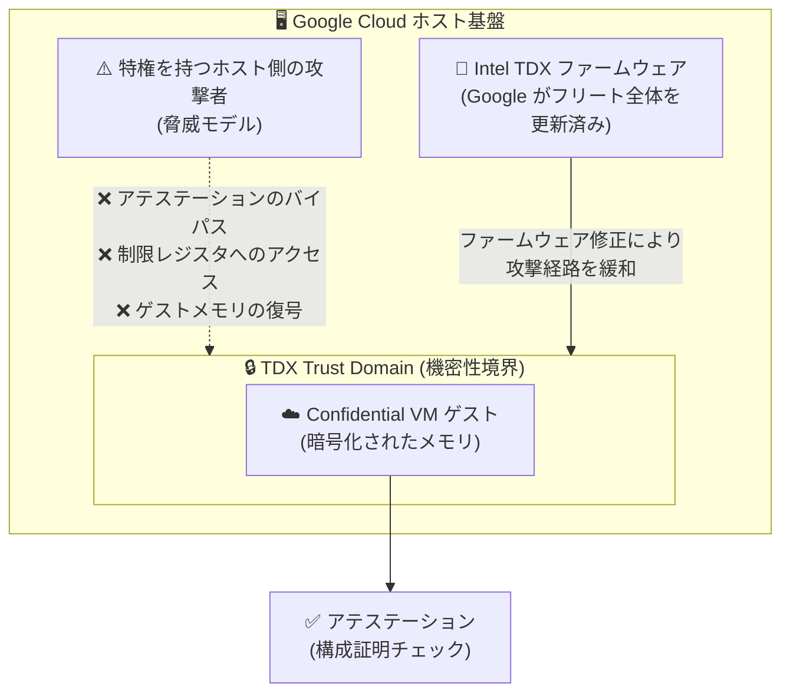

# Confidential VM: Intel TDX ファームウェア脆弱性への対応 (GCP-2026-053)

**リリース日**: 2026-08-11

**サービス**: Confidential VM

**機能**: Intel TDX ファームウェア脆弱性の修正 (セキュリティ速報 GCP-2026-053)

**ステータス**: Security (セキュリティ速報)

📊 [このアップデートのインフォグラフィックを見る](https://takech9203.github.io/google-cloud-news-summary/20260811-confidential-vm-intel-tdx-gcp-2026-053.html)

## 概要

Google は、Intel Trust Domain Extensions (TDX) ファームウェアに影響する複数のセキュリティ脆弱性を認識しており、対応を進めていることをセキュリティ速報 GCP-2026-053 (2026 年 8 月 11 日公開) で発表しました。これらの脆弱性は Confidential ゲストの完全性を侵害する可能性があるもので、深刻度は **High (高)** と評価されています。

具体的には、特権を持つホスト側の攻撃者 (privileged host adversary) が、アテステーション (構成証明) チェックのバイパス、制限されたレジスタへのアクセス、または通常は保護されているゲストメモリの復号を行える可能性があります。影響を受けるのは、**Intel TDX テクノロジーに依存するすべての Confidential VM インスタンス**です。

Google はこれらの脆弱性を緩和するため、サーバーフリートに対してファームウェアアップグレードをプロアクティブに適用済みです。**Google から個別のアップグレード勧告 (direct advisory) を受け取っていない顧客は、対応不要**です。

**脆弱性による潜在的な影響 (対応前)**

- 特権を持つホスト側の攻撃者がアテステーションチェックをバイパスできる可能性があった
- 制限されたレジスタへのアクセスが可能になるおそれがあった
- 通常は保護されている Confidential ゲストのメモリを復号できる可能性があった

**Google の対応 (対応後)**

- Google がサーバーフリート全体にファームウェアアップグレードをプロアクティブに適用し、脆弱性を緩和した
- 個別の直接勧告を受け取っていない顧客は、追加の対応が不要
- Intel の PSIRT テクニカルアドバイザリ (INTEL-TA-01404 ほか計 6 件) として詳細が公開されている

## アーキテクチャ図

Intel TDX ファームウェアの脆弱性により、特権を持つホスト側の攻撃者が Trust Domain の機密性境界を侵害できる可能性がありましたが、Google がサーバーフリートにファームウェアアップグレードを適用することで攻撃経路が緩和されています。

## サービスアップデートの詳細

### 脆弱性の内容

1. **アテステーションチェックのバイパス**
   - Confidential VM の信頼性を検証するアテステーション (構成証明) の仕組みを、特権を持つホスト側の攻撃者が回避できる可能性
   - アテステーションは TEE (Trusted Execution Environment) で実行されていることの証拠であり、そのバイパスは Confidential Computing の信頼モデルの根幹に関わる

2. **制限されたレジスタへのアクセス**
   - 本来アクセスが制限されているレジスタへ、ホスト側からアクセスできる可能性

3. **保護されたゲストメモリの復号**
   - TDX により通常は暗号化・保護されているゲストメモリを、ホスト側の攻撃者が復号できる可能性

### 影響を受ける対象

- **Intel TDX テクノロジーに依存するすべての Confidential VM インスタンス**
- AMD SEV / AMD SEV-SNP を使用する Confidential VM は本速報の対象外

参考として、Google Cloud で Intel TDX をサポートする主なマシンタイプは以下のとおりです (2026 年 8 月時点の公式ドキュメントより)。

| マシンタイプ | CPU プラットフォーム | 提供ステータス |
|------|------|------|
| `c3-standard-*` | Intel Sapphire Rapids | GA |
| `c3-standard-*-lssd` | Intel Sapphire Rapids | Preview |
| `c4-standard-*` | Intel Granite Rapids | Preview |
| `a3-highgpu-1g` (NVIDIA H100 付き) | Intel Sapphire Rapids | GA |

### 顧客に求められる対応

- **Google から個別の直接勧告を受け取っていない場合、対応は不要**
- Google がサーバーフリートへのファームウェアアップグレードをプロアクティブに適用済み
- 個別勧告を受け取った顧客のみ、勧告に従ったアップグレード対応が必要

## 技術仕様

### セキュリティ速報の概要

| 項目 | 詳細 |
|------|------|
| 速報 ID | GCP-2026-053 |
| 公開日 | 2026-08-11 |
| 深刻度 | High (高) |
| 影響範囲 | Intel TDX を使用するすべての Confidential VM インスタンス |
| 顧客対応 | 原則不要 (個別勧告を受けた場合を除く) |
| 緩和策 | Google によるサーバーフリートへのファームウェアアップグレード適用 |

### 対象 CVE

| CVE |
|------|
| CVE-2025-31938 |
| CVE-2025-35973 |
| CVE-2025-31356 |
| CVE-2026-20898 |
| CVE-2026-20713 |
| CVE-2026-20901 |
| CVE-2026-20885 |
| CVE-2026-20705 |
| CVE-2026-20775 |

### Intel PSIRT テクニカルアドバイザリ

詳細は Intel の以下のアドバイザリで公開されています。

- INTEL-TA-01404
- INTEL-TA-01428
- INTEL-TA-01419
- INTEL-TA-01439
- INTEL-TA-01442
- INTEL-TA-01436

## メリット

### ビジネス面

- **顧客対応の負荷ゼロ**: Google がインフラ側で緩和策を適用済みのため、個別勧告を受けた顧客を除き、ワークロードの停止や再構築などの対応が不要
- **透明性の確保**: セキュリティ速報と Intel PSIRT アドバイザリを通じて、脆弱性の内容と対応状況が公開されており、コンプライアンス報告やリスク評価に活用できる

### 技術面

- **マネージドファームウェアの利点**: Confidential VM のファームウェアは Google が管理しており、フリート全体への迅速かつ一貫したセキュリティ修正の展開が可能
- **アテステーションの継続性**: Google 管理のファームウェアは測定レジスタの値の一貫性を保つよう運用されており、ファームウェア更新時にアテステーション検証でワークロードがブロックされるのを防ぐ設計になっている

## デメリット・制約事項

### 考慮すべき点

- 個別の直接勧告 (direct advisory) を Google から受け取った顧客は、勧告に従ったアップグレード対応が必要
- 本速報は Intel TDX ファームウェアに関するもので、2026 年 2 月にも同様の Intel TDX ファームウェア脆弱性速報 (GCP-2026-008) が公開されており、Confidential VM 利用者はセキュリティ速報ページの継続的なモニタリングが推奨される
- 脆弱性の悪用には特権を持つホスト側のアクセスが前提となるが、Confidential Computing は「クラウド事業者やホストを信頼しない」脅威モデルを掲げるため、この種の脆弱性は信頼モデル上重要な意味を持つ

## 関連サービス・機能

- **Confidential VM アテステーション**: Intel TDX では初期起動コンポーネント (ファームウェア) が MRTD (Measurement of the Trust Domain) に、以降のブートチェーンが RTMR (Runtime Measurement Registers) に測定され、ハードウェアを信頼の起点とする。アテステーションレポートは Go-TPM tools や TDX Guest ツールで取得できる
- **ファームウェア検証 (Launch Endorsement)**: Intel TDX / AMD SEV-SNP の Confidential VM では、Google 署名付き Launch Endorsement を取得し、ファームウェアが正規の Google 管理ファームウェアであることを検証できる
- **Confidential GKE Nodes / Confidential Space**: Intel TDX を含む Confidential Computing テクノロジーを基盤とするサービスで、同じ信頼モデルの上に構築されている

## 参考リンク

- 📊 [インフォグラフィック](https://takech9203.github.io/google-cloud-news-summary/20260811-confidential-vm-intel-tdx-gcp-2026-053.html)
- [公式リリースノート (2026 年 8 月 11 日)](https://docs.cloud.google.com/release-notes#August_11_2026)
- [セキュリティ速報 GCP-2026-053](https://docs.cloud.google.com/confidential-computing/confidential-vm/docs/security-bulletins#gcp-2026-053)
- [Confidential VM のサポート構成 (マシンタイプ / CPU / ゾーン)](https://docs.cloud.google.com/confidential-computing/confidential-vm/docs/supported-configurations)
- [Confidential VM のアテステーション](https://docs.cloud.google.com/confidential-computing/confidential-vm/docs/attestation)
- [ファームウェアの検証](https://docs.cloud.google.com/confidential-computing/confidential-vm/docs/verify-firmware)

## まとめ

Intel TDX ファームウェアに、アテステーションのバイパスや保護されたゲストメモリの復号につながり得る深刻度 High の脆弱性群が発見され、Google はサーバーフリートへのファームウェアアップグレードをプロアクティブに適用済みです。個別の直接勧告を受け取っていない限り顧客側の対応は不要ですが、Intel TDX ベースの Confidential VM を利用している組織は、セキュリティ速報 GCP-2026-053 と Intel PSIRT アドバイザリの内容を確認し、自社のリスク評価・コンプライアンス記録に反映することを推奨します。

---

**タグ**: #ConfidentialVM #IntelTDX #Security #ConfidentialComputing #GCP-2026-053 #CVE
