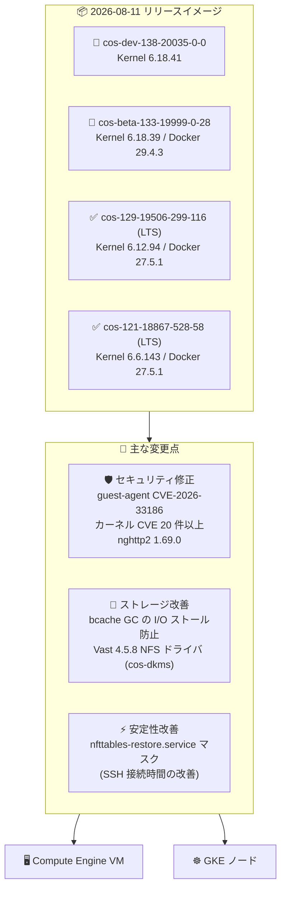

# Container-Optimized OS: 2026 年 8 月 11 日リリースの新イメージ (LTS / Beta / Dev)

**リリース日**: 2026-08-11

**サービス**: Container-Optimized OS

**機能**: 新イメージリリース (cos-beta-133、cos-129 LTS、cos-dev-138、cos-121 LTS)

**ステータス**: GA (LTS) / Beta / Dev

📊 [このアップデートのインフォグラフィックを見る](https://takech9203.github.io/google-cloud-news-summary/20260811-container-optimized-os-image-updates-august-11.html)

## 概要

2026 年 8 月 11 日、Google Cloud はコンテナワークロード実行用の OS である Container-Optimized OS (COS) の新イメージを 4 つのチャネル (Beta、LTS x2、Dev) で同時にリリースしました。今回のリリースには、cos-beta-133-19999-0-28、cos-129-19506-299-116、cos-dev-138-20035-0-0、cos-121-18867-528-58 が含まれます。

今回のアップデートの中心はセキュリティ修正とストレージ関連の安定性改善です。google-guest-agent の CVE-2026-33186 の修正、nghttp2 の 1.69.0 へのアップグレード (CVE-2026-58055 対応) に加え、Linux カーネルの 20 件を超える CVE 修正が適用されています。また、cos-dkms 経由での Vast 4.5.8 NFS クライアントドライバのサポート追加や、bcache のガベージコレクションによる I/O ストールを防ぐカーネルパッチなど、ストレージ性能に関わる改善も含まれます。

Compute Engine や GKE のノード OS として COS を利用しているすべてのユーザー、特に本番環境で cos-121-lts / cos-129-lts イメージファミリーを利用しているユーザーが対象です。

**アップデート前の課題**

- google-guest-agent に脆弱性 CVE-2026-33186 が存在していた
- Linux カーネルに多数の未修正 CVE (CVE-2026-64227 ほか) が存在していた
- bcache のガベージコレクション実行中にスリープ間隔が長く、I/O ストールが発生する可能性があった
- nfttables-restore.service の影響で SSH 接続時間にリグレッション (遅延) が発生していた
- Vast の NFS クライアントドライバ 4.5.8 が COS でサポートされていなかった

**アップデート後の改善**

- google-guest-agent の CVE-2026-33186 が修正され、ゲストエージェント経由の攻撃リスクが低減された
- Linux カーネルの多数の CVE (CVE-2026-64227、64279、64286 ほか) と KCTF-8173f7e が修正された
- bcache の GC スリープ間隔を短縮するカーネルパッチにより、I/O ストールが防止された
- nfttables-restore.service がマスクされ、SSH 接続時間のリグレッションが解消された
- cos-dkms を通じて Vast 4.5.8 NFS クライアントドライバが利用可能になった

## アーキテクチャ図



4 つのリリースチャネル (Dev / Beta / LTS x2) に対して、セキュリティ修正・ストレージ改善・安定性改善が適用され、Compute Engine VM と GKE ノードの OS として提供されます。

## サービスアップデートの詳細

### リリースされたイメージ

| イメージ | チャネル | カーネル | Docker | Containerd |
|----------|---------|---------|--------|-----------|
| cos-beta-133-19999-0-28 | Beta | COS-6.18.39 | v29.4.3 | v2.3.2 |
| cos-129-19506-299-116 | LTS (2028 年 3 月まで) | COS-6.12.94 | v27.5.1 | v2.2.6 |
| cos-dev-138-20035-0-0 | Dev | COS-6.18.41 | - | - |
| cos-121-18867-528-58 | LTS (2027 年 3 月まで) | COS-6.6.143 | v27.5.1 | v2.0.10 |

### 主要機能

1. **セキュリティ修正 (CVE 対応)**
   - google-guest-agent の CVE-2026-33186 を修正
   - Linux カーネルの多数の CVE を修正: CVE-2026-64227、64279、64286、64287、64352、64375、64401、64413、64416、64476、64508、64530〜64535、64538、64542、64545、64546、64548、64552、64554、64555、および KCTF-8173f7e
   - nghttp2 を 1.69.0 にアップグレードし、CVE-2026-58055 を修正

2. **ストレージ関連の改善**
   - Vast 4.5.8 NFS クライアントドライバのサポートを cos-dkms 経由で追加。Vast Data の高性能 NFS ストレージへの接続が可能に
   - bcache のガベージコレクション (GC) のスリープ間隔を短縮するカーネルパッチを適用し、GC 実行中の I/O ストールを防止

3. **安定性・コンポーネント更新**
   - nfttables-restore.service をマスクし、SSH 接続時間のリグレッションを解消
   - node-problem-detector を v0.8.25 に更新
   - Go を 1.25.12 に更新

## 技術仕様

### COS リリースチャネルの位置づけ

| チャネル | イメージファミリー | 用途 |
|---------|-------------------|------|
| LTS | cos-121-lts、cos-129-lts | 本番ワークロード向け。2 年間のサポートとセキュリティ修正 |
| Beta | cos-beta (COS 133) | 次期メジャーリリースの安定化フェーズ。継続テストでの検証用 |
| Dev | cos-dev (COS 138) | 開発中の最新リリース。実験・単発テスト用 |

LTS マイルストーンは約 6 か月ごとにリリースされ、2 年間サポートされます。COS 121 LTS は 2027 年 3 月、COS 129 LTS は 2028 年 3 月がサポート終了予定です (公式ドキュメントより)。

## 設定方法

### 前提条件

1. Compute Engine または GKE を使用するプロジェクト
2. イメージは `cos-cloud` プロジェクトから取得

### 手順

#### ステップ 1: 新しいイメージの確認

```bash
gcloud compute images list --project=cos-cloud --no-standard-images | grep -E "19999-0-28|19506-299-116|20035-0-0|18867-528-58"
```

リリースされたイメージが利用可能か確認します。

#### ステップ 2: 特定のイメージで VM を作成

```bash
gcloud compute instances create my-cos-vm \
  --image=cos-129-19506-299-116 \
  --image-project=cos-cloud \
  --zone=asia-northeast1-a
```

本番環境では、イメージファミリー API ではなく検証済みの特定イメージ名を指定することが推奨されています。

#### ステップ 3: GKE ノードプールの場合

GKE では COS イメージはノードの自動アップグレードにより GKE バージョンと連動して更新されます。特定の COS ビルドを直接指定するのではなく、リリースチャネルの設定を確認してください。

## メリット

### ビジネス面

- **セキュリティリスクの低減**: ゲストエージェントとカーネルの多数の CVE が修正され、コンプライアンス要件への対応が容易になる
- **ダウンタイムの防止**: bcache の I/O ストール防止により、ストレージ起因の性能劣化やサービス影響を回避できる

### 技術面

- **運用性の改善**: SSH 接続時間のリグレッションが解消され、デバッグや運用作業のレスポンスが改善
- **ストレージ選択肢の拡大**: cos-dkms 経由の Vast NFS クライアントドライバサポートにより、高性能 NFS ストレージとの統合が可能
- **最新コンポーネント**: node-problem-detector v0.8.25、Go 1.25.12 など、ランタイムコンポーネントが最新化

## デメリット・制約事項

### 制限事項

- Vast NFS クライアントドライバは cos-dkms 経由でのインストールが必要 (イメージにプリインストールされない)
- Beta (COS 133) / Dev (COS 138) イメージは本番利用非推奨

### 考慮すべき点

- 本番環境へのロールアウト前に、検証環境で新イメージの動作確認を行うことが推奨される
- LTS Refresh リリースには中・低優先度の修正も含まれるため、ロールアウト時はリグレッションに注意する
- イメージファミリー API (`getFromFamily`) を本番インスタンス作成に使用すると、未検証イメージが自動適用されるリスクがある

## ユースケース

### ユースケース 1: 本番 GKE / GCE 環境のセキュリティパッチ適用

**シナリオ**: cos-121-lts または cos-129-lts を利用中の本番環境で、カーネルおよび google-guest-agent の CVE 修正を適用したい。

**実装例**:
```bash
# 検証環境で新イメージをテスト後、インスタンステンプレートを更新
gcloud compute instance-templates create my-template-v2 \
  --image=cos-121-18867-528-58 \
  --image-project=cos-cloud \
  --machine-type=e2-standard-4
```

**効果**: CVE-2026-33186 やカーネル CVE 群が修正された状態で運用でき、脆弱性スキャンの指摘事項を解消できる。

### ユースケース 2: Vast NFS ストレージとの統合

**シナリオ**: AI/ML ワークロードなどで Vast Data の高性能 NFS ストレージを COS ノードからマウントしたい。

**効果**: cos-dkms 経由で Vast 4.5.8 NFS クライアントドライバをインストールでき、高スループットな NFS アクセスが COS 上で利用可能になる。

### ユースケース 3: bcache 利用環境での I/O 安定化

**シナリオ**: ローカル SSD をキャッシュとして bcache を構成しているノードで、GC 実行中に I/O レイテンシのスパイクが発生していた。

**効果**: GC スリープ間隔短縮パッチにより I/O ストールが防止され、レイテンシが安定する。

## 料金

Container-Optimized OS 自体は無料で提供され、追加のライセンス費用はありません。Compute Engine の VM インスタンスや GKE ノードの標準料金のみが適用されます。

- [Compute Engine 料金](https://cloud.google.com/compute/pricing)
- [GKE 料金](https://cloud.google.com/kubernetes-engine/pricing)

## 利用可能リージョン

COS イメージは `cos-cloud` プロジェクトからグローバルに提供され、すべての Compute Engine リージョンで利用可能です。

## 関連サービス・機能

- **Compute Engine**: COS を VM のブートイメージとして使用。コンテナワークロードの直接実行に対応
- **Google Kubernetes Engine (GKE)**: COS はデフォルトのノードイメージ (`cos_containerd`)。ノード自動アップグレードで COS が更新される
- **cos-dkms / cos-extensions**: GPU ドライバや Vast NFS クライアントなどのサードパーティカーネルモジュールを COS にインストールする仕組み
- **node-problem-detector**: ノードの異常を検出して Kubernetes に報告するコンポーネント。今回 v0.8.25 に更新

## 参考リンク

- 📊 [インフォグラフィック](https://takech9203.github.io/google-cloud-news-summary/20260811-container-optimized-os-image-updates-august-11.html)
- [公式リリースノート](https://docs.cloud.google.com/release-notes#August_11_2026)
- [COS リリースノート (milestone 129)](https://docs.cloud.google.com/container-optimized-os/docs/release-notes/m129)
- [COS リリースノート (milestone 121)](https://docs.cloud.google.com/container-optimized-os/docs/release-notes/m121)
- [COS バージョニングとイメージファミリー](https://docs.cloud.google.com/container-optimized-os/docs/concepts/versioning)
- [COS サポートポリシー](https://docs.cloud.google.com/container-optimized-os/docs/resources/support-policy)

## まとめ

今回の COS リリースは、google-guest-agent とカーネルの多数の CVE 修正を含むセキュリティ中心のアップデートであり、LTS 系 (COS 121 / 129) を本番利用しているユーザーは早期のロールアウトを検討すべきです。bcache の I/O ストール防止や SSH 接続時間の改善など運用品質に直結する修正も含まれるため、検証環境でのテストを経て計画的に適用することを推奨します。

---

**タグ**: Container-Optimized OS, COS, LTS, セキュリティ, CVE, カーネル, Docker, Containerd, GKE, Compute Engine
