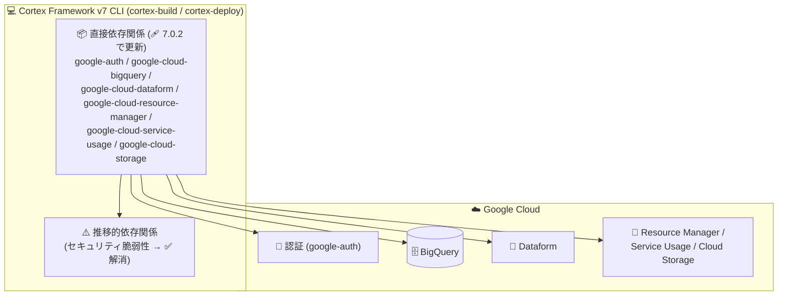

# Cortex Framework: Release 7.0.2 (依存関係更新によるセキュリティ脆弱性の解消)

**リリース日**: 2026-08-11

**サービス**: Cortex Framework

**機能**: Release 7.0.2 (セキュリティ修正リリース)

**ステータス**: Announcement / Fixed

📊 [このアップデートのインフォグラフィックを見る](https://takech9203.github.io/google-cloud-news-summary/20260811-cortex-framework-release-7-0-2.html)

## 概要

Google Cloud Cortex Framework の Release 7.0.2 が公開されました。2026 年 7 月 30 日に一般提供 (GA) となったバージョン 7 系に対するパッチリリースで、8 月 7 日の Release 7.0.1 (Windows ビルドエラー修正と Dataform クォータ管理の改善) に続くものです。

本リリースでは、推移的依存関係 (transitive dependencies) に存在していたセキュリティ脆弱性が解消されました。具体的には、それらに対応する直接依存関係である `google-auth`、`google-cloud-bigquery`、`google-cloud-dataform`、`google-cloud-resource-manager`、`google-cloud-service-usage`、`google-cloud-storage` の 6 つの Python パッケージが更新されています。新機能の追加はなく、依存関係の更新によるセキュリティ修正のみのリリースです。

Cortex Framework v7 は、CLI スクリプト (`cortex-build`、`cortex-deploy` など) を通じて BigQuery や Dataform にデータ基盤・データプロダクトをデプロイするアーキテクチャを採用しており、これらのクライアントライブラリは CLI の実行基盤となるコンポーネントです。v7 を利用中のすべてのデータエンジニアリングチームが対象です。

**アップデート前の課題**

- Cortex Framework が利用する直接依存関係の先にある推移的依存関係に、セキュリティ脆弱性が存在していた

**アップデート後の改善**

- 対応する直接依存関係 6 パッケージ (`google-auth`、`google-cloud-bigquery`、`google-cloud-dataform`、`google-cloud-resource-manager`、`google-cloud-service-usage`、`google-cloud-storage`) の更新により、推移的依存関係のセキュリティ脆弱性が解消された

## アーキテクチャ図



Cortex Framework CLI が利用する Google Cloud クライアントライブラリ (直接依存関係) の更新により、その配下の推移的依存関係に含まれていたセキュリティ脆弱性が解消されました。

## サービスアップデートの詳細

### 主要機能

1. **推移的依存関係のセキュリティ脆弱性の解消**
   - Cortex Framework の依存関係ツリーの深部 (推移的依存関係) に存在していたセキュリティ脆弱性が、対応する直接依存関係の更新によって解消された
   - 更新された直接依存関係は以下の 6 パッケージ:
     - `google-auth` (Google Cloud への認証)
     - `google-cloud-bigquery` (BigQuery クライアントライブラリ)
     - `google-cloud-dataform` (Dataform クライアントライブラリ)
     - `google-cloud-resource-manager` (Resource Manager クライアントライブラリ)
     - `google-cloud-service-usage` (Service Usage クライアントライブラリ)
     - `google-cloud-storage` (Cloud Storage クライアントライブラリ)
   - 機能追加や動作変更はなく、依存関係の更新のみ

## 設定方法

### 前提条件

1. Cortex Framework v7 を利用していること
2. `uv` (Python パッケージマネージャー) がインストールされていること

### 手順

#### ステップ 1: 最新リリース (7.0.2) の取得と依存関係の同期

```bash
git clone https://github.com/GoogleCloudPlatform/cortex-framework
cd cortex-framework
uv sync
```

リポジトリを最新化し、`uv sync` で更新された依存関係 (脆弱性が解消されたバージョン) を含む Python 仮想環境を同期します。

## メリット

### ビジネス面

- **セキュリティリスクの低減**: 既知の脆弱性を含む依存関係を排除することで、デプロイパイプラインのセキュリティポスチャが向上し、組織のセキュリティポリシーや脆弱性スキャン要件への準拠が容易になる

### 技術面

- **依存関係ツリーの健全化**: 直接依存関係の更新により推移的依存関係の脆弱性が解消され、`pip-audit` などの脆弱性スキャンでの検出が減る
- **更新作業の容易さ**: 破壊的変更を伴わないパッチリリースであり、リポジトリの更新と `uv sync` のみで適用できる

## デメリット・制約事項

### 考慮すべき点

- 本リリースは依存関係更新によるセキュリティ修正のみで、新機能の追加はない
- 解消された脆弱性の CVE 番号や深刻度はリリースノートに記載されていない
- v6 から v7 へのアップグレードは引き続き破壊的変更を伴い、自動移行パスはない

## ユースケース

### ユースケース 1: セキュリティコンプライアンスの維持

**シナリオ**: 社内のセキュリティポリシーで、利用する OSS・フレームワークの既知脆弱性への対応が義務付けられているデータエンジニアリングチームが、Cortex Framework v7 のデプロイ環境を最新化する。

**実装例**:
```bash
cd cortex-framework
git pull
uv sync
```

**効果**: 推移的依存関係に含まれていた脆弱性が解消され、脆弱性スキャンの指摘事項を減らし、コンプライアンス要件を満たした状態でデプロイパイプラインを運用できる。

## 関連サービス・機能

- **BigQuery**: Cortex Framework のデータ基盤・データプロダクトが構築されるデータウェアハウス。`google-cloud-bigquery` が更新対象
- **Dataform**: v7 のオーケストレーション基盤。`google-cloud-dataform` が更新対象
- **Cloud Storage / Resource Manager / Service Usage**: デプロイ時に CLI が利用する Google Cloud サービス群。それぞれのクライアントライブラリが更新対象
- **uv (Python パッケージマネージャー)**: Cortex Framework CLI の実行環境。`uv sync` で更新された依存関係を取り込む

## 参考リンク

- 📊 [インフォグラフィック](https://takech9203.github.io/google-cloud-news-summary/20260811-cortex-framework-release-7-0-2.html)
- [公式リリースノート](https://docs.cloud.google.com/release-notes#August_11_2026)
- [Cortex Framework リリースノート](https://docs.cloud.google.com/cortex/docs/release-notes)
- [Cortex Framework 概要](https://docs.cloud.google.com/cortex/docs/overview)
- [デプロイガイド](https://docs.cloud.google.com/cortex/docs/deployment)

## まとめ

Release 7.0.2 は、直接依存関係 6 パッケージの更新により推移的依存関係のセキュリティ脆弱性を解消するパッチリリースです。機能変更はなく更新リスクが低いため、Cortex Framework v7 を利用しているチームは、リポジトリの更新と `uv sync` により速やかに 7.0.2 へ更新することを推奨します。

---

**タグ**: Cortex Framework, セキュリティ, 依存関係更新, 脆弱性修正, BigQuery, Dataform, Python
