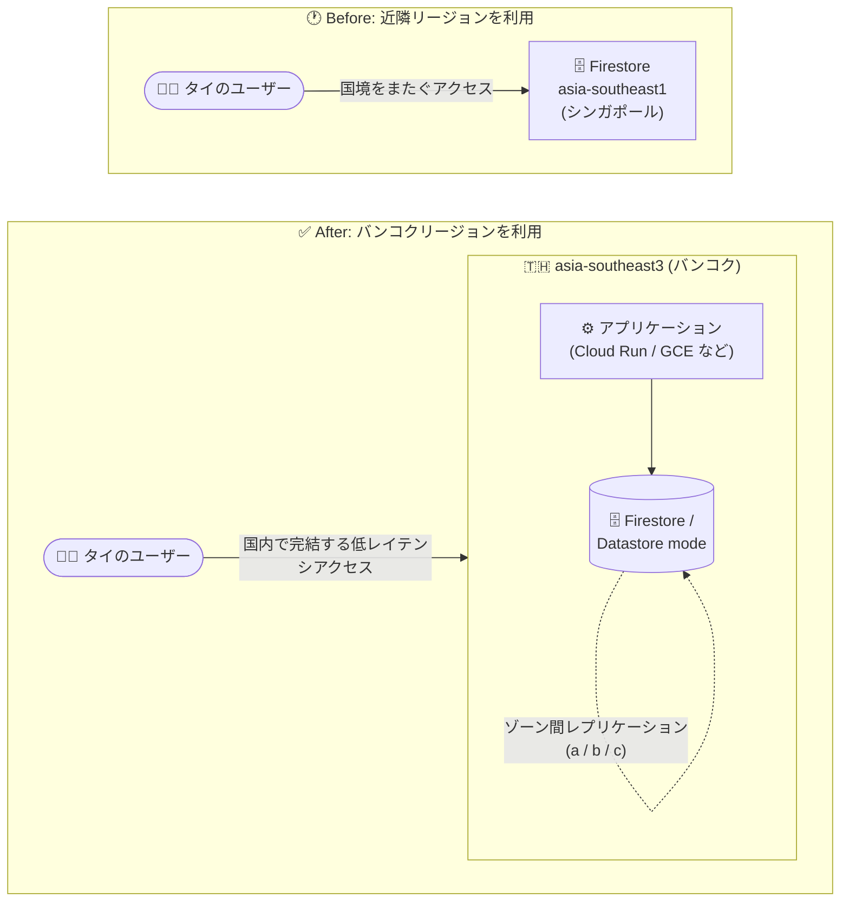

# Firestore / Firestore in Datastore mode: asia-southeast3 バンコクリージョンのサポート

**リリース日**: 2026-08-11

**サービス**: Firestore / Firestore in Datastore mode (Datastore)

**機能**: asia-southeast3 (バンコク) リージョンのサポート

**ステータス**: Feature

📊 [このアップデートのインフォグラフィックを見る](https://takech9203.github.io/google-cloud-news-summary/20260811-firestore-datastore-asia-southeast3-bangkok.html)

## 概要

Firestore および Firestore in Datastore mode (Datastore) が、asia-southeast3 (タイ・バンコク) リージョンをサポートしました。これにより、タイ国内にデータを保存する NoSQL ドキュメントデータベースを構築できるようになります。サポートされるロケーションの全リストは Locations ドキュメントで確認できます。

asia-southeast3 はタイ・バンコクに位置する Google Cloud リージョンで、3 つのゾーン (asia-southeast3-a / b / c) で構成されます。Firestore のリージョナルロケーションでは、データがリージョン内の複数ゾーンにレプリケーションされるため、単一ゾーンの障害時でもリージョン内でデータの提供を継続できます。

タイおよび東南アジアのユーザー向けにアプリケーションを提供する開発者や、タイ国内でのデータ保存 (データレジデンシー) 要件を持つ組織が主な対象です。

**アップデート前の課題**

- 東南アジアで Firestore / Datastore のデータベースを配置できるリージョンは asia-southeast1 (シンガポール) と asia-southeast2 (ジャカルタ) であり、タイ国内にデータを保存できなかった
- タイ国内のデータレジデンシー要件がある場合、Firestore / Datastore を選択肢にできなかった
- タイのユーザーに近い場所にデータを配置してレイテンシを下げるには、近隣国のリージョンを利用するしかなかった

**アップデート後の改善**

- Firestore / Datastore のデータベースを asia-southeast3 (バンコク) に作成できるようになった
- タイ国内にデータを保存でき、データレジデンシー要件への対応が可能になった
- タイのユーザーやバンコクリージョン内の他の Google Cloud リソース (Compute Engine、Cloud Run など) の近くにデータを配置し、低レイテンシなアクセスが可能になった

## アーキテクチャ図



タイのユーザー向けワークロードで、アプリケーションとデータベースの両方をバンコクリージョン内に配置できるようになり、データはリージョン内の複数ゾーンにレプリケーションされます。

## サービスアップデートの詳細

### 主要機能

1. **Firestore の asia-southeast3 サポート**
   - Firestore データベースの作成時にロケーションとして asia-southeast3 (バンコク) を選択可能
   - リージョナルロケーションとして、データはリージョン内の複数ゾーンにレプリケーションされる

2. **Firestore in Datastore mode (Datastore) の asia-southeast3 サポート**
   - Datastore mode のデータベースでも同様にバンコクリージョンを利用可能
   - Datastore mode ではプロジェクトのロケーション設定が App Engine と共通である点に注意

3. **リージョナルロケーションの特性**
   - マルチリージョンと比較して低コスト・低書き込みレイテンシ
   - 同一リージョン内の他の Google Cloud リソースとのコロケーションが可能

## 技術仕様

### asia-southeast3 リージョンと Firestore ロケーション

| 項目 | 詳細 |
|------|------|
| リージョン名 | asia-southeast3 |
| 所在地 | バンコク (タイ)、APAC |
| ゾーン | asia-southeast3-a / asia-southeast3-b / asia-southeast3-c |
| ロケーションタイプ | リージョナルロケーション |
| データレプリケーション | リージョン内の複数ゾーンにレプリケーション |
| SLA (リージョナル) | 月間稼働率 99.99% 以上 |
| SLA (参考: マルチリージョン) | 月間稼働率 99.999% 以上 |
| ロケーション変更 | データベース作成後の変更は不可 |

## 設定方法

### 前提条件

1. Google Cloud プロジェクトが作成済みであること
2. Firestore API が有効化されていること
3. データベースのロケーションは作成後に変更できないため、事前にロケーション戦略を検討すること

### 手順

#### ステップ 1: バンコクリージョンに Firestore データベースを作成

```bash
gcloud firestore databases create \
  --database=DATABASE_ID \
  --location=asia-southeast3 \
  --type=firestore-native
```

Datastore mode の場合は `--type=datastore-mode` を指定します。

#### ステップ 2: データベースのロケーションを確認

```bash
gcloud firestore databases list
```

Google Cloud コンソールのデータベース一覧の location 列でも確認できます。

## メリット

### ビジネス面

- **データレジデンシー対応**: タイ国内にデータを保存できるため、国内のデータ保存要件を持つ業界・組織でも Firestore / Datastore を採用しやすくなる
- **タイ市場向けサービスの品質向上**: ユーザーに近い場所へのデータ配置により、タイ国内ユーザー向けアプリケーションの体感品質を改善できる

### 技術面

- **低レイテンシ**: リージョナルロケーションは書き込みレイテンシが低く、タイ国内からのアクセスで国境をまたぐ通信を削減できる
- **コロケーション**: バンコクリージョンで利用可能な Compute Engine、Cloud Run、Bigtable などと同一リージョンに配置でき、リージョン内のデータ転送は無料
- **ゾーン障害への耐性**: リージョン内の複数ゾーンへのレプリケーションにより、単一ゾーン障害時もサービス継続が可能

## デメリット・制約事項

### 制限事項

- データベースのロケーションは作成後に変更できない (既存データベースの移行には新規データベースの作成とデータ移行が必要)
- リージョナルロケーションの SLA は 99.99% であり、マルチリージョン (99.999%) より低い。リージョン全体の障害には耐性がない
- asia-southeast3 を含むマルチリージョン構成は提供されていない (マルチリージョンは eur3 / nam5 / nam7 のみ)

### 考慮すべき点

- Datastore mode ではプロジェクトのロケーション設定が App Engine と共通のため、既存プロジェクトのロケーションが確定している場合は影響を確認すること
- 料金はロケーションごとに異なるため、asia-southeast3 の単価を料金ページで確認すること
- リージョン間のデータ転送には別途料金が発生する

## ユースケース

### ユースケース 1: タイ国内向けモバイル / Web アプリケーションのバックエンド

**シナリオ**: タイ国内のユーザーを対象とした EC・金融・行政系アプリケーションで、ユーザーデータをタイ国内に保存しつつ低レイテンシで提供したい。

**実装例**:
```bash
gcloud firestore databases create \
  --database=th-app-db \
  --location=asia-southeast3 \
  --type=firestore-native
```

**効果**: データがタイ国内に保存され、国内ユーザーからのアクセスレイテンシを低減できる。

### ユースケース 2: バンコクリージョン内でのフルスタック構成

**シナリオ**: Cloud Run (asia-southeast3 で利用可能) でアプリケーションをホストし、データストアも同一リージョンに配置してリージョン内で完結する構成にしたい。

**効果**: アプリケーションとデータベース間の通信がリージョン内で完結し、レイテンシとリージョン間データ転送コストを削減できる。

## 料金

Firestore の料金はデータベースのロケーションによって異なります。asia-southeast3 (バンコク) の具体的な単価は公式料金ページで確認してください。

- リージョナルロケーションは一般にマルチリージョンより低コスト
- 受信 (Inbound) データ転送および同一リージョン内のデータ転送は無料
- リージョン間のデータ転送には別途料金が発生

料金の詳細: [Firestore の料金](https://cloud.google.com/firestore/pricing)

## 利用可能リージョン

今回のアップデートで、Firestore および Firestore in Datastore mode のリージョナルロケーションに asia-southeast3 (バンコク) が追加されました。これにより、東南アジアでは asia-southeast1 (シンガポール)、asia-southeast2 (ジャカルタ) に続く 3 つ目のロケーションとなります。

サポートされるロケーションの全リスト:

- [Firestore Locations](https://docs.cloud.google.com/firestore/native/docs/locations)
- [Datastore Locations](https://docs.cloud.google.com/datastore/docs/locations)

## 関連サービス・機能

- **Compute Engine / Cloud Run**: asia-southeast3 で利用可能なコンピュートサービス。同一リージョンに配置することで低レイテンシなデータアクセスが可能
- **Bigtable**: asia-southeast3 (3 ゾーン) で利用可能な NoSQL ワイドカラムデータベース。ワークロード特性に応じた使い分けが可能
- **App Engine**: Datastore mode のプロジェクトロケーション設定は App Engine と共通
- **Cloud Interconnect**: バンコクにはコロケーション施設 (bkk-zone1/2) があり、asia-southeast3 への低レイテンシ接続が可能

## 参考リンク

- 📊 [インフォグラフィック](https://takech9203.github.io/google-cloud-news-summary/20260811-firestore-datastore-asia-southeast3-bangkok.html)
- [公式リリースノート](https://docs.cloud.google.com/release-notes#August_11_2026)
- [Firestore Locations](https://docs.cloud.google.com/firestore/native/docs/locations)
- [Datastore Locations](https://docs.cloud.google.com/datastore/docs/locations)
- [料金ページ](https://cloud.google.com/firestore/pricing)

## まとめ

Firestore / Datastore が asia-southeast3 (バンコク) をサポートしたことで、タイ国内でのデータ保存要件を満たしながら低レイテンシな NoSQL データベースを構築できるようになりました。タイ市場向けのワークロードを持つ場合は、新規データベースのロケーションとして asia-southeast3 の採用を検討し、料金ページでリージョン単価を確認することを推奨します。

---

**タグ**: #Firestore #Datastore #asia-southeast3 #Bangkok #Thailand #リージョン拡大 #データレジデンシー #NoSQL
