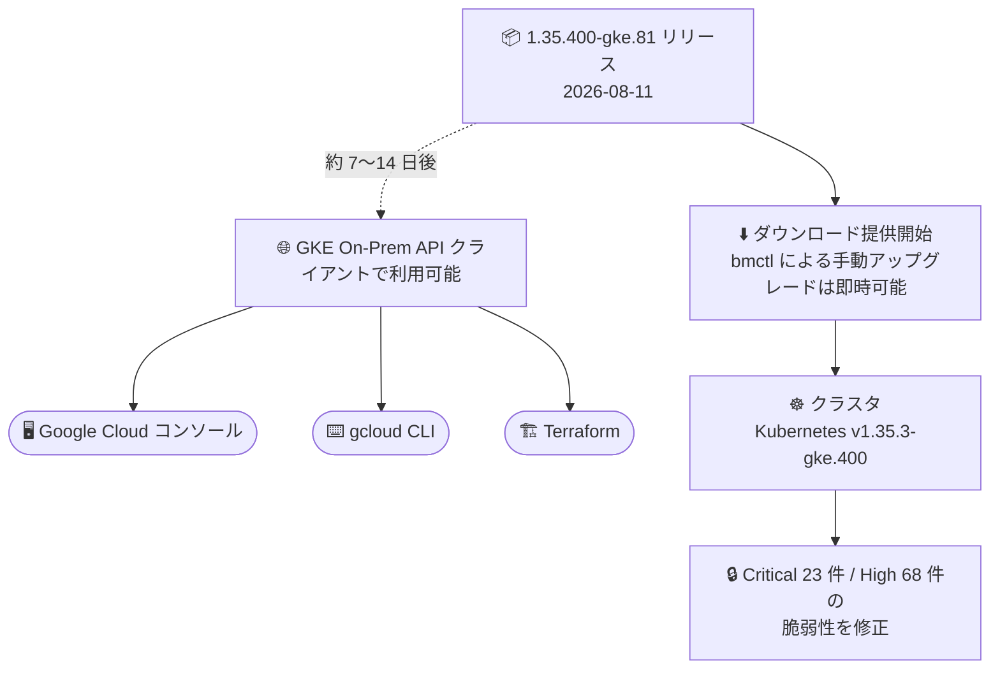

# Google Distributed Cloud (software only) for bare metal: 1.35.400-gke.81 リリース

**リリース日**: 2026-08-11

**サービス**: Google Distributed Cloud (software only) for bare metal

**機能**: バージョン 1.35.400-gke.81 リリース (脆弱性修正)

**ステータス**: GA (ダウンロード可能)

📊 [このアップデートのインフォグラフィックを見る](https://takech9203.github.io/google-cloud-news-summary/20260811-gdc-bare-metal-1-35-400.html)

## 概要

Google Distributed Cloud (software only) for bare metal のパッチバージョン 1.35.400-gke.81 がダウンロード可能になりました。本バージョンは Kubernetes v1.35.3-gke.400 上で動作します。オンプレミスのベアメタル環境で GKE Enterprise クラスタを運用しているユーザー向けのメンテナンスリリースであり、セキュリティ脆弱性の修正が中心です。

本リリースでは、Critical 23 件・High 68 件のセキュリティ脆弱性 (CVE / GHSA) が修正されています。1.35 系の最新パッチとして、セキュリティポリシー準拠の観点から早期の適用が推奨されます。

なお、リリース後、GKE On-Prem API クライアント (Google Cloud コンソール、gcloud CLI、Terraform) でのインストールやアップグレードにこのバージョンが利用可能になるまで、約 7〜14 日かかります。

**アップデート前の課題**

- 1.35.300-gke.87 以前の 1.35 系バージョンには、Critical 23 件 (CVE-2025-22871、CVE-2025-23266 など) を含む未修正の脆弱性が存在した
- Go 標準ライブラリ、libxml2、BuildKit、NVIDIA Container Toolkit など、複数のコンポーネントに由来する既知の CVE への対応が必要だった

**アップデート後の改善**

- Critical 23 件・High 68 件の脆弱性が修正され、オンプレミス環境のセキュリティ体制が強化された
- Kubernetes v1.35.3-gke.400 ベースの最新パッチに更新され、1.35 系のサポート状態を維持できる

## アーキテクチャ図

リリース直後からダウンロードによるアップグレードが可能ですが、GKE On-Prem API クライアント (コンソール、gcloud CLI、Terraform) 経由での利用は約 7〜14 日後になります。

## サービスアップデートの詳細

### 主要機能

1. **バージョン 1.35.400-gke.81 の提供開始 (Announcement)**
   - Kubernetes v1.35.3-gke.400 上で動作
   - アップグレード手順は公式ドキュメント「Upgrade clusters」を参照
   - GKE On-Prem API クライアント (Google Cloud コンソール、gcloud CLI、Terraform) でのインストール・アップグレードには、リリース後約 7〜14 日で利用可能になる
   - サードパーティストレージベンダーを利用している場合は、認定済みストレージパートナーの一覧を確認すること

2. **脆弱性の修正 (Fixed)**
   - Vulnerability fixes ページに記載された脆弱性を修正
   - Critical 23 件・High 68 件 (Medium / Low の修正はなし)
   - 詳細は「技術仕様」セクションの脆弱性一覧を参照

## 技術仕様

### リリース情報

| 項目 | 詳細 |
|------|------|
| バージョン | 1.35.400-gke.81 |
| Kubernetes バージョン | v1.35.3-gke.400 |
| リリース日 | 2026-08-11 |
| GKE On-Prem API クライアントでの利用可能時期 | リリース後 約 7〜14 日 |
| 対象 | Google Distributed Cloud (software only) for bare metal (旧称: GDC Virtual / Anthos clusters on bare metal) |

### 修正された脆弱性 (1.35.400-gke.81)

公式の Vulnerability fixes ページに記載されている本バージョンでの修正内容は以下のとおりです。

| 重要度 | 件数 | CVE / GHSA |
|--------|------|------------|
| Critical | 23 件 | CVE-2025-22871, CVE-2024-52533, CVE-2023-29405, CVE-2023-29404, CVE-2022-23806, CVE-2024-56171, CVE-2021-38297, CVE-2024-38428, CVE-2023-24540, CVE-2024-24790, CVE-2025-49794, CVE-2023-24531, CVE-2023-29402, CVE-2025-0838, CVE-2024-23652, CVE-2024-23653, CVE-2024-47606, CVE-2024-45337, CVE-2025-49796, CVE-2023-24538, CVE-2025-23266, CVE-2022-1996, CVE-2025-48174 |
| High | 68 件 | CVE-2026-32285, CVE-2026-34986, CVE-2024-34156, CVE-2024-34158, CVE-2025-22869, CVE-2025-32990, CVE-2025-32988, CVE-2025-6020, CVE-2022-30632, CVE-2025-24928, CVE-2022-23773, CVE-2026-47178, CVE-2026-23490, CVE-2026-32882, CVE-2023-39325, CVE-2022-41716, CVE-2020-28367, CVE-2022-27664, CVE-2021-3115, CVE-2022-30631, CVE-2022-32189, CVE-2022-41723, CVE-2024-24791, CVE-2023-45142, CVE-2025-32415, CVE-2024-25062, CVE-2022-28131, CVE-2022-2880, CVE-2022-30580, CVE-2021-33198, CVE-2026-47247, CVE-2026-33164, CVE-2023-24536, CVE-2026-30922, CVE-2022-2879, CVE-2025-64720, GHSA-m425-mq94-257g, CVE-2022-28327, CVE-2025-48060, CVE-2026-24049, CVE-2022-28948, CVE-2022-30630, CVE-2026-21441, CVE-2026-33747, CVE-2024-7006, CVE-2025-65637, CVE-2024-12087, CVE-2026-49295, CVE-2025-9900, CVE-2023-24539, CVE-2026-35386, CVE-2026-27459, CVE-2026-32597, CVE-2026-35414, CVE-2026-43618, CVE-2023-47108, CVE-2026-22801, CVE-2024-12085, CVE-2026-12912, CVE-2021-41771, CVE-2025-30204, CVE-2026-33748, CVE-2026-48029, CVE-2022-24921, CVE-2023-39323, CVE-2023-24537, CVE-2026-33416, CVE-2024-12088 |
| Medium | 0 件 | なし |
| Low | 0 件 | なし |

## 設定方法

### 前提条件

1. Google Distributed Cloud (software only) for bare metal のクラスタを運用していること
2. アップグレード前にリリースノート (脆弱性修正、既知の問題を含む) を確認すること
3. サードパーティストレージベンダーを利用している場合、本リリースで認定済みであることをストレージパートナー一覧で確認すること

### 手順

#### ステップ 1: アップグレードの実施

公式ドキュメント「[Upgrade clusters](https://docs.cloud.google.com/kubernetes-engine/distributed-cloud/bare-metal/docs/how-to/upgrade)」に従い、クラスタを 1.35.400-gke.81 にアップグレードします。

#### ステップ 2: GKE On-Prem API クライアント経由の場合

Google Cloud コンソール、gcloud CLI、Terraform からのインストール・アップグレードは、リリース後約 7〜14 日で利用可能になるため、利用可能になったことを確認してから実施します。

## メリット

### ビジネス面

- **セキュリティリスクの低減**: Critical 23 件・High 68 件の脆弱性が修正され、オンプレミス環境のコンプライアンス・セキュリティ体制を維持できる
- **サポート継続性の確保**: 1.35 系の最新パッチを適用することで、サポートされたバージョンでの運用を継続できる

### 技術面

- **最新 Kubernetes パッチの適用**: Kubernetes v1.35.3-gke.400 ベースに更新され、アップストリームの修正が反映される
- **広範なコンポーネントの修正**: Go 標準ライブラリ、libxml2、BuildKit、NVIDIA Container Toolkit 由来など、複数のコンポーネントにまたがる CVE が一括で解消される

## デメリット・制約事項

### 考慮すべき点

- GKE On-Prem API クライアント (コンソール、gcloud CLI、Terraform) での利用は、リリース後約 7〜14 日待つ必要がある
- サードパーティストレージベンダーを利用している場合、本リリースでの認定状況をストレージパートナー一覧で事前に確認する必要がある
- パッチアップグレードとはいえ、本番環境への適用前に検証環境での動作確認を推奨

## ユースケース

### ユースケース 1: セキュリティパッチ適用としての定期アップグレード

**シナリオ**: オンプレミスのベアメタル環境で GDC クラスタを運用しており、社内のセキュリティポリシーで Critical / High 脆弱性への迅速な対応が求められている。

**効果**: 1.35.400-gke.81 へのアップグレードにより、Critical 23 件・High 68 件の脆弱性が修正され、セキュリティポリシーへの準拠を維持できる。

### ユースケース 2: GKE On-Prem API クライアントによる一元管理環境での計画的アップグレード

**シナリオ**: 複数拠点の GDC クラスタを Google Cloud コンソールや Terraform で一元管理しており、計画的にバージョンアップを実施したい。

**効果**: リリース後約 7〜14 日で GKE On-Prem API クライアントから本バージョンが利用可能になるため、利用可能時期を見込んだアップグレード計画を立てられる。即時適用が必要な場合はダウンロードによる手動アップグレードも選択できる。

## 関連サービス・機能

- **GKE On-Prem API**: Google Cloud コンソール、gcloud CLI、Terraform からの GDC クラスタのライフサイクル管理に使用 (本バージョンの対応はリリース後約 7〜14 日)
- **Google Distributed Cloud (software only) for VMware**: VMware 環境向けの姉妹製品。ベアメタル版と同様のリリースサイクルで提供される
- **認定済みストレージパートナー**: サードパーティストレージベンダー利用時は、本リリースでの認定状況を事前に確認する

## 参考リンク

- 📊 [インフォグラフィック](https://takech9203.github.io/google-cloud-news-summary/20260811-gdc-bare-metal-1-35-400.html)
- [公式リリースノート](https://docs.cloud.google.com/release-notes#August_11_2026)
- [GDC for bare metal リリースノート](https://docs.cloud.google.com/kubernetes-engine/distributed-cloud/bare-metal/docs/release-notes)
- [Vulnerability fixes (脆弱性修正一覧)](https://docs.cloud.google.com/kubernetes-engine/distributed-cloud/bare-metal/docs/vulnerabilities)
- [認定済みストレージパートナー](https://docs.cloud.google.com/kubernetes-engine/enterprise/docs/resources/partner-storage)
- [クラスタのアップグレード](https://docs.cloud.google.com/kubernetes-engine/distributed-cloud/bare-metal/docs/how-to/upgrade)

## まとめ

Google Distributed Cloud (software only) for bare metal 1.35.400-gke.81 は、Critical 23 件・High 68 件の脆弱性修正を含むセキュリティ中心のメンテナンスリリースです。1.35 系を運用中のクラスタは、セキュリティ観点から早期のアップグレードを推奨します。GKE On-Prem API クライアント経由での適用は、リリース後約 7〜14 日で利用可能になる点に留意してください。

---

**タグ**: Google Distributed Cloud, GDC, bare metal, GKE Enterprise, Kubernetes, セキュリティ, 脆弱性修正, パッチリリース
