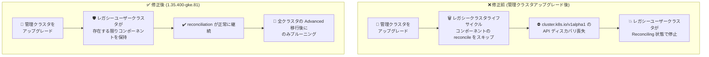

# Google Distributed Cloud (software only) for VMware: 1.35.400-gke.81 リリース (脆弱性修正と Advanced Cluster 移行期の安定性改善)

**リリース日**: 2026-08-11

**サービス**: Google Distributed Cloud (software only) for VMware

**機能**: バージョン 1.35.400-gke.81 リリース (Announcement + Fixed)

**ステータス**: GA (ダウンロード提供開始)

📊 [このアップデートのインフォグラフィックを見る](https://takech9203.github.io/google-cloud-news-summary/20260811-gdc-vmware-1-35-400.html)

## 概要

Google Distributed Cloud (software only) for VMware のパッチバージョン **1.35.400-gke.81** がダウンロード可能になりました。本バージョンは **Kubernetes v1.35.3-gke.400** 上で動作します。オンプレミスの VMware vSphere 環境で GKE クラスタを運用するユーザー向けのリリースで、セキュリティ脆弱性の修正に加え、レガシークラスタから Advanced Cluster への移行期に発生していた重要な不具合の修正が含まれています。

今回のリリースは新機能の追加ではなく、脆弱性修正 (Vulnerability fixes) と、管理クラスタアップグレード後にユーザークラスタが Reconciling 状態で停止する問題、プライベートコンテナレジストリ認証時の `gkectl prepare` の permission denied エラー、Advanced Cluster へのアップグレード再試行時の etcd Secret 復号失敗という 3 系統の不具合修正が中心です。特に Reconciling 停止の問題は、レガシー (非 Advanced) ユーザークラスタが管理クラスタ上に残っている混在環境で発生するもので、Advanced Cluster への段階的な移行を進めている環境に直接影響するため、該当環境では本バージョンへの更新が推奨されます。

リリース後、GKE On-Prem API クライアント (Google Cloud コンソール、gcloud CLI、Terraform) で本バージョンが利用可能になるまでには約 7〜14 日かかります。サードパーティのストレージベンダーを使用している場合は、認定済みストレージパートナーの一覧を確認してください。

**アップデート前の課題**

- 管理クラスタのアップグレード後、ユーザークラスタが Reconciling 状態のまま停止することがあった。管理クラスタコントローラーは、初期移行アノテーションが設定されていない限りアップグレード中にレガシークラスタライフサイクルコンポーネントの reconcile をスキップしており、レガシーユーザークラスタが管理クラスタ上に残っている場合、レガシー API (`cluster.k8s.io/v1alpha1`) のディスカバリが失われてコントローラーの reconciliation が停止していた
- プライベートコンテナレジストリに対する認証時に、`gkectl prepare` が permission denied エラーで失敗することがあった
- ユーザークラスタまたは管理クラスタの Advanced Cluster へのアップグレードを再試行すると、etcd 内の Secret の復号に失敗することがあった
- 既知の脆弱性が未修正のまま残っていた

**アップデート後の改善**

- コントローラーがレガシーユーザークラスタが 1 つでも存在する限りレガシークラスタライフサイクルコンポーネントを保持し、すべてのユーザークラスタが Advanced Cluster へ移行した後にのみプルーニング (削除) するようになったため、管理クラスタアップグレード後の Reconciling 停止が解消された
- プライベートコンテナレジストリ認証時の `gkectl prepare` の permission denied エラーが解消された
- Advanced Cluster へのアップグレード再試行時に etcd Secret の復号失敗が発生しなくなった
- Vulnerability fixes に記載された脆弱性が修正された

## アーキテクチャ図



管理クラスタコントローラーがレガシークラスタライフサイクルコンポーネントを適切なタイミングまで保持するようになり、レガシーユーザークラスタと Advanced Cluster が混在する移行期でもアップグレード後の reconciliation が停止しなくなりました。

## サービスアップデートの詳細

### 主要な修正内容

1. **脆弱性の修正**
   - [Vulnerability fixes](https://docs.cloud.google.com/kubernetes-engine/distributed-cloud/vmware/docs/vulnerabilities) ページに記載された脆弱性が修正された
   - GKE セキュリティチームは Kubernetes vulnerability scoring システムに基づき脆弱性を Critical / High / Medium / Low に分類しており、最新の推奨パッチバージョンへのアップグレードが推奨される

2. **管理クラスタアップグレード後のユーザークラスタ Reconciling 停止の修正**
   - 管理クラスタのアップグレード後、ユーザークラスタが Reconciling 状態のまま停止する問題を修正
   - 従来、管理クラスタコントローラーは初期移行アノテーションが設定されていない限り、アップグレード中にレガシークラスタライフサイクルコンポーネントの reconcile をスキップしていた
   - レガシーユーザークラスタが管理クラスタ上に残っていると、レガシー API (`cluster.k8s.io/v1alpha1`) のディスカバリが失われ、コントローラーの reconciliation が停止していた
   - 修正後は、レガシーユーザークラスタが 1 つでも存在する限りコントローラーがレガシーコンポーネントを保持し、すべてのユーザークラスタが Advanced Cluster に移行した後にのみプルーニングする

3. **gkectl prepare のプライベートレジストリ認証エラーの修正**
   - プライベートコンテナレジストリに対する認証時に、`gkectl prepare` が permission denied エラーで失敗する問題を修正

4. **Advanced Cluster アップグレード再試行時の etcd Secret 復号失敗の修正**
   - ユーザークラスタまたは管理クラスタの Advanced Cluster へのアップグレードを再試行すると、etcd 内の Secret の復号に失敗する問題を修正
   - 従来の既知の問題では、再試行時に `generated-key-kms-plugin-config` シークレットの暗号化キーが失われ、コントロールプレーンが etcd に保存された既存の Kubernetes Secret を復号できなくなるケースが報告されていた

## 技術仕様

### バージョン情報

| 項目 | 詳細 |
|------|------|
| GDC for VMware バージョン | 1.35.400-gke.81 |
| Kubernetes バージョン | v1.35.3-gke.400 |
| リリースタイプ | パッチリリース (脆弱性修正 + バグ修正) |
| GKE On-Prem API クライアント対応 | リリース後約 7〜14 日で利用可能 (コンソール、gcloud CLI、Terraform) |
| アップグレード方法 | [Upgrade clusters](https://docs.cloud.google.com/kubernetes-engine/distributed-cloud/vmware/docs/how-to/upgrading) を参照 |

### レガシークラスタと Advanced Cluster の混在環境に関する留意点

| 項目 | 詳細 |
|------|------|
| レガシー API | 非 Advanced (レガシー) クラスタのライフサイクル管理には `cluster.k8s.io/v1alpha1` API が使用される |
| コンポーネントのプルーニング | 本修正により、レガシーコンポーネントの削除はすべてのユーザークラスタが Advanced Cluster へ移行した後にのみ実行される |
| 1.32 → 1.33 アップグレード | 既定で Advanced Cluster に自動変換 (非 Advanced のまま維持するオプションあり) |
| 1.33 → 1.34 以降のアップグレード | 常に Advanced Cluster に変換される |

## 設定方法

### 前提条件

1. アップグレード前に `gkectl diagnose cluster` を実行し、クラスタが正常であることを確認する
2. gkectl のバージョンとバンドルがターゲットバージョンに対応していることを確認する
3. 管理クラスタと ユーザークラスタの現在のバックアップを取得しておく
4. サードパーティのストレージベンダーを使用している場合は、[認定済みストレージパートナー](https://docs.cloud.google.com/kubernetes-engine/enterprise/docs/resources/partner-storage)の一覧を確認する

### 手順

#### ステップ 1: OS イメージを vSphere にインポート

```bash
gkectl prepare \
    --bundle-path /var/lib/gke/bundles/gke-onprem-vsphere-1.35.400-gke.81.tgz \
    --kubeconfig ADMIN_CLUSTER_KUBECONFIG
```

管理ワークステーション上で実行し、ターゲットバージョンの OS イメージを vSphere にインポートします。1.31 以降では、ユーザークラスタより先に管理クラスタをアップグレードする必要があります (管理クラスタのバージョンはユーザークラスタ以上である必要があります)。

#### ステップ 2: クラスタのアップグレード

公式ドキュメント [Upgrade clusters](https://docs.cloud.google.com/kubernetes-engine/distributed-cloud/vmware/docs/how-to/upgrading) の手順に従い、管理クラスタ、ユーザークラスタの順にアップグレードを実施します。1.29 以降では `--dry-run` フラグでアップグレード前にプリフライトチェックのみを実行できます。

## メリット

### ビジネス面

- **セキュリティリスクの低減**: 既知の脆弱性が修正され、コンプライアンス要件への対応が容易になる
- **段階的移行の計画が立てやすくなる**: レガシークラスタと Advanced Cluster の混在環境でも管理クラスタのアップグレードが安全に行えるため、Advanced Cluster への移行を無理に一括で行う必要がなくなる

### 技術面

- **混在環境での運用安定性**: レガシーユーザークラスタが残っている状態で管理クラスタをアップグレードしても、reconciliation の停止 (Reconciling スタック) が発生しなくなった
- **データ保全性の確保**: Advanced Cluster へのアップグレード再試行時に etcd Secret の復号失敗が発生しなくなり、Secret へのアクセスを失うリスクが解消された
- **プライベートレジストリ環境の安定化**: プライベートコンテナレジストリ認証時の `gkectl prepare` の失敗が解消された

## デメリット・制約事項

### 考慮すべき点

- GKE On-Prem API クライアント (Google Cloud コンソール、gcloud CLI、Terraform) で本バージョンが利用可能になるまで、リリース後約 7〜14 日かかる
- レガシークラスタライフサイクルコンポーネントは、すべてのユーザークラスタが Advanced Cluster へ移行するまで管理クラスタ上に保持される (自動的なプルーニングは全移行完了後)
- サードパーティストレージベンダー利用時は、認定済みストレージパートナーの確認が必要

## ユースケース

### ユースケース 1: レガシーユーザークラスタが残る混在環境での管理クラスタアップグレード

**シナリオ**: 複数のユーザークラスタのうち一部のみを Advanced Cluster へ移行済みで、レガシー (非 Advanced) ユーザークラスタが管理クラスタ上に残っている。この状態で管理クラスタをアップグレードすると、従来はレガシー API のディスカバリ喪失によりユーザークラスタが Reconciling 状態で停止するリスクがあった。

**効果**: 1.35.400-gke.81 では、コントローラーがレガシーユーザークラスタの存在を検知してレガシーコンポーネントを保持するため、混在環境でも管理クラスタのアップグレードが安全に完了し、各ユーザークラスタを自分のペースで Advanced Cluster へ移行できる。

### ユースケース 2: Advanced Cluster へのアップグレード失敗後の安全な再試行

**シナリオ**: ユーザークラスタまたは管理クラスタの Advanced Cluster へのアップグレードが途中で失敗し、再試行する必要がある。従来は再試行により etcd 内の Secret が復号不能になるリスクがあった。

**効果**: 本バージョンでは再試行時にも etcd Secret の復号が維持されるため、Secret へのアクセスを失うことなくアップグレードを完遂できる。

### ユースケース 3: プライベートレジストリ環境でのバージョン準備

**シナリオ**: エアギャップに近い環境で、プライベートコンテナレジストリを使用してクラスタのコンテナイメージを配布している。従来は `gkectl prepare` がレジストリ認証時に permission denied で失敗することがあった。

**効果**: 本バージョンでは認証エラーが解消され、プライベートレジストリ環境でもアップグレード準備が正常に完了する。

## 関連サービス・機能

- **GKE On-Prem API (コンソール / gcloud CLI / Terraform)**: クラスタのライフサイクル管理に使用。本バージョンは約 7〜14 日後に利用可能になる
- **Advanced Cluster**: 1.32 で GA となった新しいクラスタアーキテクチャ。今回の修正はレガシークラスタから Advanced Cluster への移行期の安定性に関するもの
- **Always-on secrets encryption**: 外部 KMS 不要で etcd 内の Secret を暗号化する機能。今回の etcd Secret 復号失敗修正に関連
- **Google Distributed Cloud (software only) for bare metal**: 同日に同バージョン 1.35.400-gke.81 がリリースされたベアメタル版 (Kubernetes v1.35.3-gke.400 上で動作)

## 参考リンク

- 📊 [インフォグラフィック](https://takech9203.github.io/google-cloud-news-summary/20260811-gdc-vmware-1-35-400.html)
- [公式リリースノート](https://docs.cloud.google.com/release-notes#August_11_2026)
- [クラスタのアップグレード](https://docs.cloud.google.com/kubernetes-engine/distributed-cloud/vmware/docs/how-to/upgrading)
- [Vulnerability fixes (脆弱性修正一覧)](https://docs.cloud.google.com/kubernetes-engine/distributed-cloud/vmware/docs/vulnerabilities)
- [認定済みストレージパートナー](https://docs.cloud.google.com/kubernetes-engine/enterprise/docs/resources/partner-storage)
- [Advanced Cluster へのアップデート/アップグレード](https://docs.cloud.google.com/kubernetes-engine/distributed-cloud/vmware/docs/how-to/update-or-upgrade-to-adv-cluster)
- [既知の問題 (Known issues)](https://docs.cloud.google.com/kubernetes-engine/distributed-cloud/vmware/docs/troubleshooting/known-issues)

## まとめ

GDC (software only) for VMware 1.35.400-gke.81 は、脆弱性修正に加えて、レガシークラスタと Advanced Cluster の混在環境における管理クラスタアップグレードの安定性を大きく改善するパッチリリースです。特に管理クラスタアップグレード後のユーザークラスタ Reconciling 停止と、Advanced Cluster アップグレード再試行時の etcd Secret 復号失敗という運用に直結する問題が解消されているため、1.35 系を運用中、または Advanced Cluster への段階的な移行を進めている環境では、本バージョンへの早期アップグレードを推奨します。

---

**タグ**: #GoogleDistributedCloud #VMware #GDC #Kubernetes #オンプレミス #セキュリティ #AdvancedCluster #アップグレード
