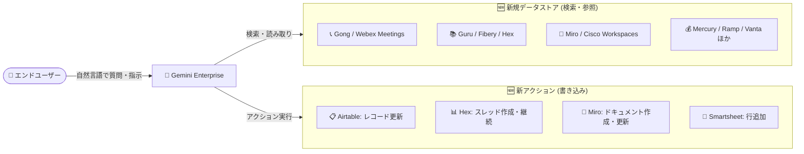

# Gemini Enterprise: 新規データストア 12 種と新アクションのサポート (Public Preview)

**リリース日**: 2026-08-11

**サービス**: Gemini Enterprise

**機能**: 新規データストアの追加と新アクションのサポート

**ステータス**: Public Preview

📊 [このアップデートのインフォグラフィックを見る](https://takech9203.github.io/google-cloud-news-summary/20260811-gemini-enterprise-new-data-stores-actions.html)

## 概要

Gemini Enterprise に新しいデータストア (コネクタ) 12 種が Public Preview として追加されました。対象は Cisco Workspaces、Fibery、Gong、Guru、Hex、LegalZoom、Mercury、Miro、Ramp、Solve Intelligence、Vanta、Webex Meetings で、これらのデータストアに格納されたデータを自然言語で検索・参照できるようになります。営業支援 (Gong)、ナレッジ管理 (Guru)、コラボレーション (Miro、Webex Meetings)、データ分析 (Hex)、コンプライアンス (Vanta)、財務 (Mercury、Ramp) など、幅広い SaaS アプリケーションのデータを Gemini Enterprise から横断的に活用できます。

さらに、既存の一部データストアで新しいアクションが Public Preview として利用可能になりました。Airtable (テーブルのレコード更新)、Hex (スレッドの作成・継続)、Miro (ドキュメントの作成・更新)、Smartsheet (行の追加) です。これにより、Gemini Enterprise は情報の検索・参照にとどまらず、自然言語の指示でサードパーティアプリケーションへの書き込み操作まで実行できるようになります。

対象ユーザーは、Gemini Enterprise を全社の AI アシスタント基盤として利用し、社内に散在する SaaS データを統合的に検索・操作したい企業の管理者およびエンドユーザーです。

**アップデート前の課題**

- Cisco Workspaces、Gong、Guru、Miro、Webex Meetings などの SaaS データは Gemini Enterprise のコネクタ対象外であり、これらのデータを検索するには各アプリケーションを個別に開いて操作する必要があった
- Airtable のレコード更新、Miro のドキュメント作成・更新、Smartsheet への行追加、Hex のスレッド操作といった書き込み操作は Gemini Enterprise から実行できず、検索結果をもとにユーザーが各アプリケーションへ移動して手動で作業する必要があった
- 会議記録 (Gong、Webex Meetings) やナレッジベース (Guru) の内容を確認するために複数ツールを行き来する必要があり、情報収集の効率が低かった

**アップデート後の改善**

- 12 種の新しいデータストアを接続することで、これらの SaaS アプリケーションのデータを Gemini Enterprise から自然言語で検索・参照できるようになった
- Airtable のレコード更新、Hex のスレッド作成・継続、Miro のドキュメント作成・更新、Smartsheet の行追加を自然言語の指示だけで実行できるようになった
- 検索から書き込みアクションまでを Gemini Enterprise の単一インターフェースで完結でき、ツール間の往復が削減された

## アーキテクチャ図

エンドユーザーは Gemini Enterprise に自然言語で指示するだけで、新規追加された 12 種のデータストアの検索・参照と、Airtable / Hex / Miro / Smartsheet への書き込みアクションを実行できます。

## サービスアップデートの詳細

### 主要機能

1. **新規データストア 12 種の追加 (Public Preview)**
   - Cisco Workspaces、Fibery、Gong、Guru、Hex、LegalZoom、Mercury、Miro、Ramp、Solve Intelligence、Vanta、Webex Meetings が利用可能
   - これらのデータストア内のデータを自然言語で検索・参照できる
   - Google Cloud コンソールの Gemini Enterprise ページからデータストアを作成し、アプリに接続して利用する

2. **Airtable の新アクション (Public Preview)**
   - テーブルのレコードを更新するアクションが追加
   - 既存のアクション (ベース作成、フィールド作成、レコードコメント作成、テーブル作成・更新など) に加えて利用可能

3. **Hex の新アクション (Public Preview)**
   - スレッドの作成 (Create threads) と継続 (Continue threads) が可能
   - データ分析ワークフローを Gemini Enterprise から開始・継続できる

4. **Miro の新アクション (Public Preview)**
   - ドキュメントの作成 (Create documents) と更新 (Update documents) が可能
   - ホワイトボードコラボレーションのコンテンツ操作を自然言語で実行できる

5. **Smartsheet の新アクション (Public Preview)**
   - シートへの行追加 (Add rows) が可能
   - 既存のアクション (シート作成、ワークスペース作成、行更新、お気に入り追加など) に加えて利用可能

## 技術仕様

### データストアの基本概念

| 項目 | 詳細 |
|------|------|
| データストア | データソースごとにエンティティ単位でデータストアが作成される (例: Jira の issue、コメントなど) |
| データ連携方式 | フェデレーション (ソースから直接取得、インデックスなし) またはインジェスト (インデックス化、検索品質向上) |
| アクション | コネクタを有効化すると、エンドユーザーが自然言語コマンドで書き込み操作を実行可能 |
| アクセス制御 | 権限認識型検索 (permission-aware search) により、ユーザーの権限に基づいた結果のみ表示 |
| 暗号化 | デフォルトは Google 管理の暗号鍵。CMEK (顧客管理の暗号鍵) も利用可能 |
| ロケーション | アクション対応データストア (Airtable、Smartsheet など) は global、us、eu をサポート |

### 既知の制限事項 (アクション対応コネクタ共通)

- 新しいアプリの作成時や既存アプリへのデータストア追加時は、アクションを持つデータストアは単一のコネクタタイプに限定することが推奨される
- 既存データストアへの VPC Service Controls 境界の適用は非サポート。適用するにはデータストアの削除・再作成が必要

## 設定方法

### 前提条件

1. Gemini Enterprise のサブスクリプション (エディション) とユーザーライセンスが必要
2. サードパーティアプリケーション側の管理者が、接続に必要な認証情報・スコープ・権限を設定しておく必要がある

### 手順

#### ステップ 1: データストアの作成

1. Google Cloud コンソールで「Gemini Enterprise」ページに移動
2. ナビゲーションメニューで「Data stores」をクリックし、「Create data store」を選択
3. ソースの検索欄で対象サービス (例: Miro、Gong) を検索して選択
4. 検索対象のエンティティを選択

#### ステップ 2: アクションの有効化 (対応コネクタの場合)

1. データストア作成フローの「Actions」セクションで、有効化するアクションを選択
2. 作成時にスキップした場合も、後から「Add actions」で追加可能

#### ステップ 3: 接続の構成と作成

1. マルチリージョン (global / us / eu) とコネクタ名を設定
2. us / eu を選択した場合は暗号化設定 (Google 管理鍵または Cloud KMS 鍵) を構成
3. 課金設定 (General pricing または Configurable pricing) を選択して「Create」をクリック
4. データストアのステータスが「Creating」から「Active」に変わったら、アプリに接続し、ユーザー認可を行って利用開始

## メリット

### ビジネス面

- **情報アクセスの一元化**: 営業 (Gong)、ナレッジ (Guru)、財務 (Mercury、Ramp)、コンプライアンス (Vanta)、会議 (Webex Meetings) など、部門ごとに分散した SaaS データを単一の AI アシスタントから横断検索でき、情報収集の時間を削減できる
- **業務フローの自動化**: 検索結果の確認からアプリケーションへの書き込み (レコード更新、行追加、ドキュメント作成) までを自然言語で完結でき、ツール切り替えのオーバーヘッドを排除できる

### 技術面

- **権限認識型のセキュアな検索**: 各データソースのアクセス制御を尊重した検索が可能で、ユーザーは自分に権限のあるデータのみ参照できる
- **柔軟なデータ連携方式**: フェデレーション (ストレージ消費なし) とインジェスト (検索品質向上) をコネクタの対応状況に応じて選択できる
- **CMEK・静的 IP エグレス対応**: 暗号鍵の顧客管理や、ソースシステム側での許可リスト登録に使える固定 IP からのアウトバウンド通信 (対応データストアのみ) など、エンタープライズ要件に対応

## デメリット・制約事項

### 制限事項

- 本機能は Public Preview であり、Pre-GA Offerings Terms が適用される。サポートが限定される可能性があり、本番ワークロードでの利用は慎重に判断する必要がある
- アクションを持つデータストアは、1 つのアプリに対して単一コネクタタイプに限定することが推奨される
- 既存データストアへの VPC Service Controls の適用は非サポート (削除・再作成が必要)

### 考慮すべき点

- サードパーティ側の認証情報・スコープ設定が必要であり、各 SaaS アプリケーションの管理者との調整が発生する
- データのインジェスト (インデックス化) を選択する場合、ストレージクォータを消費する (ストレージはプロジェクト・ロケーション単位でプール)
- PII (個人識別情報) を含むデータで検索候補の自動補完を使う場合は、PII 漏えい対策の設定を確認する必要がある

## ユースケース

### ユースケース 1: 営業会議の振り返りと CRM 更新の効率化

**シナリオ**: 営業チームが Gong に記録された商談の会話や Webex Meetings の会議内容を Gemini Enterprise で検索し、「先週の顧客 A との商談で議論された懸念点をまとめて」と自然言語で質問する。得られた要約をもとに、「Airtable の案件管理テーブルの顧客 A のステータスを『提案中』に更新して」と指示する。

**効果**: 会議ツールと CRM 的な管理ツールを行き来することなく、商談の振り返りから記録更新までを単一インターフェースで完結できる。

### ユースケース 2: コンプライアンス・財務情報の横断検索

**シナリオ**: 管理部門が Vanta のコンプライアンス状況、Ramp・Mercury の財務データを Gemini Enterprise から自然言語で検索し、監査準備に必要な情報を迅速に収集する。収集した情報の整理には「Smartsheet の監査準備シートに確認項目を行として追加して」と指示する。

**効果**: 監査・レポーティング業務における複数 SaaS からの情報収集と記録作業を大幅に効率化できる。

### ユースケース 3: デザイン・分析ワークフローの起点として活用

**シナリオ**: プロダクトチームが Guru のナレッジや Fibery のプロジェクト情報を検索して要件を確認し、「Miro に新機能のブレインストーミング用ドキュメントを作成して」「Hex で売上分析のスレッドを作成して」と指示してワークフローを開始する。

**効果**: 情報収集からコラボレーション・分析ツールでの作業開始までがシームレスにつながり、チームの立ち上がりが速くなる。

## 料金

Gemini Enterprise はエディション (Business、Standard、Plus、Pay-as-you-go、Frontline) ごとのサブスクリプション + ライセンスモデルで提供されます。データストア (コネクタ) の利用可否はエディションによって異なり、フルのデータコネクタエコシステムへのアクセスは Standard 以上のエディションで提供されます。ストレージ・データインデックスのクォータはプロジェクト・ロケーション単位でプールされます (例: Standard は 30 GiB/ユーザー、Plus は 75 GiB/ユーザー)。

詳細は以下を参照してください。

- [Gemini Enterprise のエディション比較](https://docs.cloud.google.com/gemini/enterprise/docs/editions)
- [ライセンスの取得と管理](https://docs.cloud.google.com/gemini/enterprise/docs/licenses)

## 利用可能リージョン

データストア作成時にマルチリージョン (global、us、eu) を選択します。アクション対応データストア (Airtable、Smartsheet など) は global、us、eu ロケーションでサポートされます。詳細は各コネクタのドキュメントを参照してください。

## 関連サービス・機能

- **Gemini Enterprise コネクタ / データストア**: 本アップデートの基盤。Google データソース (Google Drive、Gmail など) とサードパーティデータソースを接続してデータストアを構成する
- **Cloud KMS (CMEK)**: us / eu ロケーションのデータストアで顧客管理の暗号鍵を利用可能
- **VPC Service Controls**: データストアをセキュリティ境界で保護可能 (新規作成時のみ適用可能)
- **Cloud Logging**: フェデレーテッドコネクタのエラーログを Logs Explorer で確認可能

## 参考リンク

- 📊 [インフォグラフィック](https://takech9203.github.io/google-cloud-news-summary/20260811-gemini-enterprise-new-data-stores-actions.html)
- [公式リリースノート](https://docs.cloud.google.com/release-notes#August_11_2026)
- [コネクタとデータストアの概要](https://docs.cloud.google.com/gemini/enterprise/docs/connectors/introduction-to-connectors-and-data-stores)
- [サードパーティデータソースの接続とサポートされるアクション](https://docs.cloud.google.com/gemini/enterprise/docs/connect-third-party-data-source)
- [コネクタ一覧](https://cloud.google.com/gemini-enterprise/connectors)
- [Airtable コネクタ](https://docs.cloud.google.com/gemini/enterprise/docs/connectors/airtable)
- [Smartsheet コネクタ](https://docs.cloud.google.com/gemini/enterprise/docs/connectors/smartsheet)
- [Gemini Enterprise のエディション比較 (料金関連)](https://docs.cloud.google.com/gemini/enterprise/docs/editions)

## まとめ

Gemini Enterprise のコネクタエコシステムが 12 種のデータストア追加と 4 サービスの新アクションでさらに拡大し、「検索して終わり」ではなく「検索から書き込みアクションまで」を自然言語で完結できる範囲が広がりました。Gong、Guru、Miro、Webex Meetings など利用中の SaaS が対象に含まれる場合は、Public Preview の制約を確認のうえ、データストアの接続とアクションの有効化を検証することを推奨します。

---

**タグ**: #GeminiEnterprise #DataStore #Connector #Actions #PublicPreview #AI #EnterpriseSearch
