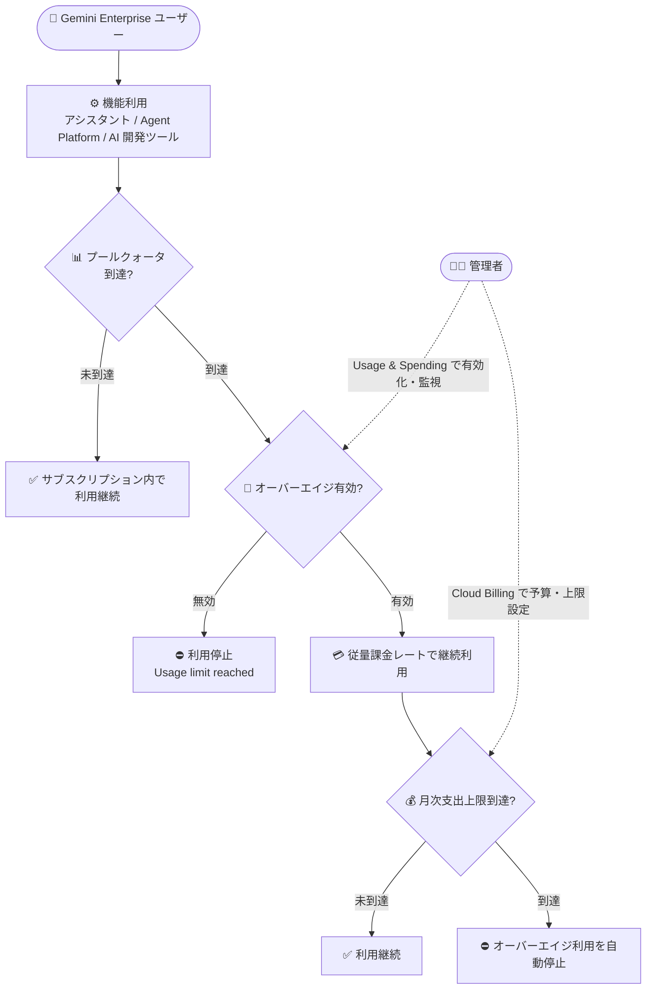

# Gemini Enterprise: オーバーエイジ・支出上限・コスト管理機能 (請求書払いアカウント向け)

**リリース日**: 2026-08-11

**サービス**: Gemini Enterprise

**機能**: 請求書払い (invoiced) Cloud Billing アカウント向けのオーバーエイジ管理・支出上限設定・コスト可視化

**ステータス**: Feature

📊 [このアップデートのインフォグラフィックを見る](https://takech9203.github.io/google-cloud-news-summary/20260811-gemini-enterprise-overages-spend-limits.html)

## 概要

Gemini Enterprise において、請求書払い (invoiced) の Cloud Billing アカウントを持ち、アクティブな非無料トライアルのサブスクリプションが 1 つ以上あるプロジェクトを対象に、管理者向けの新しい課金管理機能が利用可能になりました。具体的には、(1) プールされたクォータ到達後も従量課金レートで機能を継続利用できる「オーバーエイジ (超過利用)」の有効化、(2) Cloud Billing での月次プロジェクト支出上限と予算アラートしきい値の構成、(3) Gemini Enterprise コンソールの Usage & Spending ページと Cloud Billing コンソールでの機能使用量・コストの追跡、の 3 つです。

Gemini Enterprise の Standard / Plus / Standard Emerging Market といったライセンスベースのエディションでは、プロジェクト内の全ユーザーがリソースクォータを共有します (プールクォータ)。従来、プロジェクトが機能のプールクォータに到達すると、その機能の利用は停止していました。今回のアップデートにより、管理者はオーバーエイジを有効化してクォータ超過後も従量課金レートで利用を継続させつつ、支出上限で予期しない課金を防止するという、柔軟なコストガバナンスが可能になります。

なお、この機能は請求書払いの Cloud Billing アカウントにリンクされたプロジェクトにのみ適用されます。また、「[Billing Update] New Gemini Enterprise overage billing controls launching Aug 17, 2026」という件名のメールを受領した場合は対象外です。

**アップデート前の課題**

- プロジェクトが機能のプールクォータに到達すると、その機能の利用が停止し、クォータがリセットされるまで (または次の請求サイクルまで) ユーザーは業務で機能を使えなかった
- クォータ超過後に利用を継続させる場合の支出をプロジェクト単位で制御する仕組みがなく、予期しない課金のリスクを管理しにくかった
- プールクォータの消費状況や従量課金の使用量・コストトレンドを Gemini Enterprise のコンソール上で一元的に確認する手段が限られていた

**アップデート後の改善**

- オーバーエイジを有効化することで、プールクォータ到達後もユーザーが従量課金レートで機能を継続利用できるようになった (Standard / Plus / Standard Emerging Market エディション対応)
- Cloud Billing で月次プロジェクト支出上限と予算アラートしきい値を構成でき、上限到達時にはオーバーエイジ利用が自動停止されるため、予期しない課金を防止できるようになった
- Gemini Enterprise コンソールの Usage & Spending ページで、プールクォータ消費、従量課金 (Pay-as-you-go) 使用量、30 日間の課金トレンドを追跡できるようになった。Cloud Billing コンソールのレポートでも SKU 単位・製品単位の詳細分析が可能

## アーキテクチャ図



プールクォータ到達後の挙動をオーバーエイジ設定と月次支出上限で制御するフローです。管理者は Usage & Spending ページと Cloud Billing で設定・監視を行います。

## サービスアップデートの詳細

### 主要機能

1. **オーバーエイジ (超過利用) の有効化**
   - プロジェクトが機能のプールクォータに到達した後も、従量課金 (pay-as-you-go) のオーバーエイジレートで機能を継続利用可能
   - 対応エディション: Gemini Enterprise Standard、Gemini Enterprise Plus、Gemini Enterprise Standard Emerging Market (Emerging Market エディションは対象顧客のみ利用可能)
   - Gemini Enterprise Pay-as-you-go エディションには適用外 (すべての利用が従量課金のため)
   - コンソールの Usage & Spending ページ > Usage タブ > Feature usage > Overage セクションのトグルで有効化し、エディションごとにチェックボックスで選択

2. **月次支出上限 (spend limit) の設定**
   - オーバーエイジおよび Pay-as-you-go エディション利用に対する月次のプロジェクト支出上限を Cloud Billing の予算機能で構成
   - 上限到達時、Gemini Enterprise はオーバーエイジ利用を自動的に停止し、予期しない課金を防止
   - 予算のスコープ定義では Services リストから Vertex AI (aiplatform.googleapis.com) を選択する (Gemini Enterprise と AI 開発者ツールのオーバーエイジは Vertex AI API 配下で課金されるため)
   - 上限は Gemini Enterprise app、Gemini Enterprise Agent Platform、AI コーディングツール (Antigravity など) に横断的に適用

3. **機能使用量とコストの確認**
   - Usage & Spending ページの Usage タブでプールクォータの消費状況を確認可能
   - Billing タブでは過去 30 日間のオーバーエイジ / Pay-as-you-go 利用コストのサマリー (Gemini Enterprise app、Agent Platform、AI 開発者ツールの内訳と合計、30 日間のコストトレンドチャート) を表示
   - Cloud Billing コンソールのレポートでは、Originating products フィルタやプリセットレポート「Gemini Enterprise costs by SKU」により、サブスクリプション SKU とオーバーエイジ SKU を分離した詳細分析が可能

## 技術仕様

### オーバーエイジとクォータの仕様

| 項目 | 詳細 |
|------|------|
| 対応エディション (オーバーエイジ) | Standard / Plus / Standard Emerging Market (Pay-as-you-go は適用外) |
| 前提条件 | 請求書払い (invoiced) の Cloud Billing アカウント + アクティブな非無料トライアルサブスクリプション 1 つ以上 |
| クォータの共有単位 | プロジェクトおよびロケーション単位で、エディション内のユーザー間でプール |
| クォータリセット (AI 開発者ツール以外) | 毎日、太平洋時間 (PT) の午前 0 時 |
| クォータリセット (AI 開発者ツール) | 毎週月曜、太平洋時間 (PT) の午前 0 時 (ローリング 7 日間ベースで実施) |
| 支出上限の適用範囲 | Gemini Enterprise app / Gemini Enterprise Agent Platform / AI コーディングツール (Antigravity など) |
| 支出上限の予算スコープ | Cloud Billing 予算で Vertex AI (aiplatform.googleapis.com) を選択 |
| 上限到達時の挙動 | オーバーエイジ利用を自動停止 (反映まで数分かかるため、上限を若干超過する可能性あり) |
| Cloud Billing 上のサービス分類 | Vertex AI Search サービス (サービス ID: 74B1-77CF-C302) 配下。Originating products フィルタで Gemini Enterprise のコストを分離可能 |

### 必要なロール・権限

| 操作 | 必要なロール / 権限 |
|------|---------------------|
| オーバーエイジ有効化・支出上限設定 | Gemini Enterprise Administrator (`roles/discoveryengine.agentspaceAdmin`) + アクティブな対象サブスクリプション |
| Usage タブでのクォータ使用量表示 | `monitoring.timeSeries.list` (Administrator ロールに含まれる)、`serviceconsumermanagement.quota.get` |
| Billing タブでのコスト表示 | 上記に加え、対象請求先アカウントに対する Billing Account Viewer (`roles/billing.viewer`) または Billing Account Administrator (`roles/billing.admin`) |

権限が不足している場合、クォータ使用量が 0 と表示されたり、クォータ上限が Unknown と表示されたり、Billing タブ自体が表示されなかったりします。

## 設定方法

### 前提条件

1. 請求書払い (invoiced) の Cloud Billing アカウントにリンクされたプロジェクトであること
2. Gemini Enterprise Standard / Plus / Standard Emerging Market のアクティブな非無料トライアルサブスクリプションが 1 つ以上あること
3. Gemini Enterprise Administrator (`roles/discoveryengine.agentspaceAdmin`) ロールを持っていること
4. 「[Billing Update] New Gemini Enterprise overage billing controls launching Aug 17, 2026」という件名のメールを受領していないこと (受領した場合は本機能の対象外)

### 手順

#### ステップ 1: オーバーエイジを有効化する

1. Google Cloud コンソールで **Gemini Enterprise > Usage & Spending** ページに移動
2. **Usage** タブを選択
3. **Feature usage > Overage** セクションで **Enabled** トグルをオンにする
4. オーバーエイジを有効にするエディション (Standard / Plus / Standard Emerging) のチェックボックスを選択
5. **Save changes** をクリックし、**Overage enabled** ダイアログで **Got it** をクリック

#### ステップ 2: 月次支出上限を設定する

1. **Gemini Enterprise > Usage & Spending** ページの **Usage** タブを開く
2. **Project monthly spend limit** セクションで **Set limit** をクリック
3. Cloud Billing で予算と支出上限 (spend cap) のアクションを構成する。予算のスコープ定義では **Services** リストから **Vertex AI (aiplatform.googleapis.com)** を選択する

**注意**: オーバーエイジを有効化して支出上限を設定しない場合、プールクォータ超過後も無制限に利用が継続し、すべての超過利用に従量課金レートが適用されます。予期しない課金を防ぐため、支出上限の設定が推奨されています。

#### ステップ 3: 使用量とコストを監視する

1. **Usage & Spending** ページの **Usage** タブでプールクォータの消費状況を確認
2. **Billing** タブで過去 30 日間のコスト内訳 (Gemini Enterprise app / Agent Platform / AI 開発者ツール) と 30 日間のコストトレンドを確認
3. 詳細な内訳・請求書・レポートは **View details in Billing** から Cloud Billing コンソールで確認 (プリセットレポート「Gemini Enterprise costs by SKU」も利用可能)

## メリット

### ビジネス面

- **業務の継続性**: プールクォータ到達で機能が突然使えなくなる事態を回避でき、アシスタントやエージェントを業務に組み込んでいるユーザーの生産性低下を防げる
- **コストガバナンス**: 月次支出上限と予算アラートにより、超過利用を許容しつつ支出をプロジェクト単位で統制でき、予期しない課金のリスクを軽減できる
- **コストの透明性**: Usage & Spending ページと Cloud Billing レポート (SKU 単位・製品単位) で、サブスクリプション費用とオーバーエイジ費用を分離して把握でき、予算策定やチャージバックに活用できる

### 技術面

- **管理の一元化**: オーバーエイジの有効化からクォータ消費・コストトレンドの監視まで、Gemini Enterprise コンソールの Usage & Spending ページを起点に完結する
- **Cloud Billing との統合**: 支出上限は Cloud Billing の予算・支出上限 (spend cap) 機能をそのまま利用するため、既存の Billing 運用 (予算アラート、レポート) と整合した管理ができる
- **エディション単位の制御**: Standard / Plus / Standard Emerging のエディションごとにオーバーエイジの有効・無効を選択できる

## デメリット・制約事項

### 制限事項

- 請求書払い (invoiced) の Cloud Billing アカウントにリンクされたプロジェクトのみが対象。また「[Billing Update] New Gemini Enterprise overage billing controls launching Aug 17, 2026」という件名のメールを受領した場合は対象外
- オーバーエイジは Standard / Plus / Standard Emerging Market エディションのみ対応。Pay-as-you-go エディションには適用されない (全利用が従量課金のため)。Standard Emerging Market エディションは対象顧客のみ利用可能
- 支出上限到達によるオーバーエイジ利用の停止には数分かかることがあり、その間に上限を超える課金が発生する可能性がある

### 考慮すべき点

- オーバーエイジを有効化して支出上限を設定しない場合、クォータ超過後の利用は無制限に継続し、すべて従量課金レートで課金される。有効化と支出上限の設定はセットで行うことが推奨される
- ユーザーがクォータまたは支出の上限に到達すると「Usage limit reached」エラーが表示され、対象機能が利用できなくなる (他の機能はクォータが残っていれば利用可能)。機能へのアクセスはクォータのリセット時または次の請求サイクル開始時に自動的に再開される
- ストレージ + データインデクシングのクォータ超過は、オーバーエイジ設定に関係なく自動的にオーバーエイジ課金が発生する (プロジェクト・ロケーション単位の共有プールを超過した分が対象)
- Billing タブに表示されるのはオーバーエイジと Pay-as-you-go 利用のコストであり、ライセンスベースのサブスクリプション費用は含まれない

## ユースケース

### ユースケース 1: 全社導入したアシスタントの利用停止を防ぎつつ支出を統制

**シナリオ**: Gemini Enterprise Standard を全社導入している企業で、月末や繁忙期にアシスタントのクエリがプールクォータに到達し、業務中に機能が使えなくなることがあった。

**実装例**:
```text
1. Usage & Spending ページで Standard エディションのオーバーエイジを有効化
2. Cloud Billing で Vertex AI (aiplatform.googleapis.com) をスコープとする
   月次予算を作成し、支出上限と 50% / 80% / 100% のアラートしきい値を設定
3. Billing タブの 30 日間コストトレンドを定期的にレビュー
```

**効果**: クォータ到達後もアシスタントの利用が従量課金で継続され業務が止まらない一方、支出上限で予算超過を自動的に防止できる。

### ユースケース 2: Antigravity などの AI 開発者ツールのコスト管理

**シナリオ**: 開発チームが Antigravity などの AI コーディングツールを利用しており、週次のプールクォータ (ローリング 7 日間ベース) を超える利用が発生し得る。FinOps チームはツール別のコスト内訳を把握したい。

**効果**: 月次支出上限が AI 開発者ツールにも横断適用されるため超過支出を統制できる。Cloud Billing レポートの Originating products フィルタや「Gemini Enterprise costs by SKU」プリセットレポートで、Gemini Enterprise app / Agent Platform / AI 開発者ツール別のコストを分離して可視化できる。

## 料金

オーバーエイジ料金は機能ごとに従量課金 (pay-as-you-go) レートで課金されます。公式ドキュメントで確認できる主な内容は以下の通りです。

- **ストレージ + データインデクシング**: 1 GiB あたり月額 $5 (保存期間で日割り。例: 30 日の月に超過分 30 GiB を 1 日保存した場合、30 GiB / 30 日 × $5 = $5)
- **アシスタントクエリ、エージェント利用、動画/画像生成、Deep Research、AI 開発者ツール (Antigravity クレジット) など**: [Gemini Enterprise Agent Platform の料金](https://cloud.google.com/gemini-enterprise-agent-platform/generative-ai/pricing) に基づく
- 料金は米ドル (USD) 建て。USD 以外の通貨で支払う場合は [Cloud Platform SKUs](https://cloud.google.com/skus/) に記載の通貨別価格が適用される
- オーバーエイジ課金には、サポートサービスに応じた変動サポート料金が加算される場合がある

機能ごとの詳細なオーバーエイジ料金表は [Quotas and overages](https://docs.cloud.google.com/gemini/enterprise/docs/quotas-and-overages#overages) を参照してください。

## 関連サービス・機能

- **Cloud Billing**: 月次支出上限・予算アラートの構成先。予算スコープは Vertex AI (aiplatform.googleapis.com) を選択する。Billing レポートで SKU 単位・Originating product 単位のコスト分析が可能
- **Gemini Enterprise Agent Platform**: オーバーエイジ課金・支出上限の適用対象。エージェントの構築・デプロイに関する従量課金は Agent Platform の料金に基づく
- **AI 開発者ツール (Antigravity など)**: オーバーエイジ課金・支出上限の適用対象。請求書払いアカウントのみで利用可能で、クォータは週次 (ローリング 7 日間) の共有プールとして適用される
- **Cloud Monitoring / IAM**: Usage & Spending ページの表示には `monitoring.timeSeries.list` と `serviceconsumermanagement.quota.get` の権限が必要 (Gemini Enterprise Administrator ロールに一部含まれる)

## 参考リンク

- 📊 [インフォグラフィック](https://takech9203.github.io/google-cloud-news-summary/20260811-gemini-enterprise-overages-spend-limits.html)
- [公式リリースノート](https://docs.cloud.google.com/release-notes#August_11_2026)
- [オーバーエイジと支出管理の概要](https://docs.cloud.google.com/gemini/enterprise/docs/manage-costs-overview)
- [オーバーエイジと支出上限の構成](https://docs.cloud.google.com/gemini/enterprise/docs/configure-overages)
- [機能使用量の確認](https://docs.cloud.google.com/gemini/enterprise/docs/feature-usage)
- [コストの確認](https://docs.cloud.google.com/gemini/enterprise/docs/view-costs)
- [Cloud Billing レポートでの Gemini Enterprise コスト確認](https://docs.cloud.google.com/billing/docs/how-to/reports/gemini-enterprise-costs)
- [クォータとオーバーエイジ (料金表)](https://docs.cloud.google.com/gemini/enterprise/docs/quotas-and-overages)

## まとめ

このアップデートにより、請求書払いアカウントの Gemini Enterprise 管理者は、プールクォータ到達時の機能停止を回避しつつ、月次支出上限で従量課金の超過支出を統制するという実用的なコストガバナンスを実現できるようになりました。Standard / Plus / Standard Emerging Market エディションを利用中の組織は、オーバーエイジの有効化と支出上限の設定をセットで検討し、Usage & Spending ページと Cloud Billing レポートによる定期的なコスト監視を運用に組み込むことを推奨します。

---

**タグ**: Gemini Enterprise, Cloud Billing, オーバーエイジ, 支出上限, コスト管理, FinOps, クォータ, Agent Platform, Antigravity
