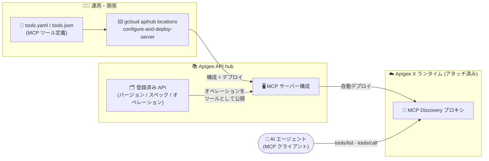

# Apigee API hub: gcloud CLI による MCP サーバーの構成とデプロイ

**リリース日**: 2026-08-12

**サービス**: Apigee API hub

**機能**: `gcloud apihub locations configure-and-deploy-server` コマンドによる MCP サーバーの構成・デプロイ

**ステータス**: Feature (GA)

📊 [このアップデートのインフォグラフィックを見る](https://takech9203.github.io/google-cloud-news-summary/20260812-apigee-api-hub-mcp-server-gcloud-deploy.html)

## 概要

Apigee API hub で、`gcloud apihub locations configure-and-deploy-server` コマンドを使用して、API hub の Model Context Protocol (MCP) サーバーを構成し、アタッチされた Apigee ランタイムにデプロイできるようになりました。MCP ツールはコマンドラインでインラインに定義するか、YAML / JSON 仕様ファイルを参照して定義でき、API hub に登録された API オペレーションを AI エージェント統合向けの MCP ツールとして公開できます。なお、このコマンドは 2026 年 8 月 11 日リリースの Google Cloud CLI 580.0.0 で GA に昇格しています。

API hub の MCP サーバー機能自体は 2026 年 5 月 12 日に Preview として登場し、7 月 24 日に GA となりました。GA と同時に `ConfigureAndDeployServer` RPC が追加され、MCP サーバーを Apigee ランタイムへ直接構成・デプロイできるようになっていましたが、操作手段は Google Cloud コンソールまたは REST API に限られていました。今回のアップデートで gcloud CLI からも同じ操作が可能になり、スクリプト化や CI/CD パイプラインへの組み込みが容易になります。

対象ユーザーは、Apigee で管理する既存 API を AI エージェント (MCP クライアント) から利用可能なツールとして公開したい API プラットフォームチームや、MCP プロキシのデプロイを自動化したい DevOps エンジニアです。

**アップデート前の課題**

- MCP サーバー (MCP プロキシ) の構成とデプロイは、Google Cloud コンソールの GUI 操作、または `servers:configureAndDeployServer` REST API を curl などで直接呼び出す方法に限られていた
- REST API を直接呼び出す場合、認証トークンの取得や JSON リクエストボディの組み立てを自前で行う必要があり、スクリプト化の負担が大きかった
- gcloud ベースの既存の運用フローや CI/CD パイプラインに MCP プロキシのデプロイを自然に組み込む手段がなかった

**アップデート後の改善**

- `gcloud apihub locations configure-and-deploy-server` コマンド 1 つで MCP サーバーの構成と Apigee ランタイムへのデプロイが完結するようになった
- MCP ツールを `--mcp-tools` フラグでインライン定義、または `--mcp-tools-from-file` フラグで YAML / JSON ファイルから一括定義できるようになり、ツール定義のコード管理 (IaC 的な運用) がしやすくなった
- `--async` フラグによる非同期実行に対応し、パイプラインへの組み込みが柔軟になった

## アーキテクチャ図



gcloud コマンドが API hub の MCP サーバー構成を作成し、アタッチされた Apigee X ランタイムへ MCP Discovery プロキシとして自動デプロイします。AI エージェントは MCP の `tools/list` / `tools/call` メソッドで公開されたツールを発見・呼び出しできます。

## サービスアップデートの詳細

### 主要機能

1. **gcloud CLI による MCP サーバーの構成とデプロイ**
   - `gcloud apihub locations configure-and-deploy-server LOCATION` で、指定したロケーションの API hub に MCP サーバーを構成し、Apigee ランタイムへデプロイする
   - 同じターゲット識別子を持つサーバーが既に存在する場合は、新しいリビジョンを作成して上書きする (既存のツールはすべて置き換えられる)
   - 現時点でサポートされるのは Apigee X 上の MCP サーバーのみ

2. **MCP ツールのインライン定義 (`--mcp-tools`)**
   - `tool-id` (ツールの一意な識別子)、`description` (ツールの説明)、`operation` (API hub オペレーションの完全なリソース名) をカンマ区切りで指定
   - フラグを繰り返し指定することで複数のツールを定義可能
   - インライン形式では `operation` (完全リソース名) のみ指定でき、spec + path + method による `http_operation` 形式は表現できない

3. **仕様ファイルによる MCP ツール定義 (`--mcp-tools-from-file`)**
   - YAML または JSON ファイルでツールのリストを定義
   - 各ツールは `tool_id`、`description` と、`operation` (API hub オペレーションのリソース名) または `http_operation` (`spec`、`path`、`method` の組) のいずれか一方を指定
   - `method` は GET / PUT / POST / DELETE / OPTIONS / HEAD / PATCH / TRACE をサポート

4. **Apigee X ターゲットの指定**
   - `--apigee-x-environment`: デプロイ先の Apigee X 環境
   - `--apigee-x-proxy`: Apigee X 上のプロキシリソース名 (例: `mcp-discovery-server`)
   - `--apigee-x-target-project`: Apigee X 組織をホストするランタイムプロジェクト (API hub ホストプロジェクトにアタッチされたランタイムプロジェクトのいずれかであること)
   - `--apigee-x-proxy-display-name` / `--apigee-x-proxy-description`: デプロイされるプロキシリビジョンの表示名・説明 (任意)

## 技術仕様

### コマンド構文

| 項目 | 詳細 |
|------|------|
| コマンド | `gcloud apihub locations configure-and-deploy-server LOCATION` |
| 必須 (ターゲット) | `--apigee-x-environment`、`--apigee-x-proxy`、`--apigee-x-target-project` |
| 必須 (ツール定義・排他) | `--mcp-tools` (繰り返し可) または `--mcp-tools-from-file` のいずれか一方 |
| 任意 | `--apigee-x-proxy-display-name`、`--apigee-x-proxy-description`、`--async` |
| 使用 API | `apihub/v1` (`ConfigureAndDeployServer` RPC) |
| サポート対象 | Apigee X 上の MCP サーバーのみ |
| バリアント | `gcloud alpha apihub locations configure-and-deploy-server` も利用可能 |

### ツール定義ファイルの構造 (`--mcp-tools-from-file`)

```yaml
# tools.yaml の例 (各項目が 1 ツールに対応)
- tool_id: greet
  description: Greet the user
  operation: projects/my-project/locations/us-central1/apis/hello/versions/v1/operations/greet
- tool_id: get_orders
  description: Get orders
  http_operation:
    spec: projects/my-project/locations/us-central1/apis/orders/versions/v1/specs/oas
    path: /orders
    method: GET
```

## 設定方法

### 前提条件

1. Google Cloud プロジェクトに API hub インスタンスがプロビジョニングされていること
2. Apigee ランタイムプロジェクトが API hub にアタッチされ、Apigee プラグインが有効であること (Apigee プラグイン経由でインポートされたプロキシのみ MCP ツールに変換可能)
3. ツールとして公開する API のオペレーションが API hub に登録されていること (Apigee プロキシのバンドルに OpenAPI 仕様ファイルが含まれ、API hub に取り込まれていること)
4. 必要な IAM ロール: `roles/apihub.admin` (API hub の API・仕様の管理) および `roles/apigee.admin` (Apigee でのプロキシのデプロイと管理)

### 手順

#### ステップ 1: 単一ツールをインライン定義してデプロイ

```bash
gcloud apihub locations configure-and-deploy-server us-central1 \
  --project=my-project \
  --mcp-tools='tool-id=greet,description=Greet the user,operation=projects/my-project/locations/us-central1/apis/hello/versions/v1/operations/greet' \
  --apigee-x-environment=eval \
  --apigee-x-proxy=mcp-discovery-server \
  --apigee-x-target-project=my-apigee-project
```

API hub オペレーションの完全リソース名を指定して、MCP サーバーを構成・デプロイします。フラグ値にカンマが含まれる場合は `^|^` などの代替デリミタ構文 (`gcloud topic escaping` 参照) を使用します。

#### ステップ 2: 仕様ファイルから複数ツールをデプロイ

```bash
gcloud apihub locations configure-and-deploy-server us-central1 \
  --project=my-project \
  --mcp-tools-from-file=tools.yaml \
  --apigee-x-environment=eval \
  --apigee-x-proxy=mcp-discovery-server \
  --apigee-x-target-project=my-apigee-project
```

spec + path + method (`http_operation`) 形式でオペレーションを参照するツールを含める場合は、この仕様ファイル形式が必須です。長時間かかる場合は `--async` を付けて非同期実行できます。

## メリット

### ビジネス面

- **API 資産のエージェント活用を加速**: API hub に登録済みの API 資産を、コマンド 1 つで AI エージェントから利用可能な MCP ツールとして公開でき、エージェント統合の立ち上げが早くなる
- **運用の標準化**: コンソール操作に依存せず、ツール定義ファイル (YAML / JSON) をリポジトリ管理することで、MCP プロキシ構成の変更履歴・レビュープロセスを既存の開発フローに統合できる

### 技術面

- **自動化・CI/CD 対応**: gcloud ベースのため、Cloud Build や GitHub Actions などのパイプラインから MCP サーバーのデプロイを自動化しやすい。`--async` による非同期実行にも対応
- **宣言的なツール管理**: `--mcp-tools-from-file` により、公開する MCP ツール一式をファイルで宣言的に管理し、デプロイのたびに全ツールを置き換える (リビジョン作成) 運用ができる
- **REST API 直接呼び出しの排除**: 認証ヘッダーや JSON ボディの組み立てが不要になり、`configureAndDeployServer` REST API を curl で呼び出すのと同等の操作をシンプルなコマンドで実行できる

## デメリット・制約事項

### 制限事項

- 現時点でサポートされるのは Apigee X 上の MCP サーバーのみ (gcloud コマンドリファレンスに明記)。MCP in Apigee 自体も Apigee hybrid 組織では利用不可
- 同じターゲット識別子のサーバーが存在する場合は新リビジョンで上書きされ、既存ツールはすべて置き換えられる (追記ではない)
- `--mcp-tools` インライン形式では `http_operation` (spec + path + method) 形式のオペレーション参照を表現できず、その場合は `--mcp-tools-from-file` が必要
- MCP in Apigee の一般的な制限として、Apigee 組織あたりの MCP ツール数は 1,000 に制限され、サポートされる OpenAPI バージョンは 3.0.0〜3.0.3

### 考慮すべき点

- API hub では環境グループごとに 1 つの MCP プロキシ (単一環境へのデプロイ) のみサポートされる。複数デプロイはエラーの原因になる
- 一部リージョン (europe-central2、europe-southwest1、europe-west9、me-central2) では MCP インフラのデプロイが容量制限の影響を受ける場合がある
- Apigee プロキシの仕様ファイル内のパスは basepath を含まない相対パスである必要があり、一致しないと API hub でのマッピングに失敗する

## ユースケース

### ユースケース 1: CI/CD パイプラインでの MCP ツール公開の自動化

**シナリオ**: API プラットフォームチームが、API hub に登録された社内 API のうちエージェントに公開するオペレーションを `tools.yaml` で管理し、プルリクエストのマージを契機に MCP プロキシを自動デプロイしたい。

**実装例**:
```yaml
# Cloud Build (cloudbuild.yaml) のステップ例
steps:
  - name: gcr.io/google.com/cloudsdktool/cloud-sdk
    entrypoint: gcloud
    args:
      - apihub
      - locations
      - configure-and-deploy-server
      - us-central1
      - --project=my-project
      - --mcp-tools-from-file=tools.yaml
      - --apigee-x-environment=prod
      - --apigee-x-proxy=mcp-discovery-server
      - --apigee-x-target-project=my-apigee-project
```

**効果**: ツール定義の変更がコードレビューを経て自動反映され、コンソール操作によるヒューマンエラーを排除できる。

### ユースケース 2: 既存 API のエージェント統合の迅速な立ち上げ

**シナリオ**: Apigee で運用中の注文管理 API を、社内の AI エージェントから MCP ツールとして呼び出せるようにしたい。OpenAPI 仕様の spec + path + method でオペレーションを指定する。

**効果**: 既存の API プロキシに手を入れることなく、API hub のカタログ情報を基に MCP Discovery プロキシが Apigee 環境へ自動デプロイされ、エージェントは `tools/list` / `tools/call` で即座にツールを利用できる。

## 料金

API hub 自体は無料のサービスです (API hub のプロビジョニングで Apigee API が有効化されても、それ自体に追加の料金は発生しません)。

ただし、MCP プロキシは Apigee ランタイムにデプロイされるため、Apigee 側の料金 (Pay-as-you-go の場合、アクティブ環境の時間課金、API 呼び出し数、プロキシデプロイユニットなど) が適用されます。詳細は Apigee の料金体系を確認してください。

- [Apigee Pay-as-you-go 料金の概要](https://docs.cloud.google.com/apigee/docs/api-platform/reference/pay-as-you-go-updated-overview)
- [Apigee 料金ページ](https://cloud.google.com/apigee/pricing)

## 関連サービス・機能

- **Apigee X**: MCP Discovery プロキシのデプロイ先ランタイム。MCP エンドポイントは OAuth 2.1 / OIDC 認証、きめ細かい認可ポリシー、Apigee Analytics によるツール単位の利用分析をサポートする
- **API hub MCP サーバー (apihub.googleapis.com/mcp)**: API hub 自体の管理オペレーション (API・バージョン・スペック・デプロイの CRUD) を MCP ツールとして提供する GA 機能。AI エージェントから MCP Discovery プロキシの構成・デプロイも可能
- **Model Armor**: MCP ツール呼び出しをプロンプトインジェクションなどの攻撃から保護する統合が利用可能
- **Cloud Trace**: リモート MCP サーバーの `tools/call` オペレーションに対するトレーススパンの自動生成により、エージェントアプリケーションの挙動を分析できる (同日の別アップデート)

## 参考リンク

- 📊 [インフォグラフィック](https://takech9203.github.io/google-cloud-news-summary/20260812-apigee-api-hub-mcp-server-gcloud-deploy.html)
- [公式リリースノート](https://docs.cloud.google.com/release-notes#August_12_2026)
- [gcloud apihub locations configure-and-deploy-server リファレンス](https://docs.cloud.google.com/sdk/gcloud/reference/apihub/locations/configure-and-deploy-server)
- [MCP プロキシの管理 (API hub)](https://docs.cloud.google.com/apigee/docs/apihub/manage-mcp-proxies)
- [ConfigureAndDeployServer REST API リファレンス](https://docs.cloud.google.com/apigee/docs/reference/apis/apihub/rest/v1/projects.locations.servers/configureAndDeployServer)
- [MCP in Apigee の概要](https://docs.cloud.google.com/apigee/docs/api-platform/apigee-mcp/apigee-mcp-overview)
- [API hub リリースノート](https://docs.cloud.google.com/apigee/docs/apihub/release-notes)
- [Apigee 料金ページ](https://cloud.google.com/apigee/pricing)

## まとめ

API hub の MCP サーバー構成・デプロイが gcloud CLI に対応したことで、AI エージェント向けのツール公開をコンソール操作から脱却させ、コード管理された宣言的なワークフローとして運用できるようになりました。Apigee X と API hub を利用してエージェント統合を進めているチームは、ツール定義を YAML / JSON ファイルとしてリポジトリ管理し、CI/CD パイプラインからの自動デプロイへの移行を検討することを推奨します。

---

**タグ**: #ApigeeAPIhub #Apigee #MCP #ModelContextProtocol #gcloud #AIエージェント #APIマネジメント
