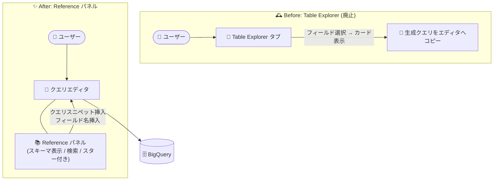

# BigQuery: Table Explorer 廃止 - 機能は Reference パネルへ移行

**リリース日**: 2026-08-12

**サービス**: BigQuery

**機能**: Table Explorer の廃止と Reference パネルへの移行

**ステータス**: Announcement (Deprecation)

📊 [このアップデートのインフォグラフィックを見る](https://takech9203.github.io/google-cloud-news-summary/20260812-bigquery-table-explorer-deprecation-reference-panel.html)

## 概要

BigQuery の Table Explorer (テーブルエクスプローラ) が廃止 (deprecated) され、その機能は Google Cloud コンソールのクエリエディタに統合された Reference パネルへ移行しました。2026 年 6 月に「2026 年 7 月以降に移行する」と予告されていた変更が、今回正式に実施された形です。

Table Explorer は、テーブルのフィールドを選択して一般的な値をカード形式で表示し、選択に基づいてデータ探索クエリを自動生成する機能でした。今後は Reference パネルが、テーブル、スナップショット、ビュー、マテリアライズドビューに関するコンテキストアウェアな情報をクエリエディタ内で動的に表示し、スキーマのプレビューやクエリスニペット・フィールド名の挿入によるクエリ構築を担います。

BigQuery Studio でデータ探索やアドホックなクエリ作成を行うデータアナリスト、データエンジニアが対象です。Table Explorer タブを利用したワークフローを持つチームは、Reference パネルベースの操作への移行が必要になります。

**アップデート前の課題**

- Table Explorer は別タブでの操作が必要で、クエリエディタとテーブル情報の参照を行き来する必要があった
- Table Explorer は一度に 1 テーブルのみ探索可能で、複数テーブルの同時参照や JOIN を含むクエリの構築には対応していなかった
- フィールドの一般値を表示するたびにクエリが実行され、コンピューティング料金が発生していた

**アップデート後の改善**

- Reference パネルがクエリエディタ内でテーブル、スナップショット、ビュー、マテリアライズドビューの情報を動的に表示し、クエリ作成とテーブル参照を同一画面で行えるようになった
- 最近使用したテーブルやスター付きテーブルへのアクセス、検索バーによるテーブル・ビューの検索が可能になった
- クエリスニペットの挿入やフィールド名のクリック挿入により、新規クエリの構築と既存クエリの編集を直接支援するようになった

## アーキテクチャ図



Table Explorer では別タブでの探索とクエリのコピーが必要でしたが、Reference パネルではクエリエディタと同一画面でテーブル情報の参照とクエリ構築が完結します。

## サービスアップデートの詳細

### 主要機能

1. **Table Explorer の廃止**
   - テーブルのフィールドを選択して一般値をカード表示し、データ探索クエリを自動生成する Table Explorer が廃止された
   - 2026 年 6 月時点の事前アナウンス (「2026 年 7 月以降に移行」) に沿った移行の完了

2. **Reference パネルによる代替**
   - クエリエディタ内でテーブル、スナップショット、ビュー、マテリアライズドビューのコンテキストアウェアな情報を動的に表示
   - スキーマ詳細のプレビュー、または新しいタブでのリソースの表示が可能
   - 最近使用したテーブル・スター付きテーブルの一覧表示と、検索バーによるテーブル・ビューの検索に対応

3. **クエリ構築の支援**
   - 「View actions」メニューからクエリスニペットをエディタに挿入可能
   - エディタ内のカーソル位置にフィールド名をクリックで直接挿入でき、新規クエリの作成と既存クエリの編集の両方を支援

## 技術仕様

### Reference パネルの基本操作

| 操作 | 手順 |
|------|------|
| パネルを開く | クエリエディタで「SQL クエリ」を作成し、「Reference」アイコンをクリック |
| テーブルの選択 | 最近使用 / スター付きテーブルをクリック、または検索バーで検索 |
| クエリスニペット挿入 | 「View actions」>「Insert query snippet」 |
| フィールド名の挿入 | エディタ内の挿入位置をクリックし、パネル内のフィールド名をクリック |
| スキーマ確認 | パネル内でスキーマ詳細をプレビュー、または新しいタブで開く |

## メリット

### ビジネス面

- **UI の一貫性向上**: テーブル参照とクエリ作成が同一画面に統合され、コンソール操作の学習コストとコンテキストスイッチが減少する
- **探索作業の効率化**: 検索バーやスター付きテーブルからの素早いアクセスにより、アドホック分析の着手が速くなる

### 技術面

- **クエリエディタとの統合**: フィールド名やクエリスニペットをエディタに直接挿入でき、コピー & ペーストの手間が不要になる
- **幅広いリソースへの対応**: テーブルに加えてスナップショット、ビュー、マテリアライズドビューの情報も動的に表示される

## デメリット・制約事項

### 制限事項

- Table Explorer が提供していた「フィールドの一般値 (上位 10 件) をカード表示し、値の選択からデータ探索クエリを自動生成する」対話的な探索 UI は、Reference パネルでは同じ形式では提供されない
- 廃止された Table Explorer タブに依存した既存のワークフローや手順書は更新が必要

### 考慮すべき点

- データの中身 (値の分布など) の探索が必要な場合は、データインサイト生成、データキャンバス、Gemini Cloud Assist など他の機能の利用を検討する
- チーム内の運用ドキュメントやトレーニング資料に Table Explorer の記載がある場合は、Reference パネルベースの手順に改訂する

## ユースケース

### ユースケース 1: 既存 Table Explorer ワークフローの移行

**シナリオ**: データアナリストチームが、テーブルのスキーマ確認と探索クエリ作成に Table Explorer タブを日常的に使用していた。

**実装例**:
```
1. BigQuery Studio でクエリエディタを開き「Reference」アイコンをクリック
2. 検索バーで対象テーブルを検索、または最近使用 / スター付きから選択
3. スキーマ詳細をプレビューして対象フィールドを確認
4. 「Insert query snippet」でひな形クエリを挿入し、フィールド名をクリック挿入して条件を組み立てる
```

**効果**: 別タブへの移動なしに、クエリエディタ内でスキーマ確認からクエリ構築までを完結できる

### ユースケース 2: 複数テーブルを参照するクエリの構築

**シナリオ**: 複数のテーブルやビューを JOIN するクエリを書く際に、各リソースのスキーマを確認しながらフィールド名を正確に入力したい。

**効果**: Reference パネルで各テーブルのスキーマを切り替えながら参照し、フィールド名をクリック挿入することでタイプミスを防ぎ、クエリ作成を高速化できる

## 料金

Reference パネル自体の利用に追加料金はありません。パネルから構築・実行したクエリには、通常どおり BigQuery のコンピューティング料金 (オンデマンドまたは容量ベース) が適用されます。

なお、廃止された Table Explorer はフィールドの一般値表示のたびにクエリを実行し料金が発生する仕様でした。詳細は [BigQuery の料金ページ](https://cloud.google.com/bigquery/pricing) を参照してください。

## 関連サービス・機能

- **BigQuery データインサイト**: テーブルデータに対する洞察を自動生成する機能。データの中身の探索用途で Table Explorer の代替の一つとなる
- **BigQuery データキャンバス**: 自然言語の質問でクエリ結果を反復的に探索できる機能
- **Gemini Cloud Assist / Gemini in BigQuery**: SQL の生成・補完・説明など AI 支援によるクエリ作成を提供

## 参考リンク

- 📊 [インフォグラフィック](https://takech9203.github.io/google-cloud-news-summary/20260812-bigquery-table-explorer-deprecation-reference-panel.html)
- [公式リリースノート](https://docs.cloud.google.com/release-notes#August_12_2026)
- [ドキュメント: Use the Reference panel (Run a query)](https://docs.cloud.google.com/bigquery/docs/running-queries#use-reference-panel)
- [ドキュメント: Create queries with table explorer (廃止対象)](https://docs.cloud.google.com/bigquery/docs/table-explorer)
- [料金ページ](https://cloud.google.com/bigquery/pricing)

## まとめ

BigQuery の Table Explorer が正式に廃止され、テーブル情報の参照とクエリ構築の機能はクエリエディタ統合の Reference パネルに一本化されました。Table Explorer を利用していたチームは、Reference パネルの操作手順への移行と社内ドキュメントの更新を進めるとともに、値の分布探索などの用途にはデータインサイトやデータキャンバスの活用を検討してください。

---

**タグ**: #BigQuery #TableExplorer #ReferencePanel #Deprecation #BigQueryStudio #GoogleCloudConsole
