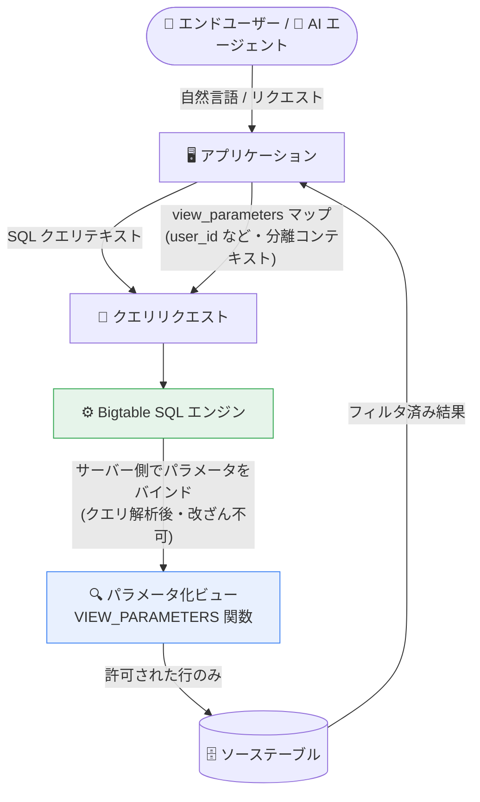

# Bigtable: パラメータ化ビュー (Parameterized Views) が GA に

**リリース日**: 2026-08-12

**サービス**: Bigtable

**機能**: パラメータ化ビュー (Parameterized Views)

**ステータス**: GA (一般提供)

📊 [このアップデートのインフォグラフィックを見る](https://takech9203.github.io/google-cloud-news-summary/20260812-bigtable-parameterized-views-ga.html)

## 概要

Bigtable のパラメータ化ビュー (Parameterized Views) が一般提供 (GA) になりました。パラメータ化ビューは、論理ビュー (logical view) に対してアプリケーションコンテキスト (ユーザー ID やテナント ID など) に基づくデータ範囲の動的なフィルタリングを可能にする機能です。SQL クエリテキストとは分離された「ビューパラメータ」という独立したコンテキストで値を渡し、サーバー側でバインドすることで、SQL インジェクションのリスクを軽減します。

従来、ユーザーごと・テナントごとにデータを絞り込むには、クライアント側でクエリ文字列にフィルタ値を埋め込むか、ユーザーごとに静的なビューを多数作成する必要がありました。パラメータ化ビューでは、`VIEW_PARAMETERS()` 関数をビュー定義内で使用し、クエリ実行時にリクエストの `view_parameters` マップから値をサーバー側で安全にバインドします。値はクエリテキストの外側で受け渡されるため、エンドユーザーや LLM が生成したクエリからパラメータを改ざん・無効化することはできません。

自然言語からの SQL 生成 (NL2SQL) を行う AI エージェントアプリケーションや、マルチテナント SaaS でユーザー単位のデータスコーピングをデータベースレベルで強制したい開発者に特に有用なアップデートです。

**アップデート前の課題**

- クライアント側でフィルタ値をクエリテキストに埋め込む方式では、クエリの改ざんによる SQL インジェクションのリスクがあった
- ユーザーやテナントごとにデータ範囲を絞るには、多数の静的なビューを個別に作成・管理する必要があった
- LLM が生成した SQL やエンドユーザーの自由入力クエリに対して、データベースレベルで行アクセス範囲を強制する手段が限られていた

**アップデート後の改善**

- ビューパラメータをクエリテキストから分離されたコンテキストとして渡し、サーバー側でクエリ構造の解析後にバインドするため、攻撃者が制御する値でクエリ構造を変更できず SQL インジェクションを防止できる
- 単一のパラメータ化ビューでアプリケーションコンテキストに応じた動的フィルタリングが可能になり、静的ビューの乱立が不要になった
- ユーザーごとに個別のデータベースロールを用意せず、単一のロールで全エンドユーザーにサービスを提供でき、ユーザー管理が簡素化された
- パラメータ値が未指定の場合はクエリが即座に失敗する「フェイルクローズド」動作により、設定ミスによる意図しないデータ露出を防止できる

## アーキテクチャ図



ビューパラメータ (ユーザー ID など) は SQL クエリテキストとは別の分離されたコンテキストとしてリクエストに含まれ、Bigtable がサーバー側でバインドします。クエリ自体はこのコンテキストを読み取り・変更できないため、ユーザーや AI エージェントによるフィルタの回避が不可能です。

## サービスアップデートの詳細

### 主要機能

1. **`VIEW_PARAMETERS()` 関数によるビュー定義**
   - ビュー定義の SQL 内で `VIEW_PARAMETERS('key')` を呼び出し、リクエスト時に渡されるパラメータ値を参照できる
   - `WHERE` 句での行フィルタリングに加え、列修飾子 (column qualifier) のパラメータ化にも使用でき、アプリケーションコンテキストに応じて返すフィールドを動的に切り替えられる

2. **サーバーサイドのパラメータバインディング**
   - パラメータ値はクエリ構造の解析後にサーバー側でバインドされるため、攻撃者が制御する値がクエリ構造を変更できない
   - 値は LLM やエンドユーザーの制御外にある分離コンテキストとして渡される (パラメータアイソレーション)

3. **フェイルクローズド動作**
   - `VIEW_PARAMETERS('key')` を参照するビューへのクエリで、対応する値がリクエストの `view_parameters` マップに含まれていない場合、クエリは即座に「missing parameter」エラーで失敗する
   - 設定の適用ミスによる偶発的なデータ露出を防止する

4. **構造化行キー (structured row key) との連携**
   - テーブルが構造化行キーを使用している場合、行キーの特定セグメント (例: `user_id#timestamp#order_id` の `user_id` 部分) に対してパラメータでフィルタリングできる

## 技術仕様

### パラメータ化ビューの特性

| 項目 | 詳細 |
|------|------|
| 作成元 | 論理ビュー (logical view) からのみ作成可能。既存の論理ビューの変更ではなく、新規に作成する |
| 作成方法 | Google Cloud CLI (`gcloud bigtable logical-views create`) |
| パラメータの型 | STRING 型のみサポート。他の型が必要な場合はビュー定義内で `CAST(VIEW_PARAMETERS('name') AS INT64)` のようにキャストする |
| パラメータの渡し方 | クエリリクエストの `view_parameters` マップで指定 (クエリテキストとは分離) |
| 未指定時の動作 | フェイルクローズド (missing parameter エラーでクエリが失敗) |
| 標準クエリパラメータとの違い | `@param` 構文はビュー定義内で宣言できないが、`VIEW_PARAMETERS('key')` はクエリ・ビューの両方のコンテキストで呼び出せる |
| ビュー ID | 最大 128 文字。インスタンス内のテーブル ID・ビュー ID 間で一意であること |

### 必要な権限

インスタンスレベルで Bigtable 管理者ロール (`roles/bigtable.admin`)、または以下の個別権限が必要です。

| 操作 | 権限 |
|------|------|
| 作成 | `bigtable.logicalViews.create` |
| 更新 | `bigtable.logicalViews.update` |
| 削除 | `bigtable.logicalViews.delete` |
| 一覧表示 | `bigtable.logicalViews.list` |
| ソーステーブルの読み取り | `bigtable.tables.readRows` (作成時に必要) |

### ビュー定義の例

```sql
-- 患者 ID でスコープする医療記録ビュー
CREATE VIEW patient_health_pv AS
(SELECT * FROM patient_health_records
 WHERE patient_id = CAST(VIEW_PARAMETERS('patient_id') AS BYTES))
```

```sql
-- 列修飾子をパラメータ化するビュー
CREATE VIEW specific_test_result_pv AS
SELECT
  tests[VIEW_PARAMETERS('test_name')] AS reading,
  _timestamp AS reading_time
FROM patients
```

## 設定方法

### 前提条件

1. Google Cloud CLI をインストールし、`gcloud init` で初期化済みであること (Cloud Shell でも実行可能)
2. インスタンスに対する `roles/bigtable.admin` ロールまたは上記の個別権限を保有していること

### 手順

#### ステップ 1: パラメータ化ビューを作成する

```bash
gcloud bigtable logical-views create VIEW \
  --instance=INSTANCE \
  --query="SELECT * FROM TABLE_ID WHERE STARTS_WITH(_key, CAST(VIEW_PARAMETERS('user_id') AS BYTES))"
```

`VIEW` はビュー ID (最大 128 文字)、`INSTANCE` はインスタンス ID、`TABLE_ID` はソーステーブル ID に置き換えます。誤削除を防ぐには `--deletion-protection` フラグを追加します。

#### ステップ 2: view_parameters マップを指定してクエリする

```java
// ビュー定義: SELECT * FROM purchases WHERE user_id = CAST(VIEW_PARAMETERS('user_id') AS BYTES)
String query = "SELECT customer_info[email], order_details[status] FROM purchase_history_pv";
PreparedStatement preparedStatement = dataClient.prepareStatement(query);
BoundStatement boundStatement = preparedStatement.bind().build();

// ユーザー ID はクエリ外 (アウトオブバンド) の view_parameters マップで渡す
Map<String, Value> viewParameters = new HashMap<>();
viewParameters.put("user_id",
    Value.newBuilder().setType(stringType()).setStringValue(userId).build());

ResultSet rs = dataClient.executeQuery(boundStatement, viewParameters);
```

クエリテキスト内に `user_id` は一切現れないため、ユーザーがパラメータを参照・操作することはできません。

## メリット

### ビジネス面

- **セキュリティリスクの低減**: SQL インジェクションやプロンプトインジェクション経由のデータ漏えいリスクをデータベースレベルで軽減し、マルチテナント環境や医療・金融などの機密データを扱うアプリケーションのコンプライアンス対応を支援
- **運用コストの削減**: ユーザー・テナントごとの静的ビューや個別データベースロールの作成・管理が不要になり、運用負荷を削減
- **AI エージェント活用の促進**: NL2SQL などの自由形式クエリを安全に実行できる基盤が整い、エージェンティックなアプリケーション開発を加速

### 技術面

- **ディープティア ID 伝播**: ユーザーレベルのきめ細かいデータ権限をデータベース層で強制し、ユーザー/テナントが自身の境界内の行のみ取得できることを保証
- **サーバーサイドバインディング**: クエリ構造解析後にパラメータをバインドするため、攻撃者制御の値がクエリ構造を変更できない
- **フェイルクローズド設計**: パラメータ未指定時はエラーで失敗するため、設定ミスがデータ露出につながらない
- **動的な列選択**: 列修飾子のパラメータ化により、単一ビューでコンテキストに応じたフィールド返却が可能

## デメリット・制約事項

### 制限事項

- パラメータ化ビューは論理ビューからのみ作成可能。既存の論理ビューを変更するのではなく、gcloud CLI で新規に作成する必要がある
- ビューパラメータは STRING 型の値のみサポート。他のデータ型はビュー定義内で `CAST()` する必要がある

### 考慮すべき点

- 信頼できないユーザーや LLM がパラメータ化ビューを参照する SQL を生成する場合は、多層防御として Model Armor や Agent Development Kit (ADK) の関数ツールによる定義済みクエリテンプレートなど、追加のセキュリティ対策を併用することが公式に推奨されている
- パラメータ化ビューの作成・管理は現時点で Google Cloud CLI が案内されており、既存の論理ビュー運用フローとの統合を検討する必要がある

## ユースケース

### ユースケース 1: 医療データアプリケーションでの患者単位のデータ分離

**シナリオ**: 患者の医療記録 (コレステロール値などの検査結果) を保存するヘルストラッキングアプリで、患者が自身のデータを自然言語で照会する。悪意のある、または挙動の不安定な AI エージェントが他の患者の記録を取得するクエリを生成するリスクがある。

**実装例**:
```sql
CREATE VIEW patient_health_pv AS
(SELECT * FROM patient_health_records
 WHERE patient_id = CAST(VIEW_PARAMETERS('patient_id') AS BYTES))
```

```sql
-- クライアントが発行するクエリ (patient_id はクエリに含まれない)
SELECT readings['value'], readings['date']
FROM patient_health_pv
WHERE readings['test_name'] = 'cholesterol'
```

**効果**: `patient_id` は分離されたパラメータマップからサーバー側で自動的にバインドされるため、LLM やエンドユーザーがこのフィルタを変更・破棄できず、患者単位の分離がデータベースレベルで保証される。

### ユースケース 2: マルチテナント SaaS でのテナントスコーピングとロール集約

**シナリオ**: 複数テナントのデータを単一の Bigtable テーブルに格納する SaaS で、テナントごとにビューやロールを作成・管理する運用が煩雑になっている。

**効果**: テナント ID をビューパラメータとする単一のパラメータ化ビューと単一のデータベースロールで全テナントに対応でき、ビュー・ロールの乱立を解消しつつ、テナント境界をデータベースレベルで強制できる。

### ユースケース 3: NL2SQL を用いる AI エージェントアプリケーション

**シナリオ**: 「私の注文を表示して」のような自然言語入力から LLM が SQL を生成するアプリケーションで、プロンプトインジェクションや過剰に広いスコープのクエリ生成によるデータ露出が懸念される。

**効果**: ユーザー ID を分離コンテキストで渡すことで、クエリの表現方法にかかわらずアクセス可能な行がユーザー自身のデータに制限される。Model Armor や ADK の関数ツールと組み合わせることで多層防御を構成できる。

## 料金

パラメータ化ビューの利用自体に固有の追加料金は Release Notes およびドキュメントに記載されていません。パラメータ化ビューは論理ビュー (仮想テーブル) から作成されるため、クエリは通常の Bigtable の料金体系 (ノードのコンピュート、ストレージ、ネットワーク) に従って課金されます。詳細は料金ページを参照してください。

- [Bigtable の料金](https://cloud.google.com/bigtable/pricing)

## 利用可能リージョン

リージョンごとの提供状況は Release Notes に明記されていません。最新の情報は公式ドキュメントを参照してください。

## 関連サービス・機能

- **Bigtable 論理ビュー (Logical Views)**: パラメータ化ビューの作成元。SQL クエリの結果を仮想テーブルとして扱う機能
- **Bigtable 継続的マテリアライズドビュー / 承認済みビュー**: 同じく Bigtable のビュー機能。承認済みビューは読み取り/書き込みアクセス制御、マテリアライズドビューはクエリ性能最適化が主目的で、パラメータ化ビューは動的データスコーピングを担う
- **Model Armor**: LLM 生成クエリに対する多層防御として公式に推奨されるセキュリティサービス
- **Agent Development Kit (ADK)**: 関数ツールによる定義済みクエリテンプレートで、エージェンティックアプリケーションの防御を強化
- **AlloyDB / Cloud SQL のパラメータ化セキュアビュー**: PostgreSQL / MySQL 系サービスにおける類似機能。Google Cloud 全体でデータベースレベルのデータスコーピング機能が拡充されている

## 参考リンク

- 📊 [インフォグラフィック](https://takech9203.github.io/google-cloud-news-summary/20260812-bigtable-parameterized-views-ga.html)
- [公式リリースノート](https://docs.cloud.google.com/release-notes#August_12_2026)
- [Parameterized views overview](https://docs.cloud.google.com/bigtable/docs/parameterized-views-overview)
- [Create and manage parameterized views](https://docs.cloud.google.com/bigtable/docs/create-manage-parameterized-views)
- [Tables and views](https://docs.cloud.google.com/bigtable/docs/tables-and-views)
- [Bigtable の料金](https://cloud.google.com/bigtable/pricing)

## まとめ

Bigtable のパラメータ化ビューの GA により、ユーザー・テナント単位のデータスコーピングをデータベースレベルで強制し、SQL インジェクションをサーバーサイドのパラメータバインディングで防止できるようになりました。NL2SQL を扱う AI エージェントアプリケーションやマルチテナント SaaS を Bigtable 上で運用しているチームは、クライアント側でのフィルタ値埋め込みや静的ビューの乱立を見直し、パラメータ化ビューへの移行を検討することを推奨します。信頼できないクエリ生成元がある場合は、Model Armor や ADK と組み合わせた多層防御の構成も併せて検討してください。

---

**タグ**: `Bigtable`, `パラメータ化ビュー`, `論理ビュー`, `SQLインジェクション対策`, `データスコーピング`, `NL2SQL`, `AIエージェント`, `GA`, `セキュリティ`
