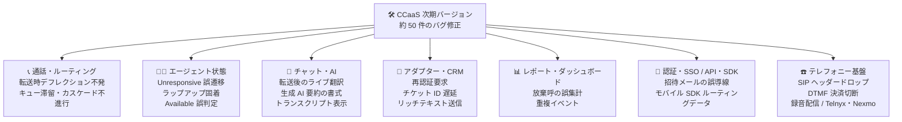

# Google Cloud Contact Center as a Service (CCaaS): 次期バージョンのプレリリースノート — 約 50 件の大規模バグ修正

**リリース日**: 2026-08-12

**サービス**: Google Cloud Contact Center as a Service (CCaaS) / CCAI Platform

**機能**: 次期バージョンの大規模バグ修正一覧 (プレリリースノート)

**ステータス**: Announcement (プレリリース) + Fixed

📊 [このアップデートのインフォグラフィックを見る](https://takech9203.github.io/google-cloud-news-summary/20260812-ccaas-prerelease-bug-fixes.html)

## 概要

Google Cloud CCaaS (CCAI Platform) の次期バージョンのプレリリースノートが更新されました。今回のリリースノートの中心は、通話ルーティング、エージェント状態管理、チャット、アダプター/CRM 連携、レポート、認証/SSO、API/SDK と、プラットフォームのほぼ全域にまたがる大規模なバグ修正一覧 (約 50 件) です。「エージェントが Unresponsive やラップアップ状態から抜けられない」「Web チャットや予測型キャンペーン通話がキューに滞留したまま割り当てられない」「Answer ボタンが表示されず通話を受けられない」といった、コンタクトセンターの運用に直接影響する既知の問題が幅広く解消されます。

新機能としては、Agent desktop のカスタムパネル URL への固定/動的パラメータのサポートと、コールバック提供の制限 (「Restrict callback offer outside of callback window」「Restrict callback offer that will exceed hours of operation」の 2 つの管理者向けチェックボックス) が含まれますが、これらは [2026-08-07 のプレリリースノート](2026-08-07-ccaas-prerelease-custom-panels-callback-restrictions.md)で既報のため、本レポートではバグ修正を中心に解説します。

CCAI Platform を運用するコンタクトセンターの管理者・スーパーバイザー、および CRM 連携や SDK 組み込みを担当する開発チームにとって、既知問題のワークアラウンドを見直すための重要な情報です。プレリリースノートのため、実際のリリース時に内容が変わる可能性がある点に留意してください。

**アップデート前の課題**

- リアルタイム秘匿化 (redaction) 有効時のチャット転送で、トランスクリプトにエージェント名ではなく `undefined joined` と表示されるなど、記録・監査に影響する表示不具合があった
- エージェントが通話応答後に誤って Unresponsive 状態になる、異常終了後にラップアップ状態から抜けられない、アウトバウンド通話中も Available のままで新規着信が割り当てられるなど、エージェント状態と実際の稼働が一致しない問題が多発していた
- 転送時に過負荷デフレクションがトリガーされず顧客が無期限に待たされる、Web チャットや予測型キャンペーン通話がキューに滞留する、コールバックが Queued/Connected 状態のまま固まるなど、ルーティングの信頼性に関わる問題があった
- DTMF 入力による決済中の通話切断、カスタム SIP ヘッダーのドロップ、通話録音が配信・処理されないなど、テレフォニー基盤の問題が存在した

**アップデート後の改善**

- エージェント状態 (Unresponsive、ラップアップ、Available の誤判定) に関する一連の問題が修正され、ルーティングエンジンが実際の稼働状況に基づいて着信を割り当てられるようになる
- キュー滞留 (Web チャット、予測型キャンペーン、コールバック、IVR 着信) と転送時のデフレクション不発が解消され、顧客が放置されるリスクが低減する
- チャット/メールアダプターの再認証要求、メールアダプターの文字消失、CRM チケット ID 取得遅延などが修正され、エージェントの作業効率が改善する
- Telnyx/Nexmo のエラーハンドリング、SIP ヘッダー、通話録音配信、iOS/Android SDK のルーティングデータ受け渡しなど、基盤・連携面の信頼性が向上する

## アーキテクチャ図

次期バージョンで修正される約 50 件の問題を領域別に整理した図です。エージェント状態・ルーティング・アダプターなどプラットフォームのほぼ全域が対象です。

## サービスアップデートの詳細

### 主要機能

1. **プレリリース新機能 (既報、2026-08-07 参照)**
   - **カスタムパネル URL のパラメータサポート**: Agent desktop のカスタムパネル URL に固定/動的パラメータを構成でき、セッション・エージェント・顧客のコンテキストを外部パネルへ渡せるようになる
   - **コールバック提供の制限**: 「Restrict callback offer outside of callback window」「Restrict callback offer that will exceed hours of operation. If queue condition improve offer callbacks」の 2 つのチェックボックスが追加され、グローバル (Settings > Call > Callback Settings) またはキュー単位で設定可能になる。EWT (推定待ち時間) が改善した場合はコールバック提供が再開される
   - 詳細は [2026-08-07 のレポート](2026-08-07-ccaas-prerelease-custom-panels-callback-restrictions.md)を参照

2. **エージェント状態・受付に関する修正**
   - 顧客がシステムのコールバック試行を拒否した後に通話へ応答したエージェントが、誤って Unresponsive 状態になる問題を修正
   - 通話が異常終了した後にエージェントが状態を変更できず、ラップアップ状態のまま固まる問題を修正
   - アウトバウンド通話中・ラップアップ中もエージェントの状態が Available のまま残り、対応中のエージェントへ新規着信がルーティングされる問題を修正
   - Agent desktop で着信の **Answer** ボタンが表示されず、通話を受けられない問題を修正
   - ラップアップ中にディスポジションコードとメモを送信できない問題を修正
   - カスタム状態 (Break、Special Task など) 選択時にアダプターが Unavailable と誤表示する問題、エージェントが Available に見えるのに着信を受けられない問題を修正

3. **ルーティング・キュー・デフレクションに関する修正**
   - エージェント発信のアウトバウンド通話やダイレクトインバウンド通話がキューへ転送された際に過負荷デフレクションがトリガーされず、顧客が無期限に待たされる問題を修正
   - 予測型キャンペーン通話が Queued 状態のまま固まり、エージェントが新規通話を受けられないのに Available と表示される問題を修正
   - Web チャットが Queued 状態のまま残り、エージェントへ割り当てられない問題を修正
   - キューレベルで電話番号へのカスタムリダイレクトが構成されているにもかかわらず、グローバルの営業時間外デフレクションメッセージが再生される問題を修正
   - 仮想エージェントから人間のエージェントキューへエスカレーションされたチャットが、メニューレベルの営業時間外・過負荷デフレクションメッセージをバイパスする問題を修正
   - タイマーしきい値到達後に次のカスケードグループへ通話が進まない問題、カスケードのエージェント可用性条件が適用されず地域エージェントが国際キューへ誤ルーティングされる問題を修正
   - エージェントが予定されたコールバック通話に応答しなかった場合にコールバックが Queued 状態のまま永久に固まる問題、完了後も Connected 状態のまま残る問題を修正

4. **チャット・翻訳・AI 機能に関する修正**
   - リアルタイム秘匿化が有効な状態でのチャット転送時に、トランスクリプトへエージェント名ではなく `undefined joined` と表示される問題を修正
   - キュー間でチャットが転送された後にライブ翻訳が起動しない (または逆方向に翻訳される) 問題を修正
   - チャットラップアップノート内の生成 AI セッション要約の見出しが、保存時に太字書式を失う問題を修正
   - 転送や保留/再開後に Agent Assist のライブ文字起こしと生成要約が通話中に停止する問題、エスカレーション時に仮想エージェントのトランスクリプトが失われる問題を修正
   - 複数の同時 Web チャット切り替え時の大幅な遅延、チャット受諾/拒否時の画面ブランク化、PDF/テキストファイル添付の失敗なども修正

5. **アダプター・CRM 連携に関する修正**
   - アクティブなセッションがあるにもかかわらず、チャットアダプターやメールアダプターを開く際に再認証を強制される問題を修正
   - メールアダプターのテキスト画面が入力中に突然再レンダリングされ、文字が消えたりずれたりする問題を修正
   - 一時的な CRM エラーにより、通話中のチケット ID 取得に大幅な遅延が発生する問題を修正
   - リッチテキスト使用時に CRM 連携のチャットアダプターが送信メッセージを投稿しない問題を修正
   - **Call History** リストで、すべての Acqueon キャンペーン通話に同一の顧客電話番号が表示される問題を修正
   - 通話アダプターのポルトガル語表記 (Portuguese (Portugal) が Portuguese BR と表示)、Settings > Operation Management > Localization でのポルトガル語 (ポルトガル)/スペイン語 (スペイン) の Unknown 表示、スペイン語 (メキシコ) のスペイン語 (スペイン) への誤表示を修正

6. **テレフォニー・録音・決済に関する修正**
   - DTMF 入力を伴う決済トランザクション中に顧客の通話が切断 (放棄) される問題を修正
   - 直接ダイヤルされたエージェントが容量超過でキューへリダイレクトされ、そのキューが SIP URI へ転送する構成の場合にカスタム SIP ヘッダーがドロップされる問題を修正
   - 通話録音が配信・処理されない問題を修正
   - Telnyx のエラーハンドリング構成不備によりシステムアラートが失敗する問題、Telnyx/Nexmo 番号の通話が過負荷デフレクションや自動リダイレクト中に「An Application error has occurred」メッセージを受け取る問題、Telnyx 利用スーパーバイザーがモニタリング終了後に後続通話を監視できない問題を修正
   - 保留中にエージェントと顧客が互いの音声を聞ける問題、発信から 1 秒以内にキャンセルされた着信が数時間アクティブなまま残る問題も修正

7. **レポート・ダッシュボードに関する修正**
   - 転送キューでの待機中に顧客が放棄した通話が、キュー障害 (queue failures) として誤って報告される問題を修正
   - 重複した対応時間 (handle-duration) イベントによる通話・チャットの不正確なレポート、ボイスメールの再読み込みによる参加者エントリの重複とセッションデータの水増しを修正
   - パーセント配分使用時に **Deflections - Calls** ダッシュボードがリダイレクト先キューを誤って報告する問題、レガシーダッシュボードが英語ラベルのみに制限される問題を修正

8. **認証・SSO・API・SDK に関する修正**
   - SAML 専用または SSO 有効環境のユーザーに、存在しない「Forgot Password」フローへ誘導する招待メールが送信される問題を修正
   - IdP-initiated SAML SSO のエージェントが Agent desktop ではなくデフォルトのホームページへルーティングされる問題、全アクティブセッションからの予期しないログアウトを修正
   - iOS/Android SDK で、チャットメニュー取得時にエンドユーザーの初回メッセージとカスタムデータがルーティング API へ正しく渡されない問題を修正
   - ヘッドレス Web SDK へチャットタイムアウトイベントが送出されず、設定にかかわらずセッションが最大 120 分残留する問題、`agent_activity_logs` / `user_activity_logs` エンドポイントのタイムアウト・遅延、Manager API のコールバック応答での `parent_id` フィールド欠落を修正

## 技術仕様

### 修正領域の分類 (代表例)

| 領域 | 代表的な修正内容 |
|------|------|
| エージェント状態 | Unresponsive 誤遷移、ラップアップ固着、アウトバウンド中の Available 誤判定、Answer ボタン非表示 |
| ルーティング・キュー | 転送時の過負荷デフレクション不発、Web チャット/予測型キャンペーン/コールバックのキュー滞留、カスケード不進行 |
| チャット・AI | リアルタイム秘匿化時のトランスクリプト表示、転送後のライブ翻訳、生成 AI 要約の書式、Agent Assist の途中停止 |
| アダプター・CRM | 再認証要求、メールアダプターの文字消失、CRM チケット ID 遅延、Acqueon 通話履歴の番号誤表示 |
| テレフォニー | DTMF 決済中の切断、SIP ヘッダードロップ、録音配信、Telnyx/Nexmo エラーハンドリング |
| レポート | 転送キュー放棄呼の誤集計、重複イベント、Deflections - Calls ダッシュボード |
| 認証・SSO | SSO 招待メールの誤導線、IdP-initiated SAML のルーティング、予期しないログアウト |
| API・SDK | iOS/Android SDK のルーティングデータ、ヘッドレス Web SDK タイムアウト、活動ログ API の遅延、`parent_id` 欠落 |
| ローカライズ | ポルトガル語 (ポルトガル)/スペイン語 (スペイン)/スペイン語 (メキシコ) の誤表示 |

### コールバック制限の設定場所 (既報の新機能、参考)

| 設定スコープ | 設定パス |
|------|------|
| グローバル | Settings > Call > Callback Settings |
| キュー単位 | Settings > Queue > IVR > Edit / View > QUEUE_NAME > Callback Settings > Configure > Callback Management |

## メリット

### ビジネス面

- **顧客の待機放置リスクの低減**: 転送時のデフレクション不発、Web チャット/コールバック/IVR 着信のキュー滞留といった「顧客が誰にも対応されない」問題が解消され、放棄率や SLA 違反の改善が期待できる
- **レポート精度の向上**: 転送キュー放棄呼の誤集計や重複イベントの修正により、KPI (キュー障害率、対応時間) を正確に把握でき、要員計画や品質管理の意思決定が改善する
- **決済・記録の信頼性**: DTMF 決済中の通話切断や録音の未配信が修正され、コンプライアンス上のリスクが低減する

### 技術面

- **エージェント状態とルーティングの整合性**: 状態誤判定に起因する二重ルーティングや着信不達が解消され、ルーティングエンジンの動作が予測可能になる
- **ワークアラウンドの削減**: 再認証要求、アダプターの再レンダリング、SDK タイムアウトなどに対して運用でカバーしていた回避策を撤去できる
- **連携基盤の安定化**: Telnyx/Nexmo、Salesforce/Zendesk 埋め込み、iOS/Android/ヘッドレス Web SDK、活動ログ API の修正により、外部連携全体の信頼性が向上する

## デメリット・制約事項

### 考慮すべき点

- これはプレリリースノートであり、実際のリリース時には記載内容から変更される可能性がある
- 修正の多くは自動適用されるが、営業時間外デフレクションやカスケードなどルーティング挙動の修正は、これまでの (不具合を前提とした) 運用フローに影響し得るため、リリース後に主要な通話フローの回帰確認を行うことが望ましい
- 2026-08-07 のプレリリースノートと同一の新機能 (カスタムパネル URL パラメータ、コールバック制限) が引き続き記載されており、修正一覧は 8 月 7 日版から拡充されている。最新のプレリリースノートを正とすること

## ユースケース

### ユースケース 1: エージェント状態不整合のワークアラウンド撤去

**シナリオ**: アウトバウンド通話中もエージェントが Available と判定され新規着信が割り当てられるため、スーパーバイザーが手動で状態を監視・修正する運用を行っている。

**効果**: 状態誤判定 (Available 誤判定、Unresponsive 誤遷移、ラップアップ固着) の修正により、手動監視の運用を撤去でき、スーパーバイザーは品質管理業務に集中できる。

### ユースケース 2: キュー滞留アラートの見直し

**シナリオ**: Web チャットや予測型キャンペーン通話がキューに滞留する既知の問題に対し、滞留検知アラートと手動再割り当ての手順を整備している。

**効果**: 滞留問題の修正後は手動再割り当ての頻度が大幅に減少する。アラートは残しつつ、リリース後の一定期間で発生率を計測し、運用手順の簡素化を判断できる。

## 料金

CCAI Platform のインスタンスは月次で課金され、課金モデルは「同時接続エージェント数 (Concurrent agents)」「登録エージェント数 (Named agents)」「利用分数 (Minutes used)」のいずれかがインスタンスに割り当てられます。テレフォニー費用は従量課金です。今回のアップデートによる料金体系の変更は Release Notes には記載されていません。

詳細は [CCAI Platform の利用開始ドキュメント](https://docs.cloud.google.com/contact-center/ccai-platform/docs/get-started) を参照してください。

## 利用可能リージョン

CCAI Platform は、規制上の理由でサポートされない一部の地域を除き、全世界で利用可能です。テレフォニー (Google Cloud 管理 / BYOC) の対応国は [ロケーションのドキュメント](https://docs.cloud.google.com/contact-center/ccai-platform/docs/localities) を参照してください (日本は Google Cloud 管理・BYOC の両方に対応)。

## 関連サービス・機能

- **過負荷デフレクション / 営業時間外デフレクション**: 転送時のデフレクション不発やキューレベルリダイレクトの優先順位に関する修正の対象。グローバルとキュー単位で構成できる
- **エージェント状態・ラップアップ / ディスポジションコード**: Unresponsive・ラップアップ固着・ディスポジション送信不可の修正対象となる既存機能
- **Agent Assist / 生成 AI 要約 / ライブ翻訳**: 転送・保留後の途中停止や書式喪失が修正される AI 支援機能
- **CCAI Platform SDK (iOS / Android / ヘッドレス Web)**: ルーティング API へのデータ受け渡しやチャットタイムアウトイベントの修正対象
- **Salesforce / Zendesk / Acqueon 連携**: 埋め込みアダプターのプレゼンス接続、キャンペーン通話履歴の修正対象
- **カスタムパネル / コールバック設定**: 既報のプレリリース新機能 (2026-08-07 レポート参照)

## 参考リンク

- 📊 [インフォグラフィック](https://takech9203.github.io/google-cloud-news-summary/20260812-ccaas-prerelease-bug-fixes.html)
- [公式リリースノート](https://docs.cloud.google.com/release-notes#August_12_2026)
- [既報レポート: カスタムパネル URL パラメータとコールバック制限 (2026-08-07)](2026-08-07-ccaas-prerelease-custom-panels-callback-restrictions.md)
- [エージェント状態のドキュメント](https://docs.cloud.google.com/contact-center/ccai-platform/docs/agent-status)
- [通話設定 (デフレクション・コールバック設定)](https://docs.cloud.google.com/contact-center/ccai-platform/docs/call-settings)
- [キュー単位の過負荷デフレクション](https://docs.cloud.google.com/contact-center/ccai-platform/docs/overcapacity-deflection-per-queue)
- [CCAI Platform の利用開始 (課金モデル)](https://docs.cloud.google.com/contact-center/ccai-platform/docs/get-started)
- [ロケーション](https://docs.cloud.google.com/contact-center/ccai-platform/docs/localities)

## まとめ

CCAI Platform の次期バージョンでは、エージェント状態、ルーティング、チャット/AI、アダプター、テレフォニー、レポート、認証、SDK に至る約 50 件の既知問題が一括修正されます。運用チームは、現在実施している手動監視やワークアラウンド (状態修正、キュー再割り当て、再認証手順など) の一覧と今回の修正リストを突き合わせ、正式リリース後に撤去できる運用手順と回帰確認すべき通話フローを事前に整理しておくことを推奨します。

---

**タグ**: #CCaaS #CCAIPlatform #ContactCenter #BugFix #AgentDesktop #Routing #AgentAssist #プレリリース
