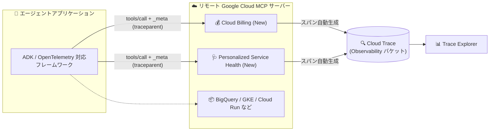
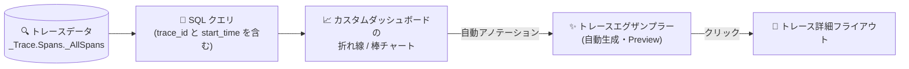

# Cloud Trace: リモート MCP サーバーのトレーススパン対応拡大と SQL チャート向けトレースエグザンプラー自動生成

**リリース日**: 2026-08-12

**サービス**: Cloud Trace / Google Cloud Observability

**機能**: リモート MCP サーバー (Cloud Billing、Personalized Service Health) の `tools/call` スパン自動生成、および SQL クエリ結果チャートに対するトレースエグザンプラーの自動生成

**ステータス**: Feature (トレースエグザンプラーは Preview)

📊 [このアップデートのインフォグラフィックを見る](https://takech9203.github.io/google-cloud-news-summary/20260812-cloud-trace-mcp-spans-trace-exemplars.html)

## 概要

2026 年 8 月 12 日、Cloud Trace に関する 2 件の関連アップデートが発表されました。いずれもトレースデータを活用したオブザーバビリティ強化に関するもので、エージェントアプリケーションの可視化と、SQL ベースのトレース分析の改善が中心です。

1 件目は、リモート MCP (Model Context Protocol) サーバーのトレース対応拡大です。**Cloud Billing** と **Personalized Service Health** のリモート MCP サーバーが、`tools/call` オペレーションに対して自動的にトレーススパンを生成するようになりました。これにより、Google Cloud の MCP サーバーをツールとして呼び出すエージェントアプリケーションにおいて、ツール呼び出しのステータスやレイテンシをエンドツーエンドのトレースの一部として観測できます。すでに Cloud Logging、Cloud Monitoring、GKE、Cloud Run、Compute Engine、BigQuery、Cloud SQL、AlloyDB for PostgreSQL、Google Security Operations、Agent Search、Maps Grounding Lite などがトレース対応済みであり、対応サーバーのリストがさらに拡大した形です。

2 件目は、**トレースエグザンプラー (trace exemplars) の自動生成** (Preview) です。Google Cloud Observability は、カスタムダッシュボード上の SQL クエリ結果を表示するチャートについて、クエリがトレースデータを対象とし一定の要件を満たす場合に、エグザンプラーを自動生成します。エグザンプラーは SQL クエリの集計結果 (チャート上のデータポイント) を特定のトレースにリンクする代表サンプルであり、選択するとそのトレースを表示するフライアウトが開きます。集計値から個別トレースへのドリルダウンが 1 クリックで可能になります。

**アップデート前の課題**

- Cloud Billing や Personalized Service Health の MCP ツールをエージェントから呼び出しても、サーバー側でスパンが生成されず、エージェントのトレースにこれらのツール呼び出しのステータス・レイテンシが記録されなかった
- SQL クエリでトレースデータを集計したチャート (例: 平均レイテンシの推移) から、その集計値の背後にある個別のトレースを特定するには、Trace Explorer で条件を組み立てて別途検索する必要があった
- 集計チャート上の異常値 (スパイクなど) と具体的なトレースを関連付ける作業が手動だった

**アップデート後の改善**

- Cloud Billing と Personalized Service Health のリモート MCP サーバーが `tools/call` オペレーションに対して自動的にスパンを生成し、エージェントアプリケーションの動作を把握しやすくなった
- カスタムダッシュボードの SQL クエリ結果チャートにエグザンプラーが自動生成され、チャート上のデータポイントから特定のトレースへ直接ジャンプできるようになった (Preview)
- エグザンプラーの生成にはインテリジェントなサンプリング戦略が適用され、追加の設定なしで読みやすく関連性の高いサンプルが表示される

## アーキテクチャ図



エージェントアプリケーションが W3C Trace Context (`traceparent`) を MCP の `_meta` フィールドで渡すと、Cloud Billing と Personalized Service Health のリモート MCP サーバーが `tools/call` に対応するスパンを自動生成し、エンドツーエンドのトレースに組み込まれます。



トレースデータに対する SQL クエリ結果チャートに、集計値と個別トレースを結び付けるエグザンプラーが自動的に描画され、クリックするとトレース詳細を確認できます。

## サービスアップデートの詳細

### 主要機能

1. **リモート MCP サーバーによる `tools/call` スパンの自動生成 (Cloud Billing、Personalized Service Health)**
   - エージェントアプリケーションが MCP リクエストの `_meta` フィールドに W3C Trace Context 形式の `traceparent` を含めると、MCP サーバー側で `tools/call` オペレーションのスパンが自動生成される
   - スパン名は OpenTelemetry の MCP セマンティック規約に従い `tools/call NAME` 形式 (NAME は呼び出したツール名)
   - Trace Explorer のフィルターバーで属性 `mcp.method.name` に値 `tools/call` を指定すると、MCP ツール呼び出しのスパンを絞り込める
   - トレースコンテキストを渡すフレームワーク・SDK として、OpenTelemetry Semantic Conventions for MCP をサポートするもの (例: Agent Development Kit (ADK)) が利用可能

2. **SQL クエリ結果チャートに対するトレースエグザンプラーの自動生成 (Preview)**
   - カスタムダッシュボード上の SQL ベースのチャートがトレースデータを対象とする場合、エグザンプラーが動的に生成される
   - エグザンプラーはメトリック測定値に関連付けられた代表的なサンプル (リクエスト/スパン) で、それぞれ特定のトレースにリンクし、選択するとトレースを表示するフライアウトが開く
   - チャートのツールバーから「Hide exemplars」でエグザンプラーの表示を隠すことも可能

3. **エグザンプラーのインテリジェントなサンプリング戦略**
   - `AVG` や `PERCENTILE` などの統計値: 生のスパン値をチャートの補間トレンドラインと比較して偏差プールにグループ化し、各プールから比例配分でサンプルを抽出して時間軸上に均等配置
   - `COUNT` などの頻度カウント: チャートウィンドウの上端に沿ってエグザンプラーを配置し、時間とデータ系列のブレークダウンにわたって均等に配置

## 技術仕様

### MCP スパン生成の仕組み

| 項目 | 詳細 |
|------|------|
| トレースコンテキストの伝搬 | MCP の `_meta` フィールドに `traceparent` (W3C Trace Context 形式) と `tracestate` を格納 |
| `traceparent` の形式 | `00-TRACE_ID-PARENT_SPAN_ID-SAMPLED_FLAG` (バージョン、トレース ID、呼び出し元スパン ID、サンプリングフラグ) |
| サンプリングフラグ | `1` (サンプリング済み) に設定されている必要がある |
| 生成されるスパン | `tools/call` オペレーションにつき単一のスパンのみ。他のオペレーションタイプや子スパンは生成されない |
| スパン生成の条件 | リクエストが認証・認可され、その他の内部チェックを通過した場合のみ |
| スパン名の規約 | `tools/call NAME` (OpenTelemetry Semantic Conventions for MCP に準拠) |

```json
{
  "jsonrpc": "2.0",
  "method": "tools/call",
  "params": {
    "name": "NAME",
    "arguments": {
      // ツールの MCP 仕様に従って指定
    },
    "_meta": {
      "traceparent": "00-TRACE_ID-PARENT_SPAN_ID-SAMPLED_FLAG",
      "tracestate": "Vendor specific information."
    }
  },
  "id": 1
}
```

### トレースエグザンプラーの表示要件 (Preview)

| 要件 | 詳細 |
|------|------|
| クエリ | SQL で記述され、クエリ対象がトレースデータであること |
| チャート種別 | 折れ線 (line) または棒 (bar) チャート |
| クエリ結果に含める列 | `trace_id` と `start_time` |

### トレース対応済みのリモート MCP サーバー (公式ドキュメント記載)

Cloud Logging、Cloud Monitoring、Maps Grounding Lite、GKE、Cloud Run、Compute Engine、Google Security Operations、AlloyDB for PostgreSQL、Agent Search、Cloud SQL (MySQL / PostgreSQL / SQL Server)、BigQuery、Personalized Service Health。今回のリリースノートで Cloud Billing と Personalized Service Health の対応が発表されました。

## 設定方法

### 前提条件

1. (MCP スパン) エージェントアプリケーションが、`_meta` フィールドでトレースコンテキストを渡せるフレームワークまたは SDK (OpenTelemetry Semantic Conventions for MCP 対応、例: ADK) を使用していること
2. (エグザンプラー) SQL チャートの表示・保存に必要な IAM ロール: 対象の observability ビューに対する Observability View Accessor (`roles/observability.viewAccessor`)、プロジェクトに対する Monitoring Editor (`roles/monitoring.editor`)

### 手順

#### ステップ 1: MCP スパンの確認 (Trace Explorer)

Google Cloud コンソールの Trace Explorer ページでトレースデータを表示し、フィルターバーで属性 `mcp.method.name` = `tools/call` を指定すると、MCP サーバーが生成したスパンを検索できます。スパン名は `tools/call NAME` 形式です。

#### ステップ 2: エグザンプラー付きチャートの作成 (Observability Analytics)

1. Google Cloud コンソールで Observability Analytics ページを開く
2. トレースデータ (`_Trace.Spans._AllSpans` ビュー) を対象に、`trace_id` と `start_time` を結果に含む SQL クエリを実行する
3. 結果を折れ線または棒チャートとして表示し、「Save to dashboard」でカスタムダッシュボードに保存する
4. 要件を満たすチャートにはエグザンプラーが自動的に表示される。不要な場合はチャートのツールバーから「Hide exemplars」を選択する

## メリット

### ビジネス面

- **エージェントアプリケーションの運用性向上**: Cloud Billing の照会や Personalized Service Health の障害情報取得といったツール呼び出しの成否・所要時間をトレースで把握でき、AI エージェントを組み込んだ業務システムのトラブルシューティングが迅速になる
- **調査時間の短縮**: 集計チャートの異常値から該当トレースへ 1 クリックで到達できるため、インシデント調査の初動が速くなる

### 技術面

- **標準準拠のトレース連携**: W3C Trace Context と OpenTelemetry Semantic Conventions for MCP に準拠しており、既存の OpenTelemetry ベースの計装と自然に統合できる
- **設定不要の自動生成**: MCP スパンもエグザンプラーも、要件を満たせば自動的に生成される。エグザンプラーのサンプリングはシステムが最適化する

## デメリット・制約事項

### 制限事項

- (MCP スパン) トレースコンテキストは W3C Trace Context 標準に準拠し、サンプリングフラグが `1` に設定されている必要がある
- (MCP スパン) リモート Google Cloud MCP サーバーは `tools/call` オペレーションに対して単一のスパンのみを生成する。他のオペレーションタイプのスパンや `tools/call` の子スパンは生成されない
- (MCP スパン) リクエストが認証・認可され、内部チェックを通過した場合にのみスパンが生成される
- (エグザンプラー) Preview 段階の機能であり、Pre-GA Offerings Terms が適用される
- (エグザンプラー) チャートに複数の時系列が表示される場合、表示されるエグザンプラーの数が削減される
- (エグザンプラー) エグザンプラーはチャートの時間間隔内で均等に分布しない場合がある
- (エグザンプラー) 対数 Y 軸や外れ値を含む時系列では、Y 軸スケールにより表示が視覚的に歪む可能性がある
- (エグザンプラー) エグザンプラーの生成方法はユーザー側で構成できない

### 考慮すべき点

- エグザンプラーを表示するには、SQL クエリの結果に `trace_id` と `start_time` を含める必要があるため、既存の保存済みクエリの見直しが必要になる場合がある
- MCP スパンを活用するには、エージェント側 (クライアント側) でトレースコンテキストを伝搬する計装が前提となる

## ユースケース

### ユースケース 1: コスト分析エージェントのツール呼び出し監視

**シナリオ**: ADK で構築した社内 FinOps エージェントが、Cloud Billing の MCP サーバーを呼び出して課金情報を取得している。応答が遅い・失敗するケースの切り分けを行いたい。

**実装例**:
```
Trace Explorer のフィルターバーで属性フィルターを追加:
  mcp.method.name = tools/call
スパン名 "tools/call <ツール名>" でレイテンシとステータスを確認
```

**効果**: エージェントの推論部分と Cloud Billing MCP ツール呼び出し部分のレイテンシ・エラーをスパン単位で切り分けられ、ボトルネックの特定が容易になる。

### ユースケース 2: レイテンシチャートのスパイクから該当トレースへドリルダウン

**シナリオ**: カスタムダッシュボードに、トレースデータに対する SQL クエリでサービス別の平均レイテンシを折れ線チャートとして表示している。特定時間帯のスパイクの原因を調査したい。

**効果**: スパイク付近に自動生成されたエグザンプラーをクリックするだけで該当トレースのフライアウトが開き、遅延の原因となったスパンを直接確認できる。Trace Explorer で条件を再構築して検索する手間が不要になる。

### ユースケース 3: 障害対応エージェントの信頼性確認

**シナリオ**: Personalized Service Health の MCP サーバーを利用して Google Cloud の障害情報を自動収集・通知するエージェントを運用しており、通知遅延の原因を調査したい。

**効果**: Personalized Service Health への `tools/call` スパンがトレースに含まれるため、障害情報の取得にかかった時間と、エージェント側の処理時間を分離して分析できる。

## 料金

今回のリリースノートおよび参照ドキュメントには、これらの機能に固有の料金に関する記載はありません。Cloud Trace / Google Cloud Observability の料金は公式の料金ページを参照してください。

- [Google Cloud Observability の料金](https://cloud.google.com/stackdriver/pricing)

## 関連サービス・機能

- **Cloud Billing**: 今回トレーススパン生成に対応したリモート MCP サーバーの提供元。課金情報をエージェントから取得するツールを提供
- **Personalized Service Health**: 今回トレーススパン生成に対応したリモート MCP サーバーの提供元。プロジェクトに関連する Google Cloud の障害情報を提供
- **Observability Analytics**: トレースデータへの SQL クエリ実行とチャート作成を行うページ。エグザンプラー付きチャートの作成起点
- **Cloud Monitoring (カスタムダッシュボード)**: SQL クエリ結果チャートの保存先。エグザンプラーはダッシュボード上のチャートに表示される
- **Agent Development Kit (ADK)**: MCP の `_meta` フィールドでトレースコンテキストを伝搬できるエージェントフレームワークの一例
- **OpenTelemetry**: トレースコンテキスト伝搬 (W3C Trace Context) と MCP セマンティック規約の基盤。セルフホスト MCP サーバーの計装にも推奨

## 参考リンク

- 📊 [インフォグラフィック](https://takech9203.github.io/google-cloud-news-summary/20260812-cloud-trace-mcp-spans-trace-exemplars.html)
- [公式リリースノート](https://docs.cloud.google.com/release-notes#August_12_2026)
- [Investigate MCP calls using Trace](https://docs.cloud.google.com/trace/docs/trace-remote-mcp-server-calls)
- [Generate and display trace exemplars (Chart SQL query results)](https://docs.cloud.google.com/trace/docs/analytics-chart#show-trace-exemplars)
- [Find and explore traces](https://docs.cloud.google.com/trace/docs/finding-traces)
- [Query and analyze traces (Observability Analytics)](https://docs.cloud.google.com/trace/docs/analytics)
- [料金ページ (Google Cloud Observability)](https://cloud.google.com/stackdriver/pricing)

## まとめ

Cloud Billing と Personalized Service Health のリモート MCP サーバーがトレーススパンの自動生成に対応し、Google Cloud 上のエージェントアプリケーションの可観測性がさらに広がりました。あわせて Preview のトレースエグザンプラーにより、SQL による集計チャートから個別トレースへのドリルダウンがシームレスになります。エージェントを運用しているチームは ADK など Trace Context を伝搬できるフレームワークでの計装を確認し、トレース分析ダッシュボードを利用しているチームは SQL クエリに `trace_id` と `start_time` を追加してエグザンプラーの活用を検討することを推奨します。

---

**タグ**: Cloud Trace, Google Cloud Observability, MCP, Model Context Protocol, Cloud Billing, Personalized Service Health, トレースエグザンプラー, Observability Analytics, OpenTelemetry, エージェント, Preview
