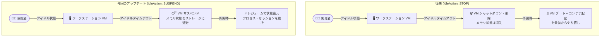

# Cloud Workstations: Compute Engine サスペンド/レジューム対応 (Preview)

**リリース日**: 2026-08-12

**サービス**: Cloud Workstations

**機能**: アイドルタイムアウト時の VM サスペンド/レジューム (自動スリープ)

**ステータス**: Preview

📊 [このアップデートのインフォグラフィックを見る](https://takech9203.github.io/google-cloud-news-summary/20260812-cloud-workstations-suspend-resume-preview.html)

## 概要

Cloud Workstations が Compute Engine のサスペンド/レジューム機能に Preview 対応しました。ワークステーション構成 (WorkstationConfig) の `idleAction` 設定を使用することで、ワークステーション VM がアイドルタイムアウトに達した際に、従来のようにシャットダウンして VM を削除するのではなく、VM をサスペンド (Google Cloud コンソールでは「自動スリープ (auto-sleep)」と表記) するように構成できます。

サスペンドされた VM は、メモリの内容 (ゲスト OS やアプリケーションの状態) がストレージに退避され保持されます。レジューム時にはメモリの状態が復元されるため、開発者は前回の作業状態 (開いていたエディタ、実行中のプロセス、シェルセッションなど) をそのまま引き継いで作業を再開できます。クラウド開発環境の利便性とコスト効率の両立を目指す開発チームやプラットフォームチームにとって有用なアップデートです。

**アップデート前の課題**

これまで Cloud Workstations のアイドルタイムアウト動作は VM の停止 (STOP) のみでした。

- アイドルタイムアウト到達時はワークステーション VM がシャットダウン・削除され、メモリ上の状態 (実行中のプロセス、デバッグセッション、シェルの状態など) はすべて失われた
- 再開時には VM のブート、コンテナの起動、IDE の初期化を最初からやり直す必要があり、作業再開までの待ち時間が長かった
- 状態を失いたくない場合は `keep_alive.sh` スクリプトや `workstations start` API 呼び出しでアイドルタイムアウトを回避する運用が必要で、その間はコンピュートコストが発生し続けた

**アップデート後の改善**

- `idleAction` に `SUSPEND` を指定することで、アイドルタイムアウト時に VM を削除せずサスペンドできるようになった
- メモリの状態が保持されるため、レジューム時に前回の作業状態 (プロセス、セッション) から即座に再開できる
- サスペンド中は CPU 使用に対する課金が発生せず、状態保持とコスト削減を両立できる (メモリ状態のストレージ、ディスク、静的 IP には課金が継続)

## アーキテクチャ図



アイドルタイムアウト時の動作を STOP (シャットダウン・削除) と SUSPEND (サスペンド) で比較した図です。SUSPEND ではメモリ状態が保持され、作業状態を維持したまま高速に再開できます。

## サービスアップデートの詳細

### 主要機能

1. **`idleAction` 設定によるアイドル時動作の選択**
   - ワークステーション構成 (WorkstationConfig) の `idleAction` フィールドで、アイドルタイムアウト到達時の動作を `STOP` (デフォルト) と `SUSPEND` から選択可能
   - Google Cloud コンソールでは「自動スリープ (auto-sleep)」として表示される
   - `gcloud beta workstations configs update` の `--idle-action` フラグでも設定可能

2. **メモリ状態の保持と高速な作業再開**
   - サスペンド時、Compute Engine が VM のメモリ内容をストレージに退避して保持
   - レジューム時にメモリ状態が VM に復元され、ゲスト OS とアプリケーションの状態がそのまま再開される
   - 長い初期化時間を要する開発環境 (大規模な Java アプリケーションのビルド環境など) で特に効果的

3. **アイドルタイムアウトとの連動**
   - アイドルタイムアウト (`idleTimeout`、デフォルト 1200 秒 = 20 分) は、ユーザートラフィックの受信や IDE 操作 (マウスクリック、キー入力など) のたびにリセットされる
   - `idleTimeout` と `runningTimeout` (デフォルト 43200 秒 = 12 時間) は独立して動作する

## 技術仕様

### WorkstationConfig の関連フィールド

| 項目 | 詳細 |
|------|------|
| `idleAction` | アイドルタイムアウト到達時の動作。`STOP` (デフォルト) または `SUSPEND` |
| `idleTimeout` | ユーザートラフィックが途絶えてから自動停止/サスペンドまでの秒数。デフォルト `1200s` (20 分)、`0s` でタイムアウト無効 |
| `runningTimeout` | ワークステーションの最大実行時間。デフォルト `43200s` (12 時間)。アイドル状態に関係なく適用される |

### Compute Engine サスペンドの主な制限 (継承される制約)

| 項目 | 詳細 |
|------|------|
| サスペンド可能期間 | 最大 60 日間。超過すると自動的に TERMINATED 状態に移行 |
| 非対応構成 | ベアメタルインスタンス、Confidential VM、GPU/TPU 搭載インスタンス、208 GB 超のメモリを持つインスタンス |
| ゲスト OS | ゲスト OS がサスペンドをサポートしている必要がある |

## 設定方法

### 前提条件

1. Cloud Workstations のクラスタおよびワークステーション構成が作成済みであること
2. ワークステーション構成の更新権限 (例: `roles/workstations.admin`) を持っていること
3. VM の構成が Compute Engine のサスペンド要件を満たしていること (メモリ 208 GB 以下、GPU 非搭載など)

### 手順

#### ステップ 1: ワークステーション構成の idle-action を suspend に更新

```bash
gcloud beta workstations configs update CONFIG_NAME \
  --region=REGION \
  --cluster=CLUSTER_NAME \
  --idle-action=suspend \
  --idle-timeout=1200
```

`--idle-action` に `suspend` を指定すると、アイドルタイムアウト到達時に VM がサスペンドされます。`stop` を指定すると従来通りの動作になります。

#### ステップ 2: 動作確認

```bash
gcloud beta workstations configs describe CONFIG_NAME \
  --region=REGION \
  --cluster=CLUSTER_NAME \
  --format="yaml(idleTimeout, idleAction)"
```

`idleAction: SUSPEND` が設定されていることを確認します。設定後、この構成から作成されたワークステーションはアイドルタイムアウト時にサスペンドされます。

## メリット

### ビジネス面

- **開発者の生産性向上**: 作業再開時の待ち時間が短縮され、離席前の状態から即座に開発を継続できる
- **コスト最適化**: アイドル時に CPU 課金が停止するため、「状態を失いたくないから起動したままにする」運用によるコスト垂れ流しを防止できる

### 技術面

- **メモリ状態の完全保持**: 実行中のプロセス、デバッグセッション、シェル環境などがサスペンド前の状態のまま復元される
- **構成レベルでの一元管理**: ワークステーション構成 (テンプレート) 単位で設定するため、プラットフォームチームがチーム全体のアイドル時動作を統一的に制御できる
- **回避策の不要化**: 状態維持のための `keep_alive.sh` や定期的な Start API 呼び出しといった回避策が不要になる

## デメリット・制約事項

### 制限事項

- Preview 段階の機能であり、SLA の対象外。本番の重要ワークロードへの適用は慎重に判断が必要
- Compute Engine サスペンドの制限を継承する: サスペンド期間は最大 60 日 (超過すると TERMINATED に移行)、GPU/TPU 搭載 VM・Confidential VM・メモリ 208 GB 超の VM はサスペンド不可
- レジュームはゾーンに十分な容量がある場合にのみ成功する (容量不足時は SUSPENDED 状態のまま再試行が必要)

### 考慮すべき点

- サスペンド中も VM のメモリ状態を保持するストレージ、永続ディスク、静的 IP アドレスには課金が継続する (完全な停止・削除よりはコストが高くなる場合がある)
- セキュリティ更新は再起動時に適用されるため、長期間サスペンドとレジュームを繰り返す運用では、`runningTimeout` などと組み合わせて定期的な再起動を確保することが推奨される
- エフェメラル外部 IP アドレスはサスペンド時に解放され、レジューム時に新しいアドレスが割り当てられる

## ユースケース

### ユースケース 1: 日中の離席時に作業状態を維持しながらコスト削減

**シナリオ**: 開発者が会議や昼休憩で 30 分〜数時間離席する際、従来はアイドルタイムアウトで VM が削除され、戻ってきたときにビルドキャッシュのウォームアップやデバッグセッションの再構築が必要だった。

**実装例**:
```bash
gcloud beta workstations configs update dev-config \
  --region=asia-northeast1 \
  --cluster=dev-cluster \
  --idle-action=suspend \
  --idle-timeout=1800
```

**効果**: 離席 30 分後に VM が自動サスペンドされ CPU 課金が停止。戻ってきたら数十秒〜数分で離席前の状態 (開いていたファイル、実行中のプロセス) から再開できる。

### ユースケース 2: 初期化コストの高い開発環境の運用

**シナリオ**: 大規模な Java アプリケーションや言語サーバーのインデックス構築など、起動後の初期化に長時間かかる開発環境を利用しているチームで、毎回のコールドスタートが生産性のボトルネックになっている。

**効果**: サスペンド/レジュームによりウォームアップ済みの状態が保持されるため、コールドスタートの初期化時間を回避し、環境をコスト効率よく維持できる。

## 料金

Cloud Workstations の料金は、管理料金 (ワークステーションおよびクラスタ) と、ワークステーション VM が使用する Compute Engine リソース (vCPU、メモリ、ディスクなど) の料金で構成されます。

サスペンド中の VM の課金は Compute Engine のサスペンド料金体系に従います。

| 状態 | 課金対象 |
|------|----------|
| RUNNING | vCPU、メモリ、ディスク、IP アドレスなどすべてのリソース |
| SUSPENDED | メモリ状態の保持ストレージ、永続ディスク、静的 IP アドレス (CPU 課金は停止) |
| 停止・削除 (従来の STOP) | 永続ディスクなど残存リソースのみ |

詳細は以下の料金ページを参照してください。

- [Cloud Workstations の料金](https://cloud.google.com/workstations/pricing)
- [Compute Engine サスペンド VM の料金](https://docs.cloud.google.com/compute/vm-instance-pricing#suspended_vm_instances)

## 利用可能リージョン

リージョンごとの提供状況は [Cloud Workstations のロケーション](https://docs.cloud.google.com/workstations/docs/locations) を参照してください。

## 関連サービス・機能

- **Compute Engine**: ワークステーション VM の基盤。本機能は Compute Engine のサスペンド/レジューム機能を Cloud Workstations から利用するもの
- **Cloud Workstations ディスクアーカイブ (`--disk-archive-timeout`)**: 停止後にディスクをスナップショット化してコストを削減する既存機能。サスペンドと組み合わせたコスト最適化戦略の検討対象
- **IAM (Identity and Access Management)**: ワークステーション構成の変更権限やワークステーション利用権限の管理に使用

## 参考リンク

- 📊 [インフォグラフィック](https://takech9203.github.io/google-cloud-news-summary/20260812-cloud-workstations-suspend-resume-preview.html)
- [公式リリースノート](https://docs.cloud.google.com/release-notes#August_12_2026)
- [WorkstationConfig API リファレンス (idleAction)](https://docs.cloud.google.com/workstations/docs/reference/rest/v1beta/projects.locations.workstationClusters.workstationConfigs)
- [gcloud beta workstations configs update リファレンス](https://docs.cloud.google.com/sdk/gcloud/reference/beta/workstations/configs/update)
- [Compute Engine インスタンスのサスペンド/レジューム](https://docs.cloud.google.com/compute/docs/instances/suspend-resume-instance)
- [インスタンスのサスペンド・停止・リセットの概要](https://docs.cloud.google.com/compute/docs/instances/suspend-stop-reset-instances-overview)
- [Cloud Workstations アーキテクチャ (アイドルタイムアウト)](https://docs.cloud.google.com/workstations/docs/architecture)
- [料金ページ](https://cloud.google.com/workstations/pricing)

## まとめ

Cloud Workstations のアイドルタイムアウト時に VM をサスペンドできるようになり、開発者の作業状態を保持したままコストを削減できるようになりました。まだ Preview 段階ですが、コールドスタートの待ち時間が課題になっているチームは、開発用のワークステーション構成で `--idle-action=suspend` を試し、レジューム時間とサスペンド中のコストを評価することをおすすめします。

---

**タグ**: `Cloud Workstations`, `Compute Engine`, `Suspend/Resume`, `Preview`, `開発環境`, `コスト最適化`
