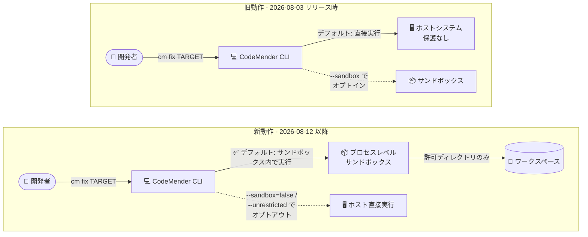

# Gemini Enterprise Agent Platform: CodeMender CLI のサンドボックスがデフォルトで有効に

**リリース日**: 2026-08-12

**サービス**: Gemini Enterprise Agent Platform (CodeMender)

**機能**: CodeMender CLI のプロセスレベルサンドボックスのデフォルト有効化

**ステータス**: Preview

📊 [このアップデートのインフォグラフィックを見る](https://takech9203.github.io/google-cloud-news-summary/20260812-codemender-cli-sandbox-default.html)

## 概要

Gemini Enterprise Agent Platform 上で動作する AI コードセキュリティエージェント **CodeMender** の CLI で、**プロセスレベルサンドボックスがデフォルトで有効** になりました。CLI はコマンドをデフォルトでプロセスレベルサンドボックス内で実行するようになり、明示的な設定なしでワークステーションが保護されます。

CodeMender は、コードベースの深刻なセキュリティ脆弱性をスキャン・検証・修正する AI エージェントで、推論はクラウド側の Gemini Enterprise Agent Platform、ツール実行 (ビルド、テスト、シェルスクリプトなど) はローカルの `cm` CLI が担う「ローカルファースト」の実行モデルを採用しています。2026 年 8 月 3 日のリリースでプロセスレベルサンドボックスが導入された際は、依存関係の解決をスムーズに行えるよう **デフォルト無効** (オプトイン方式) でしたが、今回のリリースで既定の動作が反転し、**セキュアバイデフォルト** の姿勢に変わりました。

サンドボックスを無効化したい場合は、`config.yaml` での設定、CLI コマンドへの `--sandbox=false` フラグの指定、または `--unrestricted` フラグによるバイパスの 3 つの方法が用意されています。

**アップデート前の課題**

- サンドボックスはデフォルトで無効 (オプトイン) であり、保護を得るには `config.yaml` の `sandbox.enabled: true` や `--sandbox` フラグによる明示的な有効化が必要だった
- 有効化を忘れると、エージェントが提案するツール (ビルド、テスト、シェルスクリプト) がホストシステム上で直接実行され、意図しないファイル変更や予期しない副作用のリスクに晒されていた
- 公式ドキュメントでもサンドボックスの有効化が「強く推奨」されていたものの、個々の開発者の設定に依存しており、組織として一貫した保護を担保しにくかった

**アップデート後の改善**

- CLI はデフォルトでコマンドをプロセスレベルサンドボックス内で実行するようになり、追加設定なしでワークステーションが保護されるようになった
- ファイルシステム分離 (許可ディレクトリ外への書き込みは tmpfs にリダイレクト) とネットワーク分離 (アウトバウンドをデフォルト遮断) が既定で適用されるようになった
- 無効化が必要なケース (隔離済み VM や CI/CD パイプラインなど) では、`config.yaml`、`--sandbox=false`、`--unrestricted` の 3 つの方法で明示的にオプトアウトできる

## アーキテクチャ図



従来はサンドボックスがオプトイン方式でしたが、今回のアップデートでデフォルト動作が反転し、明示的にオプトアウトしない限りすべてのコマンドがサンドボックス内で実行されるようになりました。

## サービスアップデートの詳細

### 主要機能

1. **サンドボックスのデフォルト有効化 (セキュアバイデフォルト)**
   - CLI はコマンドをデフォルトでプロセスレベルサンドボックス内で実行し、ワークステーションを保護する
   - ファイルシステム分離: エージェントは許可されたディレクトリ内のみ読み書き可能。範囲外への書き込みはメモリ上の一時ファイルシステム (tmpfs) にリダイレクトされ、ホストに影響しない
   - ネットワーク分離: サンドボックス内からのアウトバウンド接続はデフォルトで遮断 (`permissive-closed` プロファイル)

2. **無効化・バイパスの 3 つの方法**
   - `config.yaml` でサンドボックスを永続的に無効化
   - CLI コマンドに `--sandbox=false` を渡して単一実行で無効化
   - `--unrestricted` フラグで、ファイルシステムのパス境界と OS レベルの分離 (ネットワーク分離含む) をすべてバイパス

3. **OS レベルサンドボックスの実装 (8 月 3 日導入の仕組みを継承)**
   - Linux: カーネル名前空間 (`CLONE_NEWNS`、`CLONE_NEWUSER` など) + seccomp フィルタ
   - macOS: 組み込みの `sandbox-exec` (Seatbelt)
   - Windows: AppContainer 分離 + ACL (Experimental)

## 技術仕様

### サンドボックスの制御方法

| 制御方法 | スコープ | 効果 |
|------|------|------|
| デフォルト (設定なし) | 全実行 | サンドボックス内でコマンドを実行 (今回の変更点) |
| `config.yaml` の sandbox 設定 | 永続 | サンドボックスの有効/無効を切り替え |
| `--sandbox=false` | 単一実行 | そのコマンド実行のみサンドボックスを無効化 |
| `--unrestricted` | 単一実行 | パス境界と OS レベル分離 (ネットワーク分離含む) をすべてバイパス |

### 関連する config.yaml 設定

```yaml
sandbox:
  enabled: false           # サンドボックスを永続的に無効化する場合
  mounts:
    target_dir: "."        # サンドボックス内にマウントするワークスペース
  network:
    profile: "permissive-closed"  # デフォルト: 全アウトバウンド遮断
                                  # "permissive-open" で全アウトバウンド許可
security:
  protected_files:
    - "~/.ssh/*"           # 読み取り専用でマウントして保護
```

- `sandbox.network.profile` は `permissive-closed` (完全遮断) と `permissive-open` (全許可) の 2 種類。特定ドメインのみを許可する粒度の細かい制御は未サポート

## 設定方法

### 前提条件

1. Google Cloud プロジェクトで Vertex AI API (`aiplatform.googleapis.com`) と Cloud Resource Manager API (`cloudresourcemanager.googleapis.com`) を有効化
2. ユーザーに Vertex AI User ロール (`roles/aiplatform.user`) を付与
3. CodeMender CLI をインストール (限定された顧客向けの Public Preview)
4. `cm update` などで CLI を最新バージョンに更新 (デフォルト動作の変更を反映)

### 手順

#### ステップ 1: デフォルト動作の確認

```bash
# 最新版に更新すると、サンドボックスはデフォルトで有効
cm update
cm find ./src   # サンドボックス内で実行される
```

追加の設定は不要です。コマンドは自動的にプロセスレベルサンドボックス内で実行されます。

#### ステップ 2: ネットワーク依存のビルドへの対処

サンドボックスのネットワーク分離がデフォルトで適用されるため、`npm install`、`pip install`、`go get` など外部依存関係を取得するビルドは失敗します。以下のいずれかで対処します。

```yaml
# オプション A: サンドボックスに外部ネットワークアクセスを許可
sandbox:
  network:
    profile: "permissive-open"
```

```bash
# オプション B: 単一実行でサンドボックス保護をすべてバイパス
cm fix TARGET --unrestricted
```

- オプション C: `cm` コマンド実行前にホスト側で依存関係を事前インストールし、ビルドがネットワークアクセスを必要としないようにする

#### ステップ 3: 必要な場合のみサンドボックスを無効化

```bash
# 単一実行でサンドボックスを無効化
cm fix TARGET --sandbox=false
```

```yaml
# config.yaml で永続的に無効化 (隔離済み VM や CI/CD での実行時のみ推奨)
sandbox:
  enabled: false
```

公式ドキュメントでは、保護の無効化は分離された使い捨てのサンドボックス VM や CI/CD パイプライン内で実行する場合に限るべきとされています。

## メリット

### ビジネス面

- **セキュアバイデフォルト**: 個々の開発者の設定に依存せず、CLI を導入した時点でワークステーション保護が適用されるため、組織として一貫したセキュリティ姿勢を担保しやすい
- **設定ミスによるリスクの排除**: サンドボックスの有効化忘れによる意図しないファイル変更や副作用のリスクがなくなる

### 技術面

- **追加設定不要の保護**: OS 標準機能による軽量な分離が既定で適用され、起動オーバーヘッドなしにファイルシステム分離 (tmpfs リダイレクト) とネットワーク分離が機能する
- **柔軟なオプトアウト**: 永続設定 (`config.yaml`)、単一実行 (`--sandbox=false`)、完全バイパス (`--unrestricted`) と、ユースケースに応じた粒度で無効化を選択できる

## デメリット・制約事項

### 制限事項

- CodeMender は限定された顧客向けの Public Preview であり、Pre-GA Offerings Terms が適用される
- OS レベルサンドボックスは完全に分離された VM より保護が弱い (OS カーネル機能に依存)
- Windows のサンドボックスは Experimental で、管理者権限が必要な場合や一部システム構成と非互換の場合がある
- ネットワークプロファイルは `permissive-closed` / `permissive-open` の 2 択のみで、特定ドメインのみ許可する粒度の細かい制御は未サポート

### 考慮すべき点

- **既存ワークフローへの影響**: これまでサンドボックス無効の前提で運用していた場合、CLI 更新後にビルドやテストの挙動が変わる。特にネットワーク分離により外部依存関係の取得 (`npm install` など) がデフォルトで失敗するため、依存関係の事前取得・`permissive-open` への変更・オプトアウトのいずれかの対処が必要
- ワークスペース外のパスにアクセスするビルド・テストは、`project_paths` への追加やサンドボックス設定の調整が必要になる場合がある
- `--unrestricted` はファイルシステム境界と OS レベル分離をすべて無効化するため、使用は慎重に判断する

## ユースケース

### ユースケース 1: ローカル開発での追加設定不要な保護

**シナリオ**: 開発者がローカルワークステーションで CodeMender に脆弱性のスキャンと修正を任せたいが、サンドボックスの設定を意識せずに安全に使いたい。

**実装例**:
```bash
# 設定不要。デフォルトでサンドボックス内で実行される
cm find ./src
cm verify FINDING_ID
cm fix FINDING_ID
```

**効果**: エージェントのツール実行は許可ディレクトリ内に制限され、範囲外への書き込みは tmpfs に隔離、外部ネットワークは遮断される。有効化忘れによる保護漏れが発生しない。

### ユースケース 2: 隔離済み CI/CD パイプラインでのオプトアウト運用

**シナリオ**: 使い捨ての CI/CD ランナー (それ自体がコンテナや VM で分離済み) で CodeMender を実行しており、ビルド時の依存関係取得のためにサンドボックスの二重の分離が不要。

**実装例**:
```yaml
# CI 用 config.yaml
sandbox:
  enabled: false
```

**効果**: ランナー自体の分離に保護を委ね、サンドボックスのネットワーク分離による依存関係取得の失敗を回避できる。無効化の判断が設定ファイルとして明示的に管理される。

## 関連サービス・機能

- **Gemini Enterprise Agent Platform**: CodeMender のエージェント推論とオーケストレーションをホストするプラットフォーム。CLI は Interactions API 経由で通信する
- **Vertex AI API**: アクティブセッションのストリーミングと管理を担う (CLI 利用には `roles/aiplatform.user` が必要)
- **Artifact Registry**: CodeMender CLI バイナリの配布元。`cm update` や自動アップデートチェックはここから最新版を取得する

## 参考リンク

- 📊 [インフォグラフィック](https://takech9203.github.io/google-cloud-news-summary/20260812-codemender-cli-sandbox-default.html)
- [公式リリースノート](https://docs.cloud.google.com/release-notes#August_12_2026)
- [CodeMender CLI のインストールと構成 (ドキュメント)](https://docs.cloud.google.com/gemini-enterprise-agent-platform/codemender/set-up-environment)
- [関連レポート: CodeMender CLI のプロセスレベルサンドボックス導入 (2026-08-03)](./2026-08-03-gemini-enterprise-codemender-cli-sandboxing.md)

## まとめ

CodeMender CLI のプロセスレベルサンドボックスが、導入からわずか約 1 週間でオプトイン方式からデフォルト有効 (セキュアバイデフォルト) に変わりました。既存ユーザーは CLI 更新後にビルド・テストの挙動 (特にネットワーク依存の処理) が変わる可能性があるため、依存関係の事前取得やネットワークプロファイルの調整を確認してください。無効化が必要な場合は `config.yaml`、`--sandbox=false`、`--unrestricted` のいずれかで明示的にオプトアウトできますが、隔離済み環境以外での無効化は避けることを推奨します。

---

**タグ**: #GeminiEnterpriseAgentPlatform #CodeMender #Security #Sandbox #SecureByDefault #CLI #Preview #AIAgent
