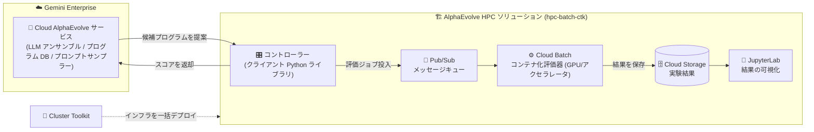

# Gemini Enterprise: AlphaEvolve HPC ソリューション

**リリース日**: 2026-08-12

**サービス**: Gemini Enterprise

**機能**: AlphaEvolve HPC ソリューション

**ステータス**: 提供開始 (Feature)

📊 [このアップデートのインフォグラフィックを見る](https://takech9203.github.io/google-cloud-news-summary/20260812-gemini-enterprise-alphaevolve-hpc-solution.html)

## 概要

Gemini Enterprise の AlphaEvolve に、大規模な進化的コード最適化実験を Google Cloud 上で実行するための分散・コンテナ化インフラストラクチャ「AlphaEvolve HPC ソリューション」が追加されました。評価 (Evaluation) に特殊なハードウェアが必要な場合や、単一マシンのリソース上限を超える場合に、このソリューションを使用して評価処理をクラウド上のワーカーにオフロードできます。

AlphaEvolve は、進化的手法 (Evolutionary Methods) を用いてアルゴリズム発見・数理探索・組合せ最適化を解く特化型 AI コーディングエージェントで、NP 完全・NP 困難クラスの最適化問題に特に適しています。AlphaEvolve のループでは、エージェントが提案した候補プログラムをユーザー側の「評価器 (Evaluator)」が採点しますが、科学計算シミュレーションや ISV/OSS アプリケーションを組み込んだ評価など、計算負荷の高いワークロードでは単一マシンでの実行が困難でした。

HPC ソリューションでは、Cluster Toolkit を使って Cloud Batch ベースの評価インフラ (`hpc-batch-ctk` サンプル) を一括デプロイし、Pub/Sub によるメッセージキューでコントローラーと評価器を疎結合に接続します。HPC ワークロードを扱う研究機関、製造業、金融機関などで、大規模な進化的最適化実験を実務レベルで運用したい組織が対象です。

**アップデート前の課題**

- 計算負荷の高い評価器 (科学計算シミュレーション、コンパイルが必要なバイナリ、ISV/OSS アプリケーション組み込みなど) は、コントローラーと同一の Python 環境や単一マシンでは実行が困難だった
- GPU/TPU などの特殊ハードウェアを必要とする評価を、AlphaEvolve の進化ループに組み込むための標準的なインフラ構成が用意されていなかった
- 分散評価基盤 (メッセージキュー、結果ストレージ、ワーカー群) をユーザーが個別に設計・構築する必要があった

**アップデート後の改善**

- Cloud Batch と Cluster Toolkit を組み合わせた分散・コンテナ化評価インフラを、提供されるサンプル (`hpc-batch-ctk`) からまとめてデプロイできるようになった
- Pub/Sub メッセージキューによるコントローラーと評価器の非同期連携、Cloud Storage への実験結果保存、JupyterLab によるデータアクセス・可視化までが構成に含まれる
- Cloud Batch により、評価に必要なインスタンスタイプやアクセラレータ構成を直接制御でき、複雑なソフトウェアスタックを含む評価をカスタムコンテナで実行できるようになった

## アーキテクチャ図



Cloud AlphaEvolve サービスが提案した候補プログラムを、Pub/Sub 経由で Cloud Batch 上のコンテナ化評価器にオフロードし、スコアを進化ループに返す構成です。インフラ全体は Cluster Toolkit で一括デプロイされます。

## サービスアップデートの詳細

### 主要機能

1. **Cloud Batch へ の評価オフロード**
   - 評価器の実行を Google Cloud Batch のワーカーマシンにオフロードし、カスタムコンテナやコードのコンパイルを必要に応じて実行できる
   - Cloud Batch により、評価に必要なインスタンスタイプやアクセラレータ構成を直接制御できる
   - ISV/OSS アプリケーションの実行や、科学計算ソフトウェアパッケージの一部を in situ で最適化するような、複雑なソフトウェアスタックを要する最適化に対応

2. **Cluster Toolkit による一括デプロイ**
   - 必要なインフラコンポーネント (Pub/Sub、Cloud Batch、Cloud Storage、JupyterLab) を Google Cluster Toolkit で構成・デプロイ
   - AlphaEvolve リポジトリに含まれる `hpc-batch-ctk` サンプルのデプロイ手順 (README) に従って構築可能
   - HPC / AI / ML ワークロード向けのアクセラレータとして、評価器用カスタムコンテナのデプロイや最適化済みアルゴリズムのコンパイル・サービングにも利用できる

3. **非同期・イベント駆動の評価アーキテクチャ**
   - コントローラーと評価器間の通信に Pub/Sub メッセージキューを使用し、疎結合な非同期連携を実現
   - 実験結果は Cloud Storage バケットに保存され、JupyterLab インスタンスからアクセス・可視化が可能
   - 「起動 (launch) とスコアリング (score) を分離する 2 ステージ評価器テンプレート」により、コントローラーが複数の評価ライフサイクルを効率的に管理できる

## 技術仕様

### 評価器の実装パターンと HPC ソリューションの位置づけ

| ユースケース | 複雑さ | 実装先 | 考慮事項 |
|------|------|------|------|
| シンプルなアルゴリズム | 最小 (単一 Python スクリプト) | インプロセス / 子プロセス | 低レイテンシだがスケーラビリティに限界 |
| 依存関係の多いスクリプト | コンパイルや特定ライブラリが必要 | Cloud Run ジョブ | 疎結合だが呼び出しごとのレイテンシが増加 |
| 小規模 ML モデル | GPU など特定ハードウェアが必要 | Vertex AI / GKE | 特殊ハードウェア、セットアップが複雑 |
| 高スループットのスイープ | 数千の独立シミュレーション | Cloud Batch | マネージドスケーリング (MPI 非対応) |
| 科学計算シミュレーション | 計算集約型、MPI 使用 | HPC クラスタ | 超並列、HPC の専門知識が必要 |

### hpc-batch-ctk サンプルの構成要素

| コンポーネント | 役割 |
|------|------|
| Pub/Sub | コントローラーと評価器間のメッセージキュー |
| Cloud Batch | カスタムコンテナによる評価器のワーカー実行基盤 |
| Cloud Storage | 実験結果の保存 |
| JupyterLab | 結果データへのアクセスと可視化 |
| Cluster Toolkit | 上記インフラコンポーネントの構成・一括デプロイ |

## 設定方法

### 前提条件

1. Gemini Enterprise 環境が構成済みで、AlphaEvolve API へのアクセスが確認できていること (サービスアカウントの設定を含む)
2. AlphaEvolve リポジトリ (`Google-Cloud-AI/alphaevolve-on-googlecloud`) のクローンまたは提供 TAR ファイルの取得
3. Cluster Toolkit の依存関係のインストール (Cloud Shell ではプリインストール済み)

### 手順

#### ステップ 1: AlphaEvolve リポジトリの取得

```bash
git clone https://github.com/Google-Cloud-AI/alphaevolve-on-googlecloud
cd alphaevolve-on-googlecloud
```

リポジトリにはクライアント側 Python ライブラリ、ユースケース別サンプル (use-cases フォルダ)、Cluster Toolkit のサンプルが含まれます。

#### ステップ 2: hpc-batch-ctk サンプルによるインフラのデプロイ

```bash
# hpc-batch-ctk フォルダ内の README の手順に従い、
# Cluster Toolkit で Pub/Sub / Cloud Batch / Cloud Storage /
# JupyterLab を含むインフラを構成・デプロイする
```

デプロイ後、コントローラーから Pub/Sub 経由で評価ジョブを投入し、Cloud Batch 上のコンテナ化評価器がスコアを算出、結果を Cloud Storage に保存します。

## メリット

### ビジネス面

- **大規模最適化の実務適用**: これまで単一マシンでは実行できなかった計算負荷の高い最適化実験 (科学計算、EDA、シミュレーションベースの評価など) を、進化的コード最適化のワークフローに組み込める
- **インフラ構築コストの削減**: 分散評価基盤の設計・構築を個別に行う代わりに、Cluster Toolkit のサンプルから短期間でデプロイできる

### 技術面

- **ハードウェアの柔軟な制御**: Cloud Batch を通じてインスタンスタイプ・アクセラレータ構成を直接指定でき、評価に最適なハードウェアを利用できる
- **疎結合な非同期アーキテクチャ**: Pub/Sub によるイベント駆動連携で、コントローラーが多数の評価ジョブのライフサイクルを効率的に管理できる
- **複雑なソフトウェアスタックへの対応**: カスタムコンテナとコンパイルを組み合わせ、ISV/OSS アプリケーションを含む評価環境を再現可能な形で構築できる

## デメリット・制約事項

### 制限事項

- 評価器のネットワーキング・セキュリティ・アクセス制御はユーザーの責任範囲であり、AlphaEvolve は評価器のデプロイや管理を行わない
- Cloud Batch は MPI をサポートしないため、MPI を使う計算集約型シミュレーションには別途 HPC クラスタ (Slurm など) の構成と専門知識が必要
- AlphaEvolve スキル (エージェント開発支援) は現時点で Python コードの進化のみをサポートし、同時に最適化できるコード箇所は 1 か所に限られる
- AlphaEvolve は FedRAMP および DoD コンプライアンスをサポートしない

### 考慮すべき点

- 進化ループを停滞させないため、1 回の評価は目安として約 10 分以内に収めることが推奨される。高コストな目的関数には、全候補に軽量チェックを行い有望な候補のみ完全評価する「評価カスケード」の採用を検討する
- AlphaEvolve は汎用のコード生成アシスタントではなく、機能的に正しいコードを性能目標に向けて最適化する用途に特化している。リンティングやコードスタイル改善には適さない
- Cloud Batch / Cloud Storage / Pub/Sub などのインフラ利用料金は Gemini Enterprise とは別に発生するため、実験規模に応じたコスト管理が必要

## ユースケース

### ユースケース 1: 科学計算ソフトウェアの in situ 最適化

**シナリオ**: 研究機関が、科学計算ソフトウェアパッケージの一部のアルゴリズムを、実際の計算環境 (専用コンテナ + コンパイル済みバイナリ) で評価しながら最適化したい。

**実装例**:
```text
1. hpc-batch-ctk サンプルで Pub/Sub + Cloud Batch + Cloud Storage をデプロイ
2. 評価器コンテナに科学計算ソフトウェアとコンパイルツールチェーンを組み込む
3. AlphaEvolve が提案する候補コードを Cloud Batch 上でコンパイル・実行し、
   性能メトリクスをスコアとして進化ループに返却
```

**効果**: 単一マシンでは実行できない評価ワークロードを分散実行し、実環境に即した性能指標に基づくアルゴリズム最適化が可能になる。

### ユースケース 2: アクセラレータを要する大規模スイープ評価

**シナリオ**: 製造業の設計部門が、数千の独立したシミュレーションによるパラメータスイープを評価関数として、設計ヒューリスティックを進化的に最適化したい。

**効果**: Cloud Batch のマネージドスケーリングで数千の独立シミュレーションを並列実行し、必要なインスタンスタイプ・アクセラレータを指定して評価スループットを確保できる。

## 料金

AlphaEvolve は Gemini Enterprise プラットフォーム上で提供され、利用には Gemini Enterprise のサブスクリプション (エディション) が必要です。また、HPC ソリューションで使用する Cloud Batch、Compute Engine、Pub/Sub、Cloud Storage などのインフラリソースは、それぞれの料金体系に基づき使用量に応じて別途課金されます。

詳細は以下の料金ページを参照してください。

- [Gemini Enterprise の料金](https://cloud.google.com/gemini-enterprise/pricing)
- [Cloud Batch の料金](https://cloud.google.com/batch/pricing)

## 利用可能リージョン

公式ドキュメントおよびリリースノートにリージョン情報の記載はありません。最新情報は [Gemini Enterprise ドキュメント](https://docs.cloud.google.com/gemini/enterprise/docs) を参照してください。

## 関連サービス・機能

- **Cloud Batch**: 評価器コンテナのワーカー実行基盤。インスタンスタイプ・アクセラレータ構成を直接制御できる
- **Cluster Toolkit**: HPC / AI / ML ワークロード向けインフラの構成・一括デプロイツール。本ソリューションの全コンポーネントのデプロイに使用
- **Pub/Sub**: コントローラーと評価器間の非同期メッセージキュー
- **Cloud Storage**: 実験結果の保存先
- **GKE / Vertex AI**: GPU など特定ハードウェアを要する小規模 ML モデル評価の代替実行環境
- **Cloud Run**: 依存関係の多いスクリプト評価向けの軽量な代替実行環境

## 参考リンク

- 📊 [インフォグラフィック](https://takech9203.github.io/google-cloud-news-summary/20260812-gemini-enterprise-alphaevolve-hpc-solution.html)
- [公式リリースノート](https://docs.cloud.google.com/release-notes#August_12_2026)
- [AlphaEvolve の使用 (HPC ユースケースを含む)](https://docs.cloud.google.com/gemini/enterprise/docs/alphaevolve/developer-guide/use-alphaevolve)
- [AlphaEvolve 概要](https://docs.cloud.google.com/gemini/enterprise/docs/alphaevolve/developer-guide/overview)
- [評価器の実装パターン](https://docs.cloud.google.com/gemini/enterprise/docs/alphaevolve/developer-guide/evaluator-patterns)
- [AlphaEvolve リポジトリ (GitHub)](https://github.com/Google-Cloud-AI/alphaevolve-on-googlecloud)
- [Cluster Toolkit ドキュメント](https://docs.cloud.google.com/cluster-toolkit/docs/overview)
- [Gemini Enterprise の料金](https://cloud.google.com/gemini-enterprise/pricing)

## まとめ

AlphaEvolve HPC ソリューションにより、単一マシンの限界を超える計算負荷の高い評価を伴う進化的コード最適化を、Cloud Batch と Cluster Toolkit ベースの分散インフラで実行できるようになりました。科学計算やシミュレーションを評価関数とする大規模最適化に取り組む組織は、まず AlphaEvolve リポジトリの `hpc-batch-ctk` サンプルを確認し、自社の評価ワークロードに合わせたインフラ構成を検証することを推奨します。

---

**タグ**: #GeminiEnterprise #AlphaEvolve #HPC #CloudBatch #ClusterToolkit #進化的最適化 #AIエージェント
