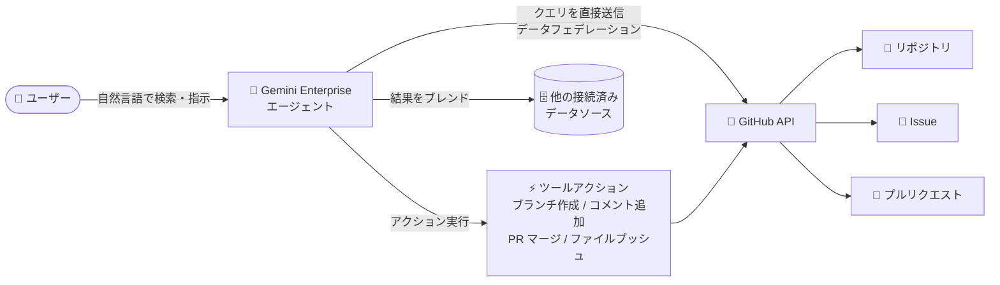

# Gemini Enterprise: GitHub コネクタ (データフェデレーション) が GA

**リリース日**: 2026-08-12

**サービス**: Gemini Enterprise

**機能**: GitHub connector with data federation

**ステータス**: GA (一般提供)

📊 [このアップデートのインフォグラフィックを見る](https://takech9203.github.io/google-cloud-news-summary/20260812-gemini-enterprise-github-connector-data-federation-ga.html)

## 概要

Gemini Enterprise において、データフェデレーション方式の GitHub コネクタが一般提供 (GA) となりました。このコネクタを利用すると、Gemini Enterprise のエージェントから GitHub のリポジトリ、Issue、プルリクエストを直接検索し、さらに自然言語による指示でブランチ作成、Issue へのコメント追加、プルリクエストのマージ、ファイルのプッシュといったアクションを実行できます。

データフェデレーション方式では、検索クエリが GitHub API に直接送信され、結果が他の接続済みデータソースの結果とブレンドされて表示されます。データを Gemini Enterprise のインデックスにコピーしないため、ストレージ消費を気にする必要がなく、常に GitHub 上の最新データに対して検索・操作を行えます。

開発チームの情報 (コード、Issue、PR、Discussions) を社内ナレッジ検索と AI エージェントのアクション基盤に統合したい組織、特にエンジニアリング部門を持つ Gemini Enterprise 導入企業にとって、本番利用の SLA を伴う選択肢が加わったアップデートです。

**アップデート前の課題**

- GitHub 上のリポジトリ、Issue、プルリクエストの情報を確認・操作するには、Gemini Enterprise から離れて GitHub の UI や CLI に切り替える必要があった
- データフェデレーション方式の GitHub 接続は GA 前のステージであり、本番環境での全社展開には慎重な判断が必要だった
- 社内ドキュメント検索と開発情報 (コード、Issue、PR) の検索が分断され、横断的なナレッジ活用が難しかった

**アップデート後の改善**

- GA となったことで、本番環境で GitHub コネクタ (データフェデレーション) を安心して利用できるようになった
- Gemini Enterprise エージェントへの自然言語指示だけで、ブランチ作成・Issue コメント追加・PR マージ・ファイルプッシュなどの GitHub 操作が完結するようになった
- フェデレーション方式のためデータのインデックス取り込みが不要で、ストレージを消費せず常に最新の GitHub データを検索できる

## アーキテクチャ図



ユーザーのクエリは Gemini Enterprise から GitHub API に直接送信され (インデックスへのコピーなし)、検索結果は他のデータソースの結果とブレンドされます。アクション実行時も GitHub API 経由でリアルタイムに操作が反映されます。

## サービスアップデートの詳細

### 主要機能

1. **データフェデレーションによる GitHub 検索**
   - 検索クエリを GitHub API に直接送信し、リポジトリ・Issue・プルリクエストなどをリアルタイムに検索
   - データを Gemini Enterprise のインデックスにコピーしないため、ストレージ消費や同期の待ち時間が不要
   - 検索結果は他の接続済みデータソースの結果とブレンドされ、横断的な検索体験を提供

2. **自然言語による GitHub アクション実行**
   - Gemini Enterprise のエージェントに自然言語で指示するだけで、データを変更するアクションを実行可能
   - 主なアクション: ブランチ作成、Issue コメント追加、プルリクエストのマージ・更新、複数ファイルの一括プッシュ (単一コミット)、リポジトリのフォーク、GitHub Actions ワークフローのトリガー (実行・キャンセル・再実行)、Issue のトリアージ (ラベル・担当者・状態の更新)、Discussion コメントの投稿、GitHub Projects の作成・更新、ラベル管理、Star/Unstar など
   - 検索やコンテキスト取得のための読み取り専用アクションも利用可能

3. **エンタープライズ向けのセキュリティ・ガバナンス機能**
   - データストア作成時に静的 IP エグレスを有効化でき、GitHub 側での送信元 IP 許可リスト運用に対応
   - us / eu ロケーションでは顧客管理暗号鍵 (CMEK) の設定が可能
   - GitHub App の権限設定により、コネクタがアクセスできる範囲を細かく制御可能

## 技術仕様

### データフェデレーションと取り込み (インデックス) の比較

| 項目 | データフェデレーション (本コネクタ) | データ取り込み (インデックス) |
|------|------|------|
| データの保存先 | コピーせず GitHub から直接取得 | Gemini Enterprise のインデックスにコピー |
| ストレージ消費 | なし | 消費する |
| データの鮮度 | 常に最新 | 同期スケジュールに依存 |
| 検索品質 | インデックスなしのため低くなる場合がある | インデックスにより高品質 |

### GitHub App に必要な主な権限

| 権限 | タイプ | 用途 |
|------|------|------|
| Repository: Metadata | 読み取り専用 (必須) | リポジトリ・ユーザーの検索 |
| Repository: Contents | 読み書き | ファイル・コミット・ブランチの読み取り、ブランチ作成、ファイルプッシュ、フォーク |
| Repository: Issues | 読み書き | Issue の読み取り・作成・更新、コメント投稿、トリアージ、ラベル管理 |
| Repository: Pull requests | 読み書き | PR・差分・コメントの読み取り、マージ、更新、レビューコメント |
| Repository: Actions | 読み書き | ワークフローの実行・一覧・キャンセル・再実行、ジョブログ取得 |
| Repository: Code scanning / Dependabot / Secret scanning alerts | 読み取り専用 | 各種セキュリティアラートの読み取り |
| Organization: Members / Projects | 読み取り専用 / 読み書き | 組織のチーム閲覧、Projects v2 の管理 |

### データハンドリング (フェデレーテッド検索時の留意点)

- クエリ文字列はサードパーティの検索バックエンド (GitHub API) に送信される
- 送信先ではクエリがユーザーの ID と関連付けられる可能性がある
- 複数のフェデレーテッド検索データソースが有効な場合、クエリがそのすべてに送信されることがある
- 精度向上のため LLM がクエリをリライトすることがあり、セッションのクエリ履歴の一部が GitHub API へのクエリに含まれる可能性がある

## 設定方法

### 前提条件

1. データストアを作成するユーザーに Discovery Engine 編集者ロール (`roles/discoveryengine.editor`) を付与する
2. GitHub アカウントにサインインし、認証情報 (OAuth クライアント ID / クライアントシークレット) を取得する
3. このコネクタで使用する GitHub App を作成し、必要な権限を設定する

### 手順

#### ステップ 1: GitHub データストアの作成

1. Google Cloud コンソールで **Gemini Enterprise** ページに移動し、プロジェクトを選択
2. ナビゲーションメニューで **Data stores** をクリックし、**Create data store** を選択
3. ソースで **GitHub** を検索して選択

#### ステップ 2: 認証と検索対象の設定

1. **Authentication settings** に OAuth クライアント ID とクライアントシークレットを入力し、**Log in** で GitHub のサインインと認可を完了
2. **Advanced options** で GitHub の組織名 (Organization Name) を入力 (検索とアクションのスコープ指定に必須)
3. **Entities to search** で検索対象のエンティティを選択

#### ステップ 3: アクションと構成の設定

1. **Actions** セクションで有効化する GitHub アクションをカテゴリから選択 (後から追加も可能)
2. 必要に応じて **Enable Static IP Addresses** を有効化し、送信トラフィックの IP を固定
3. マルチリージョン (global / us / eu) とコネクタ名を設定し、us / eu の場合は暗号化設定 (Google 管理鍵または Cloud KMS 鍵) を構成
4. 課金セクションで料金体系を選択して **Create** をクリック。データストアの状態が **Creating** から **Active** に変わればコネクタの利用準備完了

## メリット

### ビジネス面

- **開発情報へのアクセス民主化**: エンジニア以外のメンバー (PM、サポート、QA など) も、自然言語で GitHub の Issue や PR の状況を確認・操作でき、開発状況の可視性が向上する
- **コンテキストスイッチの削減**: Gemini Enterprise の単一インターフェースから社内ドキュメントと GitHub の情報を横断検索・操作でき、ツール間の行き来による生産性ロスを削減できる
- **GA による本番採用の安心感**: 一般提供となったことで、SLA を前提とした全社規模での展開判断がしやすくなった

### 技術面

- **インデックス管理が不要**: フェデレーション方式のためデータの取り込み・同期ジョブの運用が不要で、ストレージも消費しない
- **常に最新データ**: クエリのたびに GitHub API へ直接アクセスするため、同期遅延なく最新の Issue / PR / コードの状態を参照できる
- **セキュリティ制御**: 静的 IP エグレス、CMEK、GitHub App の細粒度権限により、エンタープライズのセキュリティ要件に対応できる

## デメリット・制約事項

### 制限事項

- GitHub データストアは **global、us、eu ロケーションのみ**でサポートされる
- 既存の GitHub データストアに対する VPC Service Controls 境界の適用は非サポート。VPC-SC を適用するにはデータストアの削除・再作成が必要
- 新規アプリの作成時や既存アプリへのデータストア追加時は、アクションを持つデータストアは 1 つのコネクタタイプにつき 1 つだけ関連付けることが推奨される
- フェデレーション方式はデータをインデックスしないため、取り込み (インデックス) 方式と比べて検索品質が低くなる場合がある

### 考慮すべき点

- クエリ文字列 (LLM によるリライトでクエリ履歴の一部を含む場合がある) が GitHub API に送信されるため、データ取り扱いポリシーの確認が必要。GitHub 側に渡ったデータは GitHub の利用規約・プライバシーポリシーに準拠する
- GitHub App には Contents / Issues / Pull requests の読み書きなど強い権限を付与するため、最小権限の原則に基づき有効化するアクションと権限を精査すべき
- PR のマージやファイルのプッシュなど書き込みアクションをエージェント経由で実行できるため、ブランチ保護ルールなど GitHub 側のガードレール整備が重要

## ユースケース

### ユースケース 1: 開発チームの日常業務をエージェントで効率化

**シナリオ**: 開発者が Gemini Enterprise のエージェントに「リポジトリ X のバグ報告 Issue に再現手順を確認するコメントを追加し、修正用のブランチを作成して」と自然言語で指示する。

**実装例**:
```
1. GitHub データストアで「Issue コメント追加」「ブランチ作成」アクションを有効化
2. エージェントに指示:
   「repo-x の issue #123 に『再現手順を教えてください』とコメントし、
    fix/issue-123 ブランチを main から作成して」
```

**効果**: GitHub UI への切り替えなしに Issue 対応の初動が完了し、コンテキストスイッチが減って開発フローが高速化する。

### ユースケース 2: PM・サポートチームによる開発状況の横断検索

**シナリオ**: プロダクトマネージャーが顧客からの問い合わせに対応する際、Gemini Enterprise で社内ドキュメント (Google Drive など) と GitHub の Issue / PR を同時に検索し、修正の進捗状況を確認する。

**効果**: フェデレーテッド検索により GitHub の最新状態が他のデータソースとブレンドされて表示され、エンジニアに問い合わせることなく修正状況を即座に把握できる。

### ユースケース 3: リリース作業の一部自動化

**シナリオ**: リリース担当者がエージェントに「承認済みの PR #456 をマージし、リリースノートのファイルを更新してプッシュ、その後デプロイ用の GitHub Actions ワークフローを実行して」と指示する。

**効果**: PR マージ、ファイルプッシュ、Actions ワークフローのトリガーまでを対話的に実行でき、定型的なリリース作業の手数を削減できる。

## 料金

GitHub コネクタは Gemini Enterprise のライセンス体系の中で提供されます。データストア作成時に General pricing または Configurable pricing を選択します。Gemini Enterprise には Business / Standard / Plus / Pay-as-you-go / Frontline のエディションがあり、フルのデータコネクタエコシステムへのアクセスは Standard 以上のエディションで提供されます。なお、フェデレーション方式はデータをインデックスにコピーしないため、ストレージ (インデックス) 容量を消費しません。

詳細は以下を参照してください。

- [Gemini Enterprise のエディション比較](https://docs.cloud.google.com/gemini/enterprise/docs/editions)
- [ライセンスの取得と管理](https://docs.cloud.google.com/gemini/enterprise/docs/licenses)

## 利用可能リージョン

GitHub データストアは以下のロケーションでサポートされます。

- global
- us (マルチリージョン)
- eu (マルチリージョン)

## 関連サービス・機能

- **Gemini Enterprise データストア / コネクタ**: 本コネクタは Gemini Enterprise のサードパーティコネクタ群の 1 つ。Jira、Confluence、ServiceNow、SharePoint など多数のデータソースと組み合わせたブレンド検索が可能
- **GitLab コネクタ (Preview)**: GitHub 以外のソースコード管理として GitLab データストアも Public Preview で提供されており、開発系データソースの選択肢が拡大している
- **Cloud KMS (CMEK)**: us / eu ロケーションのデータストアで顧客管理暗号鍵による暗号化を構成可能
- **VPC Service Controls**: データストアをセキュリティ境界で保護可能 (ただし既存 GitHub データストアへの後付け適用は不可)
- **IAM (Discovery Engine ロール)**: データストア作成には Discovery Engine 編集者ロールが必要

## 参考リンク

- 📊 [インフォグラフィック](https://takech9203.github.io/google-cloud-news-summary/20260812-gemini-enterprise-github-connector-data-federation-ga.html)
- [公式リリースノート](https://docs.cloud.google.com/release-notes#August_12_2026)
- [Connect GitHub with data federation (データストアのセットアップ)](https://docs.cloud.google.com/gemini/enterprise/docs/connectors/github/set-up-data-store)
- [GitHub コネクタの概要 (アクション・権限・制限事項)](https://docs.cloud.google.com/gemini/enterprise/docs/connectors/github)
- [コネクタとデータストアの概要 (フェデレーション vs 取り込み)](https://docs.cloud.google.com/gemini/enterprise/docs/connectors/introduction-to-connectors-and-data-stores)
- [Gemini Enterprise エディション比較](https://docs.cloud.google.com/gemini/enterprise/docs/editions)

## まとめ

データフェデレーション方式の GitHub コネクタが GA となり、Gemini Enterprise のエージェントから GitHub の検索と書き込みアクション (ブランチ作成、Issue コメント、PR マージ、ファイルプッシュなど) を本番環境で利用できるようになりました。インデックス取り込みが不要で常に最新データを扱える点が特長です。導入時は GitHub App の権限設計とブランチ保護などのガードレール整備を行ったうえで、まず読み取り中心のユースケースから段階的にアクションを有効化していくことを推奨します。

---

**タグ**: #GeminiEnterprise #GitHub #DataFederation #Connector #GA #AIAgent #EnterpriseSearch
