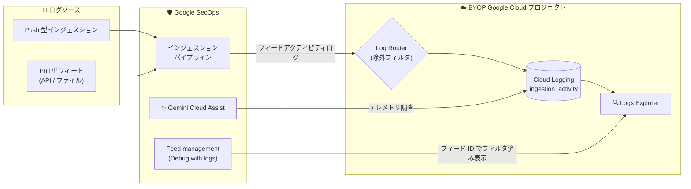

# Google SecOps: Cloud Logging によるフィードアクティビティ分析 (Public Preview)

**リリース日**: 2026-08-12

**サービス**: Google SecOps / Google SecOps SIEM

**機能**: [Spotlight Feature] Analyze feed activity with Cloud Logging

**ステータス**: Public Preview

📊 [このアップデートのインフォグラフィックを見る](https://takech9203.github.io/google-cloud-news-summary/20260812-google-secops-feed-activity-cloud-logging.html)

## 概要

Google SecOps (および Google SecOps SIEM) において、インジェスションパイプラインとフィードのアクティビティログを Cloud Logging に送信し、Logs Explorer で表示・クエリできる機能が Public Preview として発表されました。本機能を利用するには、Google SecOps インスタンスが Bring Your Own Project (BYOP) の Google Cloud プロジェクトで構成されている必要があります。

この機能により、ログの欠損・遅延・失敗といったログ配信の問題を診断し、インジェスション異常の解決にかかる時間を短縮できます。Push 型・Pull 型両方のインジェスションメカニズムに対する可視性が提供され、セキュリティエンジニアや管理者が Google SecOps へのデータ取り込みの健全性をモニタリング、デバッグ、トラブルシューティングできるようになります。

なお、本リリースノートは「Google SecOps」と「Google SecOps SIEM」の両方のエントリとして掲載されていますが、内容は実質的に同一のため、本レポートで両方をカバーします。

**アップデート前の課題**

- フィードやインジェスションパイプラインの詳細なアクティビティログを Cloud Logging (Logs Explorer) で直接クエリして調査する手段がなかった
- ログの欠損・遅延・失敗が発生した際に、原因の切り分けと解決に時間を要していた

**アップデート後の改善**

- インジェスションおよびフィードアクティビティログを Cloud Logging に送信し、Logs Explorer で表示・クエリできるようになった
- Feed management ページの「Debug with logs」オプションから、特定のフィード ID でフィルタ済みの Logs Explorer をワンクリックで開けるようになった
- Gemini Cloud Assist を使って、Google SecOps コンソールからロギング・メトリクスのテレメトリを直接調査できるようになった
- Log Router の除外フィルタで、Storage Transfer Service (STS) ログなど特定のログのルーティングを除外し、コストとノイズを制御できるようになった

## アーキテクチャ図



Push 型・Pull 型のインジェスションアクティビティが BYOP プロジェクトの Cloud Logging にルーティングされ、Logs Explorer や Gemini Cloud Assist から調査できます。Log Router の除外フィルタで不要なログのルーティングを制御できます。

## サービスアップデートの詳細

### 主要機能

1. **テレメトリの調査 (Investigate telemetry)**
   - Gemini Cloud Assist を使用して、Google SecOps コンソールから直接ロギング・メトリクスのテレメトリを調査可能
   - Feeds ページで「Ask Gemini Cloud Assist」を選択してチャットペインを開き、フィードのボリュームやエラーについて質問できる

2. **フィードのデバッグ (Debug feeds)**
   - Feed management ページで特定フィードのアクションメニューから「Debug with logs」を選択
   - 選択したフィード ID で事前フィルタされた Logs Explorer が新しいタブで開く (View feed ページからも利用可能)

3. **ルーティングされるログのフィルタ (Filter routed logs)**
   - Log Router に除外フィルタを構成し、Storage Transfer Service (STS) ログなど特定のログが Cloud Logging にルーティングされないよう制御可能

4. **ログのクエリ**
   - Logs Explorer で名前空間、ログ ID、インジェスションメカニズム、フィード ID、コレクタ ID などによるフィルタリングが可能
   - 成功・失敗を含むインジェスションアクティビティの詳細 (転送バイト数、レコード数、HTTP ステータスコード、エラー詳細など) を確認できる

## 技術仕様

### 主要な用語とログ識別子

| 項目 | 詳細 |
|------|------|
| `chronicle-siem` | Google SecOps エコシステムに関連するログの名前空間ラベル |
| `chronicle.googleapis.com/ingestion_activity` | Google SecOps データインジェスションパイプラインに関するログストリームのログ ID |
| `storage_transfer_job` | Storage Transfer Service (STS) を使用する静的フィードのログのリソースタイプ |
| `storagetransfer.googleapis.com/transfer_activity` | STS アクティビティログのログ ID |

### 代表的なクエリ例

```text
# Google SecOps エコシステム全体のログを取得
labels.namespace="chronicle-siem"

# インジェスションアクティビティログストリームに絞り込み
log_id("chronicle.googleapis.com/ingestion_activity")

# インジェスションメカニズムで絞り込み (例: サードパーティ API)
labels.ingestion_mechanism="Third Party API"

# フィード ID / コレクタ ID で絞り込み
labels.feed_id="FEED_ID"
labels.collector_id="COLLECTOR_ID"

# STS を使用する静的フィードのログ
resource.type="storage_transfer_job" AND log_id("storagetransfer.googleapis.com/transfer_activity")
```

### インジェスションアクティビティログの主なフィールド

| フィールド | データ型 | 説明 |
|------|------|------|
| `request_start_time` | string | アクティビティ開始時刻 (RFC 3339) |
| `activity_duration` | string | アクティビティの合計経過時間 (例: "1.500s") |
| `transfer_id` | string | ファイル/データ転送オペレーションの一意識別子 |
| `feed_id` | string | Google SecOps インジェスションフィードの一意識別子 |
| `collector_id` | string | インジェスションを実行するコレクタの一意識別子 |
| `log_type` | string | 取り込むログのフォーマット (例: `DUO`、`OFFICE_365`) |
| `http_status_code` | integer | API フェッチ操作で受信した HTTP ステータスコード |
| `bytes_transferred` | integer | 正常に転送された生バイト数 |
| `record_count` | integer | 処理・取得・パースされたログエントリ数 |
| `error_details` | object | 失敗時の詳細エラー情報 (`error_message`、`error_code`、`error_type`、`is_retriable`) |

### 失敗時のログペイロード例

```json
{
  "request_start_time": "2026-06-30T19:05:00Z",
  "activity_duration": "1.200s",
  "feed_id": "feed-998877",
  "collector_id": "collector-abcd",
  "log_type": "WORKDAY_AUDIT",
  "http_status_code": 401,
  "bytes_transferred": 0,
  "record_count": 0,
  "activity": "File Transfer",
  "details": "Authorization failure during API request.",
  "error_details": {
    "error_message": "Invalid API token or credential expired.",
    "error_code": "401",
    "error_type": "AUTHORIZATION_ERROR",
    "is_retriable": true
  }
}
```

## 設定方法

### 前提条件

1. Google SecOps インスタンスが Bring Your Own Project (BYOP) の Google Cloud プロジェクトで構成されていること
2. ログを表示するために、プロジェクトに対して以下のいずれかの IAM ロールが付与されていること
   - Logs Viewer (`roles/logging.viewer`)
   - Private Logs Viewer (`roles/logging.privateLogViewer`)
3. コストへの影響を理解しておくこと (Cloud Logging は課金対象サービス。Google Cloud 無料プログラムの一部として無料枠あり)

### 手順

#### ステップ 1: Logs Explorer でフィードアクティビティログを表示・クエリする

1. Google Cloud コンソールで Logs Explorer ページに移動する
2. Google SecOps インスタンスに関連付けられた Google Cloud プロジェクトを選択する
3. Query ペインにクエリ式を入力してログをフィルタする (例: `labels.namespace="chronicle-siem"`)
4. 「Run query」をクリックする

#### ステップ 2: コンソールツールでフィードをデバッグする

- **Debug with logs**: Feed management ページで対象フィードのアクションメニューから「Debug with logs」を選択すると、そのフィード ID で事前フィルタされた Logs Explorer が開く
- **Ask Gemini Cloud Assist**: Feeds ページで「Ask Gemini Cloud Assist」を選択し、フィードのボリュームやエラーについて質問する

## メリット

### ビジネス面

- **インシデント解決時間の短縮**: ログの欠損・遅延・失敗といったインジェスション異常の診断が容易になり、解決までの時間を短縮できる
- **SIEM の信頼性向上**: データ取り込みの健全性を継続的に可視化することで、検知の土台となるログ収集の欠落リスクを低減できる

### 技術面

- **標準ツールでの調査**: Cloud Logging / Logs Explorer という Google Cloud 標準のツールとクエリ言語で、フィード単位・コレクタ単位の詳細な調査が可能
- **Push/Pull 双方の可視性**: Push 型・Pull 型両方のインジェスションメカニズムのアクティビティを統一的な JSON ペイロードで確認できる
- **AI 支援の調査**: Gemini Cloud Assist により、コンソールから対話的にテレメトリを調査できる
- **コスト制御**: Log Router の除外フィルタで不要なログ (STS ログなど) のルーティングを抑制できる

## デメリット・制約事項

### 制限事項

- Public Preview (Pre-GA Offerings Terms の対象) であり、サポートが限定される場合や、他の Pre-GA バージョンと互換性のない変更が入る可能性がある
- BYOP 構成の Google SecOps インスタンスでのみ利用可能
- STS を使用する静的フィードのログは、`chronicle.googleapis.com/ingestion_activity` ではなく、リソースタイプ `storage_transfer_job`・ログ ID `storagetransfer.googleapis.com/transfer_activity` を使用するため、標準クエリでは表示されない
- `feed_id` などの高カーディナリティフィールドは、モニタリング対象リソース定義のリソースラベルではなくメタデータラベルとしてログに含まれる。メタデータラベルを使用した Gemini Cloud Assist の相関機能は継続評価中

### 考慮すべき点

- Cloud Logging は課金対象サービスのため、フィード数やログ量が多い環境ではコスト影響を試算しておく必要がある
- 不要なログは Log Router の除外フィルタで制御し、ログ量とコストを最適化することが望ましい

## ユースケース

### ユースケース 1: フィードのログ欠損・遅延の切り分け

**シナリオ**: 特定のログソース (例: Workday 監査ログ) が Google SecOps に届いていない、または遅延している。原因が認証エラーなのか、ソース側の問題なのかを迅速に切り分けたい。

**実装例**:
```text
log_id("chronicle.googleapis.com/ingestion_activity") AND labels.feed_id="FEED_ID"
```

**効果**: `http_status_code` (例: 401) や `error_details` (`error_type: AUTHORIZATION_ERROR`、`is_retriable: true` など) から失敗原因を即座に特定し、認証情報の更新などの対処を迅速に実施できる。

### ユースケース 2: Feed management からのワンクリックデバッグ

**シナリオ**: SOC 運用者がフィードの異常に気付いた際、クエリを手書きせずにすぐログを確認したい。

**効果**: Feed management ページの「Debug with logs」から、対象フィード ID で事前フィルタされた Logs Explorer が開き、調査開始までの手間を大幅に削減できる。Gemini Cloud Assist に自然言語でフィードのボリュームやエラーについて質問することも可能。

## 料金

Google SecOps の本機能自体に関する追加料金の記載はありませんが、Cloud Logging は課金対象サービスです。Google Cloud 無料プログラムの一部として無料枠が利用できます。

### Cloud Logging の料金 (参考)

| 項目 | 料金 |
|--------|-----------------|
| Logging ストレージ | $0.50/GiB (最初の 50 GiB/プロジェクト/月は無料、ログバケットへの 30 日までの保存を含む) |
| Logging 保持 (30 日超) | $0.01/GiB/月 (デフォルト保持期間内は無料) |
| Log Router | 追加料金なし |
| Log Analytics | 追加料金なし |

詳細は [Google Cloud Observability の料金ページ](https://cloud.google.com/stackdriver/pricing) を参照してください。

## 関連サービス・機能

- **Cloud Logging / Logs Explorer**: フィードアクティビティログの保存・表示・クエリ基盤
- **Log Router**: 除外フィルタによるログルーティングの制御 (STS ログの除外など)
- **Gemini Cloud Assist**: Google SecOps コンソールからのロギング・メトリクステレメトリの対話的調査
- **Storage Transfer Service (STS)**: 静的フィードのデータ転送に使用され、専用のリソースタイプ・ログ ID でログが記録される
- **Cloud Monitoring**: BYOP プロジェクトでのインジェスション停止アラートのカスタム設定に利用可能
- **IAM**: ログ閲覧に必要なロール (`roles/logging.viewer`、`roles/logging.privateLogViewer`) の管理

## 参考リンク

- 📊 [インフォグラフィック](https://takech9203.github.io/google-cloud-news-summary/20260812-google-secops-feed-activity-cloud-logging.html)
- [公式リリースノート](https://docs.cloud.google.com/release-notes#August_12_2026)
- [ドキュメント: Analyze feed activity with Cloud Logging](https://docs.cloud.google.com/chronicle/docs/ingestion/analyze-feed-activity-with-cloud-logging)
- [ドキュメント: Configure a Google Cloud project for Google SecOps](https://docs.cloud.google.com/chronicle/docs/onboard/configure-cloud-project)
- [料金ページ: Google Cloud Observability pricing](https://cloud.google.com/stackdriver/pricing)

## まとめ

Google SecOps のインジェスションパイプラインとフィードの可視性が Cloud Logging に統合され、ログ配信の問題を標準ツールと AI 支援で迅速に診断できるようになりました。BYOP 構成の Google SecOps を運用している場合は、必要な IAM ロールを付与して Logs Explorer でのフィードアクティビティ調査を試し、あわせて Log Router の除外フィルタでログ量とコストの最適化を検討することをお勧めします。

---

**タグ**: Google SecOps, Google SecOps SIEM, Cloud Logging, Logs Explorer, Log Router, Gemini Cloud Assist, BYOP, Public Preview, セキュリティ, インジェスション
