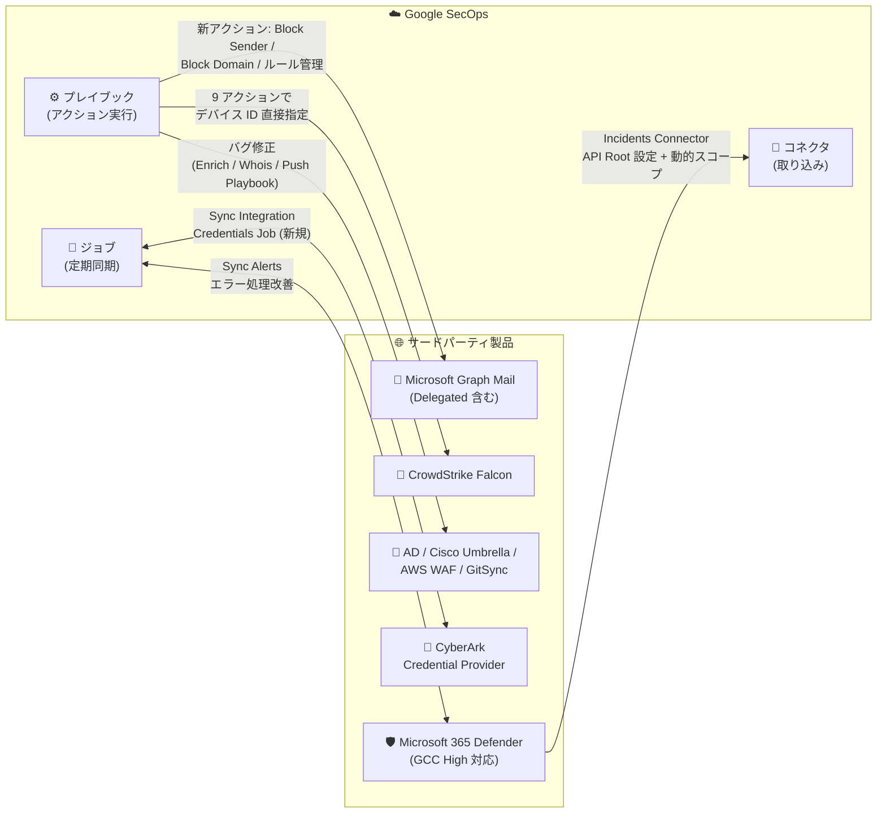

# Google SecOps Marketplace: 10 のインテグレーションアップデート (CyberArk、Microsoft Graph Mail、CrowdStrike Falcon、Microsoft 365 Defender など)

**リリース日**: 2026-08-12

**サービス**: Google SecOps Marketplace

**機能**: SOAR インテグレーションの更新 (新機能 3 件 + 変更 9 件)

**ステータス**: Feature / Change

📊 [このアップデートのインフォグラフィックを見る](https://takech9203.github.io/google-cloud-news-summary/20260812-google-secops-marketplace-integration-updates.html)

## 概要

Google SecOps Marketplace において、SOAR (Security Orchestration, Automation and Response) 向けの 10 のインテグレーションが更新されました。新機能として、CyberArk Credential Provider v5.0 に認証情報を定期同期する Sync Integration Credentials Job が追加され、Microsoft Graph Mail v45.0 および Microsoft Graph Mail Delegated v22.0 には送信者・ドメインのブロックや受信トレイルールの管理を行う 6 つの新アクション (Block Domain、Block Sender、Delete Inbox Rules、List Rules、Remove Block Domain、Remove Block Sender) が追加されました。

変更としては、CrowdStrike Falcon v81.0 で Contain Endpoint や Run Script など 9 つのアクションがデバイス ID を入力パラメータとして直接受け取れるようになったほか、Microsoft 365 Defender v30.0 では API トークンスコープの動的構築と設定可能な API Root パラメータの追加により GCC High テナント (米国政府向け高セキュリティクラウド環境) がサポートされました。また、Active Directory、Cisco Umbrella、Enrichment、GitSync、Microsoft Graph Mail 系の各インテグレーションで既知の不具合が修正されています。

今回のアップデートは、Google SecOps でプレイブックによる自動対応やフィッシング調査、エンドポイント封じ込めを運用する SOC (Security Operations Center) チームに影響します。特にメールベースの脅威への対応自動化と、政府系・規制産業向け環境での Microsoft Defender XDR 連携が強化されています。

**アップデート前の課題**

- Microsoft Graph Mail / Delegated には送信者・ドメインのブロックや受信トレイルールの列挙・削除を行う専用アクションがなく、フィッシング対応でのメールボックスレベルの封じ込めをプレイブックから直接実行できなかった
- CyberArk Credential Provider には認証情報を定期同期するジョブがなかった
- CrowdStrike Falcon の主要アクションはエンティティ (Hostname / IP) ベースの実行が前提で、デバイス ID を直接指定できなかった
- Microsoft 365 Defender の Incidents Connector は API トークンスコープと API Root が固定的で、GCC High テナントに対応していなかった
- Active Directory の Enrich Entities で更新時にエンティティプロパティが誤ってリセットされる、Cisco Umbrella の Get Domain Security Info で bytes オブジェクトのシリアライズエラーによりエンティティへの添付が失敗する、などの不具合があった

**アップデート後の改善**

- Microsoft Graph Mail v45.0 / Delegated v22.0 に Block Domain、Block Sender、Delete Inbox Rules、List Rules、Remove Block Domain、Remove Block Sender の 6 アクションが追加され、メールボックスレベルの封じ込めと復旧をプレイブックで自動化できるようになった
- CyberArk Credential Provider v5.0 の Sync Integration Credentials Job により、インテグレーション認証情報の同期を自動化できるようになった
- CrowdStrike Falcon v81.0 で Hide Hosts、Contain Endpoint、Download File、Execute Command、Get Host Information、Lift Contained Endpoint、List Host Vulnerabilities、On-Demand Scan、Run Script の 9 アクションがデバイス ID を入力パラメータとして受け取れるようになった
- Microsoft 365 Defender v30.0 の Incidents Connector が API トークンスコープの動的構築と設定可能な API Root パラメータにより GCC High テナントをサポートし、Sync Alerts ジョブのエラーハンドリングとアラート処理機構も改善された
- Active Directory (Enrich Entities)、Cisco Umbrella (Get Domain Security Info)、Enrichment (Whois の非サポートエンティティタイプ選択)、GitSync (Push Playbook のフォルダ許可リスト使用時の Include Playbook Blocks 無視)、Microsoft Graph Mail 系 (Get Mailbox Account Out Of Facility Settings のメールボックス未検出時の未処理例外) の各不具合が修正された

## アーキテクチャ図

Google SecOps とサードパーティ製品間の連携ポイント (コネクタ / アクション / ジョブ) ごとに、今回更新された 10 のインテグレーションの位置づけを示しています。

## サービスアップデートの詳細

### インテグレーション別の更新内容

| インテグレーション | バージョン | 種別 | 更新内容 |
|---|---|---|---|
| CyberArk Credential Provider | v5.0 | Feature | 新ジョブ Sync Integration Credentials Job を追加 |
| Microsoft Graph Mail | v45.0 | Feature / Change | 新アクション Block Domain、Block Sender、Delete Inbox Rules、List Rules、Remove Block Domain、Remove Block Sender を追加。Get Mailbox Account Out Of Facility Settings でメールボックス未検出時に未処理例外が発生する問題を修正 |
| Microsoft Graph Mail Delegated | v22.0 | Feature / Change | Microsoft Graph Mail v45.0 と同じ 6 つの新アクションを追加し、同じ例外処理の問題を修正 |
| Active Directory | v45.0 | Change | Enrich Entities アクションで更新時にエンティティプロパティが誤ってリセットされる問題を修正 |
| AWS WAF | v14.0 | Change | インテグレーションの依存関係を更新 |
| Cisco Umbrella | v21.0 | Change | Get Domain Security Info アクションで bytes オブジェクトのシリアライズエラーによりエンティティへの添付が失敗する問題を修正 |
| CrowdStrike Falcon | v81.0 | Change | Hide Hosts、Contain Endpoint、Download File、Execute Command、Get Host Information、Lift Contained Endpoint、List Host Vulnerabilities、On-Demand Scan、Run Script の 9 アクションでデバイス ID を入力パラメータとして使用可能に |
| Enrichment | - | Change | Whois アクションでエンリッチ時に非サポートのエンティティタイプが選択される問題を修正 |
| GitSync | - | Change | Push Playbook アクションでフォルダ許可リスト使用時に Include Playbook Blocks パラメータが無視される問題を修正 |
| Microsoft 365 Defender | v30.0 | Change | Incidents Connector で API トークンスコープの動的構築と設定可能な API Root パラメータの追加により GCC High テナントをサポート。Sync Alerts ジョブのエラーハンドリングとアラート処理機構を改善 |

### 主要な変更ポイント

1. **メールボックスレベルの封じ込めアクション追加 (Microsoft Graph Mail / Delegated)**
   - Block Sender / Block Domain で悪意ある送信者やドメインをブロックし、Remove Block Sender / Remove Block Domain で誤検知時に解除できる
   - List Rules で受信トレイルールを列挙し、Delete Inbox Rules で攻撃者が設置した不正な転送・削除ルール (BEC 攻撃で多用される手口) を削除できる
   - 従来の Mark Email as Junk (送信者をブロックリストに追加) より粒度の細かい制御が、フィッシング対応プレイブックから直接実行可能になった

2. **CyberArk Credential Provider の認証情報同期ジョブ (v5.0)**
   - Sync Integration Credentials Job により、CyberArk で管理される認証情報を Google SecOps インテグレーションへ定期同期できる
   - CyberArk Credential Provider は Linux ホスト上の CLI Application Password SDK (clipasswordsdk) を介して認証情報を取得するインテグレーションで、パスワードローテーション運用との整合性が向上する

3. **CrowdStrike Falcon アクションのデバイス ID 直接指定 (v81.0)**
   - エンドポイント封じ込め (Contain Endpoint / Lift Contained Endpoint)、スクリプト実行 (Run Script / Execute Command)、スキャン (On-Demand Scan) など 9 つの主要アクションで、Hostname / IP エンティティに依存せずデバイス ID をパラメータとして直接渡せるようになった
   - 別アクションやコネクタで取得したデバイス ID をプレイブック内で受け渡すことで、ホスト名の重複や IP の再割り当てがある環境でも対象デバイスを一意に特定した操作が可能になる

4. **Microsoft 365 Defender の GCC High テナント対応 (v30.0)**
   - GCC High は米国政府機関・防衛関連企業向けの Microsoft クラウド環境で、API エンドポイントとトークンスコープが商用クラウドと異なる
   - Incidents Connector が API トークンスコープを動的に構築し、API Root パラメータを設定可能にしたことで、GCC High テナントの Microsoft Defender XDR からインシデントを取り込めるようになった
   - Sync Alerts ジョブ (Google SecOps と Defender XDR 間のアラート・コメント・ステータスの双方向同期) のエラーハンドリングとアラート処理機構も改善された

## デメリット・制約事項

### 考慮すべき点

- インテグレーションの更新は Google SecOps Marketplace から各インテグレーションを新バージョンへ更新することで適用される。自動更新設定でない場合は手動更新が必要
- Microsoft Graph Mail の新アクションを利用するには、Microsoft Entra ID アプリ登録側で対応する Graph API 権限が付与されている必要がある。権限を変更した場合はクライアントシークレットの再生成と Google SecOps 側の設定更新が必要になる点に注意
- Microsoft 365 Defender v30.0 では Incidents Connector に API Root パラメータが追加されているため、GCC High 以外の環境でもアップグレード後にコネクタ設定値を確認することを推奨
- CrowdStrike Falcon v81.0 でデバイス ID 入力に対応した 9 アクションを既存プレイブックで使用している場合、パラメータ構成の変更が既存フローに影響しないか動作確認を推奨
- GitSync の Push Playbook 修正により、フォルダ許可リストと Include Playbook Blocks を併用していた場合はプッシュされる内容が従来と変わる可能性がある

## ユースケース

### ユースケース 1: フィッシングメール対応プレイブックの完全自動化

**シナリオ**: SOC がフィッシング報告を受けた際、悪性判定された送信者・ドメインを各ユーザーのメールボックスでブロックし、攻撃者が設置した不正な受信トレイルール (自動転送・自動削除) を排除したい。

**効果**: Microsoft Graph Mail v45.0 / Delegated v22.0 の新アクションにより、Block Sender / Block Domain でのブロック、List Rules での不正ルール検出、Delete Inbox Rules での削除までをプレイブックで自動化できる。誤検知時は Remove Block Sender / Remove Block Domain で復旧でき、BEC (ビジネスメール詐欺) 対応の初動時間を大幅に短縮できる。

### ユースケース 2: GCC High 環境での Microsoft Defender XDR 連携

**シナリオ**: 米国政府機関や防衛関連企業が GCC High テナントで Microsoft Defender XDR を運用しており、インシデントを Google SecOps に集約して SOAR で対応したい。

**効果**: Microsoft 365 Defender v30.0 の動的トークンスコープと設定可能な API Root により、GCC High の専用エンドポイントを指定してインシデントを取り込めるようになり、規制要件のある環境でも商用クラウドと同等の SOAR ワークフローを構築できる。

### ユースケース 3: デバイス ID ベースの正確なエンドポイント封じ込め

**シナリオ**: DHCP による IP 再割り当てやホスト名の重複がある大規模環境で、CrowdStrike Falcon の検知に基づき特定のデバイスだけを確実に封じ込めたい。

**効果**: CrowdStrike Falcon v81.0 により、アラートやコネクタから取得したデバイス ID を Contain Endpoint などのアクションへ直接渡せるため、エンティティ解決の曖昧さを排除し、誤封じ込めのリスクを低減した正確なレスポンスが可能になる。

## 関連サービス・機能

- **Google SecOps (SIEM/SOAR)**: 本 Marketplace インテグレーションの実行基盤。コネクタでのアラート取り込み、プレイブックでのアクション実行、ジョブによる定期同期を提供
- **CyberArk PAM インテグレーション**: CyberArk の特権アクセス管理を REST API 経由で操作する別インテグレーション。Credential Provider は CLI SDK 経由の認証情報取得に特化
- **Google SecOps フィード監視 (Cloud Logging)**: 同日のリリースノートで、Cloud Logging によるインジェスションパイプラインとフィードの監視・デバッグ機能が Public Preview として発表されている (BYOP プロジェクト構成が必要)

## 参考リンク

- 📊 [インフォグラフィック](https://takech9203.github.io/google-cloud-news-summary/20260812-google-secops-marketplace-integration-updates.html)
- [公式リリースノート (August 12, 2026)](https://docs.cloud.google.com/release-notes#August_12_2026)
- [CyberArk Credential Provider インテグレーション ドキュメント](https://docs.cloud.google.com/chronicle/docs/soar/marketplace-integrations/cyberark-credential-provider)
- [Microsoft Graph Mail インテグレーション ドキュメント](https://docs.cloud.google.com/chronicle/docs/soar/marketplace-integrations/microsoft-graph-mail)
- [Microsoft 365 Defender インテグレーション ドキュメント](https://docs.cloud.google.com/chronicle/docs/soar/marketplace-integrations/microsoft-365-defender)
- [CrowdStrike Falcon インテグレーション ドキュメント](https://docs.cloud.google.com/chronicle/docs/soar/marketplace-integrations/crowdstrike-falcon)
- [インテグレーションの設定](https://docs.cloud.google.com/chronicle/docs/soar/respond/integrations-setup/configure-integrations)

## まとめ

Google SecOps Marketplace の 10 インテグレーション更新は、フィッシング・BEC 対応の自動化 (Microsoft Graph Mail の 6 新アクション)、政府系環境への対応 (Microsoft 365 Defender の GCC High サポート)、エンドポイント操作の正確性 (CrowdStrike Falcon のデバイス ID 指定)、認証情報管理の自動化 (CyberArk の同期ジョブ) を強化するものです。該当インテグレーションを利用中のチームは Marketplace から最新バージョンへ更新し、特にメール対応プレイブックへの新アクション組み込みと、Microsoft 365 Defender コネクタの設定値確認を行うことを推奨します。

---

**タグ**: Google SecOps, SOAR, Marketplace, CyberArk, Microsoft Graph Mail, Microsoft 365 Defender, CrowdStrike Falcon, Active Directory, Cisco Umbrella, GCC High, セキュリティ運用
