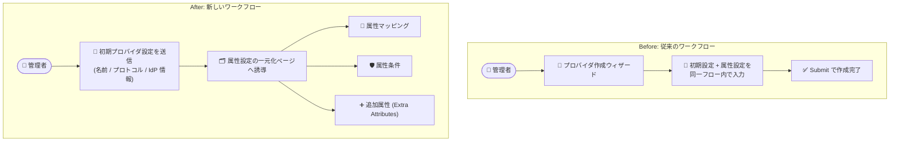

# Identity and Access Management: Workforce Identity プールプロバイダ作成のコンソールワークフロー変更

**リリース日**: 2026-08-12

**サービス**: Identity and Access Management (IAM)

**機能**: Workforce Identity プールプロバイダ作成時のコンソールワークフロー変更 (属性設定の一元化)

**ステータス**: Change (変更)

📊 [このアップデートのインフォグラフィックを見る](https://takech9203.github.io/google-cloud-news-summary/20260812-iam-workforce-identity-pool-provider-console-workflow.html)

## 概要

Google Cloud コンソールにおける Workforce Identity プールプロバイダの作成ワークフローが変更されました。今回の変更により、プロバイダの初期設定 (プロバイダ名、認証プロトコル、IdP メタデータなど) を送信した後、コンソールはプロバイダ属性を設定するための一元化されたページへ誘導するようになります。

この一元化されたページでは、属性マッピング (attribute mappings)、属性条件 (attribute conditions)、追加属性 (extra attributes) といったプロバイダ属性をまとめて設定できます。Workforce Identity Federation は、Microsoft Entra ID や Okta などの外部 IdP のユーザーに Google Cloud リソースへのアクセスを許可する機能であり、属性設定は認可制御の中核となる重要な設定項目です。

対象ユーザーは、外部 IdP と Google Cloud を連携させる Workforce Identity Federation を利用・構築する管理者やセキュリティエンジニアです。gcloud CLI や API での作成手順に変更はなく、コンソール操作のフローが変わります。

**アップデート前の課題**

- プロバイダ属性 (属性マッピング、属性条件など) の設定は、プロバイダ作成ウィザードの一連のフローの中のセクションとして行う構成だった
- 属性マッピング、属性条件、追加属性という関連する設定項目が、作成フローの途中に配置されていた

**アップデート後の改善**

- 初期プロバイダ設定の送信後に、プロバイダ属性を設定するための一元化されたページへ誘導されるようになった
- 属性マッピング、属性条件、追加属性を 1 つのページでまとめて設定できるようになった

## アーキテクチャ図



初期プロバイダ設定の送信後、属性マッピング・属性条件・追加属性をまとめて設定できる一元化されたページへ誘導されるフローに変更されました。

## サービスアップデートの詳細

### 主要機能

1. **初期プロバイダ設定と属性設定の分離**
   - コンソールでプロバイダの初期設定 (プロバイダ名、認証プロトコル (OIDC / SAML)、IdP メタデータや発行元 URI など) を送信した後、属性設定用のページへ誘導される
   - 作成の基本情報と、認可制御に関わる属性設定が段階的に整理された

2. **属性設定の一元化ページ**
   - 属性マッピング、属性条件、追加属性という 3 種類のプロバイダ属性を 1 つのページで設定できる
   - 属性設定は Workforce Identity Federation における ID 情報の変換とアクセス制御の中核となる設定項目

3. **コンソール操作のみの変更**
   - `gcloud iam workforce-pools providers create-oidc` / `create-saml` コマンドや API での作成手順に変更はない

## 技術仕様

### 一元化ページで設定するプロバイダ属性

| 属性 | 説明 |
|------|------|
| 属性マッピング (Attribute mapping) | IdP のアサーション属性を Google Cloud の属性 (`google.subject`、`google.groups`、`attribute.*` など) に CEL 式でマッピングする。`google.subject` のマッピングは必須 |
| 属性条件 (Attribute condition) | CEL 式でサインイン可能なユーザーを制限する。例: `assertion.role == 'gcp-users'`。マルチテナント IdP で発行元 URI が単一の場合は必須の推奨設定 |
| 追加属性 (Extra attributes) | Microsoft Entra ID 利用時に Microsoft Graph API 経由でグループ情報を取得し、最大 400 グループをマッピング可能にする設定 (Issuer URI、Client ID、Client Secret、属性タイプ、フィルタ) |

### 属性マッピングの設定例

```text
google.subject=assertion.subject
attribute.costcenter=assertion.attributes.costcenter[0]
```

この例では、IdP のアサーションの `subject` を `google.subject` に、`costcenter` 属性を `attribute.costcenter` にマッピングします。

## 設定方法

### 前提条件

1. Workforce Identity プールが作成済みであること
2. 連携する外部 IdP (OIDC または SAML 2.0 対応) の設定情報 (メタデータ XML、発行元 URI、クライアント ID など) が準備できていること

### 手順 (コンソール)

#### ステップ 1: プロバイダの初期設定

1. Google Cloud コンソールで「Workforce Identity プール」ページに移動する
2. プロバイダを作成するプールを選択し、「プロバイダを追加」をクリックする
3. IdP ベンダーと認証プロトコル (OIDC / SAML) を選択する
4. プロバイダ名、説明、IdP メタデータ (SAML の場合) などの初期設定を入力して送信する

#### ステップ 2: 一元化ページでプロバイダ属性を設定

初期設定の送信後に誘導される一元化されたページで、以下を設定します。

- **属性マッピング**: `google.subject` の CEL 式 (必須)、必要に応じて追加のマッピング
- **属性条件**: サインインを制限する CEL 式 (任意、マルチテナント IdP では推奨)
- **追加属性**: Microsoft Entra ID のグループを大規模にマッピングする場合に設定 (任意)

詳細な手順は公式ドキュメント「[Manage workforce identity pools and providers](https://docs.cloud.google.com/iam/docs/manage-workforce-identity-pools-providers)」を参照してください。

## メリット

### ビジネス面

- **設定ミスの防止**: 認可制御の中核である属性設定が一元化されたページに集約されることで、設定項目の見落としを防ぎやすくなる
- **運用の標準化**: プロバイダ作成の基本設定と属性設定が段階的に整理され、チーム内での作成手順を標準化しやすくなる

### 技術面

- **属性設定の一覧性向上**: 属性マッピング・属性条件・追加属性という相互に関連する設定を 1 つのページで確認・設定できる
- **既存の自動化への影響なし**: gcloud CLI や API (Terraform などの IaC を含む) によるプロバイダ作成手順には変更がない

## デメリット・制約事項

### 考慮すべき点

- コンソール操作の手順書や社内ドキュメントを整備している場合は、新しいワークフローに合わせた更新が必要
- 追加属性 (Extra attributes) を設定する場合、クライアント ID やシークレットの設定ミスがあるとサインインが失敗するため、一元化ページでの入力内容の検証が重要
- マルチテナント IdP で発行元 URI が単一の場合は、属性条件によるテナント制限の設定を忘れないこと

## 関連サービス・機能

- **Workforce Identity Federation**: 本アップデートの対象機能。外部 IdP のユーザーに Google Cloud リソースへの直接アクセスを許可する
- **Workload Identity Federation**: 人ではなくワークロード (外部アプリケーションなど) 向けの ID 連携機能
- **Cloud Logging**: プロバイダの詳細監査ロギング (detailed audit logging) を有効にすると、IdP から受信した属性情報が Logging に記録され、属性マッピングのトラブルシューティングに利用できる
- **Microsoft Entra ID / Microsoft Graph API**: 追加属性 (Extra attributes) 機能で連携し、最大 400 グループのマッピングを実現する

## 参考リンク

- 📊 [インフォグラフィック](https://takech9203.github.io/google-cloud-news-summary/20260812-iam-workforce-identity-pool-provider-console-workflow.html)
- [公式リリースノート (2026 年 8 月 12 日)](https://docs.cloud.google.com/release-notes#August_12_2026)
- [Manage workforce identity pools and providers](https://docs.cloud.google.com/iam/docs/manage-workforce-identity-pools-providers)
- [Workforce Identity Federation の概要](https://docs.cloud.google.com/iam/docs/workforce-identity-federation)
- [Microsoft Entra ID のスケーラブルなグループ連携 (Extra attributes)](https://docs.cloud.google.com/iam/docs/workforce-sign-in-microsoft-entra-id-scalable-groups)

## まとめ

Workforce Identity プールプロバイダの作成において、初期設定の送信後に属性マッピング・属性条件・追加属性を一元化されたページで設定するワークフローに変更されました。CLI や API での手順に変更はありませんが、コンソール操作の手順書を整備している組織は新しいフローに合わせて更新することを推奨します。属性設定は Workforce Identity Federation のアクセス制御の要であるため、この機会に属性条件の設定内容を見直すのもよいでしょう。

---

**タグ**: #IAM #WorkforceIdentityFederation #IdentityFederation #GoogleCloudConsole #セキュリティ
