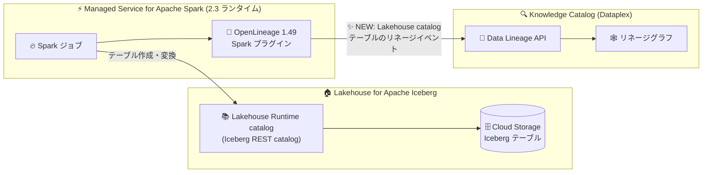

# Managed Service for Apache Spark: 新ランタイムバージョンリリース (OpenLineage 1.49 対応)

**リリース日**: 2026-08-12

**サービス**: Managed Service for Apache Spark (旧 Google Cloud Serverless for Apache Spark)

**機能**: 新サブマイナーランタイムバージョン (1.2.86 / 2.2.86 / 2.3.39) と OpenLineage アップデート

**ステータス**: Announcement (新ランタイムバージョン)

📊 [このアップデートのインフォグラフィックを見る](https://takech9203.github.io/google-cloud-news-summary/20260812-managed-spark-runtime-openlineage-updates.html)

## 概要

Managed Service for Apache Spark (旧 Google Cloud Serverless for Apache Spark) の新しいサブマイナーランタイムバージョン **1.2.86、2.2.86、2.3.39** がリリースされました。今回のリリースの目玉は 2.3 ランタイムにおける OpenLineage 関連の更新で、OpenLineage が **バージョン 1.49** にアップグレードされ、**Lakehouse Runtime catalog を使用して作成されたテーブルのリネージ (系譜) 追跡**がサポートされました。

Managed Service for Apache Spark は、OpenLineage Spark プラグインを通じて Data Lineage API と統合されており、Spark ジョブが実行されるとデータリネージイベントをキャプチャして Knowledge Catalog (Dataplex) に発行します。今回のアップデートにより、Google Cloud のマネージドレイクハウス基盤である Lakehouse for Apache Iceberg の Lakehouse Runtime catalog で作成した Iceberg テーブルについても、データの流れと変換を追跡できるようになりました。

また、OpenLineage が複雑な SQL クエリ文字列をパースする際に発生していたセグメンテーションフォルト (segmentation fault) も修正されており、リネージ機能を有効にした環境での安定性が向上しています。データガバナンスやリネージ追跡を重視するデータエンジニアリングチームにとって重要なアップデートです。

**アップデート前の課題**

- Lakehouse Runtime catalog を使用して作成されたテーブルは OpenLineage によるリネージ追跡の対象外であり、Iceberg テーブルのデータの流れを Knowledge Catalog 上で一貫して可視化できなかった
- OpenLineage が複雑な SQL クエリ文字列をパースする際にセグメンテーションフォルトが発生し、ジョブの安定性に影響する可能性があった

**アップデート後の改善**

- 2.3 ランタイムで OpenLineage 1.49 へのアップグレードにより、Lakehouse Runtime catalog で作成されたテーブルのリネージがサポートされ、Iceberg ベースのレイクハウス環境でもエンドツーエンドのリネージ追跡が可能になった
- 複雑な SQL クエリ文字列のパース時に発生していたセグメンテーションフォルトが修正され、リネージ有効環境での信頼性が向上した
- 1.2 / 2.2 / 2.3 の各ランタイムが最新のサブマイナーバージョンに更新され、継続的なメンテナンスが提供された

## アーキテクチャ図



2.3 ランタイムの Spark ジョブが Lakehouse Runtime catalog 経由で Iceberg テーブルを作成・変換すると、OpenLineage 1.49 プラグインがリネージイベントをキャプチャし、Data Lineage API を通じて Knowledge Catalog のリネージグラフに反映されます。

## サービスアップデートの詳細

### 主要機能

1. **新サブマイナーランタイムバージョンのリリース**
   - 1.2 ランタイム: **1.2.86**
   - 2.2 ランタイム: **2.2.86**
   - 2.3 ランタイム: **2.3.39**

2. **OpenLineage 1.49 へのアップグレード (2.3 ランタイム)**
   - Lakehouse Runtime catalog を使用して作成されたテーブルのリネージをサポート
   - Lakehouse Runtime catalog は Apache Iceberg REST Catalog API を実装したフルマネージド・サーバーレスのメタストアサービスで、Apache Spark、Flink、Hive、Trino、BigQuery など複数のエンジンからテーブルを共有可能
   - Iceberg テーブルに対するデータの流れと変換を Knowledge Catalog 上で追跡できるように

3. **セグメンテーションフォルトの修正 (2.3 ランタイム)**
   - OpenLineage が複雑な SQL クエリ文字列をパースする際に発生していたセグメンテーションフォルトを修正
   - リネージ機能を有効化した Spark ジョブの安定性が向上

## 技術仕様

### Spark データリネージの概要

| 項目 | 詳細 |
|------|------|
| 統合方式 | OpenLineage Spark プラグイン経由で Data Lineage API に発行 |
| OpenLineage バージョン | 1.49 (2.3 ランタイム、今回のアップデート) |
| 対応データソース | BigQuery、Cloud Storage、Lakehouse Runtime catalog テーブル (今回追加) |
| 対象外のジョブ | SparkR、Spark ストリーミングジョブ |
| リネージの参照方法 | Knowledge Catalog のリネージグラフ、Data Lineage API |
| カラムレベルリネージ | OpenLineage 1.34 以降でサポート (BigQuery と Managed Service for Apache Spark ジョブのみ) |

### リネージ有効化のプロパティ

Spark ジョブでリネージのネームスペースやアプリ名をカスタマイズする場合は、以下のプロパティを指定します (省略時はプロジェクト ID とアプリ名がデフォルト値として使用されます)。

```
spark.openlineage.namespace=CUSTOM_NAMESPACE
spark.openlineage.appName=CUSTOM_APPNAME
```

## 設定方法

### 前提条件

1. Data Lineage API が有効化されていること
2. カスタムサービスアカウントを使用する場合、`roles/dataproc.worker` または `roles/datalineage.editor` などのロールが付与されていること

### 手順

#### ステップ 1: 新しいランタイムバージョンを指定してバッチを送信

```bash
gcloud dataproc batches submit pyspark my_job.py \
  --project=PROJECT_ID \
  --region=REGION \
  --version=2.3 \
  --properties=spark.openlineage.namespace=my-namespace
```

`--version=2.3` を指定すると最新の 2.3 サブマイナーバージョン (2.3.39) が使用されます。特定のサブマイナーバージョンに固定することも可能です。

#### ステップ 2: Lakehouse Runtime catalog テーブルを作成するジョブを実行

```python
spark = SparkSession.builder.appName("lineage-demo") \
    .config('spark.sql.catalog.my_catalog', 'org.apache.iceberg.spark.SparkCatalog') \
    .config('spark.sql.catalog.my_catalog.type', 'rest') \
    .config('spark.sql.catalog.my_catalog.uri', 'https://biglake.googleapis.com/iceberg/v1/restcatalog') \
    .config('spark.sql.catalog.my_catalog.warehouse', 'WAREHOUSE_PATH') \
    .getOrCreate()

spark.sql("CREATE TABLE my_catalog.ns.sales_summary AS SELECT ... FROM my_catalog.ns.raw_sales")
```

作成されたテーブルのリネージイベントが OpenLineage 1.49 によりキャプチャされ、Knowledge Catalog のリネージグラフで確認できます。

## メリット

### ビジネス面

- **データガバナンスの強化**: Iceberg ベースのレイクハウス環境でもデータの出所と変換経路を追跡でき、監査やコンプライアンス対応 (PII データの流れの確認など) が容易になる
- **影響分析の効率化**: テーブルの廃止や移行の際に、下流のレポートやダッシュボードへの影響をリネージグラフで事前に特定できる

### 技術面

- **レイクハウスとリネージの統合**: Lakehouse Runtime catalog で作成した Iceberg テーブルが Knowledge Catalog のリネージグラフに統合され、BigQuery と Spark をまたぐエンドツーエンドの可視性が得られる
- **安定性の向上**: 複雑な SQL パース時のセグメンテーションフォルト修正により、リネージ有効環境での本番ジョブの信頼性が向上する

## デメリット・制約事項

### 制限事項

- Lakehouse Runtime catalog テーブルのリネージサポートは 2.3 ランタイム (OpenLineage 1.49) が対象。1.2 / 2.2 ランタイムのアップデート内容としては明記されていない
- データリネージは SparkR および Spark ストリーミングジョブには対応していない

### 考慮すべき点

- リネージ機能を利用するには Data Lineage API の有効化と適切な IAM ロールの設定が必要
- 特定のサブマイナーバージョンに固定している場合は、今回の修正 (セグメンテーションフォルト対応) を取り込むためにバージョン更新が必要

## ユースケース

### ユースケース 1: Iceberg レイクハウスのエンドツーエンドリネージ追跡

**シナリオ**: データエンジニアリングチームが Lakehouse Runtime catalog 上の Iceberg テーブルを Spark で作成・変換し、BigQuery からも参照している。データガバナンス担当者が PII データの流れを監査する必要がある。

**効果**: 2.3 ランタイム (OpenLineage 1.49) を使用することで、Spark ジョブによる Lakehouse catalog テーブルの作成・変換がリネージグラフに自動的に記録され、ソースから下流テーブルまでのデータの流れを一元的に監査できる。

### ユースケース 2: 複雑な SQL を含むリネージ有効ジョブの安定運用

**シナリオ**: 複雑な SQL クエリを多用する ETL パイプラインでリネージを有効化していたが、OpenLineage の SQL パース時にセグメンテーションフォルトが発生するリスクがあった。

**効果**: 最新の 2.3.39 ランタイムに更新することで、複雑な SQL クエリ文字列のパースに起因するクラッシュが解消され、リネージを有効にしたまま安定してパイプラインを運用できる。

## 料金

新ランタイムバージョンの利用自体による追加料金はありません。Managed Service for Apache Spark (サーバーレス) の料金は、使用した DCU (Data Compute Unit) とシャッフルストレージに基づく従量課金です。詳細は [Serverless for Apache Spark の料金ページ](https://cloud.google.com/dataproc-serverless/pricing) を参照してください。

## 利用可能リージョン

Managed Service for Apache Spark が利用可能なすべてのリージョンで新ランタイムバージョンを利用できます。詳細は[公式ドキュメント](https://cloud.google.com/dataproc-serverless/docs/concepts/versions/dataproc-serverless-versions)を参照してください。

## 関連サービス・機能

- **Lakehouse for Apache Iceberg (Lakehouse Runtime catalog)**: Apache Iceberg REST Catalog API を実装したフルマネージドメタストア。今回のアップデートで作成テーブルのリネージ追跡に対応
- **Knowledge Catalog (Dataplex)**: Data Lineage API とリネージグラフを提供し、Spark ジョブがキャプチャしたリネージイベントを可視化
- **BigQuery**: Lakehouse Runtime catalog のテーブルを `project.catalog.namespace.table` 構文でクエリ可能。カラムレベルリネージにも対応
- **Cloud Storage**: Iceberg テーブルのメタデータおよびデータファイル (Parquet など) の格納先

## 参考リンク

- 📊 [インフォグラフィック](https://takech9203.github.io/google-cloud-news-summary/20260812-managed-spark-runtime-openlineage-updates.html)
- [公式リリースノート](https://docs.cloud.google.com/release-notes#August_12_2026)
- [Serverless for Apache Spark ランタイムバージョン](https://cloud.google.com/dataproc-serverless/docs/concepts/versions/dataproc-serverless-versions)
- [Spark データリネージの利用ガイド](https://docs.cloud.google.com/managed-spark/docs/guides/spark-lineage)
- [Lakehouse Runtime catalog の概要](https://docs.cloud.google.com/lakehouse/docs/about-lakehouse-catalogs)
- [テーブルレベル・カラムレベルリネージ](https://docs.cloud.google.com/dataplex/docs/lineage-views)
- [料金ページ](https://cloud.google.com/dataproc-serverless/pricing)

## まとめ

今回のランタイムアップデートは、Iceberg ベースのレイクハウスアーキテクチャとデータリネージの統合を大きく前進させるものです。Lakehouse Runtime catalog を利用しているチームは、2.3 ランタイム (2.3.39 以降) に更新することで、Iceberg テーブルのリネージ追跡と SQL パースの安定性向上の両方を享受できます。リネージを有効化している既存ワークロードは、セグメンテーションフォルト修正を取り込むため最新サブマイナーバージョンへの更新を推奨します。

---

**タグ**: #ManagedServiceForApacheSpark #ServerlessSpark #OpenLineage #DataLineage #Lakehouse #ApacheIceberg #KnowledgeCatalog #Dataplex
