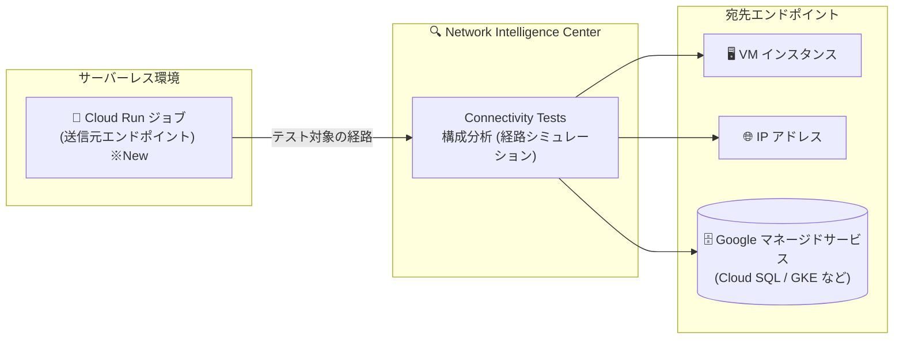

# Network Intelligence Center: Connectivity Tests が Cloud Run ジョブを送信元エンドポイントとしてサポート

**リリース日**: 2026-08-12

**サービス**: Network Intelligence Center

**機能**: Connectivity Tests - Cloud Run ジョブを送信元エンドポイントとした接続テスト

**ステータス**: 提供中

📊 [このアップデートのインフォグラフィックを見る](https://takech9203.github.io/google-cloud-news-summary/20260812-network-intelligence-center-connectivity-tests-cloud-run-job.html)

## 概要

Network Intelligence Center の Connectivity Tests が、Cloud Run ジョブを送信元エンドポイントとした接続テストをサポートしました。これにより、Cloud Run ジョブから VM インスタンス、IP アドレス、Google マネージドサービスなど、Connectivity Tests がサポートする任意の宛先エンドポイントへの到達可能性を診断できるようになりました。

Connectivity Tests は、ネットワークエンドポイント間の接続性を検証する診断ツールです。VPC ネットワーク、Cloud VPN トンネル、VLAN アタッチメントを通過するパケットの想定転送経路をシミュレートして構成を分析し、一部のシナリオではデータプレーンでのライブ分析も実行します。今回のアップデートで、バッチ処理やデータ変換などに使われる Cloud Run ジョブについても、実行前・実行時のネットワーク接続問題を体系的に診断できるようになりました。

Cloud Run ジョブでデータベースへのバッチ書き込みや外部 API 連携を行うワークロードを運用するチームにとって、「ジョブがなぜ宛先に到達できないのか」をコンソール・gcloud・API から調査できる点が主要な価値です。

**アップデート前の課題**

- Connectivity Tests の送信元として選択できるサーバーレスエンドポイントは Cloud Run リビジョン (サービス) や Cloud Run functions などに限られており、Cloud Run ジョブを送信元として指定できなかった
- Cloud Run ジョブからの接続問題 (ファイアウォールルール、ルーティング、egress 設定など) を、Connectivity Tests の構成分析による経路トレースで診断する手段がなかった

**アップデート後の改善**

- Cloud Run ジョブを送信元エンドポイントとして選択し、VM インスタンスをはじめとするサポート対象の任意の宛先への接続テストを作成できるようになった
- Google Cloud コンソールに加えて、gcloud CLI の `--source-cloud-run-job` フラグ、Network Management API の `source.cloudRunJob` フィールドからテストを作成できるようになった
- 送信元の Cloud Run ジョブが別プロジェクトにある場合でも、コンソールで送信元エンドポイントのプロジェクトを選択してテストできる

## アーキテクチャ図



Cloud Run ジョブを送信元として Connectivity Tests に指定すると、ジョブから宛先 (VM インスタンスやその他のサポート対象エンドポイント) までの想定転送経路が分析され、到達可能性の診断結果が表示されます。

## サービスアップデートの詳細

### 主要機能

1. **Cloud Run ジョブを送信元とした接続テストの作成**
   - 送信元エンドポイントとして「Cloud Run ジョブ」を選択し、ジョブのプロジェクトと対象ジョブを指定してテストを作成できる
   - 宛先には VM インスタンスのほか、Connectivity Tests がサポートする任意のエンドポイント (IP アドレス、Google マネージドサービスなど) を指定できる

2. **コンソール / gcloud / API の 3 つのインターフェースに対応**
   - コンソール: 「接続テストを作成」で Source endpoint に「Cloud Run job」を選択
   - gcloud: `gcloud network-management connectivity-tests create` コマンドの `--source-cloud-run-job` フラグで指定
   - API: `projects.locations.global.connectivityTests.create` メソッドの `source.cloudRunJob` フィールドで指定

3. **プロトコル選択とポート指定**
   - デフォルトのプロトコルは TCP。TCP または UDP を選択した場合は宛先ポートを指定できる
   - サーバーレス VPC アクセスコネクタを使用する場合、サポートされるプロトコルは TCP と UDP のみ

## 技術仕様

### テスト作成時の主なパラメータ

| 項目 | 詳細 |
|------|------|
| 送信元 (Cloud Run ジョブ) URI | `projects/PROJECT/locations/REGION/jobs/JOB_NAME` 形式 |
| gcloud フラグ | `--source-cloud-run-job=CLOUD_RUN_JOB` |
| API フィールド | `source.cloudRunJob` |
| 宛先 | VM インスタンスほか、サポートされる任意のエンドポイント |
| プロトコル | デフォルトは TCP (サーバーレス VPC アクセスコネクタ利用時は TCP / UDP のみ) |
| 宛先ポート | TCP / UDP のテスト作成時のみ指定 |

### API リクエスト例

```json
POST https://networkmanagement.googleapis.com/v1/projects/PROJECT_ID/locations/global/connectivityTests?testId=TEST_ID
{
  "protocol": "TCP",
  "source": {
    "cloudRunJob": "projects/my-project/locations/us-central1/jobs/my-cloud-run-job"
  },
  "destination": {
    "instance": "projects/my-project/zones/us-central1-a/instances/my-instance",
    "ipAddress": "DESTINATION_IP_ADDRESS",
    "port": 80
  }
}
```

## 設定方法

### 手順

#### ステップ 1: コンソールで接続テストを作成

1. Google Cloud コンソールで「Connectivity Tests」ページに移動する
2. 「接続テストを作成」をクリックし、テスト名とプロトコルを入力する
3. Source endpoint で「Cloud Run job」を選択し、ジョブのプロジェクトとテスト対象の Cloud Run ジョブを選択する
4. Destination endpoint で「VM instance」などの宛先を選択し、必要に応じて宛先ポートを入力する
5. 「作成」をクリックすると、テスト完了後に結果が表示される

#### ステップ 2: gcloud CLI で接続テストを作成

```bash
gcloud network-management connectivity-tests create NAME \
  --protocol=PROTOCOL \
  --source-cloud-run-job=projects/my-project/locations/us-central1/jobs/my-cloud-run-job \
  --destination-instance=projects/my-project/zones/us-central1-a/instances/my-instance \
  --destination-ip-address=DESTINATION_IP_ADDRESS \
  --destination-port=DESTINATION_PORT
```

宛先 IP アドレスは宛先 VM インスタンスが持つ IP アドレスのいずれかを指定します。宛先ポートは TCP または UDP のテストを作成する場合のみ指定します。

## メリット

### ビジネス面

- **障害対応時間の短縮**: バッチ処理を担う Cloud Run ジョブの接続障害 (データベースや API への到達不可) の原因を、構成分析の結果から特定でき、トラブルシューティングを迅速化できる
- **リリース前の事前検証**: ジョブのデプロイ後に実行時エラーで気付くのではなく、接続テストでネットワーク構成を事前に検証できる

### 技術面

- **サーバーレスワークロードの診断範囲拡大**: Cloud Run リビジョンや Cloud Run functions に加えて Cloud Run ジョブも送信元として扱えるようになり、Cloud Run のワークロード形態を通じた一貫した接続診断が可能になった
- **IaC / 自動化との親和性**: gcloud CLI と Network Management API の両方に対応しているため、CI/CD パイプラインやスクリプトからの自動テストに組み込める

## デメリット・制約事項

### 考慮すべき点

- サーバーレス VPC アクセスコネクタを使用する場合、テストでサポートされるプロトコルは TCP と UDP のみ
- 宛先ポートの指定は TCP または UDP を選択した場合のみ有効
- Connectivity Tests の構成分析は想定転送経路のシミュレーションであり、ライブデータプレーン分析はサポートされる経路のシナリオでのみ実行される

## ユースケース

### ユースケース 1: バッチジョブからデータベース VM への接続診断

**シナリオ**: 夜間バッチとして実行される Cloud Run ジョブが、VPC 内の VM 上で稼働するデータベースに接続できず失敗する。ファイアウォールルールかルーティングか、原因の切り分けが必要。

**実装例**:
```bash
gcloud network-management connectivity-tests create batch-to-db-test \
  --protocol=TCP \
  --source-cloud-run-job=projects/my-project/locations/us-central1/jobs/nightly-batch \
  --destination-instance=projects/my-project/zones/us-central1-a/instances/db-vm \
  --destination-ip-address=10.128.0.10 \
  --destination-port=5432
```

**効果**: ジョブから VM までの想定経路の構成分析により、通信をブロックしている構成 (ファイアウォールルールなど) を特定できる。

### ユースケース 2: デプロイパイプラインでの接続事前検証

**シナリオ**: 新しい Cloud Run ジョブをデプロイする際、接続先エンドポイントへの到達可能性を CI/CD パイプラインで自動検証したい。

**効果**: Network Management API 経由で接続テストを自動作成・実行することで、ネットワーク構成の不備を本番実行前に検出できる。

## 料金

Connectivity Tests を含む Network Intelligence Center の料金は、公式の料金ページを参照してください。

- [Network Intelligence Center の料金](https://cloud.google.com/network-intelligence-center/pricing)

## 関連サービス・機能

- **Cloud Run (ジョブ)**: 今回のアップデートで送信元エンドポイントとして指定可能になったサーバーレス実行環境。バッチ処理や一時的なタスクの実行に使用される
- **Network Management API**: Connectivity Tests のテスト作成・管理に使用する API (`networkmanagement.googleapis.com`)
- **サーバーレス VPC アクセス**: サーバーレス環境から VPC ネットワークへの egress 経路を提供するコネクタ。コネクタ利用時のテストは TCP / UDP のみサポート
- **Compute Engine / Cloud SQL / GKE**: 接続テストの宛先エンドポイントとして指定できる代表的なリソース

## 参考リンク

- 📊 [インフォグラフィック](https://takech9203.github.io/google-cloud-news-summary/20260812-network-intelligence-center-connectivity-tests-cloud-run-job.html)
- [公式リリースノート](https://docs.cloud.google.com/release-notes#August_12_2026)
- [ドキュメント: Test from a Cloud Run job to a destination](https://docs.cloud.google.com/network-intelligence-center/docs/connectivity-tests/how-to/running-connectivity-tests)
- [Connectivity Tests の概要](https://docs.cloud.google.com/network-intelligence-center/docs/connectivity-tests/concepts/overview)
- [gcloud network-management connectivity-tests create リファレンス](https://docs.cloud.google.com/sdk/gcloud/reference/network-management/connectivity-tests/create)
- [料金ページ](https://cloud.google.com/network-intelligence-center/pricing)

## まとめ

Connectivity Tests の送信元エンドポイントに Cloud Run ジョブが加わり、サーバーレスバッチワークロードのネットワーク診断がコンソール・gcloud・API から行えるようになりました。Cloud Run ジョブで VPC 内リソースや外部エンドポイントに接続するワークロードを運用しているチームは、接続障害時の切り分け手段およびデプロイ前の事前検証手段として本機能の活用を検討することを推奨します。

---

**タグ**: Network Intelligence Center, Connectivity Tests, Cloud Run, ネットワーク診断, サーバーレス
