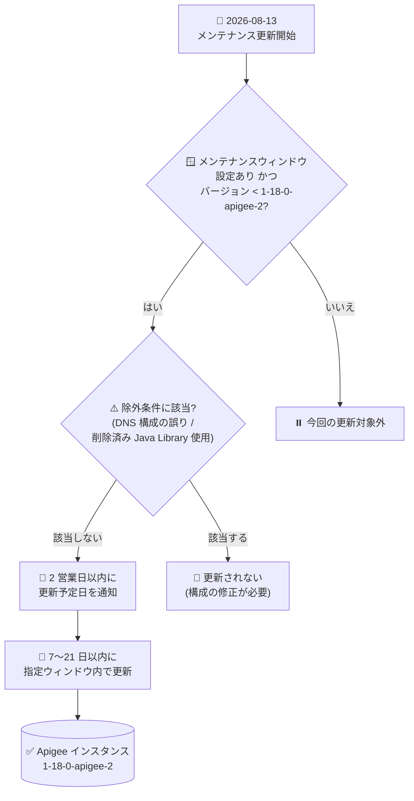

# Apigee X: メンテナンスウィンドウ設定インスタンスの 1-18-0-apigee-2 への定期メンテナンス更新開始

**リリース日**: 2026-08-13

**サービス**: Apigee X

**機能**: メンテナンスウィンドウ設定インスタンスの定期メンテナンス更新 (1-18-0-apigee-2)

**ステータス**: Announcement (メンテナンス)

📊 [このアップデートのインフォグラフィックを見る](https://takech9203.github.io/google-cloud-news-summary/20260813-apigee-x-maintenance-1-18-0-apigee-2.html)

## 概要

2026 年 8 月 13 日、Google はメンテナンスウィンドウが設定された Apigee インスタンスに対する定期メンテナンス更新を開始しました。優先メンテナンスウィンドウ (preferred maintenance window) を設定しているインスタンスで、バージョンが 1-18-0-apigee-2 未満の場合、今後 7 〜 21 日以内に 1-18-0-apigee-2 へ更新されます。更新予定日を記載した通知は、2 営業日以内に送信されます。

更新先バージョンの 1-18-0-apigee-2 は 2026 年 7 月 27 日にリリースされたもので、Java Callout ポリシーのセキュリティ修正 (Bug ID: 534852923) や Apigee インフラストラクチャのセキュリティ修正、ライブラリの更新が含まれています。今回のメンテナンスにより、メンテナンスウィンドウを設定している本番インスタンスにもこれらの修正が適用されます。

なお、以下の 2 つの条件のいずれかに該当するインスタンスは今回の更新対象外となります。該当する場合は、事前に構成の修正が必要です。

1. Known Issue 445936920 に記載された DNS 構成の誤り (DNS misconfiguration) があるインスタンス
2. 2025 年 10 月 16 日付の Apigee リリースノートに記載のとおり、削除済みの Apigee Java Library を使用しているインスタンス

**アップデート前の課題**

- メンテナンスウィンドウを設定したインスタンスは、設定していないインスタンスより後にメンテナンスが適用されるため、1-18-0-apigee-2 に含まれる Java Callout ポリシーのセキュリティ修正などが未適用の状態だった
- 更新の適用時期が確定しておらず、運用チームは変更管理の計画を立てられなかった

**アップデート後の改善**

- メンテナンスウィンドウ設定済みかつ 1-18-0-apigee-2 未満のインスタンスが、7 〜 21 日以内に 1-18-0-apigee-2 へ自動更新される
- 更新予定日を記載した通知が 2 営業日以内に送信され、事前にメンテナンス日程を把握できる
- ユーザーが指定した曜日・時刻 (メンテナンスウィンドウ) と更新順序 (Week 1 / Week 2) を尊重してメンテナンスが実施される

## アーキテクチャ図



メンテナンスウィンドウを設定したインスタンスが更新対象かどうかの判定フローと、通知から更新完了までの流れを示しています。

## サービスアップデートの詳細

### 主要機能

1. **1-18-0-apigee-2 への自動更新**
   - 優先メンテナンスウィンドウを設定済みで、バージョンが 1-18-0-apigee-2 未満のインスタンスが対象
   - 2026 年 8 月 13 日から 7 〜 21 日以内に更新が実施される
   - 1-18-0-apigee-2 (2026 年 7 月 27 日リリース) には Java Callout ポリシーのセキュリティ修正 (Bug ID: 534852923)、インフラストラクチャのセキュリティ修正、ライブラリ更新が含まれる

2. **更新予定日の事前通知**
   - 更新予定日を記載した通知が 2 営業日以内に送信される
   - 通知を受け取るには、メンテナンスウィンドウの設定に加えて、Google Cloud コンソールの「ユーザー設定 > コミュニケーション」で Apigee のメンテナンスウィンドウ通知をオプトインしておく必要がある

3. **更新対象外となる例外条件**
   - **DNS 構成の誤り**: Known Issue 445936920 に該当するインスタンス。Apigee は 1-16-0-apigee-2 にあった自動 DNS フォールバック機能を削除しており、従来検出されなかった DNS 構成の誤りが DNS エラーとして顕在化する。ランタイムログで DNS 解決エラーを確認できる
   - **削除済み Apigee Java Library の使用**: 2025 年 10 月 16 日付の Apigee リリースノートに記載された、削除済みの Java Library を使用しているインスタンス

## 技術仕様

### メンテナンス更新の概要

| 項目 | 詳細 |
|------|------|
| 開始日 | 2026 年 8 月 13 日 |
| 対象 | メンテナンスウィンドウ設定済み、かつバージョンが 1-18-0-apigee-2 未満のインスタンス |
| 更新先バージョン | 1-18-0-apigee-2 (2026 年 7 月 27 日リリース) |
| 更新期間 | 開始から 7 〜 21 日以内 |
| 通知 | 更新予定日を記載した通知を 2 営業日以内に送信 |
| 除外条件 1 | DNS 構成の誤り (Known Issue 445936920) |
| 除外条件 2 | 削除済み Apigee Java Library の使用 (2025 年 10 月 16 日付リリースノート参照) |

### メンテナンスウィンドウの設定項目

| 設定 | 説明 |
|------|------|
| Maintenance window | メンテナンスを開始する曜日と時刻 (UTC で指定) |
| Order of update (maintenanceChannel) | 同一リージョン内の他インスタンスとの相対的な更新順序。Week 1 または Week 2 を指定。Week 2 のインスタンスは、同じメンテナンスウィンドウ・同一リージョンの Week 1 インスタンスの 1 週間後に更新される |

- メンテナンスウィンドウはインスタンスごとに 1 つのみ指定可能
- 同一組織内の複数インスタンスにウィンドウを設定する場合は、メンテナンス操作の重複を避けるため各ウィンドウの間隔を 12 時間以上空けることが推奨される
- 設定には Apigee Organization Admin ロール (`roles/apigee.admin`) または `apigee.instances.update` 権限を含むロールが必要

## 設定方法

### 前提条件

1. Apigee (Apigee X) のインスタンスが存在すること (Apigee hybrid は対象外)
2. `roles/apigee.admin` または `apigee.instances.update` 権限を含むロールが付与されていること

### 手順

#### ステップ 1: 現在のメンテナンス設定とスケジュールの確認

```bash
AUTH="Authorization: Bearer $(gcloud auth print-access-token)"
curl -H "$AUTH" \
  "https://apigee.googleapis.com/v1/organizations/ORGANIZATION_ID/instances/INSTANCE_ID"
```

レスポンス内の `maintenanceUpdatePolicy` (設定済みウィンドウ) と `scheduledMaintenance` (予定されているメンテナンスの開始時刻) を確認します。今回の更新対象であれば、通知受領後に `scheduledMaintenance.startTime` で予定日時を確認できます。

#### ステップ 2: メンテナンスウィンドウの設定・変更 (必要な場合)

```bash
AUTH="Authorization: Bearer $(gcloud auth print-access-token)"
curl -X PATCH \
  -H "$AUTH" \
  -H "Content-Type: application/json" \
  -d '{
    "maintenanceUpdatePolicy": {
      "maintenanceWindows": [
        { "day": "SUNDAY", "startTime": { "hours": 23 } }
      ],
      "maintenanceChannel": "WEEK1"
    }
  }' \
  "https://apigee.googleapis.com/v1/organizations/ORGANIZATION_ID/instances/INSTANCE_ID?updateMask=maintenanceUpdatePolicy.maintenanceWindows,maintenanceUpdatePolicy.maintenanceChannel"
```

`startTime` は UTC で指定します。なお、すでにスケジュール済みのメンテナンスイベントには設定変更は適用されず、変更は今後のメンテナンスロールアウトから有効になります。

#### ステップ 3: 除外条件への該当確認

```bash
# ランタイムログで DNS 解決エラーの有無を確認 (Known Issue 445936920)
gcloud logging read 'resource.type="apigee.googleapis.com/Environment"' \
  --project=PROJECT_ID --limit=50
```

DNS 解決エラーが記録されている場合は DNS 構成を修正してください。また、2025 年 10 月 16 日付リリースノートに記載された削除済み Apigee Java Library を JavaCallout ポリシーなどで使用していないかを確認してください。いずれかに該当すると今回の更新対象外となります。

## メリット

### ビジネス面

- **セキュリティリスクの低減**: 1-18-0-apigee-2 に含まれる Java Callout ポリシーおよびインフラストラクチャのセキュリティ修正が本番インスタンスに適用される
- **計画的な変更管理**: 更新予定日が事前通知されるため、業務影響の少ない時間帯を選んだ変更管理やステークホルダーへの周知が可能

### 技術面

- **業務時間帯を避けた更新**: ユーザーが指定した曜日・時刻 (メンテナンスウィンドウ) に沿って更新が実施される
- **段階的なロールアウト**: Week 1 / Week 2 の更新順序を使い、ステージング環境で先行検証してから本番環境を更新する運用が可能

## デメリット・制約事項

### 制限事項

- DNS 構成の誤り (Known Issue 445936920) があるインスタンスは更新されない
- 削除済みの Apigee Java Library を使用しているインスタンスは更新されない
- すでにスケジュールされたメンテナンスイベントに対しては、メンテナンスウィンドウ設定の変更 (日時変更、更新順序変更、設定クリア) は適用されない

### 考慮すべき点

- メンテナンス中は、新規インスタンスの作成、環境のインスタンスへのアタッチ、エンドポイントアタッチメントの作成、一部のスケーリング操作が実行できない
- メンテナンスの所要時間は構成により異なり、通常は数時間かかる
- Apigee はメンテナンスウィンドウを最大限尊重するが、フリート全体の互換性とセキュリティ維持のため、指定時間外に更新が実施される場合がある
- 通知はメンテナンスウィンドウの設定とオプトインの両方を行ったユーザーの Google アカウントのメールアドレスに送信される (チーム用エイリアスなどは指定不可)

## ユースケース

### ユースケース 1: 本番インスタンスの更新日程の事前把握と周知

**シナリオ**: 本番の Apigee インスタンスにメンテナンスウィンドウ (日曜 23:00 UTC、Week 2) を設定している運用チームが、今回の 1-18-0-apigee-2 への更新日程を把握して社内周知したい。

**実装例**:
```bash
AUTH="Authorization: Bearer $(gcloud auth print-access-token)"
curl -H "$AUTH" \
  "https://apigee.googleapis.com/v1/organizations/ORGANIZATION_ID/instances/INSTANCE_ID" \
  | jq '{scheduledMaintenance, maintenanceUpdatePolicy}'
```

**効果**: 通知メールと API の `scheduledMaintenance` フィールドで更新予定日時を確認でき、関係者への事前周知と当日の監視体制の準備ができる。

### ユースケース 2: Week 1 / Week 2 を使った段階的な検証

**シナリオ**: ステージング環境のインスタンスを Week 1、本番環境のインスタンスを Week 2 に設定しておき、1-18-0-apigee-2 がステージングに適用された後の 1 週間で受け入れテストを実施してから本番更新を迎える。

**効果**: メンテナンスウィンドウ未設定のインスタンス (開発環境など) が最初に更新され、次に Week 1 (ステージング)、最後に Week 2 (本番) の順で更新されるため、本番適用前に問題を検出・対処する時間を確保できる。

## 料金

このメンテナンス更新自体に追加料金は発生しません。Apigee の料金体系については料金ページを参照してください。

- [Apigee 料金ページ](https://cloud.google.com/apigee/pricing)

## 利用可能リージョン

メンテナンスウィンドウを設定したすべての Apigee インスタンスが対象です (Apigee hybrid は対象外)。リージョンごとの提供状況は公式ドキュメントを参照してください。

## 関連サービス・機能

- **Apigee メンテナンスウィンドウ**: 今回の更新対象を決定する設定。曜日・時刻と更新順序 (Week 1 / Week 2) を指定できる
- **Cloud Logging**: ランタイムログで DNS 解決エラー (Known Issue 445936920) の有無を確認でき、インスタンス更新ログも記録される
- **JavaCallout ポリシー**: 1-18-0-apigee-2 でセキュリティ修正が行われたポリシー。削除済み Java Library を使用している場合は更新対象外となるため確認が必要

## 参考リンク

- 📊 [インフォグラフィック](https://takech9203.github.io/google-cloud-news-summary/20260813-apigee-x-maintenance-1-18-0-apigee-2.html)
- [公式リリースノート](https://docs.cloud.google.com/release-notes#August_13_2026)
- [Apigee リリースノート (1-18-0-apigee-2 / 2025 年 10 月 16 日)](https://docs.cloud.google.com/apigee/docs/release/release-notes)
- [Maintenance overview (メンテナンスの概要)](https://docs.cloud.google.com/apigee/docs/api-platform/system-administration/maintenance)
- [Manage Apigee instance maintenance windows (メンテナンスウィンドウの管理)](https://docs.cloud.google.com/apigee/docs/api-platform/system-administration/maintenance-windows)
- [Apigee Known Issues (Known Issue 445936920)](https://docs.cloud.google.com/apigee/docs/release/known-issues)
- [料金ページ](https://cloud.google.com/apigee/pricing)

## まとめ

メンテナンスウィンドウを設定した Apigee インスタンスへの 1-18-0-apigee-2 の定期メンテナンス更新が 2026 年 8 月 13 日に開始され、対象インスタンスは 7 〜 21 日以内に更新されます。運用チームは 2 営業日以内に届く通知で更新予定日を確認するとともに、DNS 構成の誤り (Known Issue 445936920) や削除済み Apigee Java Library の使用有無を点検し、更新対象外にならないよう事前に対処することを推奨します。

---

**タグ**: Apigee X, メンテナンス, メンテナンスウィンドウ, 1-18-0-apigee-2, セキュリティ修正, API 管理
