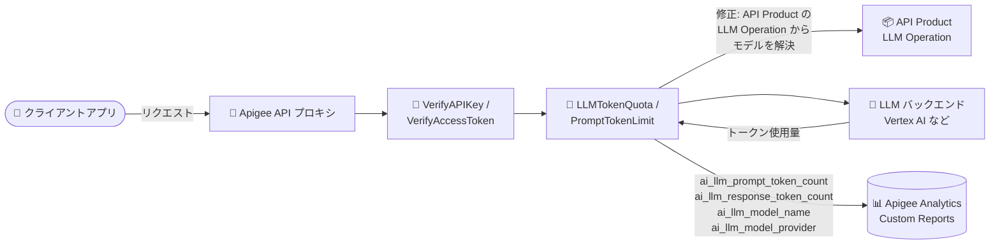

# Apigee X: 新バージョン 1-18-0-apigee-3 リリース (LLM ポリシー修正・セキュリティ修正)

**リリース日**: 2026-08-13

**サービス**: Apigee X

**機能**: Apigee 1-18-0-apigee-3 リリース (Fixed / Security / 機能追加)

**ステータス**: リリース済み (ロールアウト進行中)

📊 [このアップデートのインフォグラフィックを見る](https://takech9203.github.io/google-cloud-news-summary/20260813-apigee-x-release-1-18-0-apigee-3.html)

## 概要

2026 年 8 月 13 日、Google は Apigee の新バージョン **1-18-0-apigee-3** をリリースしました。ロールアウトは同日から開始され、全 Google Cloud ゾーンへの展開完了までに **4 営業日以上** かかる可能性があります。ロールアウトが完了するまで、インスタンスによっては本リリースの機能や修正が利用できない場合があります。

本リリースは、AI ゲートウェイ用途で重要な **LLMTokenQuota ポリシーの複数の不具合修正** と **AI/LLM 関連の Apigee アナリティクスフィールドの Custom Reports 対応**、Google Cloud BOM のアップグレード (protobuf 4.x / gRPC 1.81 / Guava 33.5)、OAuthV2 ポリシーへのオプトイン要素 `<DynamicClientIdSupported>` の追加、`apigee-ca` 証明書のローテーション機能の追加に加え、**JWT リフレッシュトークン失効処理・MessageValidation ポリシー・OAuthV2 ポリシー・HTTP ターゲットの interim-response 処理に関する複数のセキュリティ修正** を含みます。

なお、同日には別のアナウンスとして、メンテナンスウィンドウを設定済みのインスタンスに対する 1-18-0-apigee-2 へのメンテナンス更新も開始されています (詳細は既存レポート「[Apigee X メンテナンス更新 1-18-0-apigee-2](./2026-08-13-apigee-x-maintenance-1-18-0-apigee-2.md)」を参照)。本レポートは新規リリースされた 1-18-0-apigee-3 を対象とします。

**アップデート前の課題**

- LLMTokenQuota ポリシーは、API Product が複数のモデルを宣言し、かつリクエストにモデル指定がない場合、任意 (arbitrary) のクォータバケットに対して計測してしまう不具合があった (Bug ID: 542242046)
- LLMTokenQuota ポリシーは、`LLMModelSource` が省略され、リクエストボディにも model フィールドがない場合に、API Product の LLM Operation からモデルを解決できなかった (Bug ID: 492044413)
- 不正な形式の受信 gRPC リクエストフレームは、Apigee の ServiceUnavailable フォールトとして `UNAVAILABLE(14)` で報告され、アナリティクスに `x-apigee.grpc.status` が記録されなかった (Bug ID: 543022076)
- コントロールプレーンで環境が見つからない場合、watcher がすべてのルートを調整 (reconcile) できない不具合があった (Bug ID: 537657987)
- JWT リフレッシュトークンの失効処理、MessageValidation ポリシー、OAuthV2 ポリシー、HTTP ターゲットの interim-response 処理にセキュリティ上の問題が存在していた

**アップデート後の改善**

- LLMTokenQuota が正しいクォータバケットに対して計測するようになり、`LLMModelSource` 省略時は API Product の LLM Operation からモデルを解決するようになった
- LLMTokenQuota / PromptTokenLimit ポリシーを使用するプロキシで、アナリティクスフィールド `ai_llm_response_token_count`、`ai_llm_prompt_token_count`、`ai_llm_model_name`、`ai_llm_model_provider` が Custom Reports で利用可能になった。プロバイダは Apigee が自動識別してアナリティクスに公開する (Bug ID: 531731614)
- 不正な gRPC フレームはクライアントに `grpc-status INTERNAL(13)` として報告され、アナリティクスに `x-apigee.grpc.status=13` が記録されるようになった
- OAuthV2 ポリシーにオプトインの `<DynamicClientIdSupported>` boolean 要素が追加され、`true` の場合は OAuthClientContext 上に既に存在する空でない ClientID/ClientSecret が保持されるようになった (Bug ID: 67169710)
- `apigee-ca` 証明書をローテーションする機能が追加された (Bug ID: 537396574)
- フォワードプロキシサポートの修正 (Bug ID: 532147587)、および 4 件のセキュリティ問題 + インフラのセキュリティ修正が適用された

## アーキテクチャ図



AI ゲートウェイとして構成した Apigee プロキシにおける本リリースの主要修正ポイントを示しています。LLMTokenQuota がモデルを API Product の LLM Operation から正しく解決し、AI/LLM トークンメトリクスが Custom Reports で参照可能になりました。

## サービスアップデートの詳細

### 主要な修正・機能追加 (Fixed)

1. **LLMTokenQuota ポリシーの修正 (AI ゲートウェイ用途で重要)**
   - Bug ID 542242046: API Product が複数のモデルを宣言し、リクエストにモデル指定がない場合に、任意のクォータバケットに対して計測してしまう不具合を修正
   - Bug ID 492044413: `LLMModelSource` が省略され、リクエストボディに model フィールドがない場合、API Product の LLM Operation からモデルを解決するように修正
   - LLMTokenQuota は LLM ワークロードのトークン消費を管理・制御するポリシーで、`<LLMTokenUsageSource>` と `<LLMModelSource>` 要素で LLM レスポンスからトークン数、リクエスト/レスポンスからモデル名を抽出してクォータを適用する

2. **AI/LLM アナリティクスフィールドの Custom Reports 対応 (Bug ID: 531731614)**
   - LLMTokenQuota / PromptTokenLimit ポリシーを使用するプロキシで、以下のフィールドが Custom Reports で利用可能に
     - `ai_llm_response_token_count`: レスポンストークン数
     - `ai_llm_prompt_token_count`: プロンプトトークン数
     - `ai_llm_model_name`: モデル名
     - `ai_llm_model_provider`: モデルプロバイダ (Apigee が自動識別してアナリティクスに公開)

3. **Google Cloud BOM アップグレード (Bug ID: 543022076)**
   - protobuf 4.x、gRPC 1.81、Guava 33.5 へアップグレード
   - ユーザーに見える変更は 1 点のみ: 不正な形式の受信 gRPC リクエストフレームは、クライアントに `grpc-status INTERNAL(13)` として報告され、アナリティクスに `x-apigee.grpc.status=13` が記録される (従来は `UNAVAILABLE(14)` の Apigee ServiceUnavailable フォールトで、`x-apigee.grpc.status` は記録されなかった)
   - それ以外にユーザー向けの影響はないが、gcp / protobuf / gRPC に関連する本番問題は本変更に関係する可能性がある

4. **OAuthV2 ポリシー: `<DynamicClientIdSupported>` 要素の追加 (Bug ID: 67169710)**
   - オプトインの boolean XML 要素。`true` に設定すると、`AbstractOAuthStepExecution.extractClientDetails()` が OAuthClientContext 上に既に存在する空でない ClientID/ClientSecret を保持する

5. **運用系の修正・機能追加**
   - Bug ID 532147587: フォワードプロキシサポートの修正
   - Bug ID 537657987: コントロールプレーンで環境が見つからない場合に watcher がすべてのルートを調整できない不具合を修正
   - Bug ID 537396574: `apigee-ca` 証明書をローテーションする機能を追加
   - Bug ID 540861752: ApigeeDeployment カスタムリソースの conversion hub を v1alpha3 ストレージバージョンに整合 (内部変更であり、既存の ApigeeDeployment リソースへの影響なし)
   - インフラストラクチャおよびライブラリの更新

### セキュリティ修正 (Security)

| Bug ID | 修正内容 |
|--------|---------|
| 535928300 | JWT リフレッシュトークンの失効 (revocation) 処理におけるセキュリティ問題を修正 |
| 539515020 | MessageValidation ポリシーにおけるセキュリティ問題を修正 |
| 535928530 | OAuthV2 ポリシーにおけるセキュリティ問題を修正 |
| 535683286 | HTTP ターゲットの interim-response 処理におけるセキュリティ問題を修正 |
| N/A | Apigee インフラストラクチャのセキュリティ修正 |

## 技術仕様

### リリース情報

| 項目 | 詳細 |
|------|------|
| バージョン | 1-18-0-apigee-3 |
| リリース開始日 | 2026 年 8 月 13 日 |
| ロールアウト期間 | 全 Google Cloud ゾーンへの完了まで 4 営業日以上かかる可能性あり |
| 修正の種類 | Fixed (不具合修正・機能追加) + Security (セキュリティ修正) |
| BOM 更新 | protobuf 4.x / gRPC 1.81 / Guava 33.5 |

### gRPC エラー報告の変更 (Before/After)

| 項目 | 変更前 | 変更後 (1-18-0-apigee-3) |
|------|--------|--------------------------|
| 不正な受信 gRPC フレームのステータス | `UNAVAILABLE(14)` (Apigee ServiceUnavailable フォールト) | `INTERNAL(13)` |
| アナリティクス記録 | `x-apigee.grpc.status` 記録なし | `x-apigee.grpc.status=13` を記録 |

### OAuthV2 `<DynamicClientIdSupported>` の例

```xml
<OAuthV2 name="GenerateAccessToken">
  <Operation>GenerateAccessToken</Operation>
  <!-- オプトイン: true の場合、OAuthClientContext 上の
       空でない ClientID/ClientSecret を保持する -->
  <DynamicClientIdSupported>true</DynamicClientIdSupported>
</OAuthV2>
```

## メリット

### ビジネス面

- **AI ゲートウェイの課金・クォータ精度向上**: LLMTokenQuota が正しいクォータバケットとモデルを解決するため、API Product ごとのトークンクォータ (サービスプラン) を複数モデル構成でも正確に適用できる
- **AI 利用状況の可視化**: `ai_llm_*` フィールドが Custom Reports で利用可能になり、モデル別・プロバイダ別のトークン消費をレポーティングでき、コスト管理や利用分析が容易になる
- **セキュリティリスクの低減**: OAuth/JWT/メッセージ検証といった API セキュリティの中核機能に対する修正が適用される

### 技術面

- **gRPC トラブルシューティングの改善**: 不正フレームが `INTERNAL(13)` と `x-apigee.grpc.status=13` として明示的に記録されるため、クライアント起因の問題と Apigee 側の可用性問題を切り分けやすくなる
- **ルート調整の信頼性向上**: 環境がコントロールプレーンに存在しない場合でも watcher が他のルートを調整できるようになり、構成反映の信頼性が向上
- **証明書運用の改善**: `apigee-ca` 証明書のローテーション機能により、証明書ライフサイクル管理が可能になる

## デメリット・制約事項

### 制限事項

- ロールアウトは 2026 年 8 月 13 日に開始され、全ゾーンへの完了まで 4 営業日以上かかる可能性がある。完了までは機能・修正が利用できないインスタンスがある
- `<DynamicClientIdSupported>` はオプトイン (デフォルトでは無効) のため、利用するにはポリシーへの明示的な設定が必要

### 考慮すべき点

- **gRPC ステータス変更の影響確認**: gRPC プロキシを運用している場合、不正フレーム時のステータスコードが `UNAVAILABLE(14)` から `INTERNAL(13)` に変わるため、クライアント側のリトライロジックや監視アラートがステータスコードに依存している場合は確認が必要
- BOM アップグレード (protobuf / gRPC / Guava) 後に gcp / protobuf / gRPC に関連する本番問題が発生した場合、本変更との関連を疑う余地がある (リリースノートに明記)
- 同日開始のメンテナンスウィンドウ更新 (1-18-0-apigee-2 への更新) とは別のアナウンスである点に注意。メンテナンスウィンドウ経由の更新対象バージョンと本リリースのバージョンは異なる

## ユースケース

### ユースケース 1: 複数 LLM モデルを提供する AI ゲートウェイのトークンクォータ管理

**シナリオ**: API Product の LLM Operation に複数のモデル (例: 複数の Vertex AI モデル) を宣言し、コンシューマーアプリごとにトークンクォータを適用している。一部のリクエストにはモデル指定が含まれない。

**実装例**:
```xml
<LLMTokenQuota name="CheckLLMTokenQuota">
  <UseQuotaConfigInAPIProduct stepName="verify-api-key">
    <DefaultConfig>
      <Interval>1</Interval>
      <TimeUnit>hour</TimeUnit>
      <Allow>10000</Allow>
    </DefaultConfig>
  </UseQuotaConfigInAPIProduct>
  <!-- LLMModelSource を省略した場合、1-18-0-apigee-3 では
       API Product の LLM Operation からモデルが解決される -->
</LLMTokenQuota>
```

**効果**: 従来は任意のクォータバケットに計測される可能性があった構成でも、正しいモデルのクォータバケットに対して計測・制限が行われる。

### ユースケース 2: Custom Reports による LLM トークン消費の分析

**シナリオ**: LLMTokenQuota / PromptTokenLimit ポリシーを適用した AI プロキシで、モデル別・プロバイダ別のトークン消費を定期レポートとして可視化したい。

**効果**: Custom Reports で `ai_llm_prompt_token_count` と `ai_llm_response_token_count` をメトリクスに、`ai_llm_model_name` と `ai_llm_model_provider` をディメンションに指定することで、追加の StatisticsCollector 設定なしに LLM 利用状況を分析できる。

### ユースケース 3: セキュリティ修正の適用確認

**シナリオ**: OAuthV2 / JWT リフレッシュトークン / MessageValidation ポリシーを利用する API 基盤で、セキュリティ修正を確実に適用したい。

**効果**: ロールアウト完了後、インスタンスが 1-18-0-apigee-3 になっていることを確認することで、4 件のポリシー関連セキュリティ修正とインフラ修正が適用された状態で運用できる。

## 料金

本リリースはバージョン更新であり、料金体系への変更はアナウンスされていません。なお、LLMTokenQuota および OAuthV2 は Extensible policy であり、Apigee のライセンスによってはコストや使用量への影響があります。詳細は料金ページを参照してください。

- [Apigee 料金ページ](https://cloud.google.com/apigee/pricing)

## 利用可能リージョン

ロールアウトは 2026 年 8 月 13 日から開始され、全 Google Cloud ゾーンへの展開完了まで 4 営業日以上かかる可能性があります。

## 関連サービス・機能

- **Vertex AI**: Apigee を AI ゲートウェイとして構成する際の代表的な LLM バックエンド。LLMTokenQuota / PromptTokenLimit ポリシーでトークン消費を制御
- **Apigee Analytics / Custom Reports**: 本リリースで `ai_llm_*` フィールドが Custom Reports で利用可能になり、LLM 利用状況の可視化に活用
- **Apigee API Products (LLM Operation)**: LLMTokenQuota のモデル解決とクォータ設定 (サービスプラン) の定義元
- **Apigee hybrid**: ApigeeDeployment カスタムリソースの conversion hub 整合 (内部変更) が含まれる

## 参考リンク

- 📊 [インフォグラフィック](https://takech9203.github.io/google-cloud-news-summary/20260813-apigee-x-release-1-18-0-apigee-3.html)
- [公式リリースノート](https://docs.cloud.google.com/release-notes#August_13_2026)
- [LLMTokenQuota ポリシー リファレンス](https://docs.cloud.google.com/apigee/docs/api-platform/reference/policies/llm-token-quota-policy)
- [PromptTokenLimit ポリシー リファレンス](https://docs.cloud.google.com/apigee/docs/api-platform/reference/policies/prompt-token-limit-policy)
- [OAuthV2 ポリシー リファレンス](https://docs.cloud.google.com/apigee/docs/api-platform/reference/policies/oauthv2-policy)
- [Apigee アナリティクス リファレンス (メトリクス・ディメンション)](https://docs.cloud.google.com/apigee/docs/api-platform/analytics/analytics-reference)
- [料金ページ](https://cloud.google.com/apigee/pricing)

## まとめ

Apigee 1-18-0-apigee-3 は、AI ゲートウェイ用途における LLMTokenQuota のクォータ計測・モデル解決の不具合修正と、`ai_llm_*` アナリティクスフィールドの Custom Reports 対応により、LLM API 管理の精度と可視性を大きく改善するリリースです。あわせて OAuthV2 / JWT / MessageValidation などのセキュリティ修正も含まれるため、ロールアウト完了後にインスタンスのバージョンを確認することを推奨します。gRPC プロキシを運用している場合は、不正フレーム時のステータスコードが `UNAVAILABLE(14)` から `INTERNAL(13)` に変わる点をクライアントのリトライロジックや監視設定と照らして確認してください。

---

**タグ**: Apigee X, リリース, セキュリティ修正, LLMTokenQuota, PromptTokenLimit, AI ゲートウェイ, OAuthV2, gRPC, アナリティクス
