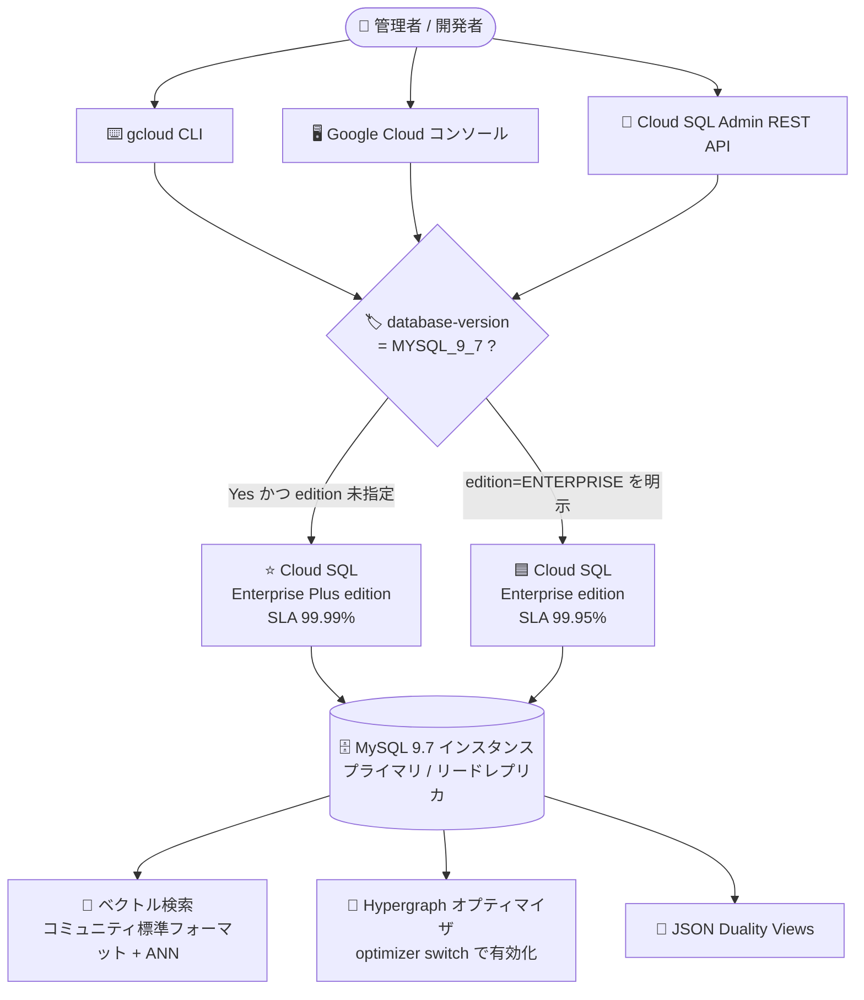
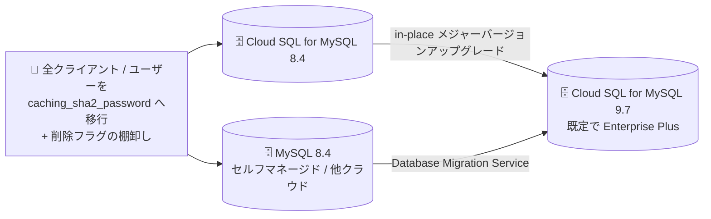

# Cloud SQL for MySQL: MySQL 9.7 が GA (一般提供) に

**リリース日**: 2026-08-13

**サービス**: Cloud SQL for MySQL

**機能**: MySQL 9.7 サポート (ベクトル検索の新フォーマット / Hypergraph オプティマイザ / JSON Duality Views / アップグレード・移行パス)

**ステータス**: GA (一般提供)

📊 [このアップデートのインフォグラフィックを見る](https://takech9203.github.io/google-cloud-news-summary/20260813-cloud-sql-mysql-9-7-ga.html)

## 概要

2026 年 8 月 13 日、Cloud SQL for MySQL において **MySQL 9.7 が GA (一般提供)** になりました。Cloud SQL のサポート対象メジャーバージョンとして `MySQL 9.7` (マイナーバージョン 9.7.1) が追加され、通常サポート (regular support) の開始日は 2026 年 8 月 6 日です。これにより Cloud SQL for MySQL がサポートするメジャーバージョンは 5.6 / 5.7 / 8.0 / 8.4 / 9.7 の 5 系列となりました (デフォルトのデータベースバージョンは引き続き MySQL 8.4)。

このリリースの最大のポイントは、**MySQL 9.7 をバージョンとして指定してインスタンス (プライマリまたはリードレプリカ) を作成すると、gcloud CLI・Google Cloud コンソール・REST API のいずれの経路であっても、Cloud SQL edition がデフォルトで Cloud SQL Enterprise Plus edition になる** という挙動です。MySQL 8.4 と同じ扱いであり、edition を明示しない場合は自動的に Enterprise Plus が選択されます。Enterprise Plus は 99.99% の可用性 SLA (メンテナンスを含む)、データキャッシュ、最適化された書き込み、読み取りプール、Managed Connection Pooling、最大 35 日の PITR ログ保持などを備えますが、Enterprise edition より vCPU・メモリの単価が高くなるため、コスト面の把握が必要です。

機能面では、コミュニティ版 MySQL 9.x で導入されたベクトルサポートへの追従 (コミュニティ標準のベクトルストレージフォーマット + ANN ベクトルインデックス)、複雑な多テーブル結合向けの Hypergraph オプティマイザ、リレーショナル SQL と階層的な JSON ドキュメントモデルを橋渡しする JSON Duality Views がサポートされます。また、Cloud SQL for MySQL 8.4 からの in-place メジャーバージョンアップグレードと、Database Migration Service (DMS) による MySQL 8.4 からの移行という 2 つの移行パスが用意されました。一方で、**レガシーの `mysql_native_password` 認証プラグインは Cloud SQL for MySQL 9.7 で完全に削除されます**。組み込み認証を使うすべてのクライアントを `caching_sha2_password` に移行することが必須の前提条件となります。

**アップデート前の課題**

- Cloud SQL for MySQL の最新メジャーバージョンは 8.4 までで、MySQL 9.x 系のコミュニティ機能 (コミュニティ標準のベクトル型、Hypergraph オプティマイザ、JSON Duality Views) をマネージドサービス上で利用できなかった
- Cloud SQL のベクトル検索は独自仕様に依存していた。ベクトル列の識別に特別な `COMMENT` アノテーションと `CONSTRAINT` を使い、ストレージフォーマットは `VARBINARY`、型宣言は `VECTOR(dimensions) USING VARBINARY` が必須で、次元数の上限は 16,000、デフォルト値なしだった
- 1 テーブルにベクトル埋め込み列は 1 つのみという制約が、インデックスの有無にかかわらず適用されていた
- MySQL 8.4 では `mysql_native_password` は「非推奨」だが既存アカウントは引き続き接続できたため、認証プラグインの移行を先延ばしにしたまま運用できてしまっていた
- `innodb_log_file_size`、`innodb_undo_tablespaces`、`replica_parallel_type` などの旧世代フラグに依存した構成が残っていても検知されなかった

**アップデート後の改善**

- MySQL 9.7 (9.7.1) が Cloud SQL のサポート対象メジャーバージョンとして GA になり、マネージド環境で MySQL 9.x の主要機能を利用できるようになった
- ベクトル検索がコミュニティ標準のストレージフォーマットに移行し、`COMMENT` / `CONSTRAINT` による識別が不要になった。次元数上限は 16,383 に拡大し、デフォルト 2,048 が設定される。`USING VARBINARY` の指定も任意になった
- インデックスを作成しないテーブルであれば、複数のベクトル埋め込み列を持てるようになった
- ベクトル埋め込みの追加自体に `cloudsql_vector` フラグが不要になり、ベクトルインデックス作成と ANN 検索を行う場合にのみ `cloudsql_vector` を `on` にする形に簡素化された
- 複雑な多テーブル結合に対して Hypergraph オプティマイザという代替の結合プラン作成フレームワークを optimizer switch で有効化できるようになった
- JSON Duality Views により、同一データをリレーショナル SQL としても階層的な JSON ドキュメントとしても扱えるようになった
- MySQL 8.4 からの in-place メジャーバージョンアップグレードと DMS による移行がサポートされ、既存 8.4 環境からの移行経路が明確になった
- MySQL 9.7 を指定するだけで Enterprise Plus edition が既定選択されるため、edition 指定漏れによる意図しない Enterprise edition 作成を避けられる

## アーキテクチャ図

MySQL 9.7 インスタンス作成時の edition 決定フローと、GA で利用可能になった主要機能の関係を示します。



MySQL 9.7 への 2 つの移行パスと、必須の前提作業を示します。



## サービスアップデートの詳細

### 主要機能

1. **ベクトル検索 (コミュニティ標準フォーマット + ANN インデックス)**
   - コミュニティ版 MySQL 9.0 で導入されたベクトルサポート・ストレージ機能との統合を優先した仕様に変更
   - ベクトルインデックスは引き続き Google の ScaNN (Scalable Nearest Neighbors) アルゴリズムで構築され、ANN 検索には `approx_distance` 関数、KNN 検索には `vector_distance` 関数を使用
   - 8.4 以前との差分は「技術仕様」セクションの比較表を参照。特にストレージフォーマット、次元数上限、`COMMENT` / `CONSTRAINT` の扱い、`vector_to_string` の出力形式が変わる

2. **Hypergraph オプティマイザ**
   - 複雑な多テーブルクエリ向けに設計された、代替の結合プラン作成 (join-planning) フレームワーク
   - optimizer switch (`optimizer_switch`) を用いて有効化する。デフォルトで常用されるものではなく、対象クエリを見極めて適用する

3. **JSON Duality Views**
   - リレーショナル SQL モデルと階層的な JSON ドキュメントモデルを橋渡しし、同一の基礎データに対して両方のインターフェイスで操作できるようにする機能
   - 詳細な構文と挙動は MySQL 9.7 のリファレンスマニュアル (JSON Duality Views) を参照

4. **アップグレード・移行パス**
   - Cloud SQL for MySQL 8.4 からの **in-place メジャーバージョンアップグレード** をサポート。MySQL はメジャーバージョンのスキップができないため、8.0 以前のインスタンスはまず 8.4 へ上げてから 9.7 へ進む
   - **Database Migration Service (DMS)** を使った MySQL 8.4 からの移行をサポート
   - アップグレード前に `gcloud beta sql instances pre-check-major-version-upgrade` によるプリチェック (アップグレード準備状況の評価) を実行できる

5. **認証プラグインの破壊的変更**
   - Cloud SQL for MySQL 9.7 では `mysql_native_password` 認証プラグインが **完全に削除** される (8.4 では「非推奨」だが既存アカウントは接続可能だった)
   - MySQL 9.7 インスタンスに接続する組み込み認証のすべてのデータベースユーザーアカウントは `caching_sha2_password` を使用する必要がある

6. **データベースフラグの追加・削除**
   - 追加 (サポート) 9 件、削除 7 件。詳細は「技術仕様」セクションの一覧を参照

## 技術仕様

### バージョンサポート状況

| 項目 | 詳細 |
|------|------|
| メジャーバージョン | MySQL 9.7 |
| マイナーバージョン | 9.7.1 |
| 通常サポート開始日 | 2026 年 8 月 6 日 |
| 拡張サポート開始日 | 該当なし |
| 非推奨化日 | 該当なし |
| Cloud SQL のデフォルトバージョン | MySQL 8.4 (9.7 GA 後も変更なし) |
| gcloud での指定値 | `--database-version=MYSQL_9_7` |
| 対応 edition | Enterprise Plus / Enterprise の両方 (未指定時は Enterprise Plus) |

### ベクトル検索: MySQL 8.4 以前と 9.7 以降の差分

| サポート領域 | Cloud SQL for MySQL 8.4 以前 | Cloud SQL for MySQL 9.7 以降 |
|--------------|------------------------------|------------------------------|
| ベクトル機能の有効化 | ベクトル埋め込みを追加してベクトル検索を使うには `cloudsql_vector` フラグを `on` にする必要がある | ベクトルインデックスを作成して ANN 検索を行う場合にのみ `cloudsql_vector` フラグを `on` にする |
| テーブル内のベクトル列 | 1 テーブルに 1 つのベクトル埋め込み列のみ | インデックスを作成する場合のみ 1 列に制限。インデックスを作成しない場合は複数列を持てる |
| `COMMENT` / `CONSTRAINT` による識別 | 特別な `COMMENT` アノテーションと `CONSTRAINT` ルールを Cloud SQL が付与し、変更・削除は不可 | `COMMENT` アノテーションと `CONSTRAINT` ルールはベクトル列の識別に使われなくなった |
| 次元数の上限 | 16,000 次元 (デフォルト値なし) | 16,383 次元 (デフォルト 2,048) |
| ストレージフォーマット | `VARBINARY` フォーマット | コミュニティベースのストレージフォーマット |
| ベクトル型の宣言構文 | `VECTOR(VECTOR_DIMENSIONS) USING VARBINARY` | `VECTOR(VECTOR_DIMENSIONS) [USING VARBINARY]` (`USING VARBINARY` は任意) |
| 変換関数の差分 | `vector_to_string` は値全体をそのまま出力 | `vector_to_string` はコミュニティ標準に合わせて科学的記数法で出力 |

全バージョン共通のベクトル関連の制限事項は次のとおりです。

- ベクトルインデックスは 1 テーブルに 1 つのみ
- ベクトル埋め込み列は生成列 (generated column) にできない
- ベクトル埋め込み列を持つテーブルのテーブルレベルパーティショニングは非対応
- 主キーに `BIT` / `BINARY` / `VARBINARY` / `JSON` / `BLOB` / `TEXT` および空間データ型を使う場合、ベクトルインデックスは非対応 (複合主キーにもこれらを含められない)
- ベクトルインデックスが存在する場合、ベーステーブルの主キーに制約を追加できない
- ベクトルインデックスが存在するテーブルでは実行できない DDL 操作がある
- `approx_distance` 関数は `ORDER BY` または `SELECT` リスト内でのみ使用可能
- ベーステーブルに関する述語は `WHERE` 条件で使えるが、`WHERE` の述語は `approx_distance` の評価後に評価される
- ベクトルインデックスの作成には、ベーステーブルに 1,000 件以上の埋め込みが必要 (未満の場合は作成失敗)

### 追加 / サポートされたデータベースフラグ

| フラグ | 内容 |
|--------|------|
| `activate_mandatory_roles` | 必須ロール (mandatory roles) の構成を公開。デフォルトは ON |
| `innodb_native_foreign_keys` | SQL レイヤーでの外部キー処理の構成を公開 |
| `table_open_cache_triggers` | トリガーキャッシュのサイズ上限を構成 |
| `connection_memory_status_limit` | 接続単位のメモリ上限の構成を設定 |
| `global_connection_memory_status_limit` | グローバルな接続メモリ上限の構成を設定 |
| `performance_schema_max_logger_classes` | performance schema のロガークラス数の上限を設定 |
| `caching_sha2_password_proxy_users` | caching SHA-2 におけるプロキシユーザーサポートを構成 |
| `caching_sha2_password_enforce_storage_format` | caching SHA-2 のストレージフォーマットルールを強制 |
| `caching_sha2_password_storage_format` | caching SHA-2 のストレージフォーマットのデフォルトを設定 |

### 削除されたデータベースフラグ

以下のフラグは MySQL 9.7 以降でサポートされません。

| フラグ |
|--------|
| `innodb_log_file_size` |
| `innodb_log_files_in_group` |
| `innodb_undo_tablespaces` |
| `mysql_native_password_proxy_users` |
| `replica_parallel_type` |
| `slave_parallel_type` |
| `temptable_use_mmap` |

### Cloud SQL for MySQL 9.7 でサポートされない MySQL 9.7 機能

- MySQL Telemetry
- Profile-Guided Optimization (PGO)
- Replication Applier Metrics Component

## 設定方法

### 前提条件

1. 組み込み認証を使用するすべてのデータベースユーザーアカウントを `caching_sha2_password` に移行しておく (MySQL 9.7 では `mysql_native_password` が完全に削除されるため必須)
2. クライアント・コネクタ・MySQL Shell を MySQL 9.x 系に対応したバージョンへ更新する。Cloud SQL Auth Proxy を使う場合はアプリケーション側で `allowPublicKeyRetrieval=true` (mysql クライアントなら `--get-server-public-key`) を構成する
3. 削除されたフラグ (`innodb_log_file_size`、`replica_parallel_type` など) を使用していないか棚卸しする
4. Enterprise Plus edition を使う場合、指定するリージョンが Enterprise Plus に対応していることを確認する
5. アップグレードの場合、Cloud SQL Admin API が有効であり、追加ディスク容量とメモリ (テーブルあたり最低 100 KB のメモリが目安) に余裕があることを確認する

### 手順

#### ステップ 1: MySQL 9.7 インスタンスを新規作成する (Enterprise Plus / 既定)

```bash
# --edition を指定しない場合、MYSQL_9_7 では自動的に Enterprise Plus edition になる
gcloud sql instances create my-mysql97 \
  --database-version=MYSQL_9_7 \
  --region=us-central1 \
  --tier=db-perf-optimized-N-4
```

`--edition` を省略しても Enterprise Plus が選択されます。明示する場合は `--edition=ENTERPRISE_PLUS` を付与します。

#### ステップ 2: あえて Enterprise edition で作成する

```bash
gcloud sql instances create my-mysql97-ent \
  --database-version=MYSQL_9_7 \
  --edition=ENTERPRISE \
  --cpu=4 \
  --memory=16GB \
  --region=us-central1
```

コスト最適化を優先する場合や Enterprise Plus 非対応リージョンを使う場合は、`--edition=ENTERPRISE` を明示します。Enterprise edition の vCPU は 1 または 2〜96 の偶数、メモリは vCPU あたり 0.9〜6.5 GB かつ 256 MB の倍数、最低 3.75 GB (3,840 MB) という制約があります。

#### ステップ 3: 既存ユーザーの認証プラグインを移行する

```sql
ALTER USER 'username'@'%' IDENTIFIED WITH caching_sha2_password BY 'user_password';
```

MySQL 9.7 へ上げる前に、組み込み認証を使うすべてのユーザーに対して実行します。

#### ステップ 4: アップグレード可否をプリチェックする

```bash
gcloud beta sql instances pre-check-major-version-upgrade INSTANCE_NAME \
  --target-database-version=MYSQL_9_7 \
  --project=PROJECT_ID \
  --async
```

プリチェックは連続するメジャーバージョン間の互換性を確認します (インスタンスは `RUNNING` 状態で、ブロッキング操作が保留されていないことが条件。上限 3 時間)。

#### ステップ 5: in-place メジャーバージョンアップグレードを実行する

```bash
gcloud sql instances patch INSTANCE_NAME \
  --database-version=MYSQL_9_7
```

Cloud SQL はアップグレード後に自動でバックアップを作成しますが、事前に手動バックアップを取得しておくことが推奨されます。問題が発生した場合は、アップグレード前バックアップを 8.4 のリカバリインスタンスへリストアして切り戻します。

#### ステップ 6: アップグレード可能なターゲットバージョンを確認する (REST API)

```bash
curl -X GET \
  -H "Authorization: Bearer $(gcloud auth print-access-token)" \
  "https://sqladmin.googleapis.com/sql/v1beta4/projects/PROJECT_ID/instances/INSTANCE_NAME"
```

レスポンスの `upgradableDatabaseVersions` に、対象インスタンスがアップグレード可能なバージョンが列挙されます。

## メリット

### ビジネス面

- **AI / 検索ワークロードの選択肢拡大**: コミュニティ標準のベクトルストレージフォーマットに揃うことで、OSS MySQL 9.x エコシステムのツールやドライバとの相互運用性が高まり、ベンダー固有仕様への依存を減らせる
- **既定で高可用性構成**: MySQL 9.7 指定時に Enterprise Plus が既定になるため、99.99% SLA (メンテナンス込み) やサブ秒のメンテナンスダウンタイムといった水準を意識せず得られる
- **移行計画が立てやすい**: 8.4 からの in-place アップグレードと DMS 移行という 2 つの公式パスが同時に提供され、9.7 の通常サポート開始日 (2026 年 8 月 6 日) も明示されている

### 技術面

- **複雑クエリの最適化余地**: Hypergraph オプティマイザにより、多テーブル結合の実行計画品質を optimizer switch 単位で検証・改善できる
- **リレーショナルとドキュメントの統合**: JSON Duality Views により、同一データに対して SQL と JSON ドキュメントの両方のアクセスパターンをアプリケーション側の二重管理なしに扱える
- **ベクトル設計の柔軟化**: 次元数上限 16,383 (デフォルト 2,048) と、インデックス非作成テーブルでの複数ベクトル列サポートにより、スキーマ設計の自由度が上がる
- **運用フラグの近代化**: レガシーな InnoDB ログ / undo 関連フラグと `slave_parallel_type` などの旧用語フラグが整理され、接続メモリ上限やロールの必須化といった管理系フラグが新たに公開された

## デメリット・制約事項

### 制限事項

- `mysql_native_password` が完全に削除されるため、対応していないクライアント・アプリケーションは接続不能になる (8.4 のときのような「既存アカウントは継続利用可」という猶予がない)
- BigQuery のフェデレーテッドクエリは `caching_sha2_password` をサポートしないため、MySQL 9.7 インスタンスに対しては組み込み認証ユーザーでのフェデレーテッドクエリが実質的に利用できない (8.4 時点でも回避策なしと明記されている)
- `innodb_log_file_size`、`innodb_log_files_in_group`、`innodb_undo_tablespaces`、`mysql_native_password_proxy_users`、`replica_parallel_type`、`slave_parallel_type`、`temptable_use_mmap` は使用できない
- MySQL Telemetry、Profile-Guided Optimization (PGO)、Replication Applier Metrics Component は Cloud SQL for MySQL 9.7 では非サポート
- ベクトル検索のフォーマット変更に伴い、8.0 / 8.4 で GA 版ベクトル検索を使っている場合はアップグレード前に差分を確認する必要がある (`vector_to_string` の出力形式変更、`COMMENT` / `CONSTRAINT` の扱いの変更など)
- MySQL はメジャーバージョンのスキップができないため、5.7 から 9.7、8.0 から 9.7 への直接アップグレードはできない
- Cloud SQL for MySQL 8.0 以降は失敗フェイルオーバーレプリカによるレガシー HA 構成をサポートせず、リージョン HA 構成のみ

### 考慮すべき点

- **コスト増の可能性**: `--edition` を指定しないと Enterprise Plus になるため、Enterprise edition 前提の見積もりのままだと想定外の請求増につながる。us-central1 の N2 系では vCPU 単価が約 30%、メモリ単価が 30% 高い
- **リージョン制約**: MySQL 9.7 を指定しても、リージョンが Enterprise Plus 非対応の場合は Enterprise Plus インスタンスを作成できない。対応リージョンを選ぶか Enterprise edition を明示する必要がある
- **Hypergraph オプティマイザは万能ではない**: optimizer switch で有効化する任意機能であり、クエリ特性によっては従来オプティマイザのほうが良い計画を出す可能性がある。本番適用前にワークロード単位での検証が必要
- **プリチェックは完全ではない**: MySQL Shell のアップグレードチェッカーがすべての非互換性を検出できるとは限らず、プリチェックを通過してもアップグレードが失敗する可能性がある
- **リードレプリカも既定で Enterprise Plus**: レプリカ作成時も同じ既定挙動になるため、レプリカ側の edition と単価も併せて確認する
- **ベクトルインデックスの再構築**: 大量の DML 操作後はインデックスを再構築することが推奨される。リーフあたり 100 ベクトル以上を目安にするとリコールが安定する

## ユースケース

### ユースケース 1: MySQL 上での RAG / 類似検索基盤の刷新

**シナリオ**: 既存の Cloud SQL for MySQL 8.4 上でベクトル検索 (GA 版) を使った類似アイテム検索を運用しているが、独自の `VARBINARY` フォーマットと `COMMENT` / `CONSTRAINT` による識別のため、OSS ツールチェーンとの相互運用に手間がかかっている。埋め込みモデルの更新で次元数も 16,000 を超える見込みがある。

**実装例**:
```sql
-- MySQL 9.7: USING VARBINARY は任意、上限 16,383 次元
CREATE TABLE items (
  id BIGINT PRIMARY KEY,
  title VARCHAR(255),
  embedding VECTOR(3072)
);

-- ANN 検索 (cloudsql_vector を on にしてベクトルインデックスを作成済みの場合)
SELECT id, title
FROM items
ORDER BY approx_distance(embedding, string_to_vector('[...]'), 'distance_measure=cosine')
LIMIT 10;
```

**効果**: コミュニティ標準フォーマットに揃うことで相互運用性が向上し、次元数上限 16,383 まで対応できる。インデックスを作らないテーブルでは複数のベクトル列を保持でき、複数の埋め込みモデルを並行評価しやすくなる。

### ユースケース 2: 複雑な分析系 JOIN クエリのプラン改善

**シナリオ**: 10 テーブル規模の JOIN を含むレポーティングクエリで、従来のオプティマイザが選ぶ結合順序が安定せず、実行時間のばらつきが大きい。

**実装例**:
```sql
-- セッション単位で Hypergraph オプティマイザを試験的に有効化し、
-- EXPLAIN ANALYZE で従来プランと比較する
SET SESSION optimizer_switch = 'hypergraph_optimizer=on';
EXPLAIN ANALYZE SELECT /* 複雑な多テーブル JOIN */ ...;
```

**効果**: 多テーブル結合向けに設計された結合プラン作成フレームワークにより、複雑クエリの実行計画を改善できる可能性がある。セッション単位で切り替えて A/B 比較できるため、本番影響を抑えて評価できる。

### ユースケース 3: リレーショナルとドキュメント API の二重実装の解消

**シナリオ**: 正規化されたリレーショナルスキーマをマスターとしつつ、モバイルアプリ向けには入れ子の JSON ドキュメントを返す必要があり、アプリケーション層で変換ロジックとキャッシュを二重に維持している。

**効果**: JSON Duality Views が同一の基礎データに対してリレーショナル SQL と階層的 JSON ドキュメントの両モデルを提供するため、変換ロジックの実装・同期コストを削減できる。

## 料金

MySQL 9.7 自体に追加料金はありません。料金は Cloud SQL の通常の課金要素 (CPU とメモリ、ストレージとネットワーク、インスタンス料金、Cloud DNS 料金、拡張サポート料金) で構成され、**選択した Cloud SQL edition によって vCPU とメモリの単価が変わります**。MySQL 9.7 では未指定時に Enterprise Plus が既定となるため、edition の違いがコストに直結します。

以下は us-central1 (アイオワ) の従量課金 (per use) 単価です。

| 課金項目 | Enterprise edition (General Purpose 専用コア) | Enterprise Plus edition (N2) |
|----------|-----------------------------------------------|------------------------------|
| vCPU | $0.0413 / 時間 | $0.0537 / 時間 |
| メモリ | $0.007 / GiB 時間 | $0.0091 / GiB 時間 |
| HA vCPU | $0.0826 / 時間 | $0.1074 / 時間 |
| HA メモリ | $0.014 / GiB 時間 | $0.0182 / GiB 時間 |
| データキャッシュストレージ | 非対応 | $0.000219178 / GiB 時間 |
| HA データキャッシュストレージ | 非対応 | $0.000438356 / GiB 時間 |

### 料金例

us-central1、730 時間 / 月、従量課金 (CUD なし) での CPU + メモリ部分の概算です。ストレージ、ネットワーク、Cloud DNS、データキャッシュの料金は別途発生します。

| 使用量 | 月額料金 (概算) |
|--------|-----------------|
| Enterprise edition / 4 vCPU + 16 GiB (シングルゾーン) | 約 $202 (vCPU 約 $120.60 + メモリ約 $81.76) |
| Enterprise Plus edition / 4 vCPU + 16 GiB (シングルゾーン) | 約 $263 (vCPU 約 $156.80 + メモリ約 $106.29) |
| Enterprise Plus edition / 4 vCPU + 16 GiB (HA / リージョン構成) | 約 $526 (HA vCPU 約 $313.61 + HA メモリ約 $212.58) |
| Enterprise Plus edition / 8 vCPU + 32 GiB (シングルゾーン) | 約 $526 (vCPU 約 $313.61 + メモリ約 $212.58) |

同一スペックの比較では Enterprise Plus は Enterprise より約 30% 高くなります。1 年 / 3 年の確約利用割引 (CUD) を適用すると、Enterprise Plus N2 の vCPU は $0.040275 / 時間 (1 年)、$0.025776 / 時間 (3 年) まで下がります。最新の料金と他リージョンの単価は公式料金ページで確認してください。

## 利用可能リージョン

MySQL 9.7 は Cloud SQL for MySQL のメジャーバージョンとして提供され、Enterprise edition と Enterprise Plus edition の両方でサポートされます。ただし Enterprise Plus edition と対応マシンシリーズはリージョンによって提供状況が異なります。MySQL 9.7 を指定しても、選択したリージョンが Enterprise Plus に対応していない場合は、Enterprise Plus 対応リージョンを選ぶか Enterprise edition を明示する必要があります。リージョンごとの対応 edition とマシンシリーズは [Cloud SQL のリージョン提供状況](https://docs.cloud.google.com/sql/docs/mysql/regions) を確認してください。

## 関連サービス・機能

- **Database Migration Service (DMS)**: MySQL 8.4 から Cloud SQL for MySQL 9.7 への移行パスとして利用する。継続的移行および 1 回限りの移行に対応
- **Cloud SQL Enterprise Plus edition**: MySQL 9.7 指定時の既定 edition。データキャッシュ、最適化された書き込み、読み取りプール、Managed Connection Pooling、高度な DR、書き込みエンドポイント、最大 35 日の PITR ログ保持、30 日の Query Insights メトリクス保持などを提供
- **Cloud SQL Auth Proxy / Cloud SQL コネクタ**: `caching_sha2_password` を使う場合、TCP ソケット接続では `--get-server-public-key` (JDBC では `allowPublicKeyRetrieval=true`) が必要。Unix ソケット + Auth Proxy + `caching_sha2_password` の組み合わせは非対応
- **BigQuery フェデレーテッドクエリ**: `caching_sha2_password` 非対応のため、MySQL 9.7 インスタンスとの併用は制約が大きい。データ連携方式の見直しが必要
- **Database Center**: 組織内のすべての Cloud SQL インスタンスとデータベースバージョンを一覧し、9.7 への移行計画やフリートインベントリの棚卸しに利用できる
- **Cloud SQL メジャーバージョンアップグレードのプリチェック**: `gcloud beta sql instances pre-check-major-version-upgrade` で 9.7 へのアップグレード準備状況を評価する
- **Knowledge Catalog (旧 Dataplex Universal Catalog)**: 2026 年 8 月 7 日以降、HA 構成で新規作成された Cloud SQL for MySQL インスタンス (8.0 以降) はニアリアルタイムでメタデータを送信する設定が既定で有効

## 参考リンク

- 📊 [インフォグラフィック](https://takech9203.github.io/google-cloud-news-summary/20260813-cloud-sql-mysql-9-7-ga.html)
- [公式リリースノート (Cloud SQL for MySQL)](https://docs.cloud.google.com/sql/docs/mysql/release-notes)
- [Google Cloud リリースノート (August 13, 2026)](https://docs.cloud.google.com/release-notes#August_13_2026)
- [データベースのバージョンとバージョンポリシー](https://docs.cloud.google.com/sql/docs/mysql/db-versions)
- [Cloud SQL エディションの概要](https://docs.cloud.google.com/sql/docs/mysql/editions-intro)
- [Cloud SQL for MySQL の機能 (MySQL 認証)](https://docs.cloud.google.com/sql/docs/mysql/features#mysql-authentication)
- [Cloud SQL for MySQL のベクトル検索 (バージョン間の差分)](https://docs.cloud.google.com/sql/docs/mysql/vector-search#version-differences)
- [データベースのメジャーバージョンを in-place でアップグレードする](https://docs.cloud.google.com/sql/docs/mysql/upgrade-major-db-version-inplace)
- [データベースフラグを構成する](https://docs.cloud.google.com/sql/docs/mysql/flags)
- [インスタンスを作成する](https://docs.cloud.google.com/sql/docs/mysql/create-instance)
- [DMS: サポートされるソースとデスティネーション](https://docs.cloud.google.com/database-migration/docs/mysql/migration-src-and-dest#cross-version-support)
- [MySQL 9.7 リリースノート (MySQL 公式)](https://dev.mysql.com/doc/relnotes/mysql/9.7/en/)
- [MySQL 9.7: JSON Duality Views (MySQL 公式)](https://dev.mysql.com/doc/refman/9.7/en/json-duality-views.html)
- [MySQL 9.7: Switchable Optimizations (MySQL 公式)](https://dev.mysql.com/doc/refman/9.7/en/switchable-optimizations.html)
- [料金ページ](https://cloud.google.com/sql/pricing)

## まとめ

Cloud SQL for MySQL 9.7 の GA は、コミュニティ標準のベクトルフォーマット、Hypergraph オプティマイザ、JSON Duality Views という MySQL 9.x の主要機能をマネージド環境に持ち込む大きな節目であり、同時に `mysql_native_password` の完全削除という破壊的変更を含みます。まずは組み込み認証ユーザーとクライアントを `caching_sha2_password` へ移行し、削除される 7 つのフラグの利用状況を棚卸しした上で、`gcloud beta sql instances pre-check-major-version-upgrade` によるプリチェックで 8.4 からのアップグレード可否を評価してください。

新規作成時は `--edition` を指定しなくても Enterprise Plus edition が既定になる点が最も見落としやすい変更です。同一スペックで Enterprise edition より約 30% 単価が高くなるため、コスト前提とリージョンの Enterprise Plus 対応状況を確認し、必要に応じて `--edition=ENTERPRISE` を明示する運用ルールを整備することを推奨します。

---

**タグ**: Cloud SQL, MySQL, MySQL 9.7, GA, Enterprise Plus edition, ベクトル検索, Hypergraph オプティマイザ, JSON Duality Views, メジャーバージョンアップグレード, Database Migration Service, caching_sha2_password, データベースフラグ
