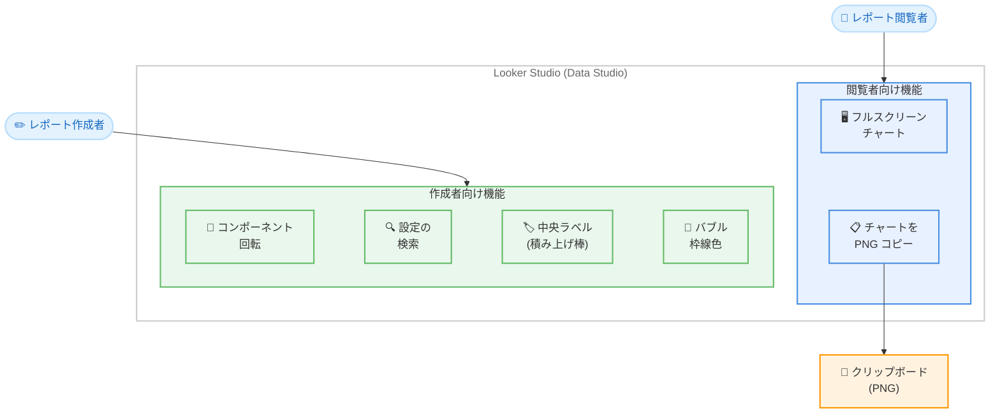

# Looker Studio (Data Studio): 可視化・編集機能の強化 (フルスクリーンチャートほか 6 機能)

**リリース日**: 2026-08-13

**サービス**: Looker Studio (Data Studio)

**機能**: フルスクリーンチャート / コンポーネント回転 / 積み上げ棒グラフの中央ラベル / 設定検索 / チャートの画像コピー / バブルチャートの枠線色

**ステータス**: GA (一般提供)

📊 [このアップデートのインフォグラフィックを見る](https://takech9203.github.io/google-cloud-news-summary/20260813-data-studio-visualization-enhancements.html)

## 概要

2026 年 8 月 13 日、Google Cloud は Looker Studio (リリースノート上の表記は Data Studio) に対して 6 つの機能強化を発表しました。今回のアップデートは、レポート閲覧者向けの体験改善 (フルスクリーンチャート、チャートの画像コピー) と、レポート作成者向けの編集・スタイリング機能の拡充 (コンポーネント回転、積み上げ棒グラフの中央ラベル、設定検索、バブルチャートの枠線色) の両面をカバーしています。

フルスクリーンチャート機能により、チャートヘッダーのフルスクリーンボタンをクリックするだけで個別のチャートを画面全体に拡大表示できるようになり、データの細部確認やプレゼンテーションでの利用が容易になります。また、チャートを PNG 画像としてクリップボードにコピーする機能により、スライドやドキュメント、チャットへのチャート共有が大幅に効率化されます。

レポート作成者にとっては、テキストボックス・画像・図形の回転によるレイアウト表現力の向上、プロパティパネルの設定検索による編集効率の改善、積み上げ棒グラフの中央ラベルやバブルチャートの枠線色によるスタイリングの柔軟性向上が実現されました。日常的に Looker Studio でレポートを作成・閲覧するすべてのユーザーに関係するアップデートです。

**アップデート前の課題**

このアップデート以前には、以下のような課題がありました。

- 個別のチャートを拡大表示する専用機能がなく、細部を確認するにはブラウザのズームやレポート全体の拡大に頼る必要があった
- テキストボックス、画像、図形などのコンポーネントを回転できず、キャンバス上のレイアウト表現が水平・垂直配置に限定されていた
- 積み上げ棒グラフのデータラベルをバーの中央に配置するオプションがなかった
- プロパティパネルの Setup タブと Style タブには多数の設定項目があり、目的の設定を探すのに時間がかかっていた
- チャートを画像として共有するには、スクリーンショットの撮影やレポート全体のエクスポートが必要だった
- バブルチャートのバブルの枠線色を変更できなかった

**アップデート後の改善**

今回のアップデートにより、以下の改善が実現されました。

- チャートヘッダーのフルスクリーンボタンから、個別チャートをワンクリックでフルスクリーン表示できるようになった (スコアカードとゲージチャートを除く)
- 非レスポンシブキャンバス上で、テキストボックス・画像・図形を任意の角度に回転でき、0 度へのリセットも可能になった
- 積み上げ棒グラフのラベルをバーの中央に配置できるようになった (スペースが不足する場合はバーの外側に表示)
- プロパティパネルの Setup タブ・Style タブ内の設定を検索できるようになった
- チャートを PNG 画像としてクリップボードにコピーできるようになった
- バブルチャートのバブルの枠線色を変更できるようになった

## アーキテクチャ図

この図は、今回発表された 6 つの機能を利用者の役割別に整理したものです。上段はレポート閲覧者の体験を向上させる機能 (フルスクリーン表示、画像コピー)、下段はレポート作成者の編集・スタイリングを効率化する機能を示しています。

## サービスアップデートの詳細

### 主要機能

1. **フルスクリーンチャート (Fullscreen charts)**
   - 個別のチャートをフルスクリーンモードで表示可能
   - チャートヘッダーのフルスクリーンボタンをクリックして展開
   - スコアカードとゲージチャートでは利用不可

2. **コンポーネントの回転 (Rotate components)**
   - テキストボックス、画像、図形を回転可能
   - レポート作成者は非レスポンシブキャンバス上でこれらのコンポーネントを回転できる
   - 回転を 0 度にリセットする機能も提供

3. **積み上げ棒グラフの中央ラベル (Center labels on stacked bar charts)**
   - データラベルをバーの中央に配置可能
   - バー内にラベルを中央配置するスペースが不足する場合は、ラベルはバーの外側に表示される
   - 詳細は棒グラフ・縦棒グラフのリファレンスを参照

4. **設定の検索 (Search for settings)**
   - プロパティパネルの **Setup** タブと **Style** タブ内の設定を検索可能
   - 多数の設定項目から目的の項目を素早く発見できる

5. **チャートの画像コピー (Copy chart as image)**
   - チャートを PNG 画像としてクリップボードにコピー可能
   - スクリーンショット不要でチャートを他のツールに貼り付けられる

6. **バブルチャートの枠線色 (Bubble chart border color)**
   - バブルチャートのバブルの枠線色を変更可能
   - チャートのスタイリング表現の幅が広がる

## 技術仕様

### 各機能の対象と制約

| 機能 | 対象ユーザー | 対象コンポーネント | 制約 |
|------|-------------|-------------------|------|
| フルスクリーンチャート | 閲覧者・作成者 | 各種チャート | スコアカード、ゲージチャートは非対応 |
| コンポーネント回転 | レポート作成者 | テキストボックス、画像、図形 | 非レスポンシブキャンバスのみ |
| 中央ラベル | レポート作成者 | 積み上げ棒グラフ | スペース不足時はバー外側に表示 |
| 設定の検索 | レポート作成者 | プロパティパネル (Setup / Style タブ) | - |
| チャートの画像コピー | 閲覧者・作成者 | 各種チャート | 出力形式は PNG |
| バブル枠線色 | レポート作成者 | バブルチャート | - |

### プロパティパネルの構成

プロパティパネルはレポートエディタの右側に表示され、選択したコンポーネントに応じて設定項目が変化するコンテキスト依存型のパネルです。

| タブ | 役割 |
|------|------|
| Setup タブ | コンポーネントのデータ設定 (ディメンション、指標、フィルタなど) |
| Style タブ | コンポーネントの外観設定 (色、フォント、ラベル、枠線など) |

今回の設定検索機能により、この両タブ内の設定項目をキーワードで検索できるようになりました。なお、テキスト・図形・線などの静的コンポーネントは Style プロパティのみを持ちます。

## 設定方法

### 前提条件

1. Looker Studio のアカウントを保有していること (無料版で利用可能)
2. 編集系機能 (回転、ラベル、枠線色、設定検索) はレポートの編集権限が必要
3. コンポーネント回転は非レスポンシブキャンバスのレポートであること

### 手順

#### ステップ 1: チャートをフルスクリーン表示する

1. レポートでチャートにカーソルを合わせる
2. チャートヘッダーに表示されるフルスクリーンボタンをクリック
3. チャートが画面全体に拡大表示される (スコアカード、ゲージチャートを除く)

#### ステップ 2: コンポーネントを回転する

1. レポートを編集モードで開く (非レスポンシブキャンバス)
2. テキストボックス、画像、または図形を選択
3. 回転操作でコンポーネントを任意の角度に回転
4. 必要に応じて回転を 0 度にリセット

#### ステップ 3: 積み上げ棒グラフのラベルを中央に配置する

1. レポートを編集モードで開き、積み上げ棒グラフを選択
2. プロパティパネルの **Style** タブでデータラベルを有効化
3. ラベル位置として中央 (Center) を選択
4. バー内のスペースが不足する場合、ラベルは自動的にバーの外側に表示される

#### ステップ 4: 設定を検索する

1. レポートを編集モードで開き、コンポーネントを選択
2. プロパティパネルの **Setup** タブまたは **Style** タブで検索機能を使用
3. キーワードを入力して目的の設定項目に直接アクセス

#### ステップ 5: チャートを画像としてコピーする

1. レポートでチャートを選択
2. チャートを PNG 画像としてクリップボードにコピー
3. スライド、ドキュメント、チャットツールなどに貼り付け

## メリット

### ビジネス面

- **レポート共有・プレゼンテーションの効率化**: フルスクリーン表示と PNG コピーにより、会議やレポーティングでチャートを提示・転用する際の手間が大幅に削減される。スクリーンショット加工などの作業が不要になる
- **レポートの表現力向上によるコミュニケーション改善**: コンポーネント回転や中央ラベル、枠線色のカスタマイズにより、伝わりやすく視認性の高いダッシュボードを作成でき、データドリブンな意思決定を促進する

### 技術面

- **編集作業の生産性向上**: プロパティパネルの設定検索により、多数の設定項目から目的の項目を探す時間が短縮され、レポート作成のイテレーションが高速化する
- **ラベル表示の自動フォールバック**: 中央ラベルはスペース不足時に自動でバー外側に表示されるため、データ量やバーのサイズに応じた手動調整が不要

## デメリット・制約事項

### 制限事項

- フルスクリーンチャートは、スコアカードとゲージチャートでは利用できない
- コンポーネントの回転は非レスポンシブキャンバスでのみ利用可能。レスポンシブキャンバスのレポートでは利用できない
- 回転できるのはテキストボックス、画像、図形のみで、チャート自体は回転できない
- チャートの画像コピーの出力形式は PNG のみ

### 考慮すべき点

- 積み上げ棒グラフの中央ラベルは、バー内のスペースが不足するとバーの外側に表示されるため、データによってはラベル位置が混在し得る。フォントサイズやバー幅の調整を検討するとよい
- 回転したコンポーネントを多用すると、レポートの可読性やアクセシビリティに影響する可能性があるため、デザインの一貫性に留意する

## ユースケース

### ユースケース 1: 経営会議でのダッシュボード提示

**シナリオ**: データアナリストが月次の経営会議で、売上ダッシュボードの特定チャートを大画面で提示しながら議論したい。

**実装手順**:

1. 会議中に注目したいチャートのヘッダーでフルスクリーンボタンをクリック
2. チャートを画面全体に拡大して細部まで提示
3. 議事録やフォローアップ資料には、チャートを PNG としてコピーしてドキュメントに貼り付け

**効果**: レポート全体を拡大したりスクリーンショットを加工したりする手間なく、注目すべきデータを大きく提示・共有できる。会議の準備時間とフォローアップ作業を削減できる

### ユースケース 2: ブランドガイドラインに沿ったダッシュボードデザイン

**シナリオ**: マーケティングチームが、社内のブランドガイドラインに沿ったデザイン性の高いダッシュボードを作成したい。斜めの装飾テキストや、コーポレートカラーで統一したバブルチャートを配置する。

**実装手順**:

1. 非レスポンシブキャンバスのレポートで、見出しテキストボックスや装飾図形を回転させてレイアウトを構成
2. バブルチャートの枠線色をコーポレートカラーに設定
3. 積み上げ棒グラフのラベルを中央配置にして視認性を向上
4. プロパティパネルの設定検索で目的のスタイル設定に素早くアクセスしながら調整

**効果**: 標準機能だけでデザイン性と視認性を両立したダッシュボードを効率的に作成でき、外部ツールでの画像加工が不要になる

## 料金

今回発表された 6 つの機能はいずれも Looker Studio の標準機能として提供され、追加料金は不要です。Looker Studio は無料で利用でき、エンタープライズ向け機能が必要な場合は Looker Studio Pro (ユーザーライセンスベースの月額課金) を利用できます。

| 項目 | 詳細 |
|------|------|
| 今回の 6 機能 | 追加料金なし (標準機能として提供) |
| Looker Studio (無料版) | 無料で利用可能 |
| Looker Studio Pro | ユーザーライセンスベースの月額課金 |

詳細は [Looker Studio の料金ページ](https://cloud.google.com/looker-studio#pricing)を参照してください。

## 利用可能リージョン

Looker Studio はグローバルサービスとして提供されており、特定のリージョン制限はありません。

## 関連サービス・機能

- **Looker Studio プロパティパネル**: 今回の設定検索機能の対象。Setup タブと Style タブでコンポーネントのデータと外観を設定する
- **Looker Studio モダンチャート**: データラベルの高度なスタイリングオプション (ラベル位置、背景色、不透明度など) を提供する基盤。積み上げ棒グラフのラベル設定と関連する
- **Looker Studio レポートテーマ / レイアウト**: レポート全体のスタイル統一に使用。バブルチャートの枠線色などの個別スタイル設定と組み合わせて利用する
- **Looker Studio Pro**: チームワークスペースや自動配信などのエンタープライズ機能を提供。今回の機能は無料版・Pro の両方で利用可能

## 参考リンク

- 📊 [インフォグラフィック](https://takech9203.github.io/google-cloud-news-summary/20260813-data-studio-visualization-enhancements.html)
- [公式リリースノート](https://docs.cloud.google.com/release-notes#August_13_2026)
- [Bar chart and column chart reference](https://cloud.google.com/looker/docs/studio/bar-chart-and-column-chart-reference)
- [Configure report components (プロパティパネル)](https://cloud.google.com/looker/docs/studio/configure-report-components)
- [Add text, images, lines, and shapes to your reports](https://cloud.google.com/looker/docs/studio/add-text-images-lines-and-shapes-to-your-reports)
- [Types of charts in Looker Studio](https://cloud.google.com/looker/docs/studio/types-of-charts-in-looker-studio)
- [Looker Studio 料金ページ](https://cloud.google.com/looker-studio#pricing)

## まとめ

今回の Looker Studio アップデートは、フルスクリーン表示と PNG コピーによる閲覧・共有体験の向上と、コンポーネント回転・中央ラベル・設定検索・枠線色カスタマイズによる編集体験の向上を同時に実現する、実用性の高い機能強化です。いずれも追加料金なしで利用できるため、Looker Studio ユーザーは新機能を日常のレポート作成・共有ワークフローに取り入れることを推奨します。特にプレゼンテーションや資料作成でチャートを頻繁に転用するチームは、フルスクリーン表示と画像コピー機能の活用効果が大きいでしょう。

---

**タグ**: #LookerStudio #DataStudio #DataVisualization #BI #Dashboard #FullscreenCharts #Charts #GoogleCloud
