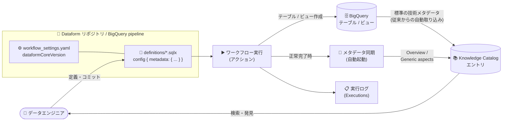

# Dataform: SQLX 構成による Knowledge Catalog へのメタデータ自動エンリッチメント (Preview)

**リリース日**: 2026-08-13

**サービス**: Dataform

**機能**: Dataform ワークフロー / BigQuery pipelines による BigQuery テーブル・ビューのメタデータ自動エンリッチメント (Knowledge Catalog 連携)

**ステータス**: Preview

📊 [このアップデートのインフォグラフィックを見る](https://takech9203.github.io/google-cloud-news-summary/20260813-dataform-knowledge-catalog-metadata-enrichment.html)

## 概要

Dataform ワークフローおよび BigQuery pipelines が、BigQuery のテーブルとビューに対するメタデータの自動エンリッチメントをサポートしました。`.sqlx` ファイルの `config` ブロック内に `metadata` キーでセマンティックメタデータを定義しておくと、アクション (テーブル / ビューの作成) が正常に完了したタイミングで、Dataform が自動的に Knowledge Catalog (旧 Dataplex Universal Catalog) へのメタデータ同期を開始します。この機能は Preview として提供されます。

BigQuery のデータセット・テーブル・ビューといった標準的な (技術) メタデータは、従来から Knowledge Catalog に自動的に取り込まれています。今回のアップデートで追加されたのは、その技術メタデータに対して **パイプラインのコード側で定義したビジネス・セマンティックなメタデータを重ねる** 仕組みです。エンリッチメント処理は次の 2 つのメタデータ構造をサポートします。

1. **Overview**: エントリのドキュメント・サマリーテキスト (Dataform core 3.0.37 以降が必要)
2. **Generic aspects**: テーブルのシステム情報や種別情報などのセマンティックな詳細 (Dataform core 3.0.52 以降が必要)

対象ユーザーは、Dataform / BigQuery pipelines で ELT パイプラインを構築しているデータエンジニアや、Knowledge Catalog でデータガバナンス・データディスカバリを推進するデータガバナンスチームです。パイプライン定義とカタログ上の意味付けを同じ SQLX ファイルで一元管理できるようになり、「Docs as Code」的な運用でカタログの記述を維持できます。

**アップデート前の課題**

- SQLX の `config` ブロックで定義できるドキュメンテーションは `description` (テーブル説明) と `columns` (列・レコード説明) が中心で、これらは BigQuery に直接プッシュされる仕組みだった。Knowledge Catalog のエントリに対するセマンティックメタデータをパイプライン側から定義する手段がなかった
- Knowledge Catalog に自動取り込みされるのは BigQuery の標準的な技術メタデータ (データセット、テーブル、ビューなど) にとどまり、それ以外のビジネスコンテキストは Knowledge Catalog 側でのアスペクト付与など別作業として管理する必要があった
- Dataform リポジトリ自体は既定で Knowledge Catalog のエントリ (`@dataform` エントリグループ / `dataform-repository` エントリタイプ) として登録されていたが、テーブルやビューといったファイルレベルのアセットを Knowledge Catalog で扱うことはできなかった

**アップデート後の改善**

- `.sqlx` の `config` ブロックに `metadata` キーを記述するだけで、テーブル / ビューのセマンティックメタデータを宣言的に定義できるようになった
- アクションが正常完了すると Dataform が自動的に Knowledge Catalog へのメタデータ同期を開始するため、カタログ更新のための追加のジョブやスクリプトが不要になった
- Overview (ドキュメント / サマリーテキスト) と Generic aspects (システム・種別などのセマンティック詳細) をパイプラインのコードとして管理でき、パイプラインの変更とカタログ上の記述の乖離を抑えられるようになった

## アーキテクチャ図



SQLX の `config` ブロックに定義したセマンティックメタデータは、アクションの正常完了をトリガーに Knowledge Catalog へ自動同期され、BigQuery から自動取り込みされる技術メタデータを補完します。

## サービスアップデートの詳細

### 主要機能

1. **SQLX の `config` ブロックによるメタデータ定義**
   - `.sqlx` ファイルの `config` ブロック内で `metadata` キーを使用し、Knowledge Catalog 向けの情報を指定する
   - BigQuery のテーブルとビューが対象
   - パイプラインの定義とカタログ上の意味付けを同一ファイルで管理できる

2. **アクション完了時のメタデータ自動同期**
   - アクションが正常に完了すると、Dataform が自動的に Knowledge Catalog へのメタデータ同期を開始する
   - エンリッチメント処理により、SQLX 構成で定義したセマンティックメタデータで Knowledge Catalog が更新される
   - Dataform ワークフローと BigQuery pipelines の両方で利用可能

3. **サポートされるメタデータ構造**
   - **Overview**: エントリ向けのドキュメント / サマリーテキスト。Dataform core 3.0.37 以降が必要
   - **Generic aspects**: テーブルのシステム情報や種別情報といったセマンティックな詳細。Dataform core 3.0.52 以降が必要

4. **同期状況の確認手段**
   - メタデータ更新のステータスは、Dataform ワークフローの場合はワークスペースの実行ログ (Inspect workspace execution logs) で確認する
   - BigQuery pipelines の場合は過去の手動実行 (View past manual runs / Executions タブ) で確認する
   - 同期されたメタデータそのものは、Knowledge Catalog でアセットを検索して検証する

## 技術仕様

### サポートされるメタデータ構造と必要バージョン

| メタデータ構造 | 内容 | 必要な Dataform core バージョン |
|------|------|------|
| Overview | エントリのドキュメント・サマリーテキスト | 3.0.37 以降 |
| Generic aspects | テーブルのシステム情報・種別情報などのセマンティックな詳細 | 3.0.52 以降 |

### SQLX の config ブロック設定例

公式ドキュメントで示されている、Overview と Generic aspects を含む構成例です。

```javascript
config {
  type: "table",
  metadata: {
    overview: "This table provides standardized trip data.",
    extraProperties: {
      generic: {
        system: "BigQuery",
        type: "table"
      }
    }
  }
}
```

## 設定方法

### 前提条件

1. Dataform リポジトリまたは BigQuery pipeline が作成されていること
2. 使用するメタデータ構造に応じた Dataform core バージョンであること (Overview は 3.0.37 以降、Generic aspects は 3.0.52 以降)
3. Knowledge Catalog でメタデータを管理するために Dataplex API が有効化されていること
4. Knowledge Catalog のメタデータを操作するために必要な Knowledge Catalog のロールと、Dataform リソースへのアクセス権を付与する Dataform の事前定義ロールが付与されていること

### 手順

#### ステップ 1: Dataform core のバージョンを確認・更新する

```yaml
# workflow_settings.yaml (Dataform core 3.0.0 以降の既定の管理場所)
dataformCoreVersion: "VERSION"
```

```json
// package.json (Dataform core 以外の追加パッケージを利用する場合)
{
  "dependencies": {
    "@dataform/core": "VERSION"
  }
}
```

Generic aspects を利用する場合は 3.0.52 以降、Overview のみを利用する場合は 3.0.37 以降のバージョンを指定します。更新後に「Install packages」をクリックし、変更をコミット・プッシュします。本番環境へ適用する前に、必ず非本番環境で新しいパッケージバージョンをテストしてください。

#### ステップ 2: SQLX の config ブロックに metadata を定義する

```javascript
config {
  type: "table",
  description: "顧客ごとの月次売上サマリー",
  metadata: {
    overview: "This table provides standardized trip data.",
    extraProperties: {
      generic: {
        system: "BigQuery",
        type: "table"
      }
    }
  }
}

SELECT ...
```

`metadata` キーの配下に Knowledge Catalog 向けの情報を記述します。従来の `description` や `columns` によるドキュメンテーションと併用できます。

#### ステップ 3: ワークフローを実行して同期状況を確認する

ワークフロー (またはパイプライン) を実行します。アクションが正常に完了すると、Dataform が Knowledge Catalog へのメタデータ同期を自動的に開始します。

- Dataform ワークフロー: ワークスペースの実行ログ (Inspect workspace execution logs) でメタデータ更新のステータスを確認
- BigQuery pipelines: 対象パイプラインの「Executions」タブで過去の手動実行を確認

#### ステップ 4: Knowledge Catalog で同期結果を検証する

Knowledge Catalog でアセットを検索し、SQLX で定義した Overview や Generic aspects が反映されていることを確認します。

## メリット

### ビジネス面

- **データディスカバリの精度向上**: パイプラインの実装者が最もよく知っているコンテキストを、実装と同じ場所で記述してカタログに反映できるため、カタログ上の説明の質と鮮度が高まる
- **ガバナンス運用工数の削減**: Knowledge Catalog 側で個別にアスペクトを付与する手作業や、独自の同期スクリプトの開発・運用が不要になる
- **AI / エージェント活用の下支え**: Knowledge Catalog は BigQuery メタデータのガバナンス層かつエージェント向けのコンテキスト提供層として機能するため、パイプライン由来のセマンティックメタデータを充実させることで、セマンティック検索や AI エージェントへのコンテキスト提供の基盤を強化できる

### 技術面

- **宣言的な定義**: `config` ブロックに宣言するだけでよく、追加の API 呼び出しやカスタムジョブを書く必要がない
- **Git によるバージョン管理**: メタデータ定義が SQLX ファイルの一部となるため、パイプラインコードと同じレビュー・履歴管理・ロールバックのワークフローに乗せられる
- **実行と同期の一体化**: アクションの正常完了がトリガーとなるため、テーブルの実体とカタログのメタデータの更新タイミングが揃う
- **Dataform / BigQuery pipelines の双方に対応**: BigQuery pipelines は Dataform を基盤としているため、どちらの開発スタイルでも同じ仕組みを利用できる

## デメリット・制約事項

### 制限事項

- Preview 段階の機能であり、Pre-GA Offerings Terms が適用される。Pre-GA 機能は「現状有姿 (as is)」で提供され、サポートが限定される場合がある
- メタデータ構造ごとに Dataform core の最低バージョン要件がある (Overview: 3.0.37 以降、Generic aspects: 3.0.52 以降)。古いバージョンのリポジトリでは事前にアップグレードが必要
- エンリッチメント対象は BigQuery のテーブルとビュー。Dataform リポジトリのファイルレベルのアセット (テーブル、ビューなど) を Knowledge Catalog で参照・管理することは引き続きできない
- 同期はアクションが正常完了したときに開始される。実行が失敗した場合はメタデータも更新されない

### 考慮すべき点

- Dataform core のバージョンアップは、本番適用前に必ず非本番環境で検証すること (公式ドキュメントでも明記されている)
- Knowledge Catalog を利用するには Dataplex API の有効化と Knowledge Catalog のロール付与が必要
- Preview 機能のフィードバック・サポート依頼は `dataform-preview-support@google.com` へのメールで受け付けられている
- 従来の `description` / `columns` は BigQuery に直接プッシュされるドキュメンテーション、`metadata` は Knowledge Catalog へ同期されるメタデータであり、役割が異なる点を理解して使い分ける必要がある

## ユースケース

### ユースケース 1: データマートの意味付けをパイプラインコードで一元管理する

**シナリオ**: Dataform で多数のデータマートテーブルを生成している組織で、カタログ上の説明が古いままになり、利用者がテーブルの意味を把握できずにデータオーナーへの問い合わせが頻発している。

**実装例**:
```javascript
config {
  type: "table",
  description: "標準化された乗車データ",
  metadata: {
    overview: "This table provides standardized trip data.",
    extraProperties: {
      generic: {
        system: "BigQuery",
        type: "table"
      }
    }
  }
}

SELECT ...
```

**効果**: テーブル定義を変更するプルリクエストの中でカタログ向けの説明も同時にレビューできるため、実装とカタログ記述の乖離を防げる。デプロイのたびに Knowledge Catalog が自動更新されるため、鮮度も維持される。

### ユースケース 2: BigQuery pipelines での ELT とカタログ登録の同時実行

**シナリオ**: BigQuery pipelines でビューを含む変換処理を構築しており、成果物を Knowledge Catalog 経由で他部門やデータサイエンティストに発見してもらいたい。

**効果**: パイプライン実行が成功した時点で Knowledge Catalog へのメタデータ同期が自動的に走るため、カタログ登録のための別工程が不要になる。同期状況はパイプラインの「Executions」タブから確認でき、Knowledge Catalog のセマンティック検索で成果物を発見できるようになる。

## 料金

Dataform 自体は無償のサービスで、Dataform リポジトリやワークスペースの作成に対する課金はありません。ただし、以下のように Dataform が依存する他の Google Cloud サービスの利用分は課金されます。

| 項目 | 課金の考え方 |
|------|------|
| Dataform | 無償 (リポジトリ / ワークスペースの作成に対する課金なし) |
| BigQuery | Dataform がテーブル・ビューの作成やその他の SQL コマンド実行のために BigQuery でクエリを実行するため、そのクエリ分が BigQuery 側で課金される |
| Cloud Logging | ワークフロー呼び出しの監視に使用され、既定で有効かつすべての Dataform ワークフロー呼び出しに必須。Google Cloud Observability の料金が適用される |
| Knowledge Catalog | Knowledge Catalog でのメタデータ管理には Knowledge Catalog (Dataplex) の料金が適用される |
| その他 | Managed Service for Apache Airflow、Cloud Scheduler、Cloud Workflows などパイプライン実行に使用するリソース分が課金される |

本メタデータエンリッチメント機能に固有の追加料金についての記載は、現時点の公式ドキュメントでは確認できませんでした。詳細は下記の料金ページを参照してください。

## 関連サービス・機能

- **Knowledge Catalog (旧 Dataplex Universal Catalog)**: メタデータの同期先。BigQuery のデータセット・テーブル・ビュー・モデル・ルーティンなどの技術メタデータを自動的に取り込み、アスペクトによるビジネスコンテキストの付与、セマンティック検索、データリネージ、MCP 経由のエージェントアクセスなどを提供する
- **BigQuery**: エンリッチメント対象となるテーブル・ビューの実体があるデータウェアハウス。Dataform のクエリ実行先でもある
- **BigQuery pipelines**: Dataform を基盤とする BigQuery 上のパイプライン機能。本機能は Dataform ワークフローと BigQuery pipelines の両方でサポートされる
- **Dataform リポジトリ / BigQuery リポジトリ**: SQLX ファイルを管理する Git ベースのリポジトリ。Dataform リポジトリは既定で Knowledge Catalog のエントリ (`@dataform` エントリグループ、`dataform-repository` エントリタイプ) として登録される
- **Cloud Logging / Cloud Monitoring**: ワークフロー呼び出しやパイプライン実行のログ記録と、失敗時のログベースアラート設定に利用する

## 参考リンク

- 📊 [インフォグラフィック](https://takech9203.github.io/google-cloud-news-summary/20260813-dataform-knowledge-catalog-metadata-enrichment.html)
- [公式リリースノート](https://docs.cloud.google.com/release-notes#August_13_2026)
- [Add metadata for Knowledge Catalog (公式ドキュメント)](https://docs.cloud.google.com/dataform/docs/create-tables#add-metadata)
- [Create tables (Dataform)](https://docs.cloud.google.com/dataform/docs/create-tables)
- [Overview of Dataform](https://docs.cloud.google.com/dataform/docs/overview)
- [Manage repositories (Dataform core パッケージの管理)](https://docs.cloud.google.com/dataform/docs/manage-repository)
- [Use Knowledge Catalog with BigQuery](https://docs.cloud.google.com/bigquery/docs/use-knowledge-catalog)
- [Knowledge Catalog overview](https://docs.cloud.google.com/dataplex/docs/introduction)
- [Manage pipelines (BigQuery pipelines)](https://docs.cloud.google.com/bigquery/docs/manage-pipelines)
- [Dataform の料金](https://cloud.google.com/dataform/pricing)
- [Knowledge Catalog (Dataplex) の料金](https://cloud.google.com/dataplex/pricing)

## まとめ

SQLX の `config` ブロックに `metadata` キーを記述するだけで、テーブル・ビューのセマンティックメタデータが Knowledge Catalog へ自動同期されるようになり、データパイプラインとデータカタログの記述を「コードとして」一元管理できるようになりました。Dataform や BigQuery pipelines を運用している組織は、まず Dataform core を必要バージョン (Overview は 3.0.37 以降、Generic aspects は 3.0.52 以降) に更新し、Dataplex API を有効化した上で、主要なデータマートテーブルから `metadata` の定義を試すことを推奨します。Preview 段階のため、Pre-GA Offerings Terms の適用と、Dataform core のバージョンアップを非本番環境で検証する点に留意してください。

---

**タグ**: Dataform, BigQuery, BigQuery pipelines, Knowledge Catalog, Dataplex, SQLX, メタデータ管理, データガバナンス, データカタログ, Preview
