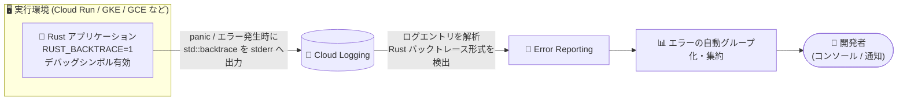

# Error Reporting: Rust アプリケーションのスタックトレース (std::backtrace) サポート

**リリース日**: 2026-08-13

**サービス**: Error Reporting

**機能**: Rust アプリケーションのスタックトレース収集サポート

**ステータス**: Announcement (新言語サポート)

📊 [このアップデートのインフォグラフィックを見る](https://takech9203.github.io/google-cloud-news-summary/20260813-error-reporting-rust-backtrace-support.html)

## 概要

Error Reporting が、Rust アプリケーションから `std::backtrace` を使用して収集されたスタックトレースのレポートに対応しました。環境変数 `RUST_BACKTRACE=1` を設定し、デバッグシンボルを有効にすることで、Rust アプリケーションのパニックやエラー発生時のスタックトレースが Error Reporting によって自動的に検出・集約されるようになります。

Error Reporting は、Cloud Logging 上に構築されたグローバルサービスで、ログエントリからスタックトレースなどの共通パターンを検出してエラーイベントを推定し、同一の根本原因を持つエラーを自動的にグループ化します。これまでサポートされる言語は Java、Python、JavaScript、Ruby、C#、PHP、Go に限られており、Rust は対象外でした。今回のアップデートにより、Cloud Run や GKE、Compute Engine などで稼働する Rust アプリケーションでも、他の言語と同様の一元的なエラー管理が可能になります。

パフォーマンスと安全性を重視して Rust を採用するバックエンドサービスやシステムプログラミング領域のワークロードが増加するなか、Rust アプリケーションの運用性 (Observability) を Google Cloud のマネージドサービスで強化できる意義のあるアップデートです。

**アップデート前の課題**

- Error Reporting がスタックトレースを解析できる言語は Java、Python、JavaScript、Ruby、C#、PHP、Go に限られており、Rust のバックトレース形式はサポートされていなかった
- Rust アプリケーションのパニックログを Cloud Logging に出力しても、スタックトレースとして認識されず、エラーの自動グループ化や集約の対象にならなかった
- Rust アプリケーションでエラーを一元管理するには、サポート対象言語の形式に合わせた独自の整形処理や、サードパーティのエラートラッキングツールの導入が必要だった

**アップデート後の改善**

- `std::backtrace` で収集した Rust のスタックトレースを Error Reporting がそのまま解析・レポートできるようになった
- `RUST_BACKTRACE=1` の設定とデバッグシンボルの有効化だけで利用でき、アプリケーションコードの大きな変更が不要になった
- Rust アプリケーションのエラーも他言語と同様に自動グループ化・集約され、Google Cloud コンソール上で一元的に管理できるようになった

## アーキテクチャ図



Rust アプリケーションが出力した `std::backtrace` 形式のスタックトレースを Cloud Logging 経由で Error Reporting が検出し、エラーを自動的にグループ化して開発者に提示するデータフローです。

## サービスアップデートの詳細

### 主要機能

1. **Rust の std::backtrace 形式のスタックトレース解析**
   - Rust 標準ライブラリの `std::backtrace` で収集されたスタックトレースを Error Reporting が解析できるようになった
   - ログに含まれるバックトレースからエラーイベントが自動的に推定され、エラーグループとして集約される

2. **環境変数ベースのシンプルな有効化**
   - 環境変数 `RUST_BACKTRACE=1` を設定することでバックトレースの収集が有効になる
   - あわせてビルド時にデバッグシンボルを有効にする必要がある (シンボルがないと関数名や行番号が解決されない)

3. **既存のエラー管理機能との統合**
   - 検出された Rust のエラーは、他のサポート言語と同様に同一の根本原因ごとに自動グループ化される
   - Error Reporting の通知機能やエラーグループ管理機能をそのまま利用できる

## 技術仕様

### サポート言語 (今回のアップデート後)

| 言語 | スタックトレース形式 |
|------|---------------------|
| Java | `Throwable.printStackTrace()` の戻り値 |
| Python | `traceback.format_exc()` の戻り値 |
| JavaScript | V8 が返す `error.stack` の値 |
| Ruby | `Exception.backtrace` のフレーム |
| C# | `Exception.ToString()` の戻り値 |
| PHP | `PHP (Notice\|Parse error\|Fatal error\|Warning):` プレフィックス + `(string)$exception` |
| Go | `debug.Stack()` の戻り値 |
| **Rust (NEW)** | **`std::backtrace` で収集されたバックトレース** |

### Error Reporting の主な動作条件

| 項目 | 詳細 |
|------|------|
| サービス形態 | Cloud Logging 上に構築されたグローバルサービス |
| エラー検出 | ログエントリのスタックトレースなど共通パターンから自動推定、または Error Reporting API で直接レポート |
| サンプリング | 1 時間あたり最大 1,000 エラーをサンプリング (超過時は推定値を表示) |
| エラーイベント保持 | 生成後 30 日以上保証 |
| 制約 | Assured Workloads 有効時は自動無効化、CMEK 有効なログバケットは解析対象外 |

## 設定方法

### 前提条件

1. アプリケーションのログが Cloud Logging に書き込まれていること (Cloud Run、GKE、Compute Engine など、サポートされるモニタリング対象リソース上で稼働)
2. Rust アプリケーションがデバッグシンボル付きでビルドされていること

### 手順

#### ステップ 1: デバッグシンボルを有効にしてビルドする

```toml
# Cargo.toml (リリースビルドでもデバッグシンボルを保持する例)
[profile.release]
debug = true
```

リリースビルドではデフォルトでデバッグシンボルが含まれないため、`Cargo.toml` の `[profile.release]` で `debug = true` を設定するなどして、シンボル情報を有効にします。シンボルがないとバックトレース内の関数名や行番号が解決されません。

#### ステップ 2: RUST_BACKTRACE 環境変数を設定する

```bash
# 例: Cloud Run サービスに環境変数を設定
gcloud run services update SERVICE_NAME \
  --set-env-vars=RUST_BACKTRACE=1
```

実行環境に `RUST_BACKTRACE=1` を設定すると、パニック発生時に `std::backtrace` によるバックトレースが stderr に出力されます。

#### ステップ 3: Error Reporting でエラーを確認する

```bash
# エラーグループの統計を確認 (コンソールでも可)
gcloud beta error-reporting events list --service=SERVICE_NAME
```

Cloud Logging に出力された Rust のバックトレースが Error Reporting によって検出され、Google Cloud コンソールの Error Reporting ページでエラーグループとして確認できます。

## メリット

### ビジネス面

- **Rust ワークロードの運用コスト削減**: サードパーティのエラートラッキングツールを別途導入・運用することなく、Google Cloud 標準のマネージドサービスで Rust アプリケーションのエラーを一元管理できる
- **障害対応の迅速化**: エラーの自動グループ化と通知により、Rust サービスの新規エラーや急増エラーを早期に発見し、根本原因の特定を高速化できる

### 技術面

- **導入の容易さ**: 環境変数の設定とビルド設定の変更のみで有効化でき、アプリケーションコードへの侵襲的な変更やエージェントの導入が不要
- **多言語環境での一貫性**: Java、Go、Python などと Rust が混在するマイクロサービス環境でも、同じ Error Reporting のコンソール・通知・API でエラー管理を統一できる

## デメリット・制約事項

### 制限事項

- Error Reporting のサンプリング上限 (1 時間あたり最大 1,000 エラー、超過時は推定値) が適用される
- CMEK (顧客管理の暗号鍵) が有効なログバケットに保存されるログは解析対象外となる
- Assured Workloads が有効なプロジェクトでは Error Reporting が自動的に無効化される

### 考慮すべき点

- リリースビルドでデバッグシンボルを有効にするとバイナリサイズが増加するため、コンテナイメージサイズやデプロイ時間への影響を考慮する必要がある
- `RUST_BACKTRACE=1` によるバックトレース生成はパニック時にオーバーヘッドが発生するため、パニックを通常フローで多用する設計は避けるべき
- スタックトレースは Cloud Logging に出力されるため、ログのインジェスト量 (課金対象) がわずかに増加する可能性がある

## ユースケース

### ユースケース 1: Cloud Run 上の Rust 製 API サービスのエラー監視

**シナリオ**: パフォーマンス要件から Rust (Axum や Actix Web など) で実装した API サービスを Cloud Run で運用しており、本番環境で発生するパニックやエラーを見逃さず検知したい。

**実装例**:
```bash
# デバッグシンボル付きでビルドしたイメージをデプロイし、環境変数を設定
gcloud run deploy rust-api \
  --image=REGION-docker.pkg.dev/PROJECT_ID/repo/rust-api:latest \
  --set-env-vars=RUST_BACKTRACE=1
```

**効果**: パニック発生時のバックトレースが自動的に Error Reporting に集約され、新規エラーの発生を通知で検知し、スタックトレースから原因箇所を即座に特定できる。

### ユースケース 2: 多言語マイクロサービス環境でのエラー管理の統一

**シナリオ**: Go や Java のサービスに加えて、一部の高性能コンポーネントを Rust で実装している GKE クラスタで、言語ごとにエラー監視ツールが分かれており運用が煩雑になっている。

**効果**: Rust サービスも含めてすべての言語のエラーを Error Reporting に統一でき、エラーグループの管理、通知設定、コンソールでの確認を単一のワークフローに集約できる。

## 料金

Error Reporting 自体は追加料金なしで利用できます。エラー検出の元となるログの取り込みには Cloud Logging の料金が適用されます。

詳細は [Google Cloud Observability の料金ページ](https://cloud.google.com/products/observability/pricing) を参照してください。

## 利用可能リージョン

Error Reporting はグローバルサービスとして提供されており、エラーグループは任意のリージョンからアクセスできます。ログのリージョン化を設定している場合、エラーグループはログバケットのリージョンに基づいて整理されます。

## 関連サービス・機能

- **Cloud Logging**: Error Reporting のエラー検出基盤。Rust アプリケーションが stderr に出力したバックトレースは Cloud Logging 経由で解析される
- **Cloud Run / GKE / Compute Engine**: Error Reporting がサポートするモニタリング対象リソース。これらの上で稼働する Rust アプリケーションが今回のアップデットの主な対象
- **Cloud Monitoring**: エラー発生状況と組み合わせてアラートやダッシュボードを構成し、Rust サービスの可観測性を強化できる
- **Error Reporting API**: ログ経由の自動検出に加えて、`ReportedErrorEvent` を直接レポートする方式も利用可能

## 参考リンク

- 📊 [インフォグラフィック](https://takech9203.github.io/google-cloud-news-summary/20260813-error-reporting-rust-backtrace-support.html)
- [公式リリースノート](https://docs.cloud.google.com/release-notes#August_13_2026)
- [ReportedErrorEvent リファレンス](https://docs.cloud.google.com/error-reporting/reference/rest/v1beta1/projects.events/report#ReportedErrorEvent)
- [Error Reporting ドキュメント](https://docs.cloud.google.com/error-reporting/docs)
- [ログ内のエラーのフォーマット](https://docs.cloud.google.com/error-reporting/docs/formatting-error-messages)
- [料金ページ](https://cloud.google.com/products/observability/pricing)

## まとめ

Error Reporting が Rust の `std::backtrace` 形式に対応したことで、Rust アプリケーションでも Google Cloud 標準のエラー管理を追加ツールなしで利用できるようになりました。Rust ワークロードを運用しているチームは、`RUST_BACKTRACE=1` の設定とデバッグシンボルの有効化という小さな変更で導入できるため、まずは本番環境のビルド設定と環境変数を見直すことをおすすめします。

---

**タグ**: Error Reporting, Rust, std::backtrace, Observability, Cloud Logging, スタックトレース, エラー監視
