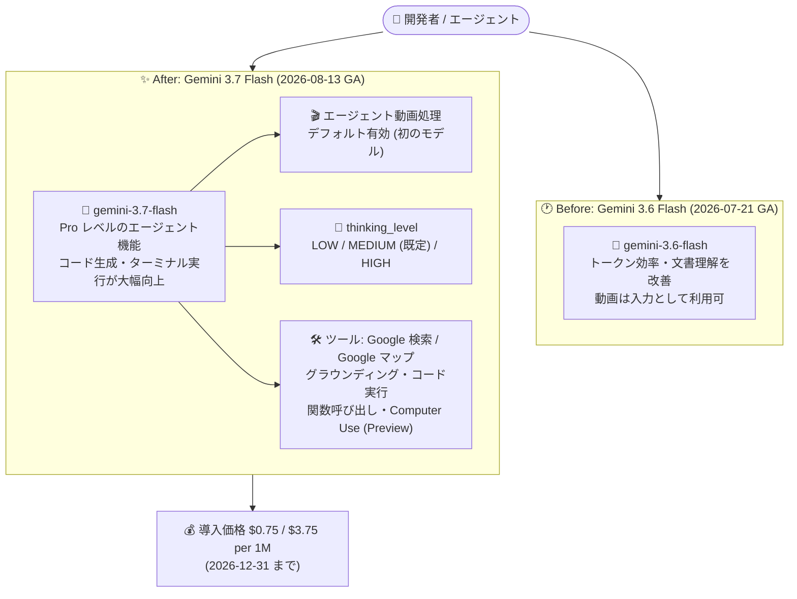

# Gemini Enterprise Agent Platform: Gemini 3.7 Flash が GA に (エージェント動画処理をデフォルト有効化)

**リリース日**: 2026-08-13

**サービス**: Gemini Enterprise Agent Platform

**機能**: Gemini 3.7 Flash (`gemini-3.7-flash`)

**ステータス**: GA (一般提供 / 本番利用可)

📊 [このアップデートのインフォグラフィックを見る](https://takech9203.github.io/google-cloud-news-summary/20260813-gemini-enterprise-agent-platform-gemini-3-7-flash-ga.html)

## 概要

Gemini Enterprise Agent Platform で **Gemini 3.7 Flash (`gemini-3.7-flash`)** が一般提供 (GA) となり、本番利用が可能になりました。リリースノートでは「**エージェント動画処理 (agentic video processing) をデフォルトで有効化した最初のモデル**」であると明記されています。

モデル情報ページでは Gemini 3.7 Flash を「Gemini 3 ファミリーの高効率・低コストな主力モデル」と位置付けており、**Pro レベルのエージェント機能**、そして**コード生成とターミナル実行における大幅な向上**を提供するとされています。ファミリー内での役割としては、深い推論を担う Pro モデルと高スループットの Flash-Lite モデルの間を埋める「エージェントの主力 (primary agentic workhorse)」であり、高いトークン効率とマルチステップのマルチモーダル処理を両立させるモデルです。

料金面では、Gemini 3.7 Flash は 2026 年 12 月 31 日まで**導入価格 (introductory pricing)** として入力 100 万トークンあたり $0.75、出力 100 万トークンあたり $3.75 で提供されます (Standard / Global)。この導入価格は Gemini 3.6 Flash にも同時に適用されます。2027 年 1 月 1 日以降は標準価格の $1.50 / $7.50 に移行します。

**アップデート前の課題**

- Gemini 3 ファミリーの Flash 系 GA モデルは Gemini 3.6 Flash (2026-07-21 GA) が最新で、エージェント動画処理がデフォルト有効なモデルは存在しなかった
- Pro レベルのエージェント能力を求める場合、GA 済みの Flash 系ではなく Preview 段階の Gemini 3.1 Pro などを検討する必要があった
- Gemini 3.5 Flash は Standard / Global で入力 $1.50・出力 $9.00 / 100 万トークンであり、エージェントのように入出力トークンを大量消費するワークロードではコスト負担が大きかった

**アップデート後の改善**

- エージェント動画処理がデフォルトで有効な最初のモデルとして、動画を含むエージェントワークフローを追加設定なしで扱えるようになった
- GA (本番利用可) の Flash モデルで、Pro レベルのエージェント機能とコード生成・ターミナル実行の大幅な改善が利用可能になった
- 導入価格により、Gemini 3.5 Flash 比で入力単価は 1/2 ($1.50 → $0.75)、出力単価は約 1/2.4 ($9.00 → $3.75) となり、エージェント用途のコスト効率が大きく改善した
- 明示的/暗黙的コンテキストキャッシュ、Provisioned Throughput、バッチ推論、Flex / Priority PayGo に GA 時点から対応している

## アーキテクチャ図



Gemini 3.6 Flash から Gemini 3.7 Flash への移行により、エージェント動画処理がデフォルト有効になり、Pro レベルのエージェント機能とコード生成能力が導入価格のまま利用できるようになりました。

## サービスアップデートの詳細

### 主要機能

1. **エージェント動画処理 (agentic video processing) のデフォルト有効化**
   - リリースノートに「弊社初のエージェント動画処理をデフォルトで有効にしたモデル」と明記されている
   - 動画は入力モダリティとしてサポートされ、音声付きで約 45 分、音声なしで約 1 時間、1 プロンプトあたり最大 10 本の動画を扱える
   - 対応 MIME タイプ: `video/x-flv`、`video/quicktime`、`video/mpeg`、`video/mpegs`、`video/mpg`、`video/mp4`、`video/webm`、`video/wmv`、`video/3gpp`

2. **Pro レベルのエージェント機能とコード生成の向上**
   - モデル情報ページでは「Pro レベルのエージェント機能」および「コード生成とターミナル実行における大幅な飛躍」を提供すると記載
   - 深い推論を担う Pro モデルと高スループットの Flash-Lite モデルの間を埋める、Gemini 3 ファミリーのエージェント主力モデルとして位置付けられている
   - 高いトークン効率とマルチステップのマルチモーダル処理を両立

3. **thinking_level による推論深度の制御**
   - サポートされる値は `LOW`、`MEDIUM` (デフォルト)、`HIGH` の 3 段階
   - **`MINIMAL` はサポートされない**。明示的に `MINIMAL` を指定すると API バリデーションエラーが返る (Gemini 3.7 Flash 固有の注意点)

4. **導入価格 (2026 年 12 月 31 日まで)**
   - Standard / Global で入力 $0.75 / 100 万トークン、出力 (レスポンス + 推論) $3.75 / 100 万トークン
   - キャッシュ済み入力は $0.075 / 100 万トークン
   - 同じ導入価格が Gemini 3.6 Flash にも適用される
   - 2027 年 1 月 1 日以降は標準価格 (入力 $1.50 / 出力 $7.50) に移行

5. **エンタープライズ向けの消費オプションとセキュリティ制御に GA 時点から対応**
   - Provisioned Throughput、バッチ推論、Standard / Flex / Priority PayGo をサポート
   - オンライン予測・バッチ推論・コンテキストキャッシュのそれぞれで、データレジデンシー、CMEK、VPC Service Controls、Access Transparency (AXT) に対応

## 技術仕様

### モデル基本仕様

| 項目 | 詳細 |
|------|------|
| モデル ID | `gemini-3.7-flash` |
| ローンチステージ | GA |
| リリース日 | 2026 年 8 月 13 日 |
| 入力モダリティ | テキスト、画像、音声、動画 (入力のみ) |
| 出力モダリティ | テキスト |
| コンテキストウィンドウ | 1,048,576 トークン |
| 最大出力トークン数 | 65,536 トークン |
| thinking_level | `LOW` / `MEDIUM` (デフォルト) / `HIGH` (`MINIMAL` は非サポート・エラー) |

### 機能サポート状況

| 機能 | サポート |
|------|----------|
| Thinking (思考) | 対応 |
| システム指示 | 対応 |
| 構造化出力 | 対応 |
| コンテキストキャッシュ | 暗黙的・明示的の両方に対応 |
| Count Tokens | 対応 |
| RAG Engine | 対応 |
| Chat Completions | 対応 |
| URL context | 対応 |
| Gemini Live API | 非対応 |
| チューニング (ファインチューニング) | 非対応 |

### ツールと消費オプション

| 項目 | 詳細 |
|------|------|
| グラウンディング | Google 検索、Google マップ |
| コード実行 | 対応 |
| 関数呼び出し (Function calling) | 対応 |
| Computer use | 対応 (Preview) |
| Provisioned Throughput | 対応 |
| バッチ推論 | 対応 |
| Pay-as-you-go | Standard PayGo / Flex PayGo / Priority PayGo |
| 固定クォータ (Fixed quota) | 非対応 |

### 入力データの上限

| モダリティ | 上限 |
|-----------|------|
| 画像 | 1 プロンプトあたり最大 3,000 枚。インライン/コンソール直接アップロードは 1 ファイル 7 MB、Cloud Storage 経由は 30 MB。対応形式: `image/png`、`image/jpeg`、`image/webp`、`image/heic`、`image/heif` |
| テキスト・PDF | 1 プロンプトあたり最大 3,000 ファイル / 1 ファイル最大 3,000 ページ。API / Cloud Storage 経由は 50 MB (`application/pdf`) または 7 MB (`text/plain`)、コンソール直接アップロードは 7 MB |
| 動画 | 音声付き約 45 分 / 音声なし約 1 時間、1 プロンプトあたり最大 10 本 |
| 音声 | 1 プロンプトあたり約 8.4 時間 (最大 100 万トークン)、音声ファイルは 1 個まで |

### セキュリティ制御

| 対象 | 対応するセキュリティ制御 |
|------|------------------------|
| オンライン予測 | データレジデンシー、CMEK、VPC-SC、AXT |
| バッチ推論 | データレジデンシー、CMEK、VPC-SC、AXT |
| コンテキストキャッシュ | データレジデンシー、CMEK、VPC-SC、AXT |

## 設定方法

### 前提条件

1. 課金が有効な Google Cloud プロジェクトと、Agent Platform API (Vertex AI API) の有効化
2. `global`、`us`、`eu` のいずれかのエンドポイントを利用できること (後述の「利用可能リージョン」を参照)
3. Google Gen AI SDK を使用する場合は最新版のインストール (`pip install -U google-genai`)

### 手順

#### ステップ 1: Google Gen AI SDK からモデルを呼び出す

```python
from google import genai
from google.genai import types

# Gemini Enterprise Agent Platform (Vertex AI) 経由で利用
client = genai.Client(
    vertexai=True,
    project="YOUR_PROJECT_ID",
    location="global",
)

response = client.models.generate_content(
    model="gemini-3.7-flash",
    contents="このリポジトリの CI 失敗の原因を調査し、修正パッチを提案してください。",
    config=types.GenerateContentConfig(
        thinking_config=types.ThinkingConfig(
            thinking_level="medium",  # low / medium (既定) / high。minimal はエラー
        ),
    ),
)
print(response.text)
```

`thinking_level` に `minimal` を指定すると API バリデーションエラーになるため、レイテンシを優先したい場合は `low` を指定します。

#### ステップ 2: REST API から呼び出す

```bash
PROJECT_ID="YOUR_PROJECT_ID"

curl -X POST \
  -H "Authorization: Bearer $(gcloud auth print-access-token)" \
  -H "Content-Type: application/json" \
  "https://aiplatform.googleapis.com/v1/projects/${PROJECT_ID}/locations/global/publishers/google/models/gemini-3.7-flash:generateContent" \
  -d '{
    "contents": [{
      "role": "user",
      "parts": [{"text": "このダッシュボード画面のモックから React コンポーネントを生成してください。"}]
    }],
    "generationConfig": {
      "thinkingConfig": {"thinkingLevel": "MEDIUM"}
    }
  }'
```

#### ステップ 3: 動画を入力に含める

```json
{
  "contents": [{
    "role": "user",
    "parts": [
      {
        "fileData": {
          "fileUri": "gs://YOUR_BUCKET/operation-recording.mp4",
          "mimeType": "video/mp4"
        }
      },
      {"text": "この操作録画から手順書を作成し、エラーが発生したタイムスタンプを列挙してください。"}
    ]
  }]
}
```

動画は Cloud Storage の URI (`fileData.fileUri`) または 100 MB 未満のインラインデータで渡します。フレームレートやクリッピング区間は `videoMetadata` (`fps`、開始/終了オフセット) で、トークン消費量は `mediaResolution` で調整できます。

## メリット

### ビジネス面

- **エージェント用途のコスト効率が大幅に改善**: 導入価格により Gemini 3.5 Flash 比で入力は 1/2、出力は約 1/2.4 の単価となり、トークン消費が大きいエージェントワークロードの運用コストを抑えられる
- **本番投入の判断がしやすい**: GA (本番利用可) であるため、Preview モデルに伴う Pre-GA 条項やサポート制限を懸念せずに本番システムへ組み込める
- **動画資産の活用**: 操作録画、会議録画、監視映像といった既存の動画資産を、追加設定なしにエージェントの入力として扱える

### 技術面

- **推論深度をコストとレイテンシに合わせて調整可能**: `thinking_level` の 3 段階により、低レイテンシ用途と難易度の高いエージェントタスクを 1 つのモデルで使い分けられる
- **エンタープライズ制御に GA 時点から対応**: データレジデンシー、CMEK、VPC-SC、AXT がオンライン予測・バッチ推論・コンテキストキャッシュのすべてで利用でき、規制業界での採用障壁が低い
- **消費オプションの柔軟性**: Provisioned Throughput でスループットを確保しつつ、バッチ推論や Flex PayGo (Standard 比 50% 相当の単価) でコストを最適化できる
- **キャッシュによる追加削減**: 暗黙的・明示的コンテキストキャッシュに対応し、キャッシュ済み入力は通常入力の 1/10 の単価 ($0.075 / 100 万トークン) になる
- **既存モデルからの移行負荷が小さい**: Gemini 3.6 Flash と同じ 1M コンテキスト・64K 出力・ツール構成を維持しているため、3.6 Flash からはモデル ID の変更が中心となる

## デメリット・制約事項

### 制限事項

- **`thinking_level: MINIMAL` は非サポート**。明示的に指定すると API バリデーションエラーが返る
- **チューニング (ファインチューニング) 非対応**。Supervised fine-tuning や強化学習によるチューニングは利用できない
- **Gemini Live API 非対応**。双方向のリアルタイム音声・映像ストリーミング用途には別モデルが必要
- **出力はテキストのみ**。画像生成や音声生成には対応しない
- **固定クォータ (Fixed quota) 非対応**
- **リージョンは `global` / `us` / `eu` のみ**。Gemini 3.5 Flash が対応していた `asia-northeast1` (東京) などの単一リージョンエンドポイントは提供されていない
- Computer use は Preview 段階の機能

### 考慮すべき点

- **短期提供モデル (short-term availability model) に分類されている**。`gemini-3.7-flash` は「後継モデルのリリースから 45 日後に廃止される」短期提供モデルの一覧に含まれており、現時点で廃止日は未告知。長期運用ではモデルバージョン固定と移行計画の運用が前提になる
- **2027 年 1 月 1 日に単価が 2 倍になる**。導入価格は 2026 年 12 月 31 日で終了し、入力 $1.50 / 出力 $7.50 に移行するため、年間予算の見積もりでは両方の単価で試算しておく必要がある
- **データレジデンシー要件との整合**。ML 処理は `us` / `eu` マルチリージョンのみで、日本国内でのデータ処理が必須の要件には適合しない
- **Gemini 3.x 共通のパラメータ変更**。`temperature` / `top_p` / `top_k` は Gemini 3.x 全体で非推奨、`thinking_budget` も非推奨 (`thinking_level` を使用)。Gemini 3.5 Flash や Gemini 3.1 Pro から移行する場合は、これらのサンプリングパラメータと、最終ターンがモデルロールとなるリクエスト (prefilled model turn) を除去する必要がある
- **動画のトークン消費**。動画入力は入力トークンとして課金され、フレームレート (既定 1 FPS) とメディア解像度でトークン数が変動する。長時間動画を扱う場合は `videoMetadata` の `fps` や `mediaResolution` によるチューニングを前提にコストを見積もる

## ユースケース

### ユースケース 1: 操作録画からの運用手順書生成と障害調査

**シナリオ**: 社内システムの操作録画 (最大約 45 分、音声付き) を Cloud Storage に保存し、Gemini 3.7 Flash に動画とテキスト指示を渡して手順書を生成する。エラー発生箇所のタイムスタンプを列挙させ、そのまま障害調査エージェントの入力にする。

**実装例**:
```python
from google import genai
from google.genai import types

client = genai.Client(vertexai=True, project="YOUR_PROJECT_ID", location="global")

response = client.models.generate_content(
    model="gemini-3.7-flash",
    contents=[
        types.Part.from_uri(
            file_uri="gs://ops-recordings/incident-2026-08-13.mp4",
            mime_type="video/mp4",
        ),
        "この録画から (1) 実行された操作手順、(2) エラーが表示されたタイムスタンプ (MM:SS)、"
        "(3) 推定原因と確認すべきログを出力してください。",
    ],
    config=types.GenerateContentConfig(
        thinking_config=types.ThinkingConfig(thinking_level="high"),
    ),
)
print(response.text)
```

**効果**: 動画の文字起こしや手動でのフレーム抽出を別サービスで前処理する必要がなく、1 回のリクエストで手順書とタイムスタンプ付きの調査メモを得られる。`thinking_level: high` により複雑な因果推論を伴う調査にも対応できる。

### ユースケース 2: コード生成・ターミナル実行を伴う開発エージェント

**シナリオ**: CI が失敗したリポジトリに対して、Gemini 3.7 Flash を推論エンジンとする開発エージェントを実行する。関数呼び出しでリポジトリ操作ツールを与え、コード実行ツールでテストを走らせ、修正パッチを生成する。

**効果**: モデル情報ページが示す「コード生成とターミナル実行の大幅な向上」により、マルチステップのエージェントループでの成功率が高まる。導入価格 ($0.75 / $3.75) のため、試行回数の多いエージェント運用でもコストを抑えられる。

### ユースケース 3: バッチ推論による大量マルチモーダルアセットの一括処理

**シナリオ**: 蓄積された数万件の画像・PDF・動画アセットに対し、バッチ推論でタグ付け・要約・分類を一括実行する。

**効果**: Flex / Batch 単価 (導入価格期間中は入力 $0.375 / 出力 $1.875 per 1M) が適用され、Standard の半額でオフライン処理を実行できる。1 プロンプトあたり画像 3,000 枚 / PDF 3,000 ファイルまで扱えるため、まとめ処理の効率も高い。

## 料金

Gemini 3.7 Flash はトークン単位の従量課金です。**2026 年 12 月 31 日まで導入価格**が適用され、2027 年 1 月 1 日以降は標準価格に移行します。同じ導入価格が Gemini 3.6 Flash にも適用されます。すべて Global エンドポイント・USD 建て・100 万トークンあたりの単価です。なお、200K トークンを超える長文入力でも単価は変わりません (Gemini 3.1 Pro とは異なる)。

### 単価一覧 (Global / 100 万トークンあたり)

| 消費オプション | 種別 | 導入価格 (〜2026-12-31) | 標準価格 (2027-01-01〜) |
|---------------|------|------------------------|------------------------|
| Standard | 入力 (テキスト・画像・動画・音声) | $0.75 | $1.50 |
| Standard | 出力 (レスポンス + 推論) | $3.75 | $7.50 |
| Standard | キャッシュ済み入力 | $0.075 | $0.15 |
| Priority | 入力 | $1.35 | $2.70 |
| Priority | 出力 | $6.75 | $13.50 |
| Priority | キャッシュ済み入力 | $0.135 | $0.27 |
| Flex / Batch | 入力 | $0.375 | $0.75 |
| Flex / Batch | 出力 | $1.875 | $3.75 |
| Flex / Batch | キャッシュ済み入力 | $0.0375 | $0.075 |

### 他の Flash モデルとの比較 (Standard / Global / 100 万トークンあたり)

| モデル | 入力 | 出力 |
|--------|------|------|
| Gemini 3.7 Flash (導入価格) | $0.75 | $3.75 |
| Gemini 3.6 Flash (導入価格) | $0.75 | $3.75 |
| Gemini 3.5 Flash | $1.50 | $9.00 |
| Gemini 3.5 Flash-Lite | $0.30 | $2.50 |
| Gemini 3.1 Pro (Preview) | $2.00 (200K 超は $4.00) | $12.00 (200K 超は $18.00) |

### 料金例 (上記単価からの計算値)

| 使用量 (月間) | 導入価格での月額 | 標準価格での月額 |
|--------------|-----------------|-----------------|
| Standard: 入力 1,000 万 / 出力 200 万トークン | $15.00 | $30.00 |
| Standard: 入力 1 億 / 出力 2,000 万トークン | $150.00 | $300.00 |
| Priority: 入力 1 億 / 出力 2,000 万トークン | $270.00 | $540.00 |
| Flex / Batch: 入力 1 億 / 出力 2,000 万トークン | $75.00 | $150.00 |

なお課金対象は HTTP 200 が返ったリクエストのみで、4xx / 5xx のレスポンスは入力・出力ともに課金されません。

## 利用可能リージョン

| 区分 | 対応ロケーション |
|------|-----------------|
| モデル提供 | Global (`global`)、マルチリージョン (`us`、`eu`) |
| ML 処理 | マルチリージョン (`us`、`eu`) |
| Provisioned Throughput | Global (`global`)、マルチリージョン (`us`、`eu`) |
| Standard PayGo | Global (`global`)、マルチリージョン (`us`、`eu`) |

単一リージョンのエンドポイント (例: `asia-northeast1`) は提供されていません。

## 関連サービス・機能

- **Gemini 3.6 Flash (`gemini-3.6-flash`)**: 2026 年 7 月 21 日 GA の前世代 Flash モデル。同じ 1M コンテキスト・64K 出力・ツール構成を持ち、Gemini 3.7 Flash と同じ導入価格が適用される。3.7 Flash からの推奨移行先候補としても案内されている
- **Provisioned Throughput**: Gemini 3.7 Flash でサポート。安定したスループットが必要な本番エージェントで利用する
- **コンテキストキャッシュ (暗黙的 / 明示的)**: 長いシステム指示や共通ドキュメントを再利用するエージェントで、入力単価を 1/10 に削減できる
- **RAG Engine**: Gemini 3.7 Flash がサポートするため、社内データにグラウンディングした回答生成に組み込める
- **グラウンディング (Google 検索 / Google マップ)**: 最新の Web 情報や地理情報を参照するエージェントを構築できる
- **Model Armor / Semantic Governance Policies**: Agent Gateway 上でプロンプト・レスポンスのコンテンツ保護やツール呼び出しのポリシー評価を行い、エージェントのガバナンスを担保する
- **Antigravity エージェント (Gemini API 側)**: Gemini API のドキュメントでは、Gemini 3.7 Flash が Gemini Managed Agents および Google Antigravity SDK の Antigravity エージェントを駆動するデフォルトモデルになったと案内されている

## 参考リンク

- 📊 [インフォグラフィック](https://takech9203.github.io/google-cloud-news-summary/20260813-gemini-enterprise-agent-platform-gemini-3-7-flash-ga.html)
- [公式リリースノート (2026 年 8 月 13 日)](https://docs.cloud.google.com/release-notes#August_13_2026)
- [Gemini Enterprise Agent Platform リリースノート](https://docs.cloud.google.com/gemini-enterprise-agent-platform/release-notes)
- [モデル情報: Gemini 3.7 Flash](https://docs.cloud.google.com/gemini-enterprise-agent-platform/models/gemini/3-7-flash)
- [ドキュメント: 動画の理解 (Video understanding)](https://docs.cloud.google.com/gemini-enterprise-agent-platform/models/capabilities/video-understanding)
- [ドキュメント: モデルバージョンとライフサイクル](https://docs.cloud.google.com/gemini-enterprise-agent-platform/models/model-versions)
- [ドキュメント: 最新の Gemini モデルへの移行](https://docs.cloud.google.com/gemini-enterprise-agent-platform/models/migrate)
- [ドキュメント: セキュリティ制御](https://docs.cloud.google.com/gemini-enterprise-agent-platform/models/security-controls)
- [料金ページ (生成 AI on Agent Platform)](https://cloud.google.com/gemini-enterprise-agent-platform/generative-ai/pricing)

## まとめ

Gemini 3.7 Flash の GA は、Pro レベルのエージェント機能とエージェント動画処理のデフォルト有効化を、Flash 相当の価格帯 (導入価格で入力 $0.75 / 出力 $3.75 per 1M) で本番利用できるようにする重要なアップデートです。Gemini 3.5 Flash を利用中のワークロードは単価が半分以下になるため、優先的に評価する価値があります。移行時は `thinking_level: MINIMAL` が使えない点、サンプリングパラメータの非推奨化、リージョンが `global` / `us` / `eu` に限られる点、そして短期提供モデルとして扱われている点を確認し、2027 年 1 月 1 日の標準価格移行を織り込んだコスト試算を行ってください。

---

**タグ**: #GeminiEnterpriseAgentPlatform #Gemini3 #Gemini37Flash #GA #生成AI #エージェント #マルチモーダル #動画理解 #料金
