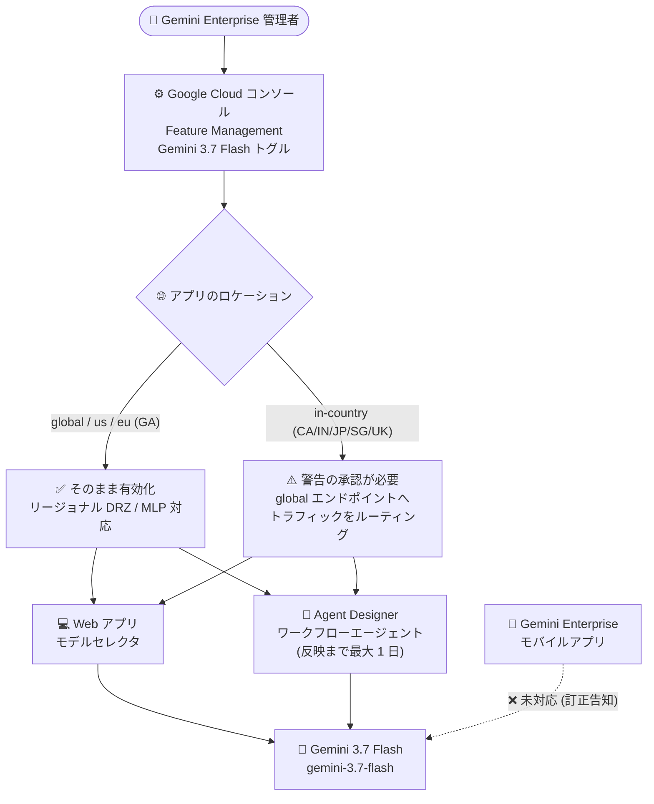

# Gemini Enterprise: Gemini 3.7 Flash が global / us / eu リージョンで GA (モバイルアプリは未対応の訂正告知あり)

**リリース日**: 2026-08-13

**サービス**: Gemini Enterprise

**機能**: Gemini 3.7 Flash の利用 (Use Gemini 3.7 Flash) / モバイルアプリでの提供状況に関する訂正

**ステータス**: GA (一般提供) — ただし Gemini Enterprise モバイルアプリは未対応

📊 [このアップデートのインフォグラフィックを見る](https://takech9203.github.io/google-cloud-news-summary/20260813-gemini-enterprise-gemini-3-7-flash-ga.html)

## 概要

Gemini Enterprise で **Gemini 3.7 Flash** が `global`、`us`、`eu` の 3 リージョンで一般提供 (GA) になりました。Gemini Enterprise アプリのユーザーが利用できるようにするには、管理者が Google Cloud コンソールで **Gemini 3.7 Flash の機能トグル (feature toggle)** をオンにする必要があります。あわせて、Agent Designer のワークフローエージェントでも Gemini 3.7 Flash が選択可能になりました (ワークフローエージェントへの反映には最大 1 日かかります)。

Gemini 3.7 Flash は Gemini 3 シリーズの最新 Flash モデルで、同日に Gemini Enterprise Agent Platform 側でも GA が発表されています。Agent Platform のリリースノートでは「エージェント的な動画処理 (agentic video processing) をデフォルトで有効化した最初のモデル」と説明されています。モデル自体は複雑なコーディング、エージェント的ワークフロー、確実なマルチステップ実行を想定した「最も高性能な Flash モデル」と位置づけられており、1M トークンのコンテキストウィンドウ、64k の最大出力トークン、調整可能な思考レベル (low / medium / high) をサポートします。

重要な点として、**同日に訂正 (Correction) の告知が別途出されています**。Gemini 3.7 Flash は **Gemini Enterprise モバイルアプリでは利用できません**。モバイルアプリ向けのロールアウトが完了した時点で、新しいリリースノートが追加される予定です。Web アプリで先行して利用可能になるため、モバイルを含めた全社展開を計画している組織は、この差異を前提にコミュニケーションを設計する必要があります。

**アップデート前の課題**

- 直前世代の Gemini 3.6 Flash は、2026 年 7 月 21 日にまず `global` リージョンのみで提供開始され、マルチリージョンへの展開が段階的だった
- Gemini 3.6 Flash を US マルチリージョン (`us`) でデータレジデンシー (at-rest DRZ) および ML 処理 (MLP) 付きで使うには、**プロジェクトが許可リスト (allowlist) に登録されている必要**があり、Google のアカウントチームへの連絡が必要だった (2026 年 7 月 24 日リリースノート)
- EU マルチリージョンについては、Gemini 3.6 Flash は「`global` リージョン経由でのみ利用可能」という制限があった
- 2026 年 7 月 21 日には、Gemini 3.5 Flash を `global` リージョンからモデルとして削除する予定が告知されていた (このリリースノートには 2026 年 8 月 5 日付の訂正あり)

**アップデート後の改善**

- Gemini 3.7 Flash は、リリース当初から `global`、`us`、`eu` の 3 リージョンで GA として提供され、許可リスト登録の要件はリリースノートに記載されていない
- 管理者は Google Cloud コンソールのトグル操作のみで、Web アプリのユーザーに最新の Flash モデルを開放できる
- モデルがネイティブにサポートされていない in-country リージョン (CA / IN / JP / SG / UK) でも、`global` エンドポイントへルーティングされる旨の警告を承認すれば有効化できるため、リージョン制約下でも「使えない」ではなく「トレードオフを理解して使う」という選択肢が取れる
- Agent Designer のワークフローエージェントでも Gemini 3.7 Flash を選択できるため、ノーコード/ローコードで構築した業務エージェントの推論品質を最新モデルへ引き上げられる

## アーキテクチャ図

管理者がコンソールで Gemini 3.7 Flash トグルを有効化すると、Web アプリのモデルセレクタと Agent Designer のワークフローエージェントで同モデルが選択可能になります。GA リージョン以外では `global` エンドポイントへのルーティングを承認する必要があり、モバイルアプリは現時点で対象外です。

## サービスアップデートの詳細

### 主要機能

1. **Gemini 3.7 Flash の GA 提供 (global / us / eu)**
   - Gemini Enterprise において Gemini 3.7 Flash が `global`、`us`、`eu` リージョンで一般提供 (GA) となった
   - 同日、Gemini Enterprise Agent Platform 側でも Gemini 3.7 Flash が GA となり、本番利用が可能になった
   - Agent Platform のリリースノートによると、Gemini 3.7 Flash は agentic video processing がデフォルトで有効になっている最初のモデル

2. **管理者による機能トグルでの有効化**
   - Gemini Enterprise アプリのユーザーに Gemini 3.7 Flash を提供するには、管理者が Google Cloud コンソールで Gemini 3.7 Flash の機能トグルをオンにする必要がある
   - Web アプリ側でユーザーがモデルを選択できるようにするには、Feature Management の「Enable model selector」トグルが有効になっている必要がある
   - なお、Gemini Enterprise アプリで GA となっているモデル (Gemini 3.5 Flash や Gemini 2.5 Pro など) は、トグルをオフにできない

3. **未サポートリージョンでの有効化 (警告の承認)**
   - モデルがサポートされていない in-country リージョンでも、管理者は「トラフィックが `global` エンドポイントにルーティングされる」旨の警告を確認・承認することでモデルを有効化できる
   - この場合、リージョナルなデータレジデンシー (DRZ) は担保されない

4. **Agent Designer ワークフローエージェントでの利用**
   - Gemini 3.7 Flash は Agent Designer のワークフローエージェントでも利用可能
   - ワークフローエージェントへの反映には**最大 1 日**かかる
   - Agent Designer では、メインエージェント/サブエージェントごとに Gemini モデルを選択できる (Flow タブのノード設定、またはチャットペインでの自然言語指示)

5. **【訂正告知】モバイルアプリでは未対応**
   - Gemini 3.7 Flash は Gemini Enterprise モバイルアプリでは利用できない
   - モバイルアプリ向けの Gemini 3.7 Flash ロールアウトが完了した際に、新しいリリースノートが追加される
   - この告知は、同日の「Gemini Enterprise: Use Gemini 3.7 Flash」リリースノートに対する訂正 (correction) として位置づけられている

## 技術仕様

### Gemini 3.7 Flash モデル仕様

| 項目 | 詳細 |
|------|------|
| モデル ID | `gemini-3.7-flash` |
| 入力トークン上限 | 1,048,576 (1M) |
| 出力トークン上限 | 65,536 (64k) |
| 入力データ型 | テキスト、画像、動画、音声、PDF |
| 出力データ型 | テキスト |
| 思考レベル (thinking level) | low / medium / high (デフォルト: medium)。`minimal` は非対応でエラーになる |
| 主な用途 | 複雑なコーディング、エージェント的ワークフロー、マルチステップ実行、空間/マルチモーダル推論、デザイン再現性 |
| バージョン | Stable: `gemini-3.7-flash` |
| 最終更新 | 2026 年 8 月 |

### 思考レベルの使い分け

| レベル | 想定用途 |
|--------|----------|
| Low | レイテンシ重視のタスク (インシデント対応パイプライン、リアルタイムチャット、下書き作成、高速なデータ分析) |
| Medium (デフォルト) | ほとんどのタスクで最良の品質。複雑なコードやエージェント用途に推奨 |
| High | 複雑な推論、難易度の高い数学、最も難しいコーディング/エージェントタスク。トークン消費とコストは増加 |

### Gemini Enterprise におけるリージョンとデータレジデンシー

| ロケーション区分 | 名称 | Gemini 3.7 Flash |
|------------------|------|------------------|
| マルチリージョン (グローバル) | `global` | GA |
| マルチリージョン (米国) | `us` | GA |
| マルチリージョン (EU) | `eu` | GA |
| in-country リージョン | `ca` / `in` / `asia-northeast1` (日本) / `sg` / `europe-west2` | リリースノートに GA の記載はなし。警告を承認して有効化した場合、`global` エンドポイントにルーティングされ、リージョナルなデータレジデンシーは非対応 |

なお、Gemini Enterprise の in-country リージョンの利用そのものが「GA with allowlist」であり、アクセスには Google のアカウントチームへの連絡が必要です。

## 設定方法

### 前提条件

1. Gemini Enterprise のライセンス (Standard / Plus など、最新の Gemini モデルへの優先アクセスを含むエディション)
2. 管理操作には Gemini Enterprise Admin ロール (`roles/discoveryengine.agentspaceAdmin`) が必要
3. 既存の Gemini Enterprise Web アプリ

### 手順

#### ステップ 1: Feature Management で Gemini 3.7 Flash トグルを有効化

1. Google Cloud コンソールで「Gemini Enterprise」ページに移動
2. 構成対象のアプリ名をクリック
3. 「Configurations」→「Feature Management」タブをクリック
4. Model availability セクションで **Gemini 3.7 Flash** のトグルをオンにする
   - ユーザーにモデルを選ばせる場合は、「Enable model selector」トグルもオンにしておく
   - `global` / `us` / `eu` 以外のロケーションでは、`global` エンドポイントへのルーティングに関する警告の承認が必要

#### ステップ 2: Agent Designer エージェントのモデルを切り替える (任意)

1. Gemini Enterprise Web アプリで「Agents」→ 対象エージェントの「Edit」を選択し、Agent Designer キャンバスを開く
2. 「Flow」タブでメインエージェントノード (またはサブエージェント) をクリック
3. **Gemini model** で Gemini 3.7 Flash を選択
4. 「Preview」タブで動作を検証し、「Update」で保存・再公開

ワークフローエージェント側にモデルが表示されるまで最大 1 日かかるため、トグル有効化直後に選択肢が出ない場合は時間を置いて再確認します。

#### ステップ 3: モバイル利用者への周知

Gemini 3.7 Flash はモバイルアプリでは利用できないため、モバイルアプリ利用者には Web アプリとの機能差があることを事前に周知します。モバイル向けロールアウト完了時には新しいリリースノートが公開されます。

## メリット

### ビジネス面

- **最新モデルへの迅速な移行**: リリース当初から `global` / `us` / `eu` の 3 リージョンで GA となったため、データレジデンシー要件のある US / EU の組織でも、許可リスト申請を待たずに最新の Flash モデルを業務利用できる
- **既存エージェント資産の品質向上**: Agent Designer で構築済みのワークフローエージェントのモデルを差し替えるだけで、コーディングやマルチステップ実行の品質改善を享受できる
- **段階的な展開が可能**: 管理者トグルによる制御のため、パイロット部門から順次開放するなど、統制された展開ができる

### 技術面

- **エージェント的タスクの信頼性向上**: 実世界のソフトウェアエンジニアリング/エージェント系ベンチマークでの品質が大幅に向上し、課題解決率の改善とエージェントループの失敗削減が図られている
- **思考レベルによるレイテンシ/品質の調整**: low / medium / high の思考レベルにより、レイテンシ重視のユースケースと高難度推論を同一モデルで使い分けられる
- **マルチモーダル入力**: テキスト、画像、動画、音声、PDF を入力として扱え、1M トークンのコンテキストウィンドウで大規模な資料も一括投入できる
- **動画処理の強化**: Agent Platform 側のリリースノートでは、agentic video processing がデフォルトで有効な最初のモデルとされている

## デメリット・制約事項

### 制限事項

- **Gemini Enterprise モバイルアプリでは利用できない** (同日の訂正告知)。Web アプリとモバイルアプリで利用可能モデルに差が生じる
- デフォルトでは無効であり、管理者が Google Cloud コンソールで機能トグルをオンにしない限りユーザーは利用できない
- Agent Designer のワークフローエージェントへの反映には最大 1 日のラグがある
- `global` / `us` / `eu` 以外のリージョンでは、有効化にあたり `global` エンドポイントへのルーティングを承認する必要があり、リージョナルなデータレジデンシーは担保されない
- 思考レベルの `minimal` は非対応で、指定するとエラーになる

### 考慮すべき点

- **データレジデンシー要件との整合**: 日本 (`asia-northeast1`) など in-country リージョンでアプリを運用している場合、Gemini 3.7 Flash の有効化は `global` へのルーティング承認を伴う。規制要件がある業種では、有効化の是非を法務・コンプライアンス部門と確認することが望ましい
- **モバイル併用組織でのユーザー体験差**: モバイル利用者には Gemini 3.7 Flash が表示されないため、「同じ質問でも回答品質が違う」といった問い合わせを招く可能性がある。ロールアウト完了のリリースノートを継続的にウォッチする運用が必要
- **モデル世代交代のスピード**: Gemini Enterprise では 2026 年 5 月に 3.5 Flash が GA、7 月に 3.6 Flash、8 月に 3.7 Flash と短期間でモデルが更新されている。旧モデルの削除告知 (例: 2026 年 7 月 21 日の Gemini 3.5 Flash の `global` リージョン削除予告、8 月 5 日付の訂正あり) も発生するため、モデル固定を前提とした運用設計は避けたほうがよい
- **エージェントの再検証**: エージェントのモデルを差し替えた場合は、Agent Designer の Preview タブで挙動を検証してから公開することが推奨される

## ユースケース

### ユースケース 1: EU 拠点を含むグローバル企業での最新モデル一斉展開

**シナリオ**: EU のデータレジデンシー要件により、Gemini Enterprise アプリを `eu` マルチリージョンで運用している多国籍企業。従来、最新の Flash モデルは `global` 経由でしか使えず、EU 拠点だけ旧モデルに据え置かれていた。今回 Gemini 3.7 Flash が `eu` を含む 3 リージョンで GA になったため、管理者が機能トグルを有効化し、US / EU / グローバル各拠点で同一モデルを利用できるようにする。

**効果**: 拠点間でのモデル世代差が解消され、回答品質のばらつきとサポート問い合わせが減少する。EU のデータレジデンシー要件を維持したまま最新モデルを利用できる。

### ユースケース 2: Agent Designer ワークフローエージェントの推論品質アップグレード

**シナリオ**: 社内ヘルプデスク向けに Agent Designer でマルチステップエージェント (メインエージェント + サブエージェント) を構築済みの組織。マルチステップ実行の途中でツール呼び出しが失敗し、ループするケースがあった。Gemini 3.7 Flash トグルを有効化し、Flow タブで各ノードのモデルを Gemini 3.7 Flash に変更、Preview タブで検証してから更新する。

**効果**: エージェント系ベンチマークでの品質向上により、マルチステップ実行の失敗が減り、エージェントの完了率が改善する。複雑な処理には思考レベル high、応答速度重視の一次対応には low といった使い分けも検討できる。

### ユースケース 3: Web 先行・モバイル後追いを前提とした社内展開計画

**シナリオ**: Web アプリとモバイルアプリを併用している組織で、Gemini 3.7 Flash を Web アプリ利用者に先行開放する。社内アナウンスで「モバイルアプリでは現時点で Gemini 3.7 Flash を選択できない」ことを明記し、モバイル向けロールアウト完了時のリリースノートを IT 部門でウォッチする。

**効果**: 期待値の齟齬による問い合わせを抑えつつ、Web 利用者には最新モデルの恩恵を早期に提供できる。

## 料金

Gemini Enterprise アプリはユーザー単位・月単位のサブスクリプション課金であり、Gemini 3.7 Flash の有効化に対する個別の追加料金はリリースノートに記載されていません。アシスタントのクエリ数などはエディションごとのクォータで管理され、クォータを超過した分は Overages 設定を有効にしている場合に Agent Platform の料金が適用されます。

### Gemini Enterprise エディションのクォータ (Standard / Plus)

| 項目 | Standard | Plus |
|------|----------|------|
| ストレージ + データインデックス | 30 GiB (プール) | 75 GiB (プール) |
| アシスタント | 160 クエリ/日 | 200 クエリ/日 |
| ノーコードエージェント作成 | 1 エージェント/日 | 10 エージェント/日 |
| Deep Research | 3 回/日 | 10 回/日 |
| ストレージ超過料金 | $5 / GiB / 月 | $5 / GiB / 月 |

### Gemini API / Agent Platform でトークン課金する場合の参考価格

Gemini API 経由で `gemini-3.7-flash` をトークン課金で利用する場合、導入価格として以下が案内されています (Gemini Enterprise アプリのシート課金とは別体系)。

| 期間 | 入力 (100 万トークン) | 出力 (100 万トークン) |
|------|----------------------|----------------------|
| 導入価格 (2026 年 12 月 31 日まで) | $0.75 | $3.75 |
| 導入価格終了後 | $1.50 | $7.50 |

※ この導入価格は Gemini 3.6 Flash にも適用されます。最新の価格は必ず公式料金ページで確認してください。

## 利用可能リージョン

Gemini Enterprise における Gemini 3.7 Flash は、`global`、`us` (米国マルチリージョン)、`eu` (EU マルチリージョン) で GA です。

in-country リージョン (`ca` / `in` / `asia-northeast1` / `sg` / `europe-west2`) についてはリリースノートで GA の明示はなく、管理者が `global` エンドポイントへのルーティング警告を承認することで有効化できますが、その場合リージョナルなデータレジデンシーはサポートされません。詳細は [Gemini Enterprise のデータレジデンシー](https://docs.cloud.google.com/gemini/enterprise/docs/locations) を参照してください。

## 関連サービス・機能

- **Feature Management (Gemini Enterprise 管理)**: Gemini 3.7 Flash トグル、Enable model selector など、Web アプリのエンドユーザー機能とモデル提供範囲を管理者が制御する仕組み
- **Agent Designer**: ノーコード/ローコードでシングルステップ/マルチステップエージェントを構築するツール。エージェント単位・サブエージェント単位で Gemini モデルを選択できる
- **Gemini Enterprise Agent Platform**: 同日に Gemini 3.7 Flash が GA となった開発者向けプラットフォーム。API/SDK からのトークン課金型利用や、Provisioned Throughput、CMEK / VPC-SC といったセキュリティコントロールを提供
- **Gemini Enterprise モバイルアプリ**: MDM / QR コード / アクセスリンクで配布・構成するモバイルクライアント。今回のアップデート時点で Gemini 3.7 Flash は非対応
- **Gemini Notebook Enterprise**: Gemini Enterprise と同じ `us` / `eu` マルチリージョンで提供され、データレジデンシーの制約が個別に定義されている関連プロダクト

## 参考リンク

- 📊 [インフォグラフィック](https://takech9203.github.io/google-cloud-news-summary/20260813-gemini-enterprise-gemini-3-7-flash-ga.html)
- [公式リリースノート (2026 年 8 月 13 日)](https://docs.cloud.google.com/release-notes#August_13_2026)
- [Gemini Enterprise リリースノート](https://docs.cloud.google.com/gemini/enterprise/docs/release-notes)
- [ドキュメント: Web アプリ機能の管理 (Feature Management)](https://docs.cloud.google.com/gemini/enterprise/docs/manage-web-app-features)
- [ドキュメント: Gemini Enterprise / Gemini Notebook Enterprise のデータレジデンシーとロケーション](https://docs.cloud.google.com/gemini/enterprise/docs/locations)
- [ドキュメント: Agent Designer でエージェントを編集する](https://docs.cloud.google.com/gemini/enterprise/docs/agent-designer/edit-agent)
- [ドキュメント: Gemini Enterprise モバイルアプリの構成](https://docs.cloud.google.com/gemini/enterprise/docs/configure-mobile-app)
- [ドキュメント: Gemini 3.7 Flash モデルページ](https://ai.google.dev/gemini-api/docs/models/gemini-3.7-flash)
- [ドキュメント: 最新モデル (Gemini 3.7 Flash の新機能・移行ガイド)](https://ai.google.dev/gemini-api/docs/latest-model)
- [ドキュメント: Gemini Enterprise のクォータと超過料金](https://docs.cloud.google.com/gemini/enterprise/docs/quotas-and-overages)
- [料金ページ: Gemini Enterprise](https://cloud.google.com/gemini-enterprise/pricing)

## まとめ

Gemini 3.7 Flash が Gemini Enterprise で `global` / `us` / `eu` の 3 リージョン同時に GA となり、直前世代の 3.6 Flash が US マルチリージョンで許可リストを要していた状況から大きく前進しました。管理者は Google Cloud コンソールの Feature Management で Gemini 3.7 Flash トグルを有効化し、Agent Designer のワークフローエージェントについては反映に最大 1 日かかることを見込んで検証を計画してください。一方でモバイルアプリは未対応である旨が同日に訂正告知されているため、Web 先行・モバイル後追いを前提とした社内アナウンスと、ロールアウト完了リリースノートのウォッチを合わせて行うことを推奨します。

---

**タグ**: #GeminiEnterprise #Gemini37Flash #GA #生成AI #モデル管理 #データレジデンシー #AgentDesigner
