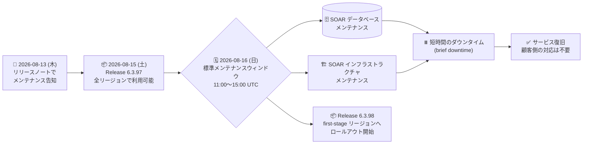

# Google SecOps / Google SecOps SOAR: 2026 年 8 月 16 日 (日) の SOAR データベース・インフラストラクチャ定期メンテナンス

**リリース日**: 2026-08-13

**サービス**: Google SecOps / Google SecOps SOAR

**機能**: SOAR データベースおよびインフラストラクチャの定期メンテナンス (標準メンテナンスウィンドウ内で実施)

**ステータス**: Announcement (Scheduled Maintenance)

📊 [このアップデートのインフォグラフィックを見る](https://takech9203.github.io/google-cloud-news-summary/20260813-google-secops-soar-scheduled-maintenance-august-16.html)

## 概要

2026 年 8 月 13 日、Google は Google SecOps および Google SecOps SOAR のリリースノートで、SOAR のデータベースとインフラストラクチャに対する定期メンテナンスを **2026 年 8 月 16 日 (日)** の標準メンテナンスウィンドウ内で実施することを告知しました。このウィンドウ中、システムは短時間のダウンタイム (a brief period of downtime) が発生します。**顧客側での対応は不要 (No customer action is required)** です。

この告知は「Google SecOps」と「Google SecOps SOAR」の 2 つのリリースノートに同一内容で掲載されており、SOAR を単体プラットフォームとして利用している顧客と、Google SecOps 内の SOAR コンポーネントを利用している顧客の双方が対象になります。

SOAR プラットフォームの公式メンテナンスウィンドウは、リリースノート (2024 年 12 月 1 日付) に記載のとおり **日曜日の 11:00 〜 15:00 UTC** (日本時間で日曜 20:00 〜 翌 00:00) です。同記載では「メンテナンスは常にサービス停止を伴うわけではない」とされていますが、今回は明示的に短時間のダウンタイムが発生すると告知されている点が通常のメンテナンス告知との違いです。

また、8 月 16 日は SOAR のリリースロールアウト日とも重なっています。SOAR のリリースは日曜日に 2 段階 (first-stage / second-stage) で展開される運用となっており、8 月 15 日には Release 6.3.97 が全リージョンで利用可能となり、8 月 16 日には Release 6.3.98 が first-stage リージョンへのロールアウトを開始します。SOC の運用チームは、同一日にメンテナンス起因のダウンタイムとリリース展開が発生することを前提に当日の体制を検討することになります。

**アップデート前の課題**

- 定期メンテナンスの実施日が事前に告知されない場合、SOC のシフト計画やインシデント対応体制を、ダウンタイムを織り込んで組むことができない
- SOAR のダウンタイム中はコンソールへのアクセスやプレイブック実行が影響を受けるため、実施タイミングが不明なままでは重要なインシデント対応と重なるリスクを避けられない

**アップデート後の改善**

- 実施日 (2026 年 8 月 16 日 日曜) が事前にリリースノートで告知され、標準メンテナンスウィンドウ (日曜 11:00 〜 15:00 UTC) 内で実施されることが明確になった
- ダウンタイムが「短時間」であることと、顧客側の作業が不要であることが明示され、事前準備や設定変更を行う必要がないことが確認できる
- 同時期のリリース展開 (8 月 15 日: 6.3.97 全リージョン、8 月 16 日: 6.3.98 first-stage) とあわせて、当日の変更内容を把握できる

## アーキテクチャ図

8 月 13 日の告知から 8 月 16 日の標準メンテナンスウィンドウでの実施、短時間のダウンタイムを経た復旧までの流れと、同時期のリリース展開の位置関係を示しています。

## サービスアップデートの詳細

### 主要機能

1. **SOAR データベースおよびインフラストラクチャのメンテナンス**
   - 対象は SOAR のデータベースとインフラストラクチャ
   - 実施日は 2026 年 8 月 16 日 (日曜)
   - 実施時間帯は SOAR の標準メンテナンスウィンドウ内

2. **短時間のダウンタイムの発生**
   - メンテナンスウィンドウ中、システムに短時間のダウンタイム (a brief period of downtime) が発生する
   - リリースノートではダウンタイムの具体的な長さは明示されていない

3. **顧客側の対応は不要**
   - 事前の設定変更や作業は必要ない (No customer action is required)
   - Google SecOps 統合プラットフォーム利用者と SOAR スタンドアロン利用者の双方が対象

## 技術仕様

### メンテナンスの概要

| 項目 | 詳細 |
|------|------|
| 告知日 | 2026 年 8 月 13 日 (木) |
| 実施日 | 2026 年 8 月 16 日 (日) |
| 実施時間帯 | SOAR の標準メンテナンスウィンドウ内 |
| 対象コンポーネント | SOAR データベース、SOAR インフラストラクチャ |
| 影響 | 短時間のダウンタイム (brief period of downtime) |
| 顧客側の対応 | 不要 |
| 掲載リリースノート | Google SecOps / Google SecOps SOAR (同一内容) |

### SOAR プラットフォームの標準メンテナンスウィンドウ

| 項目 | 詳細 |
|------|------|
| 公式メンテナンスウィンドウ | 日曜日 11:00 〜 15:00 UTC (リリースノート 2024 年 12 月 1 日付) |
| 日本時間 (JST) 換算 | 日曜日 20:00 〜 翌月曜 00:00 |
| 補足 | メンテナンスは常にサービス停止を伴うわけではない (今回は明示的にダウンタイムありと告知) |

### SOAR リリースの展開ステージ (参考)

SOAR のリリースは日曜日に 2 段階でロールアウトされ、second-stage のリージョンは first-stage の 1 週間後に更新されます。

| ステージ | リージョン |
|----------|-----------|
| First-stage | 日本、インド、オーストラリア、カナダ、ドイツ、スイス |
| Second-stage | シンガポール、カタール、サウジアラビア、イスラエル、英国 (ロンドン)、イタリア、EU (マルチリージョン)、US (マルチリージョン) |

自身の割り当てリージョンが不明な場合は、Google SecOps の担当者に問い合わせます。

## メリット

### ビジネス面

- **計画的な運用調整が可能**: 実施日が事前告知されるため、SOC のシフト、当直体制、変更凍結期間などを事前に調整できる
- **作業負荷がゼロ**: 顧客側の対応が不要なため、運用チームがメンテナンス対応工数を確保する必要がない

### 技術面

- **業務影響の小さい時間帯での実施**: 標準メンテナンスウィンドウ (日曜 11:00 〜 15:00 UTC) 内で実施されるため、平日業務時間帯への影響を避けられる
- **データベースとインフラの継続的な健全性維持**: SOAR のデータベースおよびインフラストラクチャのメンテナンスにより、プラットフォームの安定性・パフォーマンスが維持される

## デメリット・制約事項

### 制限事項

- メンテナンスウィンドウ中に短時間のダウンタイムが発生する (リリースノート上、具体的な所要時間は示されていない)
- メンテナンスウィンドウは Google 側で定められた標準ウィンドウであり、顧客が任意の日時に変更することはできない

### 考慮すべき点

- ダウンタイム発生中は Google SecOps / SOAR プラットフォームへのアクセスや操作が一時的にできなくなる可能性があるため、当日の緊急インシデント対応手順 (代替手段・エスカレーション先) をあらかじめ確認しておくことが望ましい
- 日本のリージョンは SOAR リリースの first-stage に含まれるため、8 月 16 日は今回のメンテナンスと Release 6.3.98 のロールアウトが同日に重なる
- 日本時間では日曜 20:00 〜 翌月曜 00:00 という夜間帯にあたるため、24 時間体制の SOC では夜勤シフトへの周知が必要になる
- Google Cloud 側のサービス状況は Personalized Service Health (Service Health ダッシュボード / API / Cloud Logging ベースのアラート) で確認・通知設定が可能

## ユースケース

### ユースケース 1: 24 時間体制 SOC における当日シフトへの周知

**シナリオ**: 24 時間体制で Google SecOps を運用している SOC が、8 月 16 日 (日) 夜間 (JST) にプラットフォームへアクセスできない時間帯が発生することを、日曜夜勤シフトのアナリストに周知する。

**効果**: メンテナンスによるアクセス不能を障害と誤認せず、無用なインシデントチケット起票や Google サポートへの問い合わせを回避できる。ダウンタイム中の暫定対応 (手動トリアージ、代替連絡経路) を事前に合意できる。

### ユースケース 2: 変更管理カレンダーへの反映とリリース展開との突き合わせ

**シナリオ**: SOAR のプレイブックやコネクタの変更を計画している運用チームが、8 月 16 日のメンテナンスおよび Release 6.3.98 の first-stage ロールアウトを変更管理カレンダーに登録し、同日の自チームの変更作業を回避する。

**効果**: プラットフォーム側の変更 (メンテナンス + リリース) と自チームの変更が重ならないため、問題が発生した際の切り分けが容易になる。

## 料金

このメンテナンスの実施に伴う追加料金は発生しません。Google SecOps の料金体系については、Google Security Operations の料金ページを参照してください。

## 利用可能リージョン

今回のメンテナンスは Google SecOps SOAR のプラットフォーム全体を対象とした定期メンテナンスであり、リリースノートでは対象リージョンの限定は示されていません。SOAR のリージョン展開ステージ (first-stage / second-stage) は「Release plan for Google SecOps」に記載されています。

## 関連サービス・機能

- **Google SecOps SOAR**: 今回のメンテナンス対象。データベースとインフラストラクチャが更新される
- **Google SecOps (統合プラットフォーム)**: SOAR コンポーネントを含むため、同一内容の告知がリリースノートに掲載されている
- **Release plan for Google SecOps**: SOAR リリースが日曜日に 2 段階で展開される仕組みを規定。8 月 16 日は Release 6.3.98 の first-stage ロールアウト日でもある
- **Personalized Service Health**: Google Cloud のサービス状況・障害イベントをプロジェクト単位で確認し、Cloud Logging / Cloud Monitoring 経由でアラート通知を設定できる
- **SOAR Remote Agent の通知機能**: リモートエージェントの新バージョンリリースやエージェントのダウンタイムを通知する機能 (デフォルトで有効)

## 参考リンク

- 📊 [インフォグラフィック](https://takech9203.github.io/google-cloud-news-summary/20260813-google-secops-soar-scheduled-maintenance-august-16.html)
- [公式リリースノート (Google Cloud 全体 / 2026 年 8 月 13 日)](https://docs.cloud.google.com/release-notes#August_13_2026)
- [Google Security Operations SOAR release notes](https://docs.cloud.google.com/chronicle/docs/soar/release-notes)
- [Release plan for Google SecOps (リージョン展開ステージ)](https://docs.cloud.google.com/chronicle/docs/soar/overview-and-introduction/soar-gradual-release)
- [Personalized Service Health の概要](https://docs.cloud.google.com/service-health/docs/overview)
- [Google Security Operations 料金](https://cloud.google.com/chronicle/pricing)

## まとめ

2026 年 8 月 16 日 (日) の標準メンテナンスウィンドウ (日曜 11:00 〜 15:00 UTC / 日本時間 20:00 〜 翌 00:00) 内で、Google SecOps SOAR のデータベースとインフラストラクチャの定期メンテナンスが実施され、短時間のダウンタイムが発生します。顧客側の作業は不要ですが、同日は Release 6.3.98 の first-stage ロールアウト日にも重なるため、SOC 運用チームは日曜夜間シフトへの周知と、当日の変更作業の回避を検討することを推奨します。

---

**タグ**: Google SecOps, Google SecOps SOAR, Chronicle, メンテナンス, 定期メンテナンス, ダウンタイム, メンテナンスウィンドウ, SOC 運用
