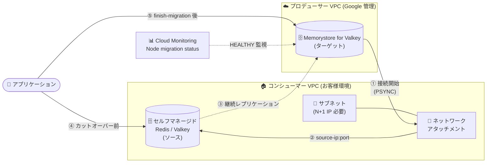

# Memorystore for Valkey: セルフマネージド Redis/Valkey からのワークロード移行が GA

**リリース日**: 2026-08-13

**サービス**: Memorystore for Valkey

**機能**: Google Cloud 上のセルフマネージド Redis / Valkey インスタンスから Memorystore for Valkey へのワークロード移行

**ステータス**: GA (一般提供)

📊 [このアップデートのインフォグラフィックを見る](https://takech9203.github.io/google-cloud-news-summary/20260813-memorystore-valkey-self-managed-migration-ga.html)

## 概要

Google Cloud 上で自己管理 (セルフマネージド) している Redis および Valkey インスタンスから、フルマネージドの Memorystore for Valkey へワークロードを移行する機能が GA (一般提供) になりました。2026 年 4 月 16 日に Preview として提供が開始された機能であり、今回の GA により本番環境での移行プロジェクトに正式なサポートと SLA のもとで適用できるようになります。

この移行機能は、Private Service Connect の**ネットワークアタッチメント**を介して移行先 (ターゲット) の Memorystore for Valkey インスタンスがソースインスタンスへ接続し、ターゲットインスタンスをソースインスタンスの**リードレプリカ**として動作させることでデータを継続的にレプリケーションします。カットオーバーのタイミングを利用者が制御できるため、ダウンタイムを最小限に抑えた移行が可能です。

対象となるのは、Compute Engine VM や GKE 上で Redis / Valkey をセルフホストしており、OS パッチ適用・レプリケーション構成・バックアップスクリプトなどの運用負荷から脱却したい組織です。Memorystore for Valkey へ移行することで、99.99% の SLA、自動フェイルオーバー、組み込みのバックアップ/リストア、VPC ネイティブなセキュリティと IAM ベースのアクセス制御、最大 250 シャードまでのスケールアウト、Vector Search などの高度な機能が利用できるようになります。

**アップデート前の課題**

- セルフマネージド Redis / Valkey から Memorystore for Valkey への移行機能は Preview 段階であり、Pre-GA Offerings Terms (「as is」提供・サポート限定) が適用されるため、本番環境の移行プロジェクトに採用しづらかった
- セルフマネージド環境では OS パッチ適用、インフラ監視、バックアップスクリプト、レプリケーション管理といった運用タスクを自社で担う必要があった
- 複雑なネットワークルールを手動で構成する必要があり、IAM ベースの粒度の細かいアクセス制御を利用できなかった
- サイロ化した複数のセルフマネージドインスタンスの統合や、古い Redis / Valkey バージョンのアップグレードには個別の作業が必要だった

**アップデート後の改善**

- セルフマネージド Redis / Valkey から Memorystore for Valkey への自動移行が GA となり、本番ワークロードの移行に正式に利用できるようになった
- レプリケーションベースの移行により、カットオーバー時のダウンタイムを最小限に抑えられる
- 移行と同時に古い Redis / Valkey バージョンから最新のサポート対象バージョン (Valkey 7.2 / 8.0 / 9.0 / 9.1 (Preview)) へアップグレードできる
- 移行完了後は 99.99% SLA、自動フェイルオーバー、組み込みバックアップ、VPC ネイティブセキュリティ、最大 250 シャードへのスケールアウトといったマネージド機能の恩恵を受けられる

## アーキテクチャ図



ターゲットの Memorystore for Valkey インスタンスがネットワークアタッチメント経由でソースインスタンスへ接続し、リードレプリカとしてデータを継続的に取り込みます。`Node migration status` メトリクスが `HEALTHY` であることを確認した上で移行を完了 (finish) し、アプリケーションのトラフィックをターゲットへ切り替えます。

## サービスアップデートの詳細

### 主要機能

1. **レプリケーションベースの自動データ移行**
   - 移行を開始すると、ターゲットインスタンスがソースインスタンスとのレプリケーションを確立し、ソースへの書き込みが自動的にターゲットへ複製される
   - ターゲットインスタンスはソースインスタンスのリードレプリカとして動作する (移行中は書き込み不可)
   - ソースインスタンスの IP アドレスとポートを指定すると、Memorystore for Valkey がインスタンストポロジ内の他のノードを自動的に検出する

2. **ネットワークアタッチメントによる VPC 間接続**
   - プロデューサー VPC 上のターゲットインスタンスから、コンシューマー VPC 上のソースインスタンスへの接続をネットワークアタッチメントで確立
   - ターゲットノードからの接続は、ネットワークアタッチメントに紐づくサブネットの IP アドレスから発信される

3. **カットオーバーの制御と自動ロールバック**
   - 移行完了 (finish) 操作のタイミングを利用者が制御でき、完了後にターゲットインスタンスが読み書き可能になる
   - 完了方法は `Standard` (ソースの全データ複製を保証) と `Force (Skip-sync)` (即時カットオーバー、全データ複製が保証されない) の 2 種類
   - ターゲットノードがソースノードへ接続できない場合やレプリケーションが確立できない場合、移行は失敗し、ターゲットインスタンスは移行開始前の状態 (`ACTIVE` / Ready、読み書き可能) に自動ロールバックされる。問題を解消後、再度移行を開始できる

4. **Cloud Monitoring による移行状況の可視化**
   - ターゲットインスタンスの各プライマリノードについて `Node migration status` メトリクスで健全性を確認できる
   - ソースインスタンス側では client output buffer の使用量が低く保たれていることを確認することで、レプリケーション遅延が小さいことを判断できる

5. **移行と同時のバージョンアップグレードとインスタンス統合**
   - 移行の一環として、古い Redis / Valkey バージョンから最新のサポート対象リリースへ自動的にアップグレードできる
   - サイロ化した複数のセルフマネージドインスタンスを 1 つの高性能な Memorystore for Valkey デプロイメントへ統合できる

## 技術仕様

### サポートされるバージョン

| ソースインスタンスの種類 | ソースのバージョン | 移行先 (ターゲット) のバージョン |
|------|------|------|
| Redis | 3.2.x - 7.2.x | Valkey 7.2、8.0、9.0、9.1 (Preview) |
| Valkey | 7.x、8.x、9.x | Valkey 7.2、8.0、9.0、9.1 (Preview) |

ターゲットインスタンスのバージョンは、ソースインスタンスと同じか、それ以降のバージョンである必要があります。ターゲットインスタンスを以前のバージョンにダウングレードすることはできません。

### ターゲットインスタンスの要件

| 項目 | 要件 |
|------|------|
| プロジェクト / リージョン | ソースインスタンスと同一のプロジェクトかつ同一リージョン |
| クラスタモード | ソースインスタンスのクラスタモードと一致させる (Cluster Mode Disabled / Enabled) |
| 論理データベース数 | Cluster Mode Disabled の場合、ソースインスタンスのデータベース数と同じか、それ以上 |
| シャード数 | Cluster Mode Enabled の場合、ソースインスタンスのシャード数と完全に一致させる (レプリカ数は異なってよい) |
| メンテナンスバージョン | `MEMORYSTORE_20260313_01_00` 以降 |
| ノードタイプ | ソースインスタンスから受け取るデータを保持できる十分なキースペース容量を持つノードタイプ |
| 除外条件 | クロスリージョンレプリケーションのインスタンスはターゲットとして使用できない |

### ネットワークアタッチメントの要件

| 項目 | 要件 |
|------|------|
| 配置 | ターゲットインスタンスと同一のプロジェクトかつ同一リージョン |
| サブネット | ソースインスタンスと同一の VPC ネットワーク内 |
| IP CIDR 範囲 | 最低 N+1 個の使用可能な IP アドレス (N = ターゲットインスタンスのノード数) |
| 予約範囲との重複 | `10.0.0.0/23` と重複してはならない (Memorystore for Valkey の予約範囲) |

例: ターゲットインスタンスが 3 シャード + レプリカ 1 の場合、ノード数は 6 (プライマリ 3 + レプリカ 3) となるため、少なくとも 7 個の IP アドレスが必要です。

### ノードタイプのキースペース容量 (ターゲットのサイジング参考)

| ノードタイプ | デフォルト書き込み可能キースペース容量 | ノード総容量 | vCPU |
|------|------|------|------|
| shared-core-nano | 1.12 GB | 1.4 GB | 0.5 (SLA 対象外) |
| custom-pico | 1.08 GB | 1.25 GB | 2 |
| custom-micro | 2 GB | 2.5 GB | 2 |
| custom-mini | 3 GB | 3.75 GB | 2 |
| standard-small | 5.2 GB | 6.5 GB | 2 |
| highmem-medium | 10.4 GB | 13 GB | 2 |
| highcpu-medium | 10.4 GB | 13 GB | 8 |
| standard-large | 20.8 GB | 26 GB | 8 |
| highmem-xlarge | 46.4 GB | 58 GB | 8 |
| highmem-2xlarge | 88 GB | 110 GB | 16 |

## 設定方法

### 前提条件

1. Google Cloud プロジェクトで課金が有効になっていること
2. gcloud CLI がインストール・初期化されていること (Memorystore for Valkey のコマンドを使うには **バージョン 489.0.0 以上** が必要)
3. 以下の API が有効化されていること
   - Memorystore for Valkey API
   - Network Connectivity API
   - Service Consumer Management API
   - Compute Engine API
4. 以下の IAM ロールが付与されていること
   - Memorystore Admin (`roles/memorystore.admin`) — 移行操作全般
   - Compute Network Admin (`roles/compute.networkAdmin`) — ネットワークアタッチメントの作成と参照

### 移行ワークフローの全体像

1. **ソースインスタンスの準備** — セルフマネージド Redis / Valkey が Memorystore for Valkey からの接続とアウトバウンドレプリケーションを許可するよう構成する
2. **ターゲットインスタンスの要件確定** — シャード数、ノードタイプなどの仕様を決定する
3. **ターゲットインスタンスの作成** — 移行データを受け取る Memorystore for Valkey インスタンスをプロビジョニングする
4. **ネットワークアタッチメントの構成** — プロデューサー VPC のターゲットインスタンスからコンシューマー VPC のソースインスタンスへの接続を確立する
5. **移行の開始** — 同期処理を開始し、ターゲットインスタンスがリードレプリカとして継続的にデータを複製する
6. **移行の監視** — 移行ステータスが `HEALTHY` であることを確認する
7. **移行の完了** — アプリケーショントラフィックをターゲットインスタンスへ切り替える

### ステップ 1: ソースインスタンスの準備

ターゲットノードからソースノードへの接続を許可するための設定:

- ソースノードで `protected-mode` が有効な場合は無効化する
- ソースノードに明示的な `bind` ディレクティブを設定している場合、ターゲットノードからの受信接続を許可するよう更新する (ターゲットノードはネットワークアタッチメントのサブネットの IP アドレスから接続を開始する)
- ターゲットノードからの受信接続をブロックするファイアウォールルールを更新する
- ソースノードで認証および TLS が有効な場合は無効化する

レプリケーションを確立するための設定:

- データ変更やレプリケーションに使用される Valkey / Redis コマンド (`PING`、`PSYNC`、`HSET` など) をリネームしない
- ACL (アクセス制御リスト) を使用している場合、`default` ユーザーに対して以下のコマンドを許可する
  - `REPLCONF`、`SYNC`、`PSYNC`、`PING`、`INFO`、`CLUSTER|NODES`
- ターゲットノードからのレプリケーション負荷を処理できる十分なメモリと CPU 容量をソースインスタンスが備えていることを確認する

**重要**: ソースインスタンスの IP アドレスとポート番号を記録しておきます。移行プロセス中、Memorystore for Valkey はこの IP アドレスとポートに常に通信できる必要があります。

### ステップ 2: 移行の開始

```bash
gcloud beta memorystore instances start-migration INSTANCE_ID \
    --project=PROJECT_ID \
    --location=REGION \
    --source-ip=SOURCE_IP_ADDRESS \
    --source-port=SOURCE_PORT \
    --network-attachment=projects/NETWORK_ATTACHMENT_PROJECT_ID/locations/NETWORK_ATTACHMENT_REGION/networkAttachments/NETWORK_ATTACHMENT_ID
```

開始後、ステータスを確認します。

```bash
gcloud memorystore instances describe INSTANCE_ID \
    --project=PROJECT_ID \
    --location=REGION_ID
```

`state` パラメータに `MIGRATING` が表示されれば開始成功です。コンソールから実行する場合は、ターゲットインスタンスの「Instance at a glance」ページで **Start migration** をクリックし、Prepare → Connect (ソースの IP / ポートとネットワークアタッチメントを指定) → Review の順に進めます。

**注意**: 移行を開始した後、移行を完了するまでソースインスタンスでスロット移行 (slot migration) 操作を実施しないでください。

### ステップ 3: 移行の監視

ターゲットインスタンス側では、各プライマリノードの `Node migration status` メトリクスが `HEALTHY` であることを確認します。Metrics Explorer で `Memorystore Instance Node > Instance > Node migration status` を選択し、以下のフィルタを追加します。

```
instance_id = INSTANCE_ID
role        = primary
status     != HEALTHY
```

このフィルタで何も表示されなければ、すべてのノードが健全であり、移行を完了できる状態です。ソースインスタンス側では client output buffer の使用量が低く保たれていることを確認します。

### ステップ 4: 移行の完了 (カットオーバー)

```bash
gcloud beta memorystore instances finish-migration INSTANCE_ID \
    --project=PROJECT_ID \
    --location=REGION
```

`state` が `MIGRATED` になれば完了です。デフォルトでは、Memorystore for Valkey は移行完了時点までソースインスタンスに完全に追いついた状態を保証します。**データの完全な整合性とデータ損失ゼロを求める場合は、移行を完了する前にソースインスタンスへのすべての書き込み操作を停止してください。** 完了後にソースへ書き込まれたデータはレプリケーションされない可能性があります。

即時カットオーバーが必要な場合は `--force` パラメータ (コンソールでは `Force (Skip-sync)`) を使用できますが、ソースインスタンスの全データがターゲットへ複製されない可能性があります。

移行完了後は、アプリケーションの構成ファイルを更新し、すべてのトラフィックをターゲットインスタンスへ向けます。

## メリット

### ビジネス面

- **運用負荷の解消**: OS パッチ適用、インフラ監視、バックアップスクリプト、レプリケーション管理といった手作業かつ時間のかかるタスクを Google Cloud にオフロードでき、データベース保守ではなくアプリケーション開発に注力できる
- **本番採用の判断が可能**: GA により Pre-GA Offerings Terms の制約がなくなり、正式サポートのもとで本番ワークロードの移行計画を立てられる
- **インスタンスの統合**: サイロ化した複数のセルフマネージドインスタンスを 1 つの高性能なデプロイメントへ統合し、管理対象を削減できる

### 技術面

- **エンタープライズグレードの高可用性**: フルマネージドの 99.99% SLA、自動フェイルオーバー、組み込みのバックアップ/リストアにより、ノード障害からの保護と迅速な災害復旧を実現
- **ニアゼロダウンタイムでのスケール**: 予測困難なトラフィックスパイクに合わせて動的にスケールイン/アウトでき、最大 250 シャードまでアプリケーションを停止せずに拡張できる
- **セキュリティの強化**: 手動構成の複雑なネットワークルールを、VPC ネイティブな接続と IAM ベースの粒度の細かいアクセス制御に置き換えられる
- **バージョンアップグレードの同時実施**: 移行の一環として古い Redis / Valkey バージョンを最新のサポート対象リリースへ自動アップグレードできる
- **高度な機能の利用**: キャッシュやセッション管理でマイクロ秒レイテンシを実現し、生成 AI アプリケーション向けに Vector Search などのマネージド機能を即座に利用できる

## デメリット・制約事項

### 制限事項

- ソースインスタンスとターゲットインスタンスは**同一プロジェクト・同一リージョン**に存在する必要がある (リージョン間移行には対応しない)
- ターゲットインスタンスのバージョンはソースと同じか、それ以降でなければならない (ダウングレード不可)
- Cluster Mode Enabled の場合、ターゲットのシャード数はソースと**完全に一致**させる必要がある
- ターゲットインスタンスのメンテナンスバージョンが `MEMORYSTORE_20260313_01_00` 以降である必要がある
- クロスリージョンレプリケーションのインスタンスはターゲットとして使用できない
- ネットワークアタッチメントのサブネット範囲は `10.0.0.0/23` と重複できない
- ソースインスタンスで認証と TLS を**無効化する必要がある** (移行期間中のセキュリティ設計に配慮が必要)
- ソースインスタンスでデータ変更・レプリケーション関連コマンドをリネームしている場合は移行できない
- 移行開始後、移行完了までソースインスタンスでスロット移行操作を実施できない
- 移行中のターゲットインスタンスはリードレプリカとして動作するため、書き込みを受け付けられない
- `gcloud` の `start-migration` / `finish-migration` コマンドは `beta` トラックで提供されている

### 考慮すべき点

- **ソースインスタンスの容量**: ターゲットノードからのレプリケーション負荷が追加されるため、ソースインスタンスに十分なメモリと CPU の余裕が必要
- **ブロックされたコマンドの確認**: Memorystore for Valkey がブロックしているコマンドをソースインスタンスで使用していないか事前に検証する必要がある
- **完了方式の選択**: `Force (Skip-sync)` は即時カットオーバーが可能だが全データ複製が保証されないため、データ損失を避けたい場合は書き込み停止 + `Standard` を選択する
- **アプリケーション設定の更新**: 移行完了は自動的なトラフィック切り替えを行わないため、接続先エンドポイントの更新を別途計画する必要がある
- **移行期間中のコスト**: ソース (セルフマネージド VM / GKE) とターゲット (Memorystore for Valkey) が並行稼働するため、移行期間中は両方のコストが発生する
- **TLS 無効化のリスク**: ソース側で TLS を無効化する必要があるため、移行期間中は VPC 内の通信経路とファイアウォールによる保護設計を検討する

## ユースケース

### ユースケース 1: Compute Engine 上のセルフマネージド Redis クラスタのモダナイゼーション

**シナリオ**: 3 シャード構成の Redis 6.2 クラスタを Compute Engine VM 上で運用しており、OS パッチ適用とレプリカ管理を運用チームが手作業で実施している。バックアップは cron によるカスタムスクリプトで取得している。

**実装例**:
```bash
# 1. 同一プロジェクト・同一リージョンにターゲットを作成 (Cluster Mode Enabled、シャード数 3 を一致させる)
#    ノードタイプは必要なキースペース容量に応じて選択 (例: highmem-medium = 10.4 GB/ノード)

# 2. ソース VPC のサブネットにネットワークアタッチメントを作成 (N+1 個の IP を確保)

# 3. 移行を開始
gcloud beta memorystore instances start-migration my-valkey-target \
    --project=my-project \
    --location=us-central1 \
    --source-ip=10.128.0.15 \
    --source-port=6379 \
    --network-attachment=projects/my-project/locations/us-central1/networkAttachments/valkey-migration-na

# 4. Node migration status が HEALTHY になったら、ソースへの書き込みを停止して完了
gcloud beta memorystore instances finish-migration my-valkey-target \
    --project=my-project \
    --location=us-central1
```

**効果**: OS パッチ適用・バックアップスクリプト・レプリケーション管理の運用タスクが不要になり、Redis 6.2 から Valkey の最新サポートバージョンへのアップグレードも移行と同時に完了する。99.99% SLA と自動フェイルオーバーが適用される。

### ユースケース 2: サイロ化した複数インスタンスの統合と生成 AI 基盤への転換

**シナリオ**: 部門ごとに個別の VM 上で小規模な Redis / Valkey インスタンスを運用しており、バージョンもまちまちで管理が煩雑。同時に、生成 AI アプリケーション向けのベクトル検索基盤を新規に用意したい。

**効果**: 各インスタンスを Memorystore for Valkey へ順次移行することで、管理対象を集約しつつバージョンを統一できる。移行後は Vector Search などのマネージド機能をそのまま利用できるため、ベクトル検索基盤を別途構築する必要がなくなる。

## 料金

移行機能自体の追加料金は公表されていません。コストは移行先の Memorystore for Valkey インスタンスの料金として発生します。Memorystore for Valkey の料金は以下の要素で構成されます。

- **ノードタイプ**: インスタンスに使用するノードタイプ
- **プロビジョニング容量**: インスタンスで利用可能なストレージ量 (ノード数ベース)
- **AOF 永続化設定**: AOF データを保存する場合の追加料金
- **リージョン**: インスタンスをプロビジョニングするロケーション
- **レプリカ**: インスタンス内のノード数 (レプリカ有効時)

課金は 1 秒単位で、インスタンスのプロビジョニング容量 (ノード数) に基づきます。インスタンスを作成した時点から、実際に使用しているかどうかに関わらず課金が始まります。

### ノード単価 (us-central1 / Iowa、1 時間あたり)

| ノードタイプ | ノード容量 | オンデマンド (USD) | 1 年 CUD (USD) | 3 年 CUD (USD) |
|------|------|------|------|------|
| shared-core-nano | 1.4 GB | $0.0318 | $0.02544 | $0.01908 |
| custom-pico | 1.25 GB | $0.0308 | - | - |
| custom-micro | 2.5 GB | $0.0616 | - | - |
| custom-mini | 3.75 GB | $0.0924 | - | - |
| standard-small | 6.5 GB | $0.1425 | $0.114 | $0.0855 |
| highmem-medium | 13 GB | $0.1923 | $0.15384 | $0.11538 |
| highcpu-medium | 13 GB | $0.4986 | $0.39888 | $0.29916 |
| standard-large | 26 GB | $0.5698 | $0.45584 | $0.34188 |
| highmem-xlarge | 58 GB | $0.8581 | $0.68648 | $0.51486 |
| highmem-2xlarge | 110 GB | $1.6274 | $1.30192 | $0.97644 |

バックアップストレージは $0.00011111 / GB 時間 (us-central1、オンデマンド)。各バックアップには最低 24 時間分の課金が発生します。インスタンスを削除してもバックアップは自動削除されません。AOF 永続化を使用する場合は、インスタンスの総容量 (GB) に応じた追加料金がかかります。

コミット use ディスカウント (CUD) を利用すると、1 年契約で 20%、3 年契約で 40% の削減が可能です。ただし `custom-pico` / `custom-micro` / `custom-mini` のノードタイプには CUD が適用されません。

### 料金例 (us-central1、オンデマンド、730 時間/月)

| 構成 | 月額料金 (概算) |
|------|-----------------|
| highmem-medium × 3 シャード (レプリカなし = 3 ノード) | 約 $421 |
| highmem-medium × 3 シャード + レプリカ 1 (= 6 ノード) | 約 $842 |
| standard-large × 5 シャード + レプリカ 1 (= 10 ノード) | 約 $4,160 |

上記はインスタンス料金のみの概算です。移行期間中はソース (セルフマネージド VM / GKE) の費用も並行して発生します。

## 利用可能リージョン

ソースインスタンスとターゲットインスタンスは同一プロジェクト・同一リージョンに配置する必要があります。Memorystore for Valkey がサポートするリージョンは [ロケーションのドキュメント](https://docs.cloud.google.com/memorystore/docs/valkey/locations) を参照してください。

## 関連サービス・機能

- **Private Service Connect / ネットワークアタッチメント**: ターゲットインスタンス (プロデューサー VPC) からソースインスタンス (コンシューマー VPC) への接続経路を提供する必須コンポーネント
- **Cloud Monitoring**: `Node migration status` メトリクスによる移行の健全性監視。Metrics Explorer でプライマリノードの状態を確認する
- **Compute Engine / GKE**: セルフマネージド Redis / Valkey の一般的なホスト環境であり、移行元となる
- **Certificate Authority Service**: 移行完了後、Memorystore for Valkey の Customer-managed CA モードによる転送中暗号化で利用できる
- **Memorystore for Valkey バックアップ**: 移行完了後、組み込みのバックアップ/リストア機能でデータ保護を自動化できる
- **Vector Search (Memorystore for Valkey)**: 移行後に利用可能となる生成 AI 向け機能

## 参考リンク

- 📊 [インフォグラフィック](https://takech9203.github.io/google-cloud-news-summary/20260813-memorystore-valkey-self-managed-migration-ga.html)
- [公式リリースノート](https://docs.cloud.google.com/release-notes#August_13_2026)
- [セルフマネージド Redis / Valkey ワークロードの移行 (ドキュメント)](https://docs.cloud.google.com/memorystore/docs/valkey/migrate-workloads)
- [インスタンスとノードの仕様](https://docs.cloud.google.com/memorystore/docs/valkey/instance-node-specification)
- [ネットワークアタッチメントについて](https://docs.cloud.google.com/vpc/docs/about-network-attachments)
- [gcloud beta memorystore instances start-migration](https://docs.cloud.google.com/sdk/gcloud/reference/beta/memorystore/instances/start-migration)
- [gcloud beta memorystore instances finish-migration](https://docs.cloud.google.com/sdk/gcloud/reference/beta/memorystore/instances/finish-migration)
- [Memorystore for Valkey の割り当てと上限](https://docs.cloud.google.com/memorystore/docs/valkey/quotas)
- [料金ページ](https://cloud.google.com/memorystore/valkey/pricing)
- [確約利用割引 (CUD)](https://docs.cloud.google.com/memorystore/docs/valkey/cuds)

## まとめ

セルフマネージド Redis / Valkey から Memorystore for Valkey へのワークロード移行が GA となり、レプリケーションベースのニアゼロダウンタイム移行を本番環境で正式に採用できるようになりました。Compute Engine や GKE 上で Redis / Valkey を自己運用している組織は、まずソースインスタンスの前提条件 (protected-mode / bind / ファイアウォール / 認証・TLS の無効化、ACL でのレプリケーションコマンド許可、ブロック対象コマンドの使用有無) を棚卸しし、シャード数とクラスタモードを一致させたターゲットインスタンスとネットワークアタッチメントを準備することから着手するのが実践的です。データ損失を避けるには、`Node migration status` が `HEALTHY` になったことを確認した上でソースへの書き込みを停止し、`Standard` 方式で移行を完了させてください。

---

**タグ**: Memorystore for Valkey, Valkey, Redis, マイグレーション, GA, ネットワークアタッチメント, Private Service Connect, レプリケーション, Cloud Monitoring, データベースモダナイゼーション
