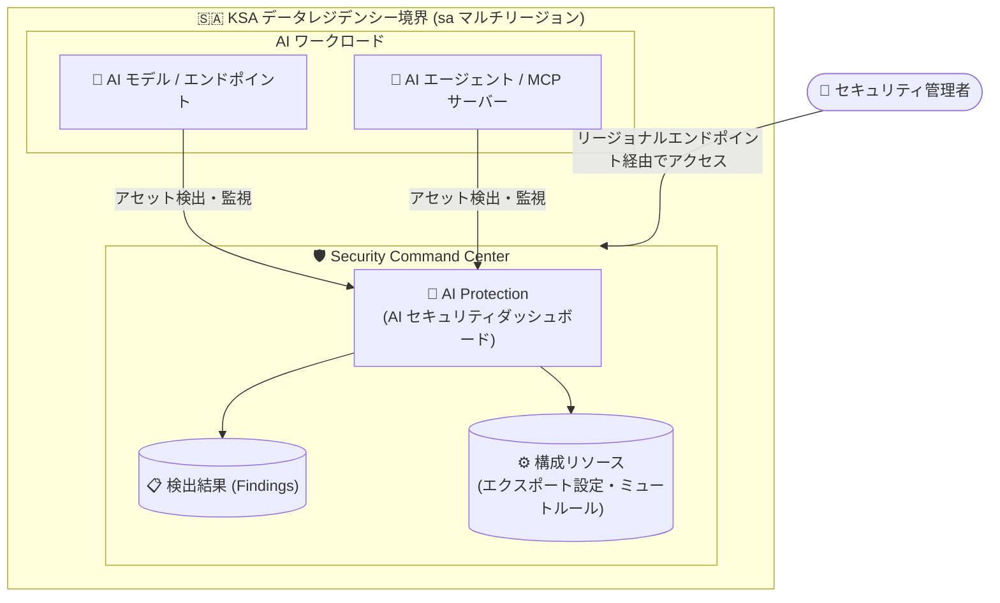

# Security Command Center: AI Protection がサウジアラビア王国 (KSA) のデータレジデンシーをサポート

**リリース日**: 2026-08-13

**サービス**: Security Command Center

**機能**: AI Protection のサウジアラビア王国 (KSA) データレジデンシーサポート

**ステータス**: Feature (全サービスティアで利用可能)

📊 [このアップデートのインフォグラフィックを見る](https://takech9203.github.io/google-cloud-news-summary/20260813-scc-ai-protection-ksa-data-residency.html)

## 概要

Security Command Center の AI Protection が、サウジアラビア王国 (Kingdom of Saudi Arabia, KSA) におけるデータレジデンシーをサポートしました。このサポートは Security Command Center のすべてのサービスティア (Standard、Premium、Enterprise) で利用できます。

AI Protection は、AI ワークロードのセキュリティポスチャを管理する機能で、AI アセットインベントリの把握、脅威の検出、リスクの軽減を支援します。今回のアップデートにより、AI Protection が生成・管理するデータを KSA 内の Google Cloud リージョンに保持できるようになり、サウジアラビアの規制要件 (データ主権・データローカライゼーション要件) に対応する必要がある組織でも AI Protection を活用しやすくなりました。

金融、公共、通信など、データの国外持ち出しに厳格な規制があるサウジアラビア国内の組織や、KSA リージョンでワークロードを運用するグローバル企業が主な対象です。

**アップデート前の課題**

- AI Protection のデータは KSA のデータレジデンシー境界内での保持に対応しておらず、厳格なデータローカライゼーション要件を持つサウジアラビアの組織は AI Protection の利用を制限せざるを得なかった
- Security Command Center 本体はデータロケーションとして EU (`eu`)、米国 (`us`)、KSA (`sa`) をサポートしていたが、AI Protection の機能を KSA レジデンシー環境で完全に利用することができなかった
- AI ワークロードのセキュリティ監視と規制コンプライアンスの両立が難しかった

**アップデート後の改善**

- AI Protection のデータを KSA 内の Google Cloud リージョンに保持しながら、AI アセットインベントリの評価や脅威検出などの機能を利用できるようになった
- Standard、Premium、Enterprise のすべてのサービスティアで KSA データレジデンシーが利用可能になった
- サウジアラビアの規制要件を満たしつつ、AI ワークロードのセキュリティポスチャ管理を一元的に実施できるようになった

## アーキテクチャ図



AI Protection が監視する AI アセットの情報や検出結果 (Findings) を、KSA のデータレジデンシー境界内に保持したまま管理できる構成を示しています。データレジデンシー有効時は、リージョナルエンドポイントを使用してデータの作成・参照を行います。

## サービスアップデートの詳細

### 主要機能

1. **KSA データロケーションでの AI Protection サポート**
   - Security Command Center のデータレジデンシー対応ロケーションである KSA (`sa`) マルチリージョンで、AI Protection が利用可能になった
   - データは KSA 内の Google Cloud リージョンに保持される

2. **全サービスティアでの提供**
   - Standard、Premium、Enterprise のすべての Security Command Center サービスティアで利用可能
   - Standard ティアではベースラインのセキュリティ検出 (Security Essentials)、Premium / Enterprise ティアでは脆弱性の特定、Attack Path Simulation によるリスク特定、脅威検出などの高度な機能を利用できる

3. **AI Protection の主な機能 (KSA レジデンシー下でも利用可能)**
   - AI アセットインベントリの評価 (モデル、データソース、エンドポイント、エージェント、MCP サーバー)
   - 過剰な権限を持つエージェントの検出
   - リスクとコンプライアンスの管理 (AI Protection フレームワークの適用)
   - AI セキュリティダッシュボードによる一元管理

## 技術仕様

### Security Command Center のデータレジデンシー対応ロケーション

| ロケーション | コード | データ保持先 |
|------|------|------|
| 欧州連合 | `eu` | EU 加盟国内の Google Cloud リージョン |
| サウジアラビア王国 | `sa` | KSA 内の Google Cloud リージョン |
| 米国 | `us` | 米国内の Google Cloud リージョン |

### データレジデンシーの適用対象と適用状態

| 項目 | 詳細 |
|------|------|
| 適用対象リソース | 検出結果 (Findings)、BigQuery エクスポート設定、継続的エクスポート設定、ミュートルール設定など |
| 適用される状態 | 保存時 (At rest)、使用時 (In use)、転送時 (In transit) |
| 必要な API バージョン | Security Command Center v2 API (v1 以前は利用不可) |
| 有効化のタイミング | 組織で Security Command Center を初めて有効化する時に設定 |
| アクセス方法 | リージョナルエンドポイントおよび管轄区域別 Google Cloud コンソールを使用 |

## 設定方法

### 前提条件

1. Security Command Center の組織レベルまたはプロジェクトレベルの有効化
2. データレジデンシーは、組織で Security Command Center を初めて有効化する際に設定する (Standard / Premium ティアはデータレジデンシー構成の変更が可能)
3. Enterprise ティアでデータレジデンシーを有効化する場合は、事前に Google Cloud アカウント担当者への連絡が必要
4. データレジデンシー有効化後は Security Command Center v2 API の使用が必須

### 手順

#### ステップ 1: データレジデンシーを有効化して Security Command Center を有効化

組織で Security Command Center を有効化する際に、データロケーションとして KSA (`sa`) を選択します。詳細は [データレジデンシーの計画](https://docs.cloud.google.com/security-command-center/docs/data-residency-support) を参照してください。

#### ステップ 2: リージョナルエンドポイント経由でリソースを操作

データレジデンシー有効化後は、リージョナルエンドポイントを使用して検出結果や構成リソースを作成・参照します。

```bash
# 例: KSA ロケーションの検出結果を一覧表示 (v2 API / リージョナルエンドポイント)
gcloud scc findings list <ORGANIZATION_ID> \
  --location=sa
```

データの作成・参照は一度に 1 つのロケーションに対してのみ行えます。

## メリット

### ビジネス面

- **規制コンプライアンスへの対応**: サウジアラビアのデータローカライゼーション要件やデータ主権要件を満たしながら、AI ワークロードのセキュリティ管理を実現できる
- **AI 導入の加速**: 規制上の懸念から AI セキュリティ機能の利用を控えていた KSA の組織が、AI Protection を活用して安全に AI 活用を推進できる
- **法的・財務的リスクの軽減**: セキュリティ侵害や規制違反に伴う財務的・法的・レピュテーションリスクを低減できる

### 技術面

- **保存時・使用時・転送時のデータ保持**: データレジデンシーは保存時だけでなく、使用時 (メモリ内)、転送時にも適用される
- **全ティアで利用可能**: Standard ティアからでも AI Protection の KSA データレジデンシーを利用でき、段階的な導入が可能
- **一元的な AI セキュリティ管理**: レジデンシー境界内で AI アセットインベントリ、リスク、脅威を単一のダッシュボードで管理できる

## デメリット・制約事項

### 制限事項

- データレジデンシーは、組織で Security Command Center を初めて有効化する際に設定する必要がある (Standard / Premium ティアで有効化していない場合、Enterprise へのアップグレード時に有効化することはできない)
- データレジデンシー有効時は Security Command Center v2 API のみ利用可能 (v1 以前の API は使用不可)
- データレジデンシー有効時、一部の機能が利用できない場合がある (例: Enterprise ティアでの外部クラウド向け CIEM、Mandiant Attack Surface Management、一部の Cloud Run Threat Detection / Container Threat Detection 検出器)
- Pre-GA (プレビュー) の機能・サービスにはデータロケーションの規約が適用されない

### 考慮すべき点

- データの作成・参照は一度に 1 つのロケーションに対してのみ可能 (例: `sa` ロケーションの検出結果一覧には `eu` や `us` の検出結果は表示されない)
- 選択したデータロケーション外のリソースに対して検出結果が作成された場合、最終的には選択したロケーションに保持されるが、作成直後は一時的に別のリージョンに存在する可能性がある。すべての検出結果をロケーション内に保持するには、Google Cloud リソース自体を KSA リージョンに作成することが推奨される
- Enterprise ティアは 2027 年 5 月 21 日にシャットダウンが予定されており、以降は Premium ティアに自動移行される

## ユースケース

### ユースケース 1: サウジアラビアの金融機関における AI ワークロードのセキュリティ監視

**シナリオ**: サウジアラビア国内の金融機関が、顧客対応チャットボットや与信モデルなどの AI ワークロードを Google Cloud 上で運用している。国内規制によりセキュリティ関連データを含む顧客データの国外保存が制限されている。

**実装例**:
```
1. Security Command Center を組織レベルで有効化し、データロケーションに KSA (sa) を選択
2. AI Protection を構成し、AI モデル・エンドポイント・エージェントのインベントリを可視化
3. リージョナルエンドポイント経由で検出結果を管理し、BigQuery エクスポートも sa ロケーションで構成
```

**効果**: セキュリティ検出結果を含むデータを KSA 内に保持しながら、AI ワークロードの脅威検出とリスク管理を実現し、規制対応と AI セキュリティを両立できる。

### ユースケース 2: グローバル企業の KSA 拠点における AI エージェントのガバナンス

**シナリオ**: 中東地域に拠点を展開するグローバル企業が、KSA リージョンで AI エージェントや MCP サーバーを展開しており、現地のデータ主権要件に準拠した形で過剰権限エージェントの検出やコンプライアンス管理を行いたい。

**効果**: AI Protection のダッシュボードで KSA 境界内の AI アセットを一元管理し、過剰な権限を持つエージェントの検出や AI Protection フレームワークによるベースライン統制を、データレジデンシー要件を満たしながら適用できる。

## 料金

AI Protection は Security Command Center の全サービスティア (Standard、Premium、Enterprise) で利用可能です。ティアごとに利用できる機能の範囲が異なります (Standard はベースラインのセキュリティ検出、Premium / Enterprise は脆弱性特定・リスク特定・脅威検出などの高度な機能)。

データレジデンシー自体に追加料金は明示されていません。詳細な料金は公式の料金ページを参照してください。

- [Security Command Center の料金](https://cloud.google.com/security-command-center/pricing)

## 利用可能リージョン

Security Command Center のデータレジデンシーは、以下のマルチリージョンをデータロケーションとしてサポートしています。

- 欧州連合 (`eu`)
- サウジアラビア王国 (`sa`) - 今回のアップデートで AI Protection が対応
- 米国 (`us`)

## 関連サービス・機能

- **Google Security Operations (SecOps)**: Enterprise ティアと連携するセキュリティ運用基盤。SecOps ではデータレジデンシーが常に有効で、無効化はできない
- **BigQuery**: 検出結果のエクスポート先。BigQuery エクスポート設定もデータレジデンシー統制の対象
- **Vertex AI / Gemini Enterprise Agent Platform**: AI Protection が監視対象とする AI モデル・エージェント・MCP サーバーの実行基盤
- **Compliance Manager (フレームワークとクラウドコントロール)**: AI Protection のデフォルトフレームワークやカスタムフレームワークを定義・適用する仕組み。管轄区域別の統制を特定のフォルダに適用し、データを特定の地理的リージョン内に保持する構成も可能

## 参考リンク

- 📊 [インフォグラフィック](https://takech9203.github.io/google-cloud-news-summary/20260813-scc-ai-protection-ksa-data-residency.html)
- [公式リリースノート](https://docs.cloud.google.com/release-notes#August_13_2026)
- [データレジデンシーの計画 (Planning for data residency)](https://docs.cloud.google.com/security-command-center/docs/data-residency-support)
- [AI Protection の概要](https://docs.cloud.google.com/security-command-center/docs/ai-protection-overview)
- [Security Command Center のリージョナルエンドポイント](https://docs.cloud.google.com/security-command-center/docs/regional-endpoints)
- [料金ページ](https://cloud.google.com/security-command-center/pricing)

## まとめ

AI Protection が KSA データレジデンシーに対応したことで、サウジアラビアの厳格なデータローカライゼーション要件を持つ組織でも、AI ワークロードのセキュリティポスチャ管理を全サービスティアで利用できるようになりました。KSA でのデータレジデンシーが必要な組織は、Security Command Center の初回有効化時にデータロケーションとして `sa` を選択する必要があるため、有効化前に「データレジデンシーの計画」ドキュメントを確認し、v2 API とリージョナルエンドポイントの利用を前提とした設計を検討することを推奨します。

---

**タグ**: #SecurityCommandCenter #AIProtection #データレジデンシー #サウジアラビア #KSA #セキュリティ #コンプライアンス #AIセキュリティ
