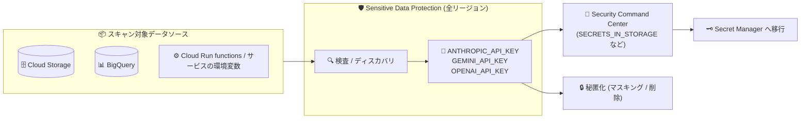

# Sensitive Data Protection: AI サービス API キー検出用 infoType (ANTHROPIC_API_KEY / GEMINI_API_KEY / OPENAI_API_KEY) が全リージョンで利用可能に

**リリース日**: 2026-08-13

**サービス**: Sensitive Data Protection

**機能**: ANTHROPIC_API_KEY / GEMINI_API_KEY / OPENAI_API_KEY infoType 検出器の全リージョン提供

**ステータス**: Feature (全リージョンで利用可能)

📊 [このアップデートのインフォグラフィックを見る](https://takech9203.github.io/google-cloud-news-summary/20260813-sensitive-data-protection-ai-api-key-infotypes.html)

## 概要

Sensitive Data Protection (旧 Cloud DLP) において、生成 AI サービスの API キーを検出する 3 つの組み込み infoType 検出器 `ANTHROPIC_API_KEY`、`GEMINI_API_KEY`、`OPENAI_API_KEY` がすべてのリージョンで利用可能になりました。これらの検出器は、Anthropic API、Gemini API、OpenAI API への認証に使用される API キーをそれぞれ検出します。

生成 AI アプリケーションの普及に伴い、LLM プロバイダーの API キーがソースコード、環境変数、ログ、データウェアハウスなどに誤って混入・保存されるリスクが高まっています。これらの API キーは従量課金と直結しているため、漏洩すると不正利用による高額請求や、組織の AI 利用ポリシー違反につながります。今回のアップデートにより、データレジデンシー要件のある組織でも、任意のリージョンでこれらの AI API キーのスキャン・秘匿化 (de-identification) が可能になります。

対象ユーザーは、生成 AI アプリケーションを開発・運用する組織のセキュリティチーム、データガバナンス担当者、および Security Command Center を利用してシークレット漏洩を監視しているユーザーです。

**アップデート前の課題**

- 生成 AI サービス (Anthropic / Gemini / OpenAI) の API キーを検出する組み込み infoType の利用可能リージョンが限定されており、すべてのリージョンでは使用できなかった
- データレジデンシー要件により特定リージョンでの処理が必須の組織では、これらの検出器を活用したスキャンを構成できないケースがあった
- リージョン制約のため、カスタム infoType (正規表現) で代替する必要があり、検出精度の維持・パターン更新の運用負荷が発生していた

**アップデート後の改善**

- 3 つの AI API キー検出器がすべてのリージョンで利用可能になり、リージョンを問わず一貫したスキャン構成を展開できるようになった
- リージョナルエンドポイントを使用したデータレジデンシー準拠のスキャンでも、AI API キーの検出が可能になった
- 組み込み検出器に統一することで、カスタム infoType によるパターン管理が不要になった

## アーキテクチャ図



Cloud Storage、BigQuery、環境変数などのデータソースを Sensitive Data Protection でスキャンし、新しく全リージョン対応となった 3 つの AI API キー検出器で漏洩シークレットを発見、Security Command Center への通知や秘匿化・Secret Manager への移行といった修復アクションにつなげるフローです。

## サービスアップデートの詳細

### 主要機能

1. **ANTHROPIC_API_KEY 検出器**
   - Anthropic API へのリクエスト認証に使用される API キーを検出
   - Claude API を利用するアプリケーションのキー漏洩検知に活用可能

2. **GEMINI_API_KEY 検出器**
   - Gemini API へのリクエスト認証に使用される API キーを検出
   - Google AI Studio などで発行された Gemini API キーの漏洩検知に活用可能

3. **OPENAI_API_KEY 検出器**
   - OpenAI API へのリクエスト認証に使用される API キーを検出
   - GPT 系 API を利用するアプリケーションのキー漏洩検知に活用可能

4. **全リージョンでの利用**
   - 3 つの検出器すべてが Availability: `ANY_LOCATION` となり、リージョナルエンドポイントを含むすべてのロケーションで指定可能
   - 検査 (inspection)、ディスカバリ (discovery)、秘匿化 (de-identification) の各オペレーションで使用可能

## 技術仕様

### infoType 検出器の概要

| infoType 名 | 説明 | カテゴリ |
|------|------|------|
| `ANTHROPIC_API_KEY` | Anthropic API への認証に使用される API キー | Credentials and secrets (CREDENTIAL) |
| `GEMINI_API_KEY` | Gemini API への認証に使用される API キー | Credentials and secrets (CREDENTIAL) |
| `OPENAI_API_KEY` | OpenAI API への認証に使用される API キー | Credentials and secrets (CREDENTIAL) |

### 検査設定の例 (InspectConfig)

```json
{
  "inspectConfig": {
    "infoTypes": [
      { "name": "ANTHROPIC_API_KEY" },
      { "name": "GEMINI_API_KEY" },
      { "name": "OPENAI_API_KEY" },
      { "name": "GCP_API_KEY" }
    ],
    "minLikelihood": "POSSIBLE",
    "includeQuote": true
  }
}
```

## 設定方法

### 前提条件

1. Google Cloud プロジェクトで DLP API (`dlp.googleapis.com`) が有効化されていること
2. スキャン実行に必要な IAM ロール (例: `roles/dlp.user`) が付与されていること

### 手順

#### ステップ 1: 利用可能な infoType の確認

```bash
# 組み込み infoType の一覧から AI API キー検出器を確認
curl -s -H "Authorization: Bearer $(gcloud auth print-access-token)" \
  "https://dlp.googleapis.com/v2/infoTypes" \
  | grep -A 2 -E "ANTHROPIC_API_KEY|GEMINI_API_KEY|OPENAI_API_KEY"
```

`infoTypes.list` メソッドで最新の組み込み infoType 一覧を取得できます。

#### ステップ 2: コンテンツの検査を実行

```bash
# テキストコンテンツに対する検査の例 (任意のリージョンを指定可能)
curl -s -X POST \
  -H "Authorization: Bearer $(gcloud auth print-access-token)" \
  -H "Content-Type: application/json" \
  "https://dlp.googleapis.com/v2/projects/PROJECT_ID/locations/asia-northeast1/content:inspect" \
  -d '{
    "inspectConfig": {
      "infoTypes": [
        {"name": "ANTHROPIC_API_KEY"},
        {"name": "GEMINI_API_KEY"},
        {"name": "OPENAI_API_KEY"}
      ],
      "includeQuote": true
    },
    "item": {"value": "検査対象のテキスト"}
  }'
```

全リージョン対応となったため、`asia-northeast1` (東京) などのリージョナルロケーションでもこれらの infoType を指定できます。

## メリット

### ビジネス面

- **AI API キー漏洩リスクの低減**: 漏洩した LLM API キーの不正利用による高額請求や情報流出のリスクを、既存のスキャン基盤で低減できる
- **データレジデンシー要件との両立**: 特定リージョン内でのデータ処理が必須の組織でも、AI API キー検出を含むコンプライアンス対応が可能

### 技術面

- **組み込み検出器による運用負荷軽減**: カスタム正規表現の作成・保守が不要で、Google がパターンを維持管理する組み込み検出器を利用できる
- **既存ワークフローへの統合**: 検査ジョブ、ディスカバリ (データプロファイリング)、秘匿化テンプレートに infoType 名を追加するだけで導入できる
- **Security Command Center 連携**: Credentials and secrets カテゴリの infoType として、`SECRETS_IN_STORAGE` や `SECRETS_IN_ENVIRONMENT_VARIABLES` などのシークレット検出ワークフローと組み合わせられる

## デメリット・制約事項

### 制限事項

- 組み込み infoType 検出器は完全に正確な検出手法ではなく、規制要件への準拠を保証するものではない (公式ドキュメントに明記)
- 検出できるのはパターンに合致する API キー文字列であり、キーが有効か (失効済みか) までは判定できない

### 考慮すべき点

- 検出後の対応 (キーのローテーション、Secret Manager への移行、該当データの削除) は別途運用として設計する必要がある
- 大規模なストレージスキャンはコストが増大しうるため、サンプリングや差分スキャン (timespan 設定) などのコスト管理ベストプラクティスの適用を推奨

## ユースケース

### ユースケース 1: データウェアハウス・ストレージ内の AI API キー漏洩検出

**シナリオ**: 生成 AI アプリケーションのログやプロンプト履歴を BigQuery / Cloud Storage に蓄積している組織で、誤って記録された LLM API キーを検出したい。

**実装例**:
```json
{
  "inspectJob": {
    "storageConfig": {
      "cloudStorageOptions": {
        "fileSet": {"url": "gs://BUCKET_NAME/logs/**"}
      }
    },
    "inspectConfig": {
      "infoTypes": [
        {"name": "ANTHROPIC_API_KEY"},
        {"name": "GEMINI_API_KEY"},
        {"name": "OPENAI_API_KEY"}
      ]
    },
    "actions": [
      {"publishSummaryToCscc": {}}
    ]
  }
}
```

**効果**: 蓄積データ内の AI API キーを自動検出し、Security Command Center 経由でセキュリティチームに通知。キーのローテーションと Secret Manager への移行を促進できる。

### ユースケース 2: 東京リージョンでのデータレジデンシー準拠スキャン

**シナリオ**: データを国内 (asia-northeast1) で処理する要件がある金融機関などが、リージョナルエンドポイントを使用して AI API キーを含むシークレットスキャンを実施したい。

**効果**: 全リージョン対応により、データを国内リージョンに保ったまま AI API キーの検出・秘匿化を実行でき、データレジデンシー要件とシークレット管理を両立できる。

### ユースケース 3: LLM へ渡すプロンプトの事前秘匿化

**シナリオ**: ユーザー入力を LLM に渡す前に Sensitive Data Protection の秘匿化 API を通し、誤って入力された API キーをマスキングしたい。

**効果**: `deidentifyContent` で AI API キーを `[REDACTED]` などに置換してから LLM に送信することで、プロンプト経由のシークレット流出を防止できる。

## 料金

infoType 検出器自体に追加料金はなく、Sensitive Data Protection の通常の検査・ディスカバリ料金が適用されます。

### 料金例 (検査: inspection)

| 使用量 | 料金 (概算) |
|--------|-----------------|
| 1 GB まで | 無料 |
| 1 GB 〜 50 TB | $1.00 / GB |
| 50 TB 〜 500 TB | $0.75 / GB |
| 500 TB 超 | $0.60 / GB |

### 料金例 (ディスカバリ: discovery)

| モード | 料金 (概算) |
|--------|-----------------|
| 消費モード | $0.03 / GB (または 3 TB 相当額の低い方) |
| サブスクリプションモード | $2,500 / サブスクリプションユニット |

なお、Cloud Run functions / Cloud Run サービスの環境変数に対するシークレットディスカバリは Sensitive Data Protection の料金は無料です (Security Command Center の料金が別途適用される場合があります)。詳細は[料金ページ](https://cloud.google.com/sensitive-data-protection/pricing)を参照してください。

## 利用可能リージョン

すべてのリージョンで利用可能です (Availability: `ANY_LOCATION`)。Sensitive Data Protection が利用可能なロケーションの一覧は[ロケーションのドキュメント](https://docs.cloud.google.com/sensitive-data-protection/docs/locations)を参照してください。

## 関連サービス・機能

- **Security Command Center**: Credentials and secrets カテゴリの検出結果を `SECRETS_IN_STORAGE` / `SECRETS_IN_ENVIRONMENT_VARIABLES` などの検出項目として集約し、修復手順を提示
- **Secret Manager**: 検出された API キーの安全な保管先。環境変数やコードへの直接埋め込みからの移行先として推奨
- **BigQuery / Cloud Storage / Cloud SQL / Vertex AI**: ディスカバリおよび検査のスキャン対象となるデータソース
- **GCP_API_KEY infoType**: Google Cloud API キー用の既存の組み込み検出器。AI API キー検出器と組み合わせて包括的なキースキャンを構成可能

## 参考リンク

- 📊 [インフォグラフィック](https://takech9203.github.io/google-cloud-news-summary/20260813-sensitive-data-protection-ai-api-key-infotypes.html)
- [公式リリースノート](https://docs.cloud.google.com/release-notes#August_13_2026)
- [InfoType detector reference](https://docs.cloud.google.com/sensitive-data-protection/docs/infotypes-reference)
- [組み込み infoType の一覧取得 (infoTypes.list)](https://docs.cloud.google.com/sensitive-data-protection/docs/listing-infotypes)
- [シークレットディスカバリ (環境変数のシークレット検出)](https://docs.cloud.google.com/sensitive-data-protection/docs/secrets-discovery)
- [Sensitive Data Protection のロケーション](https://docs.cloud.google.com/sensitive-data-protection/docs/locations)
- [料金ページ](https://cloud.google.com/sensitive-data-protection/pricing)

## まとめ

生成 AI の業務利用が急速に拡大する中、LLM プロバイダーの API キー漏洩は不正利用・高額請求に直結する重大なリスクであり、その検出器が全リージョンで利用可能になった意義は大きいアップデートです。既存の検査ジョブ・ディスカバリ設定・秘匿化テンプレートに `ANTHROPIC_API_KEY`、`GEMINI_API_KEY`、`OPENAI_API_KEY` を追加し、Security Command Center と組み合わせたシークレット漏洩監視の強化を推奨します。

---

**タグ**: #SensitiveDataProtection #DLP #infoType #APIキー #シークレット管理 #生成AI #セキュリティ #SecurityCommandCenter
