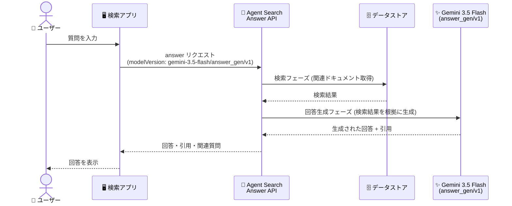

# Vertex AI Search: Agent Search が Gemini 3.5 Flash による回答生成をサポート

**リリース日**: 2026-08-13

**サービス**: Vertex AI Search

**機能**: Agent Search - Gemini 3.5 Flash による回答生成 (Answer Generation)

**ステータス**: Feature (提供開始)

📊 [このアップデートのインフォグラフィックを見る](https://takech9203.github.io/google-cloud-news-summary/20260813-vertex-ai-search-agent-search-gemini-3-5-flash.html)

## 概要

2026 年 8 月 13 日、Vertex AI Search の Agent Search において、**Gemini 3.5 Flash モデルを使用した回答生成 (Answer Generation)** がサポートされました。回答生成のモデルバージョンとして `gemini-3.5-flash/answer_gen/v1` を指定できるようになり、検索サマリー (Search Summaries) および回答とフォローアップ (Answers and Follow-ups) の両方のユースケースで利用できます。

Gemini 3.5 Flash は 2026 年 5 月 19 日にリリースされた一般提供 (GA) モデルで、「Flash 帯のコストと速度で Pro に迫るインテリジェンス」を掲げる最新の Flash モデルです。エージェント実行、コーディング、長期タスクにおいて持続的なフロンティア性能を発揮するとされており、Vertex AI のモデルライフサイクル上も 2027 年 5 月 19 日以降まで利用可能と明示されています。

Agent Search で検索拡張生成 (RAG) ベースの回答生成を運用しているユーザーにとって、現行の stable 指定 (`gemini-2.5-flash/answer_gen/v1`、廃止日 2026 年 10 月 16 日) からの移行先として、GA モデルベースの選択肢が加わった点が重要です。

**アップデート前の課題**

- 回答生成の `stable` 指定は `gemini-2.5-flash/answer_gen/v1` を指しており、ベースの Gemini 2.5 Flash モデルには 2026 年 10 月 16 日の廃止日 (discontinuation date) が設定されていた
- Gemini 3 世代の回答生成モデルは `gemini-3-flash-preview/answer_gen/v1` や `gemini-3.1-pro-preview/answer_gen/v1` などプレビュー版ベースに限られていた
- 廃止日を見据えた移行先として、GA ステータスの新世代 Flash モデルを回答生成に指定する選択肢がなかった

**アップデート後の改善**

- 回答生成モデルとして `gemini-3.5-flash/answer_gen/v1` (コンテキストウィンドウ 128K) を明示的に指定できるようになった
- ベースモデルの Gemini 3.5 Flash は GA であり、リテンション期間は「2027 年 5 月 19 日以降まで」と明示されているため、廃止予定モデルからの計画的な移行が可能になった
- 検索サマリーと回答 (Answer API) の両方で新モデルを選択でき、回答品質とコスト・速度のバランスを用途に応じて選べるようになった

## アーキテクチャ図



Answer API のリクエストで `answerGenerationSpec.modelSpec.modelVersion` に Gemini 3.5 Flash を指定すると、検索フェーズで取得したドキュメントを根拠として同モデルが回答を生成します。

## サービスアップデートの詳細

### 主要機能

1. **Gemini 3.5 Flash による回答生成**
   - モデルバージョン `gemini-3.5-flash/answer_gen/v1` を指定して回答を生成できる
   - コンテキストウィンドウは 128K、廃止日は現時点で未設定 (N/A)
   - 検索サマリー (Search Summaries) と回答とフォローアップ (Answers and Follow-ups) の両方で利用可能

2. **回答生成モデルの選択肢の拡充**
   - Agent Search は「Q&A タスクでテストされた Vertex AI LLM モデル」と「それをベースに Q&A 向けに追加学習された Agent Search モデル」の 2 種類を提供
   - Agent Search モデルの廃止日はベースの Vertex AI LLM モデルと同一で、ベースモデルは次バージョンのリリース後 6 か月間利用可能 (Vertex AI モデルライフサイクルポリシーに準拠)

3. **ベースモデル Gemini 3.5 Flash の特性**
   - 2026 年 5 月 19 日リリースの GA モデルで、リテンションは 2027 年 5 月 19 日以降まで
   - 「Flash 帯のコスト・速度で Pro に迫るインテリジェンス」を掲げ、エージェント実行・コーディング・長期タスクに最適化
   - Gemini 2.5 Pro (2026 年 10 月 20 日廃止予定) の後継モデルとしても位置付けられている

## 技術仕様

### 回答生成モデルバージョン一覧 (2026 年 8 月時点)

| モデルバージョン | 説明 | コンテキストウィンドウ | 廃止日 |
|------|------|------|------|
| `stable` (デフォルト) | `gemini-2.5-flash/answer_gen/v1` を指す。指定モデルは新モデルの提供に応じて定期的に変更される | 128K | 2026 年 10 月 16 日 |
| `gemini-3.5-flash/answer_gen/v1` | **今回追加**。Gemini 3.5 Flash モデル | 128K | N/A |
| `gemini-3.1-pro-preview/answer_gen/v1` | gemini-3.1-pro-preview モデル | 128K | N/A |
| `gemini-3-flash-preview/answer_gen/v1` | gemini-3-flash-preview モデル | 128K | N/A |
| `gemini-2.5-flash/answer_gen/v1` | Gemini 2.5 Flash モデル。リリース後は凍結 | 128K | 2026 年 10 月 16 日 |
| `preview` | gemini-2.5-flash を指す。予告なく変更される可能性あり | 128K | 2026 年 10 月 16 日 |

### ベースモデル Gemini 3.5 Flash の主な仕様 (Vertex AI)

| 項目 | 詳細 |
|------|------|
| モデル ID | `gemini-3.5-flash` |
| リリース日 / リテンション | 2026 年 5 月 19 日 / 2027 年 5 月 19 日以降 |
| モダリティ | テキスト (入出力)、画像・音声・動画 (入力) |
| コンテキストウィンドウ (モデル単体) | 1,048,576 トークン (入力)、最大 65,536 トークン (出力) |
| Thinking | サポート |
| ナレッジカットオフ | 2025 年 1 月 |

注: Agent Search の回答生成として利用する場合のコンテキストウィンドウは 128K です。

## 設定方法

### 手順

#### Answer API でモデルバージョンを指定する (Python)

```python
answer_generation_spec = discoveryengine.AnswerQueryRequest.AnswerGenerationSpec(
    model_spec=discoveryengine.AnswerQueryRequest.AnswerGenerationSpec.ModelSpec(
        model_version="gemini-3.5-flash/answer_gen/v1",
    ),
    include_citations=True,
    answer_language_code="ja",
)
```

`AnswerQueryRequest` の `answer_generation_spec.model_spec.model_version` に `gemini-3.5-flash/answer_gen/v1` を設定すると、回答生成に Gemini 3.5 Flash が使用されます。モデルバージョンを設定しない場合はデフォルトの `stable` (現在は gemini-2.5-flash ベース) が使用されます。

## メリット

### ビジネス面

- **移行リスクの低減**: 廃止日が設定された Gemini 2.5 Flash ベースの回答生成から、GA でリテンション期間が明示された Gemini 3.5 Flash へ計画的に移行できる
- **回答品質の向上余地**: Pro に迫るインテリジェンスを掲げる最新 Flash モデルを、検索体験の回答生成にそのまま適用できる

### 技術面

- **明示的なモデル指定による一貫性**: `stable` や `preview` エイリアスではなく特定バージョンを固定指定することで、モデル変更に伴う応答の変動を回避できる
- **既存 API との互換性**: Answer API / 検索サマリーの既存インターフェースのまま `modelVersion` の変更のみで切り替えられる

## デメリット・制約事項

### 制限事項

- Agent Search の回答生成におけるコンテキストウィンドウは 128K であり、Gemini 3.5 Flash 単体の 1M トークンとは異なる
- `stable` エイリアスは引き続き `gemini-2.5-flash/answer_gen/v1` を指しており、Gemini 3.5 Flash を使うには明示的なバージョン指定が必要

### 考慮すべき点

- ベースの Gemini 2.5 Flash 系の回答生成モデルは 2026 年 10 月 16 日に廃止予定のため、`stable` / `preview` 指定のまま運用している場合はモデル切り替わりの影響を事前に検証しておく必要がある
- モデルを変更すると回答のトーンや長さが変わる可能性があるため、本番適用前に代表的なクエリセットでの回答品質評価が推奨される

## ユースケース

### ユースケース 1: 社内ナレッジ検索の回答生成モデルの移行

**シナリオ**: 社内ドキュメントを Agent Search のデータストアに取り込み、Answer API で `stable` (Gemini 2.5 Flash ベース) を使った Q&A を提供している。ベースモデルの廃止日 (2026 年 10 月 16 日) が近づいている。

**実装例**:
```python
model_spec = ModelSpec(model_version="gemini-3.5-flash/answer_gen/v1")
```

**効果**: 廃止前に GA モデルベースの回答生成へ移行し、モデル切り替わりによる予期しない回答品質の変動を回避できる。

### ユースケース 2: 回答品質の A/B 比較

**シナリオ**: 既存の `gemini-2.5-flash/answer_gen/v1` と新しい `gemini-3.5-flash/answer_gen/v1` で、同一クエリセットに対する回答品質・レイテンシを比較評価する。

**効果**: モデルバージョンをリクエスト単位で切り替えられるため、インフラ変更なしで新旧モデルの比較検証が行える。

## 料金

Vertex AI Search (Agent Search) の料金は、エディションおよびクエリ数・インデックスサイズなどに基づきます。回答生成に関する最新の料金は公式料金ページを参照してください。

- [Vertex AI Search 料金ページ](https://cloud.google.com/generative-ai-app-builder/pricing)

## 関連サービス・機能

- **Answer API (回答とフォローアップ)**: 回答生成モデルの指定対象。`answerGenerationSpec.modelSpec.modelVersion` でモデルを選択する
- **検索サマリー (Search Summaries)**: 検索結果ページに表示するサマリー生成でもモデルバージョンを選択可能
- **Vertex AI モデルライフサイクル**: 回答生成モデルの廃止日はベースの Vertex AI LLM モデルのライフサイクルポリシーに準拠する
- **Gemini 3.5 Flash (Vertex AI)**: 今回の回答生成のベースとなる GA モデル。Vertex AI から直接呼び出すことも可能

## 参考リンク

- 📊 [インフォグラフィック](https://takech9203.github.io/google-cloud-news-summary/20260813-vertex-ai-search-agent-search-gemini-3-5-flash.html)
- [公式リリースノート (2026 年 8 月 13 日)](https://docs.cloud.google.com/release-notes#August_13_2026)
- [Answer generation model versions and lifecycle](https://docs.cloud.google.com/generative-ai-app-builder/docs/answer-generation-models)
- [Get answers and follow-ups (Answer API)](https://docs.cloud.google.com/generative-ai-app-builder/docs/answer)
- [Gemini 3.5 Flash モデルドキュメント](https://docs.cloud.google.com/gemini-enterprise-agent-platform/models/gemini/3-5-flash)
- [料金ページ](https://cloud.google.com/generative-ai-app-builder/pricing)

## まとめ

Agent Search の回答生成に GA モデルである Gemini 3.5 Flash (`gemini-3.5-flash/answer_gen/v1`) が加わりました。現行のデフォルト (`stable` = Gemini 2.5 Flash ベース) は 2026 年 10 月 16 日に廃止予定のため、Answer API や検索サマリーを利用中のユーザーは、早めに新モデルでの回答品質を検証し、明示的なバージョン指定への移行を計画することを推奨します。

---

**タグ**: Vertex AI Search, Agent Search, Gemini 3.5 Flash, Answer Generation, RAG, 検索, 生成 AI
