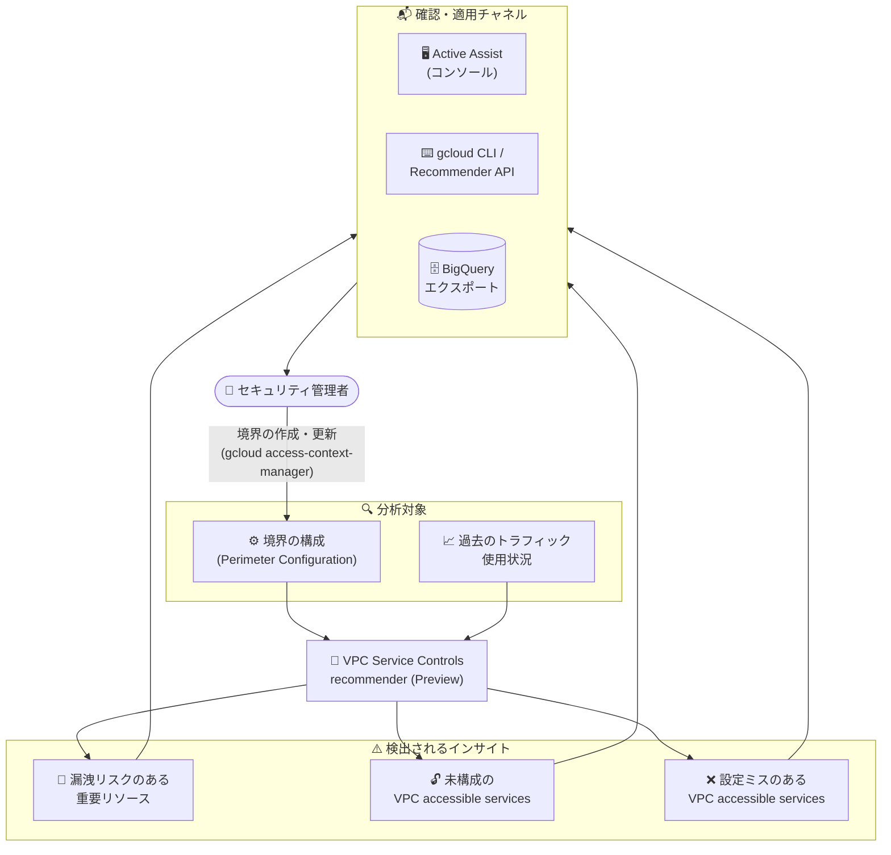

# VPC Service Controls: サービス境界を最適化する VPC Service Controls recommender (Preview)

**リリース日**: 2026-08-13

**サービス**: VPC Service Controls

**機能**: VPC Service Controls recommender によるサービス境界 (Service Perimeter) の最適化

**ステータス**: Preview

📊 [このアップデートのインフォグラフィックを見る](https://takech9203.github.io/google-cloud-news-summary/20260813-vpc-service-controls-perimeter-recommender-preview.html)

## 概要

VPC Service Controls recommender を使用してサービス境界 (Service Perimeter) を最適化する機能が Preview として利用可能になりました。この recommender は、境界の構成と過去のトラフィック使用状況に基づいて、Google Cloud 上のリソースと境界に対する推奨事項 (Recommendation) とインサイト (Insight) を提供します。手動での調査を最小限に抑えながら、データ漏洩 (Exfiltration) への防御態勢を強化し、最適な境界構成を実現できます。

recommender は、以下のようなアーキテクチャ上のリスクや境界の設定ミスを検出します。

1. **漏洩リスクのある重要リソース**: サービス境界の外側で稼働しているアクティブかつ機密性の高いサービス (BigQuery や Cloud Storage など) を特定
2. **未構成の VPC accessible services**: セキュリティ境界の内側から API へのアクセスが無制限のままになっている境界を特定
3. **設定ミスのある VPC accessible services**: 境界内で許可されたアクセス可能 API と制限付きサービス (Restricted Services) の不一致を特定

各推奨事項には、特定されたリスクに関するインサイトと、サービス境界に推奨事項を適用するための実行可能な次のステップが含まれます。VPC Service Controls を運用するセキュリティ管理者やネットワーク管理者にとって、境界構成の抜け漏れを体系的に発見・修正できる機能です。

**アップデート前の課題**

- 保護すべき機密サービス (BigQuery、Cloud Storage など) が境界の外側で稼働していても、管理者が手動で棚卸しをしない限り気付くことが難しかった
- VPC accessible services が未構成の場合、デフォルトでは境界内からすべてのサポート対象 API にアクセス可能となり、境界内部のネットワークエンドポイントからの漏洩リスクが高まっていた
- 許可された accessible services と restricted services の不一致といった設定ミスを検出する自動化された仕組みがなく、構成の監査に手作業が必要だった

**アップデート後の改善**

- 過去のリクエスト数に基づいて、境界で保護されていない利用頻度の高い機密サービスが自動的にフラグ付けされるようになった
- VPC accessible services の未構成・設定ミスがインサイトとして検出され、修正のための具体的な gcloud コマンドを含む実行可能な手順が提示されるようになった
- Google Cloud コンソール (Active Assist)、gcloud CLI、Recommender API、BigQuery エクスポートを通じて、推奨事項の確認・適用・自動化が可能になった

## アーキテクチャ図



recommender は境界の構成と過去のトラフィック使用状況を分析して 3 種類のリスク・設定ミスを検出し、Active Assist・gcloud CLI・API・BigQuery エクスポートを通じて管理者に実行可能な修正手順を提示します。

## サービスアップデートの詳細

### 主要機能

1. **漏洩リスクのある重要リソースの検出 (Critical resources at risk of exfiltration)**
   - プロジェクト内の機密サービスがサービス境界で (直接またはフォルダメンバーシップ経由で) 制限されておらず、リソースが漏洩リスクにさらされている状態を検出
   - 過去のリクエスト数に基づいて、利用頻度の高い VPC Service Controls サポート対象サービス (BigQuery、Cloud Storage、Spanner、Bigtable など) をフラグ付け
   - 推奨アクション: 特定されたプロジェクトとそのアクティブなサービスを制限する新しいサービス境界を構成するか、プロジェクトを既存のサービス境界に追加する

2. **未構成の VPC accessible services の検出 (Unconfigured VPC accessible services)**
   - サービス境界に VPC accessible services が構成されていない状態を検出。デフォルトではすべてのサポート対象 API に境界内からアクセス可能なため、境界内部のネットワークエンドポイントからの漏洩リスクが増大する
   - 推奨アクション: 境界で VPC accessible services の制限を有効化し、ワークロードに必要なサービスのみ (最低限 `RESTRICTED-SERVICES` 値を含む) にアクセスを制限する

3. **設定ミスのある VPC accessible services の検出 (Misconfigured VPC accessible services)**
   - サービス境界で構成されたアクセス可能サービスが、境界内で制限されていない (restricted services に含まれていない) 状態を検出。この構成では、承認されていないトラフィックの境界越えが許容され、アセットが露出する
   - 推奨アクション: 制限されていないサービスを許可済み VPC accessible services リストから削除するか、そのサービスを境界の restricted services リストに追加して一貫した保護を確保する

4. **複数のチャネルでの確認・適用**
   - Google Cloud コンソールの Active Assist ページから、推奨事項カード・インサイト・関連リソース・具体的な手順を確認可能
   - gcloud CLI (`gcloud recommender recommendations list`) や Recommender API によるプログラマティックな取得に対応
   - BigQuery エクスポートにより、すべての推奨事項を BigQuery データセットに自動エクスポート可能。カスタムダッシュボードの作成や SIEM ツールへのデータ連携に活用できる

## 技術仕様

### 検出タイプと推奨アクション

| 脆弱性・設定ミスのタイプ | 検出されるインサイト | 推奨アクション |
|------|------|------|
| 漏洩リスクのある重要リソース | 機密サービスが境界で保護されていない (過去のリクエスト数に基づき利用頻度の高いサービスをフラグ付け) | 新しい境界の構成、または既存境界へのプロジェクト追加 |
| 未構成の VPC accessible services | VPC accessible services が未構成で、境界内からすべての API にアクセス可能 | VPC accessible services を有効化し、必要なサービスのみに制限 |
| 設定ミスのある VPC accessible services | アクセス可能サービスと restricted services の不一致 | 許可リストからの削除、または restricted services への追加 |

### 必要なロールと権限

| 項目 | 詳細 |
|------|------|
| 推奨事項・インサイトの表示 | Recommender Viewer (`roles/recommender.viewer`) |
| 推奨事項の表示・更新・却下 | Recommender Admin (`roles/recommender.admin`) |
| 表示に必要な権限 | `recommender.vpcScRecommendations.get`、`recommender.vpcScRecommendations.list` |
| 更新に必要な権限 | `recommender.vpcScRecommendations.update` |
| recommender ID | `google.accessContextManager.VpcScRecommender` |
| ロケーション | `global` |

## 設定方法

### 前提条件

1. Recommender API (`recommender.googleapis.com`) が有効化されていること
2. 推奨事項の表示・更新に必要な IAM ロール (Recommender Viewer / Recommender Admin) がプロジェクト、フォルダ、または組織に対して付与されていること

### 手順

#### ステップ 1: 推奨事項の一覧を取得する

```bash
gcloud recommender recommendations list \
    --recommender=google.accessContextManager.VpcScRecommender \
    --location=global
```

gcloud CLI で VPC Service Controls recommender の推奨事項を取得します。Google Cloud コンソールの場合は、Active Assist ページで「Security」フィルタまたは「VPC Service Controls」で検索し、推奨事項カードをクリックして詳細 (インサイト、関連リソース、具体的な手順) を確認します。

#### ステップ 2: 未構成の VPC accessible services を解決する

```bash
gcloud access-context-manager perimeters update PERIMETER_NAME \
    --enable-vpc-accessible-services \
    --add-vpc-allowed-services=RESTRICTED-SERVICES
```

VPC accessible services を有効化し、安全な最小限の制限付き API セットで構成します。`PERIMETER_NAME` はサービス境界の名前に置き換えます。

#### ステップ 3: 設定ミスのある VPC accessible services を解決する

```bash
# 方法 1: 許可されたアクセス可能サービスを標準の restricted services リストに制限する
gcloud access-context-manager perimeters update PERIMETER_NAME \
    --clear-vpc-allowed-services \
    --add-vpc-allowed-services=RESTRICTED-SERVICES

# 方法 2: 特定のサービスを境界の restricted リストに追加して accessible services リストと一致させる
gcloud access-context-manager perimeters update PERIMETER_NAME \
    --add-restricted-services=SERVICE_NAME
```

`SERVICE_NAME` はサービスの API 識別子名 (`bigquery.googleapis.com` や `storage.googleapis.com` など) に置き換えます。

## メリット

### ビジネス面

- **データ漏洩リスクの低減**: 境界の外側で稼働する機密サービスや境界の設定ミスが自動検出されるため、漏洩インシデントにつながる構成の抜け漏れを早期に発見・修正できる
- **運用コストの削減**: 手動での境界構成の棚卸しや監査作業が不要になり、セキュリティチームの工数を削減できる
- **コンプライアンス対応の強化**: 境界構成の網羅性を継続的にチェックできるため、データ境界に関する規制・コンプライアンス要件への対応を体系化できる

### 技術面

- **トラフィック実績に基づく検出**: 過去のリクエスト数という実データに基づいて利用頻度の高いサービスをフラグ付けするため、優先度の高いリスクから対処できる
- **実行可能な修正手順の提示**: 各推奨事項にインサイトと具体的な次のステップが含まれ、gcloud コマンドでそのまま修正を適用できる
- **自動化・大規模運用への対応**: Recommender API によるプログラマティックな取得や、BigQuery エクスポートによる SIEM 連携・カスタムダッシュボード構築が可能

## デメリット・制約事項

### 制限事項

- Preview 段階の機能であり、Pre-GA Offerings Terms が適用される。Pre-GA 機能は「現状有姿 (as is)」で提供され、サポートが限定される場合がある
- 推奨事項の更新は日次で行われる。新しい境界を作成した場合や未解決の問題を解消した場合、Active Assist 上の推奨事項に反映されるまで最大 24 時間かかる

### 考慮すべき点

- 推奨事項の表示・更新には Recommender API の有効化と適切な IAM ロール (Recommender Viewer / Recommender Admin) の付与が必要
- VPC accessible services の制限を有効化すると境界内からアクセスできる API が制限されるため、推奨事項の適用前にワークロードが必要とするサービスを確認する必要がある
- 推奨事項の適用は自動では行われず、管理者がコンソールまたは gcloud CLI で境界を更新する必要がある

## ユースケース

### ユースケース 1: 境界の外側にある機密データサービスの発見と保護

**シナリオ**: 多数のプロジェクトを持つ組織で、BigQuery や Cloud Storage を利用する新規プロジェクトが次々と作成されており、セキュリティチームがすべてのプロジェクトの境界保護状況を手動で追跡しきれていない。

**実装例**:
```bash
# 推奨事項を取得し、境界で保護されていないアクティブな機密サービスを確認
gcloud recommender recommendations list \
    --recommender=google.accessContextManager.VpcScRecommender \
    --location=global

# 推奨に従い、対象プロジェクトを既存の境界に追加するか新しい境界を構成
```

**効果**: 過去のリクエスト数に基づいて利用頻度の高い未保護サービスが自動的にフラグ付けされ、優先度の高いプロジェクトから境界保護を適用できる。

### ユースケース 2: 推奨事項の BigQuery エクスポートによる継続的なセキュリティ監視

**シナリオ**: 大規模組織のセキュリティ運用チームが、VPC Service Controls の構成リスクを SIEM ツールやダッシュボードで一元的に監視したい。

**効果**: BigQuery エクスポートを設定することで、すべての推奨事項が BigQuery データセットに自動的にエクスポートされ、カスタム可視化ダッシュボードの作成や SIEM ツールへのデータ連携により、境界構成リスクの継続的な監視体制を構築できる。

## 料金

VPC Service Controls recommender 自体の料金に関する記載は、現時点のドキュメントでは確認できませんでした。Recommender の料金体系については、以下の公式ページを参照してください。

- [Recommender の料金](https://cloud.google.com/recommender/pricing)

なお、前提条件として Recommender API (`recommender.googleapis.com`) の有効化が必要です。

## 関連サービス・機能

- **Recommender (Active Assist)**: 本機能の基盤となるサービス。Google Cloud コンソールの Active Assist ページで推奨事項とインサイトを確認・管理する
- **Access Context Manager**: サービス境界の構成を管理するサービス。推奨事項の適用は `gcloud access-context-manager perimeters update` コマンドで行う
- **VPC accessible services**: 境界内のネットワークエンドポイントからアクセスできる API を制限する VPC Service Controls の機能。本 recommender の主要な検出対象
- **BigQuery**: 推奨事項のエクスポート先として利用可能。カスタムダッシュボードや SIEM 連携に活用できる。また、境界で保護すべき機密サービスとしての検出対象でもある
- **Cloud Storage / Spanner / Bigtable**: BigQuery とともに、漏洩リスクのある重要リソースとしてフラグ付けされる代表的な機密サービス

## 参考リンク

- 📊 [インフォグラフィック](https://takech9203.github.io/google-cloud-news-summary/20260813-vpc-service-controls-perimeter-recommender-preview.html)
- [公式リリースノート](https://docs.cloud.google.com/release-notes#August_13_2026)
- [Optimize perimeters with recommender (公式ドキュメント)](https://docs.cloud.google.com/vpc-service-controls/docs/recommender)
- [VPC Service Controls の概要](https://docs.cloud.google.com/vpc-service-controls/docs/overview)
- [VPC accessible services](https://docs.cloud.google.com/vpc-service-controls/docs/vpc-accessible-services)
- [Recommender の料金](https://cloud.google.com/recommender/pricing)

## まとめ

VPC Service Controls recommender の登場により、境界の外側にある機密サービスの検出や VPC accessible services の未構成・設定ミスの発見が自動化され、データ漏洩防御態勢の継続的な改善が可能になりました。VPC Service Controls を運用している組織は、Recommender API を有効化して Active Assist で推奨事項を確認し、優先度の高いリスクから境界構成の修正を進めることを推奨します。Preview 段階のため、Pre-GA Offerings Terms の適用と最大 24 時間の推奨事項更新遅延に留意してください。

---

**タグ**: VPC Service Controls, Recommender, Active Assist, サービス境界, データ漏洩防止, セキュリティ, Preview
