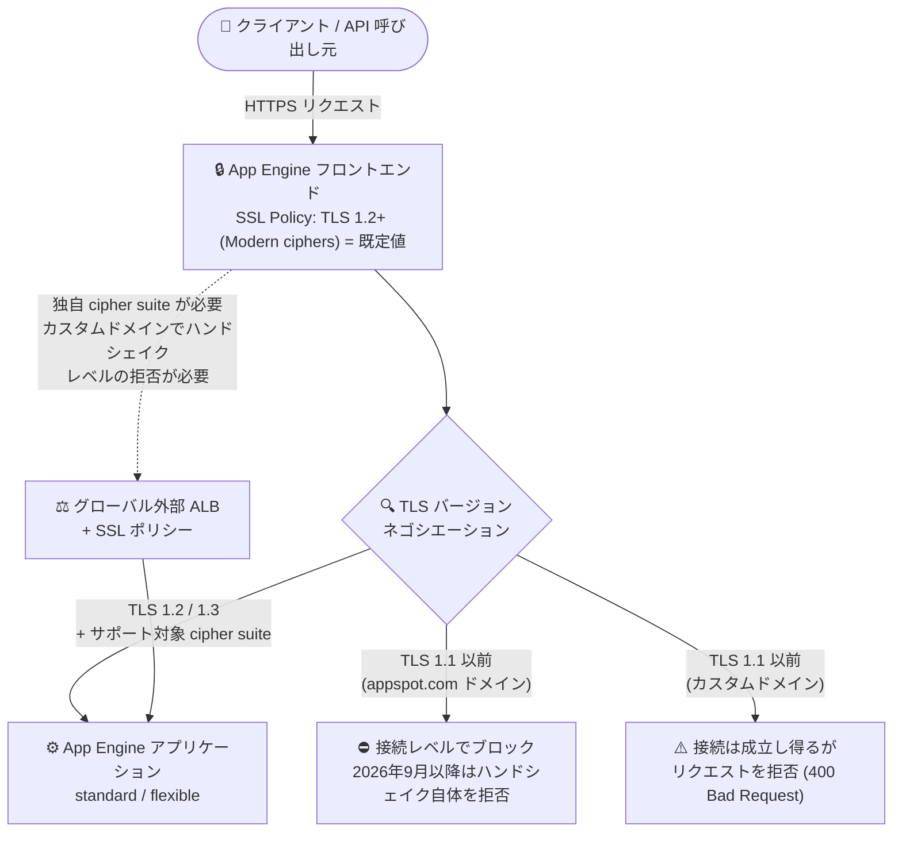

# App Engine: 最小 TLS バージョン 1.2 への自動オプトイン開始 (オプトアウトは 2026 年 8 月末まで)

**リリース日**: 2026-08-14

**サービス**: App Engine (standard environment / flexible environment)

**機能**: 最小 TLS バージョン 1.2 以降への自動オプトイン (Secure minimum TLS)

**ステータス**: 一般提供 (GA) — 既存アプリケーションへの自動適用が 2026 年 8 月に開始

📊 [このアップデートのインフォグラフィックを見る](https://takech9203.github.io/google-cloud-news-summary/20260814-app-engine-minimum-tls-1-2.html)

> **本レポートの対象範囲**
> 2026 年 8 月 14 日のリリースノートでは、以下 6 つの App Engine ランタイム向けに同一内容のアナウンスが公開されました。内容が完全に共通するため、本レポートで一括して解説します。
>
> - App Engine flexible environment: Go / Java / Ruby
> - App Engine standard environment: Go / Python / Ruby

## 概要

Google Cloud は 2026 年 8 月 14 日、App Engine の standard 環境および flexible 環境において、**アプリケーションを最小 TLS バージョン 1.2 以降へ自動的にオプトインする**ことを発表しました。これはセキュリティ強化を目的とした変更で、2026 年 8 月から既存アプリケーションに対して順次適用されます。適用後は、TLS 1.2 / TLS 1.3 とサポート対象の cipher suite のみが許可され、TLS 1.1 以前を使用する通信は拒否されます。

レガシーな TLS 1.1 以前を必要とするアプリケーションについては、**2026 年 8 月末まで**は Google Cloud コンソールまたは Google Cloud CLI からオプトアウト (SSL ポリシーを `TLS 1.0+ (Obsolete)` / `TLS_VERSION_1_0` に設定) が可能です。ただし **2026 年 9 月以降、App Engine は TLS 1.1 以前の安全でないトラフィックを恒久的にブロックする可能性がある**と明記されており、恒久的にブロックされたプロジェクトではオプトアウト設定そのものが選択できなくなります。より長い移行期間が必要な場合はサポートへの問い合わせが案内されています。

この変更は、TLS 1.1 以前を非推奨とした 2025 年 3 月のアナウンスに始まる一連の移行プロセスの最終フェーズに位置づけられます。TLS 1.2 以降のサポート自体は flexible 環境で 2025 年 8 月に Preview、2025 年 10 月に GA となっており、今回は「明示的な設定変更が必要だった機能」が「デフォルトで有効になる」段階へ移行するものです。古い OS / ブラウザ、組み込みデバイス、レガシーな HTTP クライアントライブラリから App Engine アプリを呼び出しているシステムを運用している場合は、8 月末までに影響調査を完了させる必要があります。

**アップデート前の課題**

- TLS 1.2 以降を強制するには、アプリケーション設定 (SSL ポリシー) を利用者自身が明示的に変更する必要があり、未対応のアプリケーションでは TLS 1.1 以前の通信が受け付けられ続けていた
- デフォルトが安全でない状態 (`TLS 1.0+`) であるため、設定漏れがそのままセキュリティリスクとして残存していた
- App Engine 単体では cipher suite / TLS バージョンの細かな制御ができず、要件を満たすにはグローバル外部 Application Load Balancer と SSL ポリシーの構成が必要だった (この点は現在も同様)

**アップデート後の改善**

- App Engine が既存アプリケーションを TLS 1.2 以降へ**自動的にオプトイン**するため、利用者側の設定変更なしにセキュアなデフォルトが適用される
- 新規に作成するアプリケーションは、当初からデフォルトで TLS 1.2 以降とサポート対象 cipher suite のみを許可する
- デフォルト設定 (TLS 1.2 以降 + 既定の cipher suite) で足りる場合、安全でないトラフィックのブロックのためにグローバル外部 Application Load Balancer を構成する必要がない
- 2026 年 9 月以降は、appspot.com ドメインにおいて TLS ハンドシェイク自体を拒否する接続レベルでのブロックとなり、より厳格なセキュリティコンプライアンスが実現される

## アーキテクチャ図



App Engine フロントエンドが TLS バージョンを判定し、TLS 1.2 以降のみをアプリケーションへ通します。既定の cipher suite で要件を満たせない場合、またはカスタムドメインでハンドシェイクレベルの拒否が必要な場合は、グローバル外部 Application Load Balancer と SSL ポリシーを併用します。

## サービスアップデートの詳細

### 主要機能

1. **既存アプリケーションの TLS 1.2 以降への自動オプトイン**
   - 2026 年 8 月から、App Engine がアプリケーションを TLS 1.2 以降 (サポート対象 cipher suite 付き) へ自動的にオプトインする
   - 対象は App Engine standard 環境および flexible 環境 (今回のリリースノートでは Go / Java / Python / Ruby の各ランタイム向けに告知)

2. **2026 年 8 月末までのオプトアウト**
   - レガシーな TLS 1.1 以前が必要な場合、Google Cloud コンソールまたは gcloud CLI からオプトアウトできる
   - オプトアウトが可能な期間は **2026 年 8 月末まで**
   - 追加の移行期間が必要な場合は Google Cloud サポートへ問い合わせる

3. **2026 年 9 月以降の恒久的ブロック**
   - 2026 年 9 月以降、App Engine は TLS 1.1 以前の安全でないトラフィックを恒久的にブロックする可能性がある
   - appspot.com ドメイン: **接続レベル**でブロックされる
   - カスタムドメイン: 接続は成立する可能性があるが、**リクエストがブロック**される
   - 恒久的にブロックされたプロジェクトでは、オプトイン設定 (SSL ポリシーの選択) が利用できなくなる

4. **新規アプリケーションのデフォルト変更**
   - 新規に作成する App Engine アプリケーションは、既定で TLS 1.2 以降とサポート対象 cipher suite のみを許可する

5. **Application Load Balancer が不要になるケースの明確化**
   - TLS 1.2 以降 + 既定のサポート対象 cipher suite で足りる場合、グローバル外部 Application Load Balancer の構成は不要
   - 別の cipher suite セットが必要な場合、またはカスタムドメインで接続レベル (ハンドシェイク) の拒否が必要な場合は、グローバル外部 Application Load Balancer を構成する

## 技術仕様

### 移行スケジュール

| 時期 | 内容 |
|------|------|
| 2025 年 3 月 | TLS 1.1 以前のサポートを非推奨化 (deprecated) |
| 2025 年 8 月 7 日 | TLS 1.2 以降のサポートが Preview (flexible 環境) |
| 2025 年 10 月 20 日 | TLS 1.2 以降のサポートが一般提供 (GA) (flexible 環境) |
| 2026 年 8 月 | App Engine がアプリケーションを TLS 1.2 以降へ自動オプトイン開始 |
| 2026 年 8 月末 | オプトアウト可能な期限 |
| 2026 年 9 月以降 | TLS 1.1 以前を恒久的にブロックする可能性 / TLS ハンドシェイク自体を拒否 |

### 拒否時の挙動の違い

| 時期 / ドメイン | TLS 1.1 以前での挙動 |
|-----------------|----------------------|
| 2026 年 9 月より前 | TLS ハンドシェイクは成功するが、リクエストが `400 Bad Request - The request was malformed` で拒否される |
| 2026 年 9 月以降 (appspot.com) | TLS ハンドシェイク自体が成立しない (接続レベルでブロック) |
| 2026 年 9 月以降 (カスタムドメイン) | 接続は成立する可能性があるが、リクエストがブロックされる |

> **注意**: 外部の SSL チェックサイトは TLS ハンドシェイクの成否のみを検証する場合があり、2026 年 9 月より前は「TLS 1.1 以前が依然サポートされている」と誤って表示されることがあります。

### サポートされる TLS バージョンと cipher suite

| TLS バージョン | IANA 値 | Cipher suite |
|----------------|---------|--------------|
| TLS v1.3 | 0x1301 | TLS_AES_128_GCM_SHA256 |
| TLS v1.3 | 0x1302 | TLS_AES_256_GCM_SHA384 |
| TLS v1.3 | 0x1303 | TLS_CHACHA20_POLY1305_SHA256 |
| TLS v1.2 | 0xCCA9 | TLS_ECDHE_ECDSA_WITH_CHACHA20_POLY1305_SHA256 |
| TLS v1.2 | 0xCCA8 | TLS_ECDHE_RSA_WITH_CHACHA20_POLY1305_SHA256 |
| TLS v1.2 | 0xC02B | TLS_ECDHE_ECDSA_WITH_AES_128_GCM_SHA256 |
| TLS v1.2 | 0xC02F | TLS_ECDHE_RSA_WITH_AES_128_GCM_SHA256 |
| TLS v1.2 | 0xC02C | TLS_ECDHE_ECDSA_WITH_AES_256_GCM_SHA384 |
| TLS v1.2 | 0xC030 | TLS_ECDHE_RSA_WITH_AES_256_GCM_SHA384 |
| TLS v1.2 | 0xC009 | TLS_ECDHE_ECDSA_WITH_AES_128_CBC_SHA |
| TLS v1.2 | 0xC013 | TLS_ECDHE_RSA_WITH_AES_128_CBC_SHA |
| TLS v1.2 | 0xC00A | TLS_ECDHE_ECDSA_WITH_AES_256_CBC_SHA |
| TLS v1.2 | 0xC014 | TLS_ECDHE_RSA_WITH_AES_256_CBC_SHA |

上記以外の cipher suite、またはより制限の緩い cipher suite が必要な場合は、グローバル外部 Application Load Balancer の利用が推奨されます。

### SSL ポリシーの設定値

| 設定値 (gcloud) | Console 表示 | 内容 |
|-----------------|--------------|------|
| `TLS_VERSION_1_2` | TLS 1.2+ (Modern ciphers) | 既定値。TLS 1.2 以降とモダンな cipher suite のみを許可 |
| `TLS_VERSION_1_0` | TLS 1.0+ (Obsolete) | TLS 1.1 以前の安全でないトラフィックを許可 (オプトアウト用) |

## 設定方法

### 前提条件

1. 対象の App Engine アプリケーション (standard 環境または flexible 環境) が存在するプロジェクトへのアクセス権
2. アプリケーション設定を更新できる権限
3. Google Cloud CLI で操作する場合は gcloud のインストールと認証

### 手順

#### ステップ 1: 現在の SSL ポリシーを確認・変更する (Google Cloud コンソール)

1. Google Cloud コンソールで App Engine の **[設定 (Settings)]** ページを開く
2. **[Application settings]** タブで **[Edit application settings]** をクリック
3. **[SSL Policy]** リストから以下のいずれかを選択する
   - **TLS 1.2+ (Modern ciphers)** (既定値): TLS 1.2 以降とモダンな cipher suite のみを許可
   - **TLS 1.0+ (Obsolete)**: TLS 1.1 以前の安全でないトラフィックを許可 (オプトアウト)
4. **[Save]** をクリック

なお、2026 年 9 月以降に古い TLS バージョンが恒久的にブロックされたプロジェクトでは、このオプトイン設定は選択できません。

#### ステップ 2: gcloud CLI で SSL ポリシーを設定する

```bash
# 既存アプリケーションの最小 TLS バージョンを TLS 1.2 以降に設定 (推奨)
gcloud app update --ssl-policy=TLS_VERSION_1_2

# 新規アプリケーション作成時に最小 TLS バージョンを指定
gcloud app create --ssl-policy=TLS_VERSION_1_2

# レガシー TLS を許可する (オプトアウト / 2026 年 8 月末まで)
gcloud app update --ssl-policy=TLS_VERSION_1_0
```

`--ssl-policy` に指定できる値は `TLS_VERSION_1_0` と `TLS_VERSION_1_2` の 2 つです。Google は最新のサポート対象 TLS バージョンへのアップデートを推奨しています。

#### ステップ 3: (必要な場合) グローバル外部 Application Load Balancer で TLS / cipher を制御する

Cloud Load Balancing とサーバーレス NEG を使って App Engine アプリケーションにトラフィックをルーティングしている場合は、ロードバランサに SSL ポリシーを定義することで、TLS バージョンや cipher をさらに厳しく制限できます。

```bash
# 例: ロードバランサ用の SSL ポリシーを作成する
gcloud compute ssl-policies create modern-tls-policy \
    --profile=MODERN \
    --min-tls-version=1.2
```

カスタムドメインで TLS 1.1 以前の接続をハンドシェイクレベルで拒否したい場合、または既定と異なる cipher suite セットが必要な場合は、この構成が必要です。

## メリット

### ビジネス面

- **コンプライアンス要件への適合**: TLS 1.1 以前を排除することで、PCI DSS など TLS 1.2 以降を求める各種セキュリティ基準への準拠が容易になる
- **設定作業の削減**: 自動オプトインにより、多数の App Engine アプリケーションを個別に設定変更する運用負荷が軽減される
- **設定漏れリスクの排除**: セキュアな設定がデフォルトになるため、設定漏れによる脆弱な構成が残るリスクを低減できる

### 技術面

- **ロードバランサ不要でのレガシー TLS ブロック**: 既定の cipher suite で要件を満たす場合、グローバル外部 Application Load Balancer を構成せずに安全でないトラフィックをブロックできる
- **接続レベルでの拒否**: 2026 年 9 月以降、appspot.com ドメインでは TLS ハンドシェイク自体が拒否されるため、外部スキャンツールに対しても正しくレガシー TLS 非対応として認識される
- **モダンな cipher suite への統一**: AEAD 系 (GCM / ChaCha20-Poly1305) を中心としたモダンな cipher suite に揃えられる

## デメリット・制約事項

### 制限事項

- オプトアウトが可能なのは **2026 年 8 月末まで**であり、それ以降は選択できなくなる可能性がある
- 2026 年 9 月以降に古い TLS バージョンが恒久的にブロックされたプロジェクトでは、SSL ポリシーのオプトイン設定自体が利用できなくなる
- App Engine の SSL ポリシーで選択できるのは `TLS_VERSION_1_0` と `TLS_VERSION_1_2` の 2 択で、cipher suite を個別に指定することはできない
- カスタムドメインでは、2026 年 9 月以降も接続 (ハンドシェイク) 自体は成立し得る。ハンドシェイクレベルでの拒否が必要な場合はグローバル外部 Application Load Balancer が必要

### 考慮すべき点

- **クライアント側の互換性調査が急務**: 古い OS / ブラウザ、組み込み機器、レガシーな HTTP クライアントライブラリ、社内バッチなど TLS 1.1 以前しか話せないクライアントがあると、8 月中は `400 Bad Request`、9 月以降は接続不能になる
- **`400 Bad Request` の切り分け**: 2026 年 9 月より前は TLS ハンドシェイク成功後にリクエストが拒否されるため、アプリケーションのバグと誤認しやすい。TLS バージョン起因の可能性を疑う必要がある
- **外部 SSL チェックサイトの結果は当てにならない**: ハンドシェイクの成否のみを検証するツールでは、2026 年 9 月より前は「TLS 1.1 以前がまだ使える」と誤表示される
- **移行期間が足りない場合の手続き**: 追加時間が必要な場合は事前に Google Cloud サポートへ問い合わせる必要がある
- **設定はアプリケーション単位**: SSL ポリシーは App Engine アプリケーション (プロジェクト) レベルの設定であり、サービスやバージョン単位で個別に変えることはできない

## ユースケース

### ユースケース 1: レガシークライアントを抱える B2B API の段階的移行

**シナリオ**: App Engine standard 環境 (Python) で提供している B2B API に、取引先の古いシステムから TLS 1.1 でアクセスがある。2026 年 8 月の自動オプトインで即座に障害となることを避けたい。

**実装例**:
```bash
# 一時的にオプトアウトして移行猶予を確保する (2026 年 8 月末まで)
gcloud app update --ssl-policy=TLS_VERSION_1_0

# 取引先のクライアント改修完了後、TLS 1.2 以降へ切り替える
gcloud app update --ssl-policy=TLS_VERSION_1_2
```

**効果**: 取引先の改修スケジュールに合わせて切り替えタイミングを制御できる。ただし 8 月末以降はオプトアウトできなくなるため、期限内の改修完了と、必要な場合のサポートへの事前相談が前提となる。

### ユースケース 2: コンプライアンス監査に向けた TLS 1.2 以降の強制

**シナリオ**: TLS 1.2 以降を必須とするセキュリティ基準の監査を控えており、App Engine flexible 環境 (Java) のアプリケーションで TLS 1.1 以前が確実に拒否されることを証明したい。

**実装例**:
```bash
# 明示的に TLS 1.2 以降を強制する
gcloud app update --ssl-policy=TLS_VERSION_1_2

# TLS 1.1 でのアクセスを試行して拒否されることを確認する
curl -v --tlsv1.1 --tls-max 1.1 https://PROJECT_ID.REGION_ID.r.appspot.com/
```

**効果**: サポート対象の cipher suite に限定された TLS 1.2 / 1.3 のみで配信される。2026 年 9 月以降 appspot.com ドメインではハンドシェイク自体が拒否されるため、外部スキャンツールでも正しく非対応と判定される。

### ユースケース 3: カスタムドメインでのハンドシェイクレベル拒否

**シナリオ**: カスタムドメインで App Engine アプリを公開しており、TLS 1.1 以前の接続を「リクエスト拒否」ではなく「ハンドシェイク拒否」にしたい。あるいは既定と異なる cipher suite セットをサポートする必要がある。

**効果**: グローバル外部 Application Load Balancer とサーバーレス NEG を構成し、SSL ポリシーで TLS バージョン / cipher を制御することで、接続レベルでの拒否と柔軟な cipher suite 制御が可能になる。あわせて Ingress 制御を利用し、App Engine の URL 経由でロードバランサをバイパスされないようにすることが推奨される。

## 料金

今回のリリースノートおよび公式ドキュメントには、この TLS 設定変更に伴う料金の変更に関する記載はありません。App Engine の SSL ポリシー設定自体は、アプリケーションレベルの設定として提供されています。

一方で、既定と異なる cipher suite のサポートや、カスタムドメインでのハンドシェイクレベルの拒否を実現するためにグローバル外部 Application Load Balancer を構成する場合は、Cloud Load Balancing の料金が別途発生します。最新の料金は以下の公式ページで確認してください。

- [App Engine の料金](https://cloud.google.com/appengine/pricing)
- [Cloud Load Balancing の料金](https://cloud.google.com/vpc/network-pricing#lb)

## 関連サービス・機能

- **Cloud Load Balancing (グローバル外部 Application Load Balancer)**: 既定以外の cipher suite のサポートや、カスタムドメインでのハンドシェイクレベルの TLS 拒否を実現する場合に必要。SSL ポリシーで TLS バージョン / cipher を制御する
- **サーバーレス NEG (Serverless network endpoint group)**: Cloud Load Balancing から App Engine アプリケーションへトラフィックをルーティングするための構成要素
- **SSL ポリシー (SSL policies)**: ロードバランサがクライアントとネゴシエートする TLS バージョン / cipher を定義する仕組み
- **App Engine カスタムドメインの SSL (Google 管理証明書)**: カスタムドメインの HTTPS 配信を自動化する機能。TLS ポリシーとあわせて構成を確認する
- **App Engine の Ingress 制御**: ロードバランサを経由しない App Engine URL への直接アクセスを制限し、Cloud Armor や SSL ポリシーのバイパスを防止する
- **Cloud Run へのマイグレーション**: flexible 環境では 2026 年 6 月に `gcloud beta app migrate-to-run` コマンドによる Cloud Run への移行が Preview として提供されており、長期的なモダナイゼーションの選択肢となる

## 参考リンク

- 📊 [インフォグラフィック](https://takech9203.github.io/google-cloud-news-summary/20260814-app-engine-minimum-tls-1-2.html)
- [公式リリースノート (Google Cloud release notes: August 14, 2026)](https://docs.cloud.google.com/release-notes#August_14_2026)
- [App Engine flexible environment Go release notes](https://cloud.google.com/appengine/docs/flexible/go/release-notes)
- [Secure your app with minimum TLS (standard environment)](https://cloud.google.com/appengine/docs/standard/secure-minimum-tls)
- [Secure your app with minimum TLS (flexible environment)](https://cloud.google.com/appengine/docs/flexible/secure-minimum-tls)
- [gcloud app update リファレンス](https://cloud.google.com/sdk/gcloud/reference/app/update)
- [SSL policies for SSL and TLS protocols (Cloud Load Balancing)](https://cloud.google.com/load-balancing/docs/ssl-policies-concepts)
- [Set up an Application Load Balancer with serverless backends](https://cloud.google.com/load-balancing/docs/https/setting-up-https-serverless)
- [Secure custom domains with SSL (App Engine)](https://cloud.google.com/appengine/docs/standard/securing-custom-domains-with-ssl)
- [App Engine の料金](https://cloud.google.com/appengine/pricing)

## まとめ

App Engine は 2026 年 8 月から既存アプリケーションを最小 TLS 1.2 へ自動的にオプトインし、2026 年 9 月以降は TLS 1.1 以前を恒久的にブロックする可能性があります。オプトアウトが可能なのは 2026 年 8 月末までという短い猶予期間しかないため、App Engine (standard / flexible) を運用しているチームは、直ちにクライアント側の TLS 対応状況を棚卸しし、TLS 1.1 以前しか利用できない呼び出し元がないかを確認してください。レガシークライアントの改修が 8 月末までに完了しない場合は、`gcloud app update --ssl-policy=TLS_VERSION_1_0` による一時的なオプトアウトと、Google Cloud サポートへの事前相談を検討する必要があります。

---

**タグ**: App Engine, App Engine standard environment, App Engine flexible environment, TLS, TLS 1.2, セキュリティ, SSL ポリシー, Cloud Load Balancing, 非推奨対応, コンプライアンス
